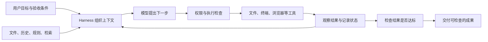

# 从零理解：模型、Agent 与 Harness

> 建议先读本章，再看工具地图；已经有使用经验的读者，可以直接查工具档案和场景推荐。资料的采集时间与版本见参考索引。

## 先用一个例子讲清楚

你对 AI 说：“这个网站的登录有问题，帮我修好。”

普通聊天模型可以给出建议。但是，真正修好网站通常需要先读项目文件，找到登录逻辑，复现问题，修改代码，运行测试，最后解释改了什么。完成这些工作，需要有软件负责把模型和文件、终端、浏览器连接起来，并决定它可以做什么、做到哪一步需要停下来。

这套软件就是我们讨论的 **Harness**。中文可以理解为“让模型实际干活的运行外壳”。“外壳”并不意味着简单：成熟的 Harness 往往承担了整个工作现场的组织工作。

模型像有能力的工作人员；工具像电脑、文件柜和仪器；Harness 像工作台、流程和权限制度。把它们组合起来，才形成一个可以观察环境、采取行动、根据结果继续行动的 **Agent（智能代理）**。

这个比喻有一个边界：模型并不是可靠的人类员工。它可能误解任务，遗漏条件，甚至把一份看起来很完整的结果误认为正确。所以，还需要测试、来源核对、差异审查等验收办法。

## 术语表：遇到不熟悉的词，可以回来看

| 术语 | 通俗解释 | 和选工具有什么关系 |
|---|---|---|
| 大语言模型，LLM | 根据输入生成文字、代码或工具调用的模型 | 决定理解、推理、表达等基础能力，但不能单独决定任务能否完成 |
| Harness | 负责上下文、工具、权限、会话和执行过程的软件 | 本报告的主要研究对象 |
| Agent | 模型通过 Harness 使用工具，反复行动以完成任务的系统 | 不是某一种模型，也不等于一个聊天窗口 |
| Agent loop，代理循环 | “看情况→想下一步→调用工具→看结果”的循环 | 能否恢复、停止、纠错，比能否发起第一轮调用更重要 |
| 工具调用，Tool calling | 模型提出结构化请求，例如读取文件或执行测试 | 模型提出请求，真正执行的是软件；权限必须由软件控制 |
| 上下文，Context | 本轮实际交给模型看的资料 | 保存在磁盘上的文件、全部聊天记录，不一定都在上下文里 |
| 上下文窗口 | 模型一次能接收的资料上限 | 窗口大不等于它能同样可靠地使用其中每个细节 |
| Token | 模型处理文本时使用的小单位，可能是一个字、词或词的一部分 | 用量、价格和上下文长度通常按它计；不能简单等同于汉字数 |
| 系统提示词，System prompt | 给模型的基础工作要求 | 同一个模型在不同外壳里的行为差异，部分来自这里 |
| 规则文件 | 项目里写给代理看的说明，如 `AGENTS.md`、`CLAUDE.md` | 适合保存测试命令、项目约定；它不是强制执行的安全边界 |
| 会话，Session / Thread | 一段可继续、保存和恢复的任务对话 | “能找回记录”和“恢复后完整理解之前的工作”是两件事 |
| 上下文压缩，Compaction | 把长对话整理成较短内容，腾出继续工作的空间 | 通常会丢细节；要关注保存了哪些决定和未完成事项 |
| 检索，Retrieval | 从大量资料中找到本次需要的一部分 | 好比先查目录再翻书，而不是把整间图书馆搬上桌 |
| RAG | 先检索资料，再让模型根据资料回答 | 适合知识库问答；检索错了，回答仍可能错 |
| Embedding，向量表示 | 把文字转成可用于比较相似程度的数字 | 常用于语义搜索；不是普通聊天模型的替代品 |
| Reranker，重排模型 | 再检查搜索结果，把更相关的排到前面 | 资料多时，改善找资料可能比升级回答模型更有效 |
| 记忆，Memory | 跨轮次或跨会话保留的事实、偏好和经验 | 可以是文件、数据库或检索系统，并不等于模型被重新训练 |
| Skill，技能 | 一份可重复使用的工作说明，有时附带脚本、模板 | 比如“按公司格式写周报”；通常仍需要模型解释和执行 |
| Plugin / Extension，插件／扩展 | 为宿主增加能力的一种安装和集成方式 | 有的只增加提示词，有的能运行程序，两者风险和能力不同 |
| MCP | 让代理连接外部工具和数据源的一种通用协议 | 像工具插座；支持插座并不表示已经安装了所有工具 |
| ACP | 让编辑器或界面连接一个完整代理的协议 | MCP 常连接“工具”，ACP 常连接“另一个已经会干活的代理” |
| API / Provider | 模型服务接口／提供该接口的服务商 | 同一个模型可能由多家平台提供，速度、价格和功能支持可能不同 |
| BYOK | Bring Your Own Key，自带服务商 API 密钥 | 外壳费用和模型费用可能分开；订阅会员通常不自动等于 API 额度 |
| OpenAI-compatible | 接口模仿 OpenAI 的部分格式 | 不能据此推断所有工具调用、图片、推理状态和缓存都兼容 |
| 子代理，Subagent | 主代理委派出去处理一部分工作的代理 | 通常有独立上下文；是否能写文件、继续对话、再派任务，各工具不同 |
| 多代理，Multi-agent | 多个代理共同完成工作 | 可能只是几个并列聊天，也可能有任务板、消息和调度，不能混为一谈 |
| 编排，Orchestration | 安排谁先做、谁并行做、结果交给谁 | 工作拆得合理时有效，拆得不合理会增加协调和返工 |
| Checkpoint，检查点 | 保存某个阶段的状态或文件版本 | 要查清楚保存的是对话、代码还是运行环境；未必都能恢复 |
| Git / Diff / PR | 代码版本管理／修改前后差异／请求合并代码的审查单 | 是检查代理修改和撤销错误的重要手段 |
| Worktree | 同一个代码仓库的另一份独立工作目录 | 有助于让并行代理不直接争改同一份文件；不是操作系统沙箱 |
| Sandbox，沙箱 | 用操作系统、容器或虚拟机限制程序可接触的资源 | 和“模型答应不乱改”“每次点批准”不同，属于实际执行边界 |
| 审批，Approval | 对某次操作询问是否允许 | 能增加控制，但点过一次批准不代表之后所有操作都安全 |
| Hook，钩子 | 在特定时机自动执行的程序或规则 | 可以在改文件前后检查、记录、阻止操作；具体能力看宿主实现 |
| CLI / TUI | 命令行程序／带交互界面的终端程序 | 适合熟悉终端的人，也容易接入脚本 |
| IDE | 集成开发环境，写代码、运行和调试的一体化软件 | 能把当前文件、报错和项目结构自然交给代理 |
| LSP | 编辑器与语言分析服务之间的协议 | 帮助查符号、类型和错误；不等于理解整个业务 |
| Headless | 不打开交互界面，直接从脚本执行 | 适合批处理和流水线，要另行处理权限、日志和失败 |
| 本地运行 | Harness 或工具程序运行在自己的电脑上 | 不代表推理也在本地；调用云模型时相关输入仍会发到服务商 |
| 本地模型 | 模型推理在自己的设备或受控服务器上进行 | 有硬件和运维要求，尤其不能把超大开放权重模型理解为笔记本可运行 |
| 开放权重 | 可以获得模型参数文件 | 不等于训练数据公开，也不等于没有使用许可限制 |
| 开源／源码可见 | 前者通常符合开源许可；后者只是能读到源码 | 商业使用、再分发和做竞争服务的权利可能不同 |
| Benchmark，基准测试 | 用一组规定任务测系统表现 | 分数属于“模型＋外壳＋设置＋环境”的组合，不能随意移植 |
| 缓存，Cache | 重复输入的一部分无需重新完整处理 | 常影响成本和延迟；频繁换模型或改提示词可能损失缓存 |
| 长任务，Long-horizon task | 需要很多轮行动、甚至跨会话才能完成的任务 | 核心问题是状态、目标、恢复和验收，不只是上下文够不够长 |
| SDK | 给开发者调用的一组现成程序接口 | 用它把代理嵌入自己的应用，比从零实现整套循环省事 |
| Runtime，运行时 | 真正管理代理执行的程序部分 | 界面相同，运行时仍可能不同 |
| Adapter / Driver，适配器／驱动 | 把一种模型或代理转换成宿主能理解的接口 | 协议、工具和状态能否正确衔接，常取决于它 |
| Gateway，网关 | 位于客户端和后端之间，管理连接、路由或访问的服务 | 要看它是否保存数据，以及真正把请求发给谁 |
| Profile，配置档案 | 一组模型、工具、权限或插件的预设 | 两个人用同一产品、不同配置档案，行为仍可能差很多 |
| Markdown / JSON / TOML | 常见的文档／结构化数据／配置文件格式 | 规则、会话和设置常用这些格式保存，不是新的模型类型 |
| Python / TypeScript / Rust / Go / Lua | 编写软件的不同编程语言 | 能帮助开发者理解源码组织；语言本身不决定代理聪明程度 |
| Node.js / Electron / QuickJS | 分别是常用 JavaScript 运行环境、桌面应用框架、另一种 JavaScript 引擎 | “脚本引擎被限制”不等于它调用的外部工具也被隔离 |
| Docker / Kubernetes / 虚拟机 | 容器打包工具／容器管理平台／虚拟的计算机环境 | 用来准备、隔离和管理任务运行环境，仍需配置权限与网络 |
| CI / CD | 自动检查、构建和交付软件的流水线 | 无界面代理可以进入流水线，但需要失败与验收机制 |
| Webhook | 某个系统发生事件后，向另一个系统发通知的接口 | 可用来自动触发任务，需要辨认事件来源和避免重复执行 |
| RBAC | 按角色给用户分配权限 | 多人工作台需要控制谁能读资料、用工具和改设置 |
| MoE，混合专家模型 | 每一步只选择部分子网络参与计算的模型结构 | 活跃参数较少，不等于只需存放那部分权重 |
| 量化，Quantization | 用更少的数字位数保存模型参数等数据 | 可减少内存，但效果与速度需按具体实现测试 |
| 索引，Index | 提前建立的资料目录与检索结构 | 更新是否及时、哪些文件被排除，会影响代理找到什么 |
| 事件日志／状态快照 | 逐条记录发生的事／保存某一刻的状态 | 方便恢复和排查，但不能自动撤销已经发生的外部动作 |
| Preview / Beta，预览／测试版 | 尚在调整中的公开或受限版本 | 应固定版本并保留回退，不按成熟稳定版作同等承诺 |

任务控制、部署与资料处理还会用到以下词语：

| 术语 | 通俗解释 | 容易误解的地方 |
|---|---|---|
| Goal，持续目标 | 保存一个目标，让代理在一轮结束后继续推进 | 自动继续不代表自动证明任务已完成 |
| Cron，时间调度 | 按规定时间触发任务的机制 | 保存时间表不代表电脑关机后仍会运行 |
| Workflow，工作流 | 把若干任务按顺序、并行或条件组织起来 | 在不同软件里可能指固定业务流程，也可能指代理临时生成的编排脚本 |
| Credits，额度点数 | 服务商把不同消耗换算成统一单位记账 | 不是 Token；不能把额度点数直接当成可生成字数 |
| 动态模型目录 | 登录后向服务查询账户当前能用的模型和能力 | 默认写着某个模型，不保证账户可调用，也不保证元数据完整 |
| Bun／isolated-vm | JavaScript 运行环境／在独立环境中执行脚本的组件 | 原生组件可能只支持特定运行环境，因此不同安装包功能会有差异 |
| avg@4 | 对四次尝试的评测结果取平均的统计标记 | 应按该评测的具体规则理解，不等于一次必然成功，也不等于四次取最好成绩 |
| YAML / JSONL | 常见配置格式／每行一条 JSON 记录的文件格式 | 前者常写模型与流程配置，后者常保存可追加的会话事件 |
| HTTP / RPC / IPC | 网络请求协议／远程过程调用／进程之间通信 | 界面、运行核心与服务不一定在同一个程序或机器里 |
| Base URL，服务基地址 | API 请求要发往的服务入口地址 | 地址可能决定地区、协议与计费渠道，不只是网络连通 |
| OAuth | 用户通过服务商登录并授予应用访问权的一套机制 | 登录成功不代表所有模型、工具或订阅额度都能共用 |
| JSON Mode / JSON Schema | 返回 JSON 的模式／约束字段和类型的规则 | 能输出 JSON 不保证字段、内容和事实都正确 |
| Streaming，流式返回 | 内容或事件产生一点就返回一点 | 界面看到文字，不代表工具已经执行或任务已经结束 |
| Spec / Steering | 可检查的需求设计材料／持续指导项目的规则 | 前者帮助对齐当前功能，后者保存更稳定的工作约定 |
| Plan / Build / Act | 常见的规划／构建／执行模式名称 | 名字相近不保证工具权限、审批或操作范围相同 |
| RepoMap / Repo Wiki | 仓库结构摘要／项目知识说明 | 都帮助理解项目，但来源、生成方式与更新时效不同 |
| Dry-run，预演 | 只展示将做的操作，尽量不真正修改对象 | 是否真的没有副作用必须测试，不能只看开关名称 |
| 幂等 | 同一请求执行多次，不产生额外的重复效果 | 自动重试、重复触发和恢复任务时特别重要 |
| Schema / 序列化 | 数据结构约定／把对象转换成可传输或保存的形式 | 字段、类型和格式错了，下游模型再强也可能拿错材料 |
| 依赖图，DAG | 用连线说明哪些任务要等前面的任务完成 | 并行前先辨认依赖，不能所有工作同时开始 |
| SDK／解释器／构建依赖 | 程序开发接口／执行程序的环境／生成软件需要的部件 | 在这里主要提醒：项目环境没准备好，模型也无法正确验证 |
| Oracle / Librarian | 部分产品给推理咨询／资料调查等职责起的角色名 | 名称是产品约定，要看实际工具、上下文与权限 |
| Work / Mission / Quest | 不同产品给工作模式、成组任务或目标执行起的名称 | 不能凭同类营销词推断它们使用同一种调度和恢复机制 |
| k / M / B，bit / GB / TB | 千／百万／十亿；数字位数与存储容量单位 | 600B 参数约六千亿；Token 数、参数量与文件大小不能混用 |

## 一次任务究竟经过哪些地方

比如修登录问题时，“测试失败”是工具返回的事实；“可能是登录令牌过期”是模型的判断；“运行这条测试命令是否允许”是 Harness 的职责。分清这三层，才能找到出问题的原因。

同样的模型接到不同 Harness 上，可能看到不同文件、拿到不同工具、收到不同错误反馈，最终表现自然会不同。反过来，即便 Harness 很完善，模型如果不善于遵守工具格式、理解反馈或识别任务完成条件，也仍会卡住。

## 六个最容易误解的地方

**第一，能聊天、能调用一个工具、能持续完成任务，是不同层次。** 聊天客户端也能增加 Agent 能力，但需要检查实际执行、状态管理和验收方式；不能只凭产品分类判断“它什么都做不了”。

**第二，长上下文不等于长期记忆。** 一百万 Token 的窗口仍然有限，而且保留大量历史会增加成本。把关键决定写进项目文件，往往比永远延长聊天更可靠。

**第三，多代理不保证更强。** 两个人同时调查不同模块可能节约时间；两个人同时重写同一个函数，可能只是制造冲突。判断标准是任务能否独立、结果能否检查。

**第四，本地客户端不等于数据不出电脑。** 要分别看聊天记录放在哪里、模型在哪里推理、文件如何检索、外部工具由谁执行。

**第五，模型能接通不等于适配完成。** 接口正确只是第一步。工具参数、错误处理、长对话恢复、图片输入和模型特有的推理状态，都可能影响后续执行。

**第六，“自我改进”通常不是训练模型。** 在本报告涉及的软件里，它经常指保存经验、编写技能、更新记忆和调整工作流程。模型参数是否改变，是另一件事。

这些解释是本报告的分析框架。对应实现可在 [工具档案](03A-终端与开放编程代理.md)、[架构比较](04-架构分类与取舍.md) 以及 [证据与方法](08-方法与参考资料.md) 中核查。
