# 03A｜终端与开放编程代理：从“帮我改一下”到可编排的执行系统

这里的“终端”指主要交互入口，不代表只能在黑色命令行窗口里使用。同一套执行引擎，可能同时服务终端、编辑器、桌面应用和自动化任务。读这一章时，重点看：**谁负责组织工作，任务状态怎样保存，工具怎样执行，以及模型能否真正换得动。**

本章的模型建议分两种：**原生优先**表示官方围绕该模型生态提供了直接支持；**选型建议**表示依据架构和任务提出的试用方案，并非本报告实测出的胜者。型号、权限和订阅差异集中见[第六章](06-模型搭配与成本.md)。难度是作者对安装、配置、运维负担的判断，不是测量成绩。


**档案读法：** 每个工具均按七个相同维度展开。架构图用于理解责任分工；上手步骤与任务卡用于实际试用。代码块是命令或操作示例，不表示本报告已经运行全部工具。

<a id="a01"></a>

## A01 Claude Code：让强模型直接操作开发环境

### 定位与设计理念

Claude Code 把开发看成一个持续循环：读资料、采取行动、观察结果，再决定下一步。它不像固定流水线那样要求用户事先画好每一步，更依赖模型自己找文件、使用终端、修改代码和验证。它的优势来自 Claude 模型、工具描述、提示和运行环境的配合，而不仅是一个聊天窗口。[工作原理](https://code.claude.com/docs/en/how-claude-code-works.md)

它把不少原来由开发者完成的操作串进同一轮工作：模型发现缺少信息时继续读文件，测试失败时接着诊断。用户的主要工作从逐条复制答案，变成规定目标、提供项目约束和审阅结果。这个自由循环对模糊问题有帮助；反过来，若需求和完成标准始终不清楚，模型也可能持续做看起来有用却没有解决问题的工作。

### 工作原理与架构图

下图依据官方公开接口整理，表示责任分工，不代表已审计闭源内部实现。

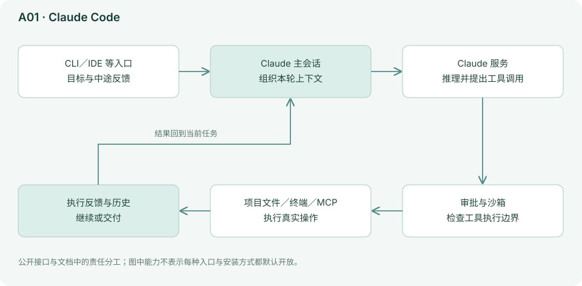

可以把它看成“主对话＋工具执行层＋可插拔工作规范”。项目说明、记忆、Skills 为模型补充做事方法；Hooks 在确定的生命周期节点执行程序；MCP 接入外部工具；子代理拥有独立上下文，完成局部任务后交回结果。Skills 更像工作手册，子代理则像另开一张办公桌，两者不应混为一谈。[记忆](https://code.claude.com/docs/en/memory.md)、[子代理](https://code.claude.com/docs/en/sub-agents.md)、[Hooks](https://code.claude.com/docs/en/hooks.md)

它也有 Agent Teams，但团队协作与普通子代理不是同一个功能开关。是否启用、可用界面、并行开销和任务边界都要单独确认。权限审批负责决定能不能做；沙箱进一步限制命令实际接触的文件和网络。允许一次命令，并不等于让全部后续动作永久放行。[团队](https://code.claude.com/docs/en/agent-teams.md)、[沙箱](https://code.claude.com/docs/en/sandboxing.md)

官方 GitHub 仓库可用于查看 README、扩展、发布和问题记录，但不能据此声称已经审计完整的商业运行时。本报告对其内部架构的描述以官方公开行为和接口为边界。[官方仓库](https://github.com/anthropics/claude-code)

读一个陌生项目时，主代理不必一次加载所有源文件。它可以先搜索入口，再读取有关函数，把运行结果带回下一轮。子代理适合把一大段探索过程放到独立上下文中，交回结论和文件位置；但如果任务需要修改同一组文件，分出去反而可能增加协调。Hooks 适合确定的检查，例如文件修改后的格式化；Skill 适合需要模型理解后执行的一套方法。前者按事件触发，后者仍要经过模型判断。

#### 深入一层：上下文、执行权限与独立子任务怎样衔接

Claude Code 的循环可以拆成“准备材料、让模型决策、执行工具、把观察送回去”。CLAUDE.md 与技能提供行为背景，工具结果提供新事实，两者不能互相代替。子代理另有上下文窗口：主代理把范围明确的调查交出去，收到结果后再决定下一步；这不等于让每个工作者读到主对话的全部细节。

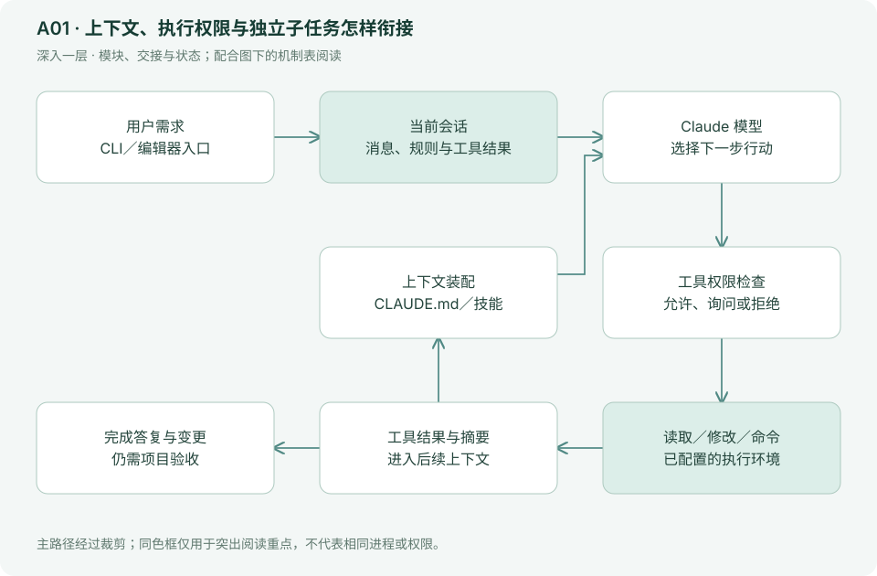

| 模块／交接点 | 怎样工作 | 状态与边界 |
|---|---|---|
| 上下文入口 | 项目规则、会话与按需技能参与请求 | 规则文件不是执行权限；材料过多也会占上下文。 |
| 动作出口 | 权限判断与可选沙箱限制工具行为 | “用户批准”与“操作系统隔离”是两层控制。 |
| 子任务交接 | 独立上下文中的子代理向主任务返回结果 | 交接要包含目标与验收标准；团队协作另有生命周期。 |

**沿着一次任务看数据怎样走。** 例如修复解析器：先读规则和测试，模型提出读取实现，工具返回代码；需要独立调查时委派子代理，主会话汇总后修改并运行测试。压缩发生时应保留已确认结论、失败测试和待办，不能把摘要当成原文件备份。

**与相近工具的实质差别。** 与 Pi 的最小核心相比，Claude Code 把较多现成的上下文、权限与委派体验纳入产品。代价是不能仅凭公开 CLI 包确认商业内部所有实现；图表示官方描述的职责。

本节细图与机制依据：[claude-how](https://code.claude.com/docs/en/how-claude-code-works.md)、[claude-subagents](https://code.claude.com/docs/en/sub-agents.md)、[claude-sandbox](https://code.claude.com/docs/en/sandboxing.md)。图中选取主要模块与交接路径，完整结构及并行条件请结合所引材料阅读。

### 能力、状态与边界

| 观察项 | 实际机制／公开能力 | 对使用者意味着什么 |
|---|---|---|
| 项目知识 | CLAUDE.md、记忆和按需使用的 Skills | 把构建命令、目录约定写清楚；按任务需要加载相关手册内容 |
| 会话与恢复 | 当前历史会影响后续动作；可继续既有对话 | 继续聊天不等于恢复已退出的服务进程 |
| 任务分工 | 独立上下文的子代理；另有 Agent Teams | 先决定需要摘要交接，还是需要真正的团队协作 |
| 外部能力 | MCP 接服务，Hooks 接确定性程序 | 工具数量增加后，要检查命名、凭据和调用范围 |
| 执行控制 | 权限决定是否允许；沙箱限制可访问范围 | 首次使用时确认实际审批模式及账户默认值 |
| 交付与迁移 | 文件和 Git diff 可审查；扩展配置有产品语义 | 带走代码容易，迁移 Hooks、权限规则还需重新适配 |

**把机制放进实际工作。**

项目规则、Skill、Hook 和权限要分别理解。规则告诉模型长期遵循什么；Skill 告诉它某类工作通常怎样做；Hook 在具体事件发生时运行确定程序；权限决定工具请求是否允许。比如“修改后检查格式”可以写成规则，也可以通过 Hook 执行检查，但两者强制程度不同。规则被摘要遗漏与 Hook 配置错误，也属于不同故障。

长任务看似忘记要求时，先核对要求放在哪里、当前会话是否读取、是否在压缩后仍有足够依据。对重要约束，可以要求重新读项目文件；重复粘贴全部历史则可能把成本与噪声一起抬高。把调查交给子代理时，给它一个需要证据回答的问题，比只给“研究专家”头衔更有效；主代理需要文件位置、结论和未解决问题。

命令没有执行时，应先看是模型没有提出调用、审批没通过、沙箱拒绝访问，还是程序自身报错。按失败原因分别补充提示、调整授权、修正环境或修改代码，可以更快找到有效的解决办法。正式比较时固定项目状态与工具，原生模型的优势才不会和更宽的权限、更齐的环境混在一起。

### 从安装到完成第一个任务

1. 按官方 Quickstart 为自己的系统安装，运行版本检查；区分订阅登录、Console API 与企业云渠道，确认实际计费账户。

2. 进入已有项目，先请求说明入口、测试和依赖。核对它引用的文件，修正错误后再把稳定结论放进 CLAUDE.md。

3. 选择账户可用的模型与权限模式。给出一个可重现的小问题，让它先提出原因，再修改；阅读工具请求中的目录和命令。

4. 让它运行与改动直接有关的检查，并说明失败是原有问题、环境问题还是新增问题。审查 diff，确认没有顺手扩大需求。

5. 第二次同类任务再提炼 Skill；大量独立调查再开子代理。需要接外部系统时逐个增加 MCP，并保留一条不用该扩展也能验收的基线任务。

下面是启动命令或操作路线；路径、认证与功能入口请按自己的版本调整。

```bash
# 先按官方文档安装；把路径替换为自己的仓库
cd /path/to/project
claude --version
claude
# 之后在同一目录继续最近一次会话
claude -c
```

### 典型任务与验收方法

下面是一份**可直接改写使用的试用任务**，属于本报告设计的验收示例，并非已完成的运行测试。

> 登录接口在密码错误时返回 500。请定位异常处理路径，增加能重现问题的测试，做最小修复，再运行相关测试。交付时给出变更文件、测试结果和仍未覆盖的情况。

重点观察它有没有先重现问题、是否读到了真正的异常入口，以及失败后能否依据输出调整方案。若只看最终解释，很容易把有条理的叙述误当成可靠调试。跨文件任务再记录你中途纠正它的次数。

### 模型搭配、适用方向与取舍

原生优先 Claude。当前官方直连别名中，Sonnet 5 适合作为日常起点；复杂设计和长任务再试账户可用的 Opus 或 Fable。不同云供应商的同名别名可能落到不同版本，因此应记录实际模型 ID。适合跨文件修复、项目探索、测试驱动的实现，也能处理目录中的文档和资料。若主要诉求是随意更换各家模型，应优先比较 OpenCode、Pi、Kilo。上手难度：中；深度扩展：中高。[模型配置](https://code.claude.com/docs/en/model-config.md)

| 选择路线 | 候选组合 | 怎样决定 |
|---|---|---|
| 原生日常 | Claude Sonnet 5 | 先验证普通修复、测试与项目探索，记录实际版本。 |
| 困难任务 | 账户可用的 Opus／Fable | 复杂根因和多文件设计再升级；先排除环境与资料缺失。 |
| 控制成本 | 日常档＋缩小调查范围 | 只给相关文件，减少无效工具与重复上下文；将单价、重试次数和人工返工一起计入任务成本。 |

选它的理由是原生模型与工具体验配合紧密、日常开发流程完整；代价是执行行为对商业模型和产品更新较敏感。希望研究循环本身的人可对照 Pi；希望在多家模型间反复切换的人可对照 OpenCode。用完整任务比较修改质量、测试结果和恢复表现。

### 资料依据与继续阅读

[工作原理](https://code.claude.com/docs/en/how-claude-code-works.md)、[记忆](https://code.claude.com/docs/en/memory.md)、[子代理](https://code.claude.com/docs/en/sub-agents.md)、[官方上手步骤](https://code.claude.com/docs/en/quickstart)。

完整商业运行时未公开，结构判断以官方可见行为和接口为限。上面的流程建议与取舍是依据这些材料给出的选型判断；具体型号、权限和菜单以实际安装与账户为准。

<a id="a02"></a>

## A02 Codex：把任务、执行环境和审查组织成一套系统

### 定位与设计理念

Codex 的关键不只是生成补丁，而是让代理在明确工作空间中持续执行任务，留下可审查的变更。CLI、编辑器和桌面入口可以提供不同交互方式；各入口的功能、模型和权限设置应分别核对。[CLI](https://learn.chatgpt.com/docs/codex/cli.md)、[工作树](https://learn.chatgpt.com/docs/environments/git-worktrees.md)

它更强调任务的持续执行和结果审查：代理先获得一个明确的工作空间，再围绕文件、命令与验证推进。对于开发者，这意味着一次对话可以形成一组可检查的改动；对于界面开发者，同一核心又能通过协议被不同客户端使用。桌面上的任务管理方便组织工作，但真正决定任务能做什么的是运行位置、权限和所选模型。

### 工作原理与架构图

下图结合所引源码与文档，画出本工具的主要责任分工；为便于理解，省略次要模块与错误分支。

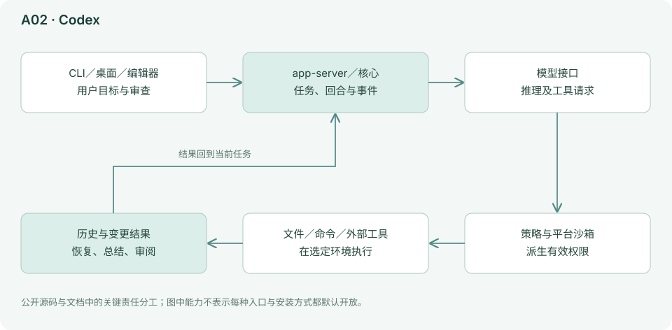

当前公开核心以 Rust 为主。`codex-rs/core` 放可复用业务逻辑，app-server 通过结构化协议把任务、回合和输出事件交给界面。通俗地说，界面负责“怎样看和怎样点”，核心负责“任务到底跑到了哪里”。这使桌面交互、自动化客户端和执行逻辑可以分开演进。[核心说明](https://github.com/openai/codex/blob/8a577399c774d1881ef030971d8f271694f55536/codex-rs/core/README.md)、[app-server](https://github.com/openai/codex/blob/8a577399c774d1881ef030971d8f271694f55536/codex-rs/app-server/README.md)

权限也不是一串提示词。源码将沙箱策略选择、命令转换和执行请求衔接起来；子代理创建时处理父级与请求权限的有效边界，并管理运行容量。其含义是：一个子代理不该因为“另起了会话”就自动获得比父任务更大的权限。具体平台使用的沙箱实现有所不同，部署时要看对应系统说明。[沙箱适配](https://github.com/openai/codex/blob/8a577399c774d1881ef030971d8f271694f55536/codex-rs/core/src/sandboxing/mod.rs)、[子代理创建](https://github.com/openai/codex/blob/8a577399c774d1881ef030971d8f271694f55536/codex-rs/core/src/agent/control/spawn.rs)

`AGENTS.md`、Skills、记忆与历史压缩分别解决项目规则、可复用方法、跨任务信息和当前窗口容量问题。压缩有本地／远端处理路径，不等于原始文件消失。工作树能够减少并行改代码时的文件冲突，但最后仍要集成、检查测试和审阅变更。[压缩实现](https://github.com/openai/codex/blob/8a577399c774d1881ef030971d8f271694f55536/codex-rs/core/src/compact.rs)、[自定义](https://learn.chatgpt.com/docs/customization/overview.md)、[子代理文档](https://learn.chatgpt.com/docs/agent-configuration/subagents.md)

app-server 的意义可以用远程控制来理解：界面发送结构化请求，核心把一轮中的消息、工具进度和完成状态回传。界面刷新不应让客户端重新猜任务有没有执行过。工作树则解决另一个问题：两个任务各自在不同目录改代码，减少争写文件；它不提供网络隔离，也不会自动解决两个补丁在业务逻辑上的冲突。源码中的子代理控制把容量和权限继承放进创建流程，说明分工需要运行时管理，而非只在提示里写几个角色名。

#### 深入一层：客户端、会话协议与执行边界

Codex 要把同一任务呈现给不同客户端，因此“界面”与“运行中的会话”分开理解更清楚。App Server 用请求和通知传递线程、轮次与条目；一次 turn 内可产生多个工具条目。core 负责实际代理逻辑，界面消费进度，并在协议要求时处理审批。图中的两条入口是接入关系，不表示 App Server 之外又有一套不同模型。

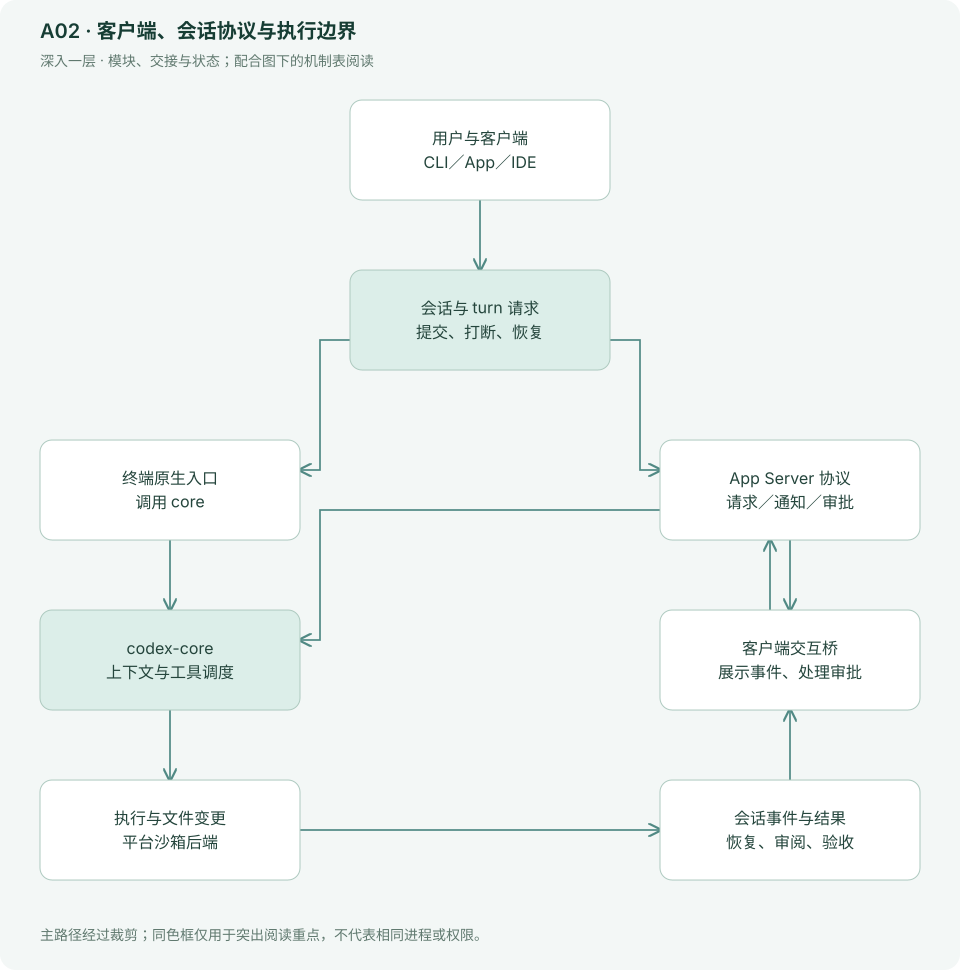

| 模块／交接点 | 怎样工作 | 状态与边界 |
|---|---|---|
| 协议层 | 客户端发起请求，服务端持续报告条目状态 | 一次请求返回不代表整个任务已经完成。 |
| 执行层 | 工具请求经过策略与具体沙箱后端 | macOS、Linux、Windows 的实现不同，不能拿一种平台的隔离承诺套用全部。 |
| 历史与分工 | 会话历史、压缩和子代理控制是不同职责 | 恢复聊天不等于恢复文件系统；并行任务仍需管理工作目录。 |

**沿着一次任务看数据怎样走。** 例如改 API：客户端创建轮次，core 组织上下文并请求模型；命令需要审批时，客户端收到请求并返回决定。允许后才进入相应执行路径，输出再作为工具条目回到会话。用户看到的“正在运行”表示任务仍处于执行阶段，其中也可能包含等待工具返回的时间。

**与相近工具的实质差别。** 与仅把 HTTP 模型接口包在聊天窗口里的工具相比，Codex 的客户端协议还要承载工具、审批和持续会话。与云端远程工作机相比，本地 core 的边界不自动等于云产品全部实现。

本节细图与机制依据：[README.md](https://github.com/openai/codex/blob/8a577399c774d1881ef030971d8f271694f55536/codex-rs/app-server/README.md)、[README.md](https://github.com/openai/codex/blob/8a577399c774d1881ef030971d8f271694f55536/codex-rs/core/README.md)、[mod.rs](https://github.com/openai/codex/blob/8a577399c774d1881ef030971d8f271694f55536/codex-rs/core/src/sandboxing/mod.rs)、[compact.rs](https://github.com/openai/codex/blob/8a577399c774d1881ef030971d8f271694f55536/codex-rs/core/src/compact.rs)。图中选取主要模块与交接路径，完整结构及并行条件请结合所引材料阅读。

#### 局部放大：一次命令：策略判断、审批与操作系统限制

这幅图单独拆开命令出口。策略判断决定该走哪条路径；需要审批时，用户或配置中的审批机制给出决定；获准动作再按实际配置进入执行后端。具体策略可能无需交互，也可能拒绝执行。审批回答的是“是否准许”，沙箱回答的是“运行时能碰到什么”，两者不能互相替代。恢复会话后，仍要检查命令是否已经执行及其退出状态，避免把缺少结果的调用直接重复一次。

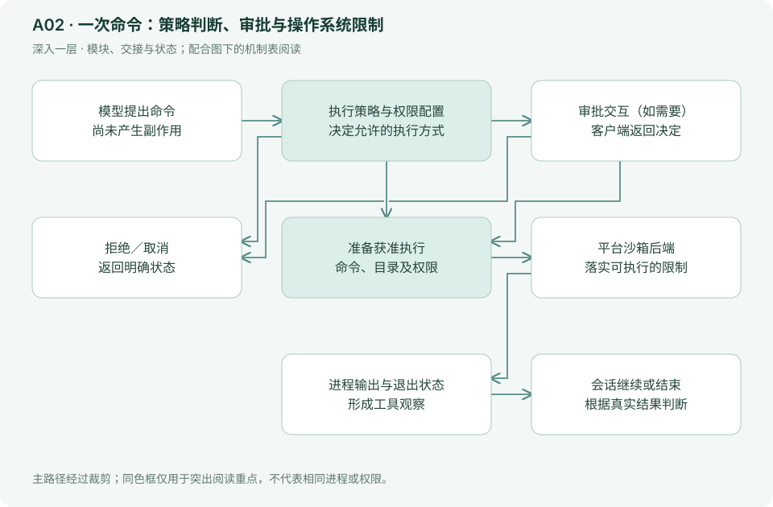

本图依据同节列出的固定源码与官方文档，表示所选子系统的主要路径。

### 能力、状态与边界

| 观察项 | 实际机制／公开能力 | 对使用者意味着什么 |
|---|---|---|
| 项目规则 | AGENTS.md、Skills 与产品支持的记忆 | 固定规范进入规则文件，当前进度进入任务记录，便于分别维护 |
| 状态与界面 | 任务／回合／事件通过 app-server 协议交互 | 自建客户端需要正确处理审批、流式事件和任务结束 |
| 上下文容量 | 保留历史并按路径进行压缩 | 压缩后抽查目标、文件和失败原因，必要时重新读原文 |
| 并行工作 | 子代理与 Git 工作树承担不同职责 | 前者分工，后者隔开文件；完成后都需要集成 |
| 执行环境 | 本地及其他产品入口的环境与沙箱不同 | 先确认当前目录、可写范围和网络访问策略 |
| 交付 | 文件变更、命令输出与审阅流程 | 最终要检查实际 diff；任务完成标签不是业务验收 |

**把机制放进实际工作。**

事件接口的价值在于让客户端区分“正在请求模型”“工具已开始”“需要审批”和“回合结束”。如果只把它们拼成一段文字，重新连接时就容易误判操作是否做过。开发自有客户端时，应该按协议管理任务状态；普通用户则应查看实际命令和文件，确认成功提示对应真实结果。

并行任务有三种不同的分离：子代理分开上下文，工作树分开代码目录，沙箱限制系统资源。可以只拥有其中一种，也可以组合。两个工作树仍可能使用同一个数据库或相同端口；两个子代理在共享目录里也可能争改同一文件。因此，分工应写明文件与外部资源责任，集成测试仍由整体任务承担。

恢复时至少核对四件事：当前任务目标、实际分支与文件、上次验证结果、仍在运行或已结束的外部操作。摘要里写“服务已启动”，不表示进程重启后服务还在。让代理先核对环境再继续，通常比直接说“接着做”更稳。模型升级适合解决推理瓶颈，不能替代这些状态检查。

### 从安装到完成第一个任务

1. 选择 CLI、编辑器或桌面入口，打开目标仓库。确认当前分支和已有未提交修改，避免把用户原有工作误当作代理产物。

2. 检查实际工作目录、模型、权限与执行环境，让它解释项目运行方法；把长期有效的约定放进适用范围内的 AGENTS.md。

3. 提交完整任务，包括复现、改动边界、可运行的测试和完成标准。复杂需求先要求简短计划，确认关键接口后实施。

4. 检查执行证据：命令是否真的运行、返回状态如何、验证覆盖了哪些行为。没有运行条件时，明确区分静态检查与真实运行验证。

5. 确有独立改动再创建工作树或子任务；集成时重新做相关检查。需要开发自己的客户端时，再读 app-server 协议及事件生命周期。

下面是启动命令或操作路线；路径、认证与功能入口请按自己的版本调整。

```bash
# 安装并完成认证后，在目标仓库启动
cd /path/to/project
codex
# 以下 Git 命令供交付后人工审查
git diff --stat
git diff
```

### 典型任务与验收方法

下面是一份**可直接改写使用的试用任务**，属于本报告设计的验收示例，并非已完成的运行测试。

> 为现有服务增加分页查询，保留旧接口行为。先梳理调用方和测试，再实现参数校验、分页逻辑与测试。完成后解释兼容性，并列出未验证的部署条件。

分页任务应覆盖正常返回、空结果、边界页和非法参数，确认各条路径都符合预期。若并行实现前后端，还要确认参数名称、排序规则和错误码一致。这个例子用来检验任务管理是否改善了交接、集成和最终交付。

### 模型搭配、适用方向与取舍

原生优先当前官方 GPT 系列：日常先试 GPT-5.6 Terra，重复且容易验收的任务试 Luna，较深推理和成品质量需求试 Sol，最复杂的长任务试 GPT-6 Astra。选择必须以所在产品实际开放的模型为准。自定义 Provider 可以接入其他服务，但“接口能调用”不等于工具格式、推理状态和长任务行为已经同等优化。适合完整功能实现、迁移、复杂调试、需要反复运行验证的任务。上手难度：中；工作树和自动化管理：中高。[模型说明](https://learn.chatgpt.com/docs/models.md)、[配置](https://learn.chatgpt.com/docs/config-file/config-basic.md)

| 选择路线 | 候选组合 | 怎样决定 |
|---|---|---|
| 原生日常 | GPT-6 Sol；仍可用的 GPT-5.6 Terra | 优先核对当前入口的模型目录，以同一小任务建立开发基线。 |
| 困难任务 | GPT-6 Astra／Sol | 深推理、复杂迁移和长任务候选；比较提升是否抵消额外时间与成本。 |
| 可机械验收 | GPT-6 Luna；仍可用的 GPT-5.6 Luna | 用于清楚、重复的小任务；失败应有明确升级条件。 |

它适合把实现、验证和审查作为一件连续工作的用户。原生模型路线通常省去协议适配负担；自定义 Provider 仍需确认工具参数、推理状态和上下文处理。与 Kiro 比较时看是否需要先形成规范；与轻量 Pi 比较时看是否更重视现成任务与权限管理。

### 资料依据与继续阅读

[CLI](https://learn.chatgpt.com/docs/codex/cli.md)、[工作树](https://learn.chatgpt.com/docs/environments/git-worktrees.md)、[核心说明](https://github.com/openai/codex/blob/8a577399c774d1881ef030971d8f271694f55536/codex-rs/core/README.md)、[配置](https://learn.chatgpt.com/docs/config-file/config-basic.md)。

源码链接指向固定提交；关键实现分析不等于对整个项目和依赖逐行审计。上面的流程建议与取舍是依据这些材料给出的选型判断；具体型号、权限和菜单以实际安装与账户为准。

<a id="a03"></a>

## A03 Gemini CLI：把 Google 模型和检索能力带进终端

### 定位与设计理念

Gemini CLI 是开放的终端代理，面向 Gemini 生态。适合希望保留命令行工作习惯，又需要联网查资料、多模态输入和项目操作的用户。Google 账户、API Key、Vertex AI 等接入方式对应的计费、限额和组织管理方式不同，不能统一概括为“免费无限用”。[项目说明](https://github.com/google-gemini/gemini-cli/blob/d5b3e3accb26000d273abf16e0f1dd83aa5428a9/README.md)

它把 Google 模型接进一个可读源码的开发循环。检索、图片与项目操作可以在同一任务中配合，例如先理解截图和接口文档，再修改页面。它的自然优势来自生态整合；如果只是希望所有厂商都能完全相同地工作，多 Provider 产品的设计目标会更贴近需求。

### 工作原理与架构图

下图结合所引源码与文档，画出本工具的主要责任分工；为便于理解，省略次要模块与错误分支。

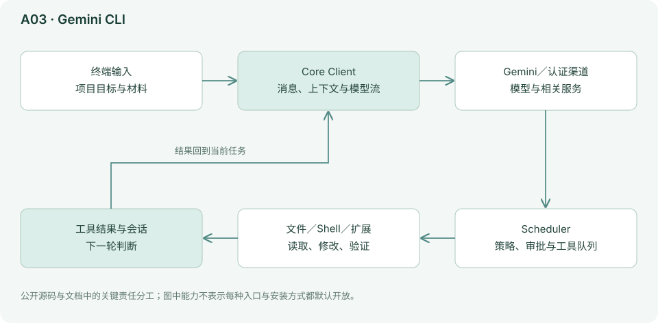

核心客户端处理对话和模型流，调度器处理工具批次、策略判断、审批和执行状态。模型说“执行这个工具”和工具真的执行，中间隔着一个明确的调度层。例如工具策略可以直接拒绝，也可以转入询问，正在运行的批次还会影响后续队列。[客户端](https://github.com/google-gemini/gemini-cli/blob/d5b3e3accb26000d273abf16e0f1dd83aa5428a9/packages/core/src/core/client.ts)、[调度器](https://github.com/google-gemini/gemini-cli/blob/d5b3e3accb26000d273abf16e0f1dd83aa5428a9/packages/core/src/scheduler/scheduler.ts)

这类分层的价值在于，终端界面不需要自己理解每一种工具的全部生命周期。项目上下文、扩展、MCP 和权限机制则围绕这条执行链提供能力。它还可以操作开发环境，将检索得到的线索用于后续执行与验证。

调度器像执行现场的值班员。模型提出一批操作后，它要逐个判断能否执行、是否需要询问、是否已经被取消，再把结果交回客户端。因此，模型输出一条命令并不表示命令已经运行。扩展和 MCP 增加可用能力时，也是在这条执行链上增加工具；如果工具返回太长、错误不清楚，最终会影响下一轮推理。排查失败时应分别看模型回复、调度状态和实际进程输出。

#### 深入一层：模型客户端与工具调度器之间的状态交接

Gemini CLI 把“生成下一步”与“把工具执行好”拆开。GeminiClient 管理模型会话；Scheduler 接收工具请求队列，用状态管理器、执行器与消息总线协调确认、执行和取消。这样终端可以随工具状态变化及时显示进度。

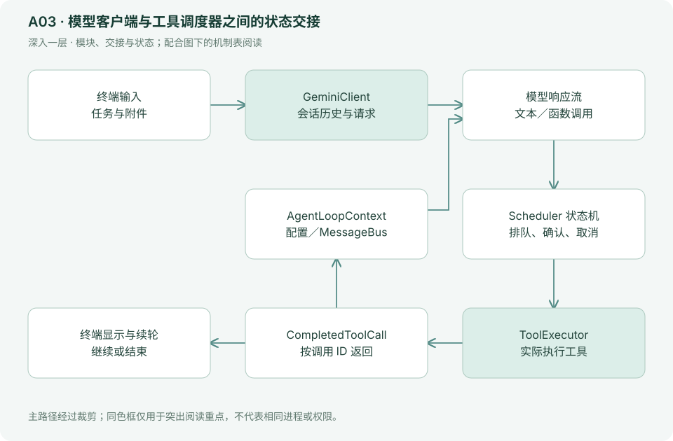

| 模块／交接点 | 怎样工作 | 状态与边界 |
|---|---|---|
| 请求标识 | 工具结果关联调用 ID | 多个结果不能按完成先后随意拼接。 |
| 调度状态 | 排队、等待确认、执行和完成各有状态 | 等待用户不是执行失败，取消也不应留下悬挂任务。 |
| 共享运行背景 | AgentLoopContext 向调度器提供配置与消息总线 | 界面进度和模型可见结果职责不同。 |

**沿着一次任务看数据怎样走。** 假设模型同时提出读文件与运行测试：调度器接收这一批调用，分别处理确认与执行，组装完成结果后让会话继续。若用户中止，应沿取消信号停止相应工作；不能仅清空终端输出就算取消。

**与相近工具的实质差别。** 与 Qwen Code 相比，二者可见共同的客户端与工具循环思路，但模型服务、产品配置和扩展演进需要分别核对。源码血缘只能解释结构相似，不能证明当前能力相同。

本节细图与机制依据：[client.ts](https://github.com/google-gemini/gemini-cli/blob/d5b3e3accb26000d273abf16e0f1dd83aa5428a9/packages/core/src/core/client.ts)、[scheduler.ts](https://github.com/google-gemini/gemini-cli/blob/d5b3e3accb26000d273abf16e0f1dd83aa5428a9/packages/core/src/scheduler/scheduler.ts)。图中选取主要模块与交接路径，完整结构及并行条件请结合所引材料阅读。

### 能力、状态与边界

| 观察项 | 实际机制／公开能力 | 对使用者意味着什么 |
|---|---|---|
| 认证与费用 | Google 登录、API、Vertex 等渠道 | 同一个界面不代表相同额度和组织政策 |
| 项目背景 | GEMINI.md 与按需读取项目材料 | 将命令和目录约定写进去，比整仓灌入更容易维护 |
| 多模态与检索 | 依所选模型和工具处理额外材料 | 模型支持图片，不代表所有输入渠道都支持同样附件 |
| 工具调度 | 策略、审批、执行状态和队列分层 | 失败先区分被拒绝、工具报错和模型选错动作 |
| 扩展 | 扩展与 MCP 等外部能力 | 逐项接入，保留可复现的配置 |
| 模型替换 | 主要面向 Gemini 生态 | 更换认证渠道后重新记录实际型号和上下文限制 |

**把机制放进实际工作。**

调度层把模型意图转换成有状态的工具操作。一次读取、一次写入和一条长时间运行的命令，对取消、审批与结果保存的要求并不相同。排错时可以沿三段看：客户端有没有发出正确请求，调度器怎样决定，工具实际返回什么。这样比仅凭最后一段回答判断原因更清楚。

联网资料与项目事实也要分开。模型检索到的接口文档可能属于另一个版本，仓库却锁定旧依赖；这时不能直接照搬搜索答案。让代理检查依赖版本、请求格式与真实错误，再把外部资料接到本地实现，才是检索辅助开发的完整链条。

更换认证渠道后，模型名称相似也可能有不同额度、组织策略或服务能力。一次图片任务失败，应先检查图片是否经当前入口发送，再确认模型与渠道；一次工具失败则应检查返回信息。记录这些差异，有助于区分产品配置、工具执行和模型理解各环节的问题。

### 从安装到完成第一个任务

1. 按仓库安装指南准备运行环境和 CLI，选择适合个人或组织的认证方式；先验证能正常调用模型。

2. 在测试项目运行 gemini，让它读 README 和配置文件，说明本项目怎样构建与测试。把确认后的规则写入 GEMINI.md。

3. 提交一个同时有材料和代码的任务，例如按接口文档补齐一个调用。明确哪些网址或附件可作为依据，以及哪些内容必须由本地代码确认。

4. 在执行阶段检查文件修改和命令审批；工具失败后让它解释返回信息，再决定重试或换方法。

5. 完成后检查引用资料是否真的支持实现，运行本地检查。再加入一个必要扩展，重复同一任务片段，确认新增能力没有破坏基本循环。

下面是启动命令或操作路线；路径、认证与功能入口请按自己的版本调整。

```bash
# 先按官方要求准备运行环境
npm install -g @google/gemini-cli
cd /path/to/project
gemini
```

### 典型任务与验收方法

下面是一份**可直接改写使用的试用任务**，属于本报告设计的验收示例，并非已完成的运行测试。

> 根据提供的 API 文档，在这个项目里增加天气查询页。请先确认文档中的请求参数与错误格式，再复用现有网络层；界面需要加载、成功、空结果和失败四种状态。

这里需要同时核对资料理解和工程落地。能查到正确文档但没有沿用项目网络层，仍算集成失败；页面成功显示一次，也不能替代错误状态验证。记录是否出现了检索结果过多、模型只读摘要或接口版本混用。

### 模型搭配、适用方向与取舍

原生优先 Gemini。当前官方目录中的 Gemini 3.8 Flash 可作为快速任务候选，复杂任务比较账户可用的 Pro 型号，例如 3.1 Pro Preview；预览型号要单列记录。适合带检索的开发、资料到代码的转换、图片辅助理解，以及 Google Cloud 生态。若核心需求是跨厂商随时替换，OpenCode／Qwen Code 的入口通常更直接。上手难度：中。[当前 Gemini 模型](https://ai.google.dev/gemini-api/docs/models)

| 选择路线 | 候选组合 | 怎样决定 |
|---|---|---|
| 快速日常 | Gemini 3.8 Flash | 短任务和有清楚验收的修改先试，检查工具与视觉输入是否完整。 |
| 复杂任务 | 可用 Gemini Pro，如 3.1 Pro Preview | 复杂资料与推理再比较；预览可用性、额度按入口核对。 |
| 保持可比 | 固定模型与输入类型 | 先固定检索、图片与工具配置，再比较不同档位，不混淆材料差异。 |

适合已经采用 Google 服务、需要检索与多模态辅助开发的用户。主要成本不只在模型单价，也在认证配置、组织限制和扩展维护。与 Qwen Code 对照时，重点看实际需要的协议与服务渠道；比较时结合当前版本，核对两者的模型适配与工具行为。

### 资料依据与继续阅读

[项目说明](https://github.com/google-gemini/gemini-cli/blob/d5b3e3accb26000d273abf16e0f1dd83aa5428a9/README.md)、[客户端](https://github.com/google-gemini/gemini-cli/blob/d5b3e3accb26000d273abf16e0f1dd83aa5428a9/packages/core/src/core/client.ts)、[调度器](https://github.com/google-gemini/gemini-cli/blob/d5b3e3accb26000d273abf16e0f1dd83aa5428a9/packages/core/src/scheduler/scheduler.ts)、[当前 Gemini 模型](https://ai.google.dev/gemini-api/docs/models)。

源码链接指向固定提交；关键实现分析不等于对整个项目和依赖逐行审计。上面的流程建议与取舍是依据这些材料给出的选型判断；具体型号、权限和菜单以实际安装与账户为准。

<a id="a04"></a>

## A04 Qwen Code：在熟悉的终端代理结构上扩大模型与渠道覆盖

### 定位与设计理念

Qwen Code 既服务 Qwen 生态，也重视多协议接入。当前版本已不宜只用“Gemini CLI 的中文分支”概括：历史来源解释了部分结构，但现有模型配置、团队功能和入口已经继续演化。[README](https://github.com/QwenLM/qwen-code/blob/99bf4ce86b32010644538046ea37b0ef0ad23921/README.md)

Qwen Code 把熟悉的终端代理形式与更宽的模型接入结合。它允许用户在保留一套工作习惯的同时调整模型服务，但这个自由度也要求用户了解地址、协议、认证和模型能力是四件事。它尤其适合希望围绕中文服务或自建推理环境形成稳定流程的用户。

### 工作原理与架构图

下图结合所引源码与文档，画出本工具的主要责任分工；为便于理解，省略次要模块与错误分支。

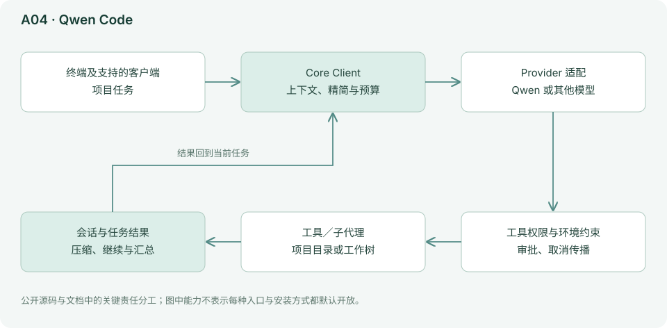

模型客户端中可以看到压缩、上下文精简和目标预算相关逻辑；代理工具则把子任务的生命周期、权限、会话和工作目录纳入管理。它不是简单将请求中的模型名替换成 Qwen。[客户端](https://github.com/QwenLM/qwen-code/blob/99bf4ce86b32010644538046ea37b0ef0ad23921/packages/core/src/core/client.ts)

一个有代表性的源码细节是：某些 shell 沙箱环境只允许在同一工作空间内运行子代理，工作树、另选工作目录和队友功能会受到限制；前台子代理也需要处理父任务取消的向下传播。由此可见，宣传页上的“支持子代理”“支持沙箱”，并不保证两者在每一种组合中完全可用。[代理工具](https://github.com/QwenLM/qwen-code/blob/99bf4ce86b32010644538046ea37b0ef0ad23921/packages/core/src/tools/agent/agent.ts)

同一个子任务能否放进工作树，取决于运行环境是否允许它访问那个目录。源码对这类限制做了明确判断，所以不能孤立地比较功能勾选项。上下文预算也是如此：客户端可以精简和压缩材料，但服务端真实可容纳多少内容，还取决于模型部署参数。特别是在本地服务中，模型卡写着很长的窗口，并不意味着推理服务已经按相同长度启动。

#### 深入一层：主会话与专用 Agent 工具如何分工

Qwen Code 不只是替换了模型名称。主会话客户端组织持续交互，Agent 工具把一个范围较明确的任务交给另外的代理执行，再把结果作为主任务的观察。这里最关键的是输入输出边界：子任务需要哪些文件、可用哪些工具、交付什么证据，应在委派时说清。图中并列分支表示不同职责，不承诺每条都会同时运行。

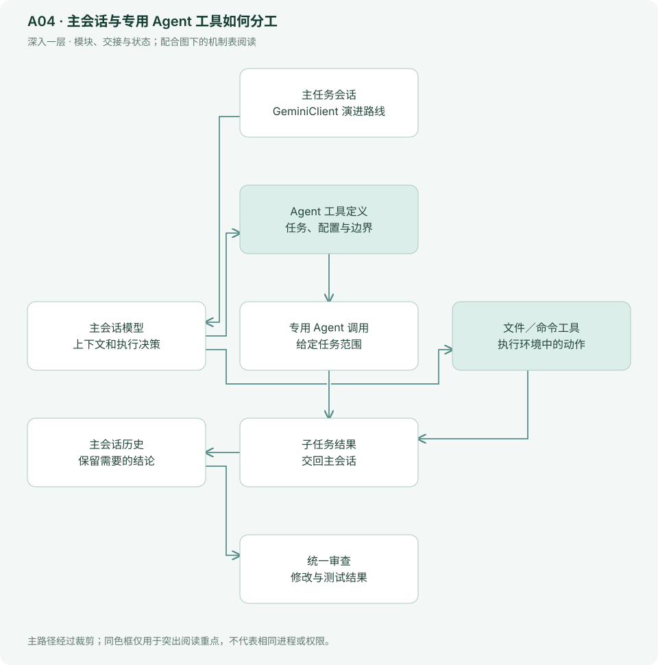

| 模块／交接点 | 怎样工作 | 状态与边界 |
|---|---|---|
| 会话客户端 | 管理请求与会话继续 | 模型渠道和认证配置仍须单独核对。 |
| Agent 工具 | 把任务包装为可委派的调用 | 委派结果是结论和证据，不自动合并所有思考历史。 |
| 项目状态 | 工具最终作用于实际工作环境 | 多个任务修改相同文件时需要明确所有权。 |

**沿着一次任务看数据怎样走。** 例如排查构建失败：主会话保留用户目标，一条专用调查分析依赖错误，主任务检查构建配置；返回结果后再决定修改。验收应检查导致失败的命令是否恢复，而不只检查子代理是否返回“已找到原因”。

**与相近工具的实质差别。** 与 Gemini CLI 比较时，重点检查各自的工具实现与模型适配。与重型团队编排器相比，单个 Agent 工具也不自动具备共享任务板和全队调度。

本节细图与机制依据：[client.ts](https://github.com/QwenLM/qwen-code/blob/99bf4ce86b32010644538046ea37b0ef0ad23921/packages/core/src/core/client.ts)、[agent.ts](https://github.com/QwenLM/qwen-code/blob/99bf4ce86b32010644538046ea37b0ef0ad23921/packages/core/src/tools/agent/agent.ts)。图中选取主要模块与交接路径，完整结构及并行条件请结合所引材料阅读。

### 能力、状态与边界

| 观察项 | 实际机制／公开能力 | 对使用者意味着什么 |
|---|---|---|
| 模型接入 | 多协议与多个 Provider | 逐个确认 Base URL、认证、模型 ID 与协议 |
| 项目上下文 | 规则、当前历史和压缩／精简 | 保留关键约束，验证长任务恢复时是否仍然有效 |
| 目标控制 | 客户端处理目标与预算相关状态 | 预算应连同子任务用量一起观察 |
| 分工 | 子任务、会话、目录与权限共同管理 | 沙箱条件可能限制工作树和团队模式 |
| 本地模型 | 可按文档接入自建兼容服务 | 先通过工具调用与多轮测试，再讨论长任务 |
| 迁移 | 可复用项目文件与任务描述 | 认证、规则优先级和插件配置仍需重新核对 |

**把机制放进实际工作。**

多协议配置至少包含服务地址、认证、模型 ID 与请求格式。地址正确而协议错误时，普通文本可能勉强可用，工具、多模态或推理参数却失败；模型 ID 是别名时，还可能在不改配置的情况下切到新版本。完成聊天连通检查后，再测试工具往返和恢复，逐步迁移日常工作。

子任务创建既涉及上下文，也涉及工作目录和父任务的生命周期。若当前沙箱限制了可访问目录，独立工作树可能无法运行；若取消只结束父任务，子任务还在改文件，就会留下状态问题。源码中对此做约束的意义，是承认这些能力需要共同设计，不能分别打开几个开关就假定全部兼容。

本地模型方案还需核对推理服务的真实窗口、输出限制与工具模板。硬件不足导致截断、服务模板改变调用格式，与模型自身不会解决问题是不同情况。先用短任务排除部署问题，再增加上下文和任务复杂度；这样得到的成本与质量判断才有意义。

### 从安装到完成第一个任务

1. 安装当前发行版并运行 qwen。先使用文档推荐的认证路线，避免第一步就同时自建模型、修改工具和启用团队。

2. 让它解释仓库入口与测试方法，补充项目指令；确认中文需求中的业务术语与代码名的对应关系。

3. 选择一个明确模型，用读取、单文件修改、运行检查三个动作验证基础工具链；记录返回的实际模型 ID。

4. 接入本地服务时，再检查服务的上下文参数、工具模板和是否支持所需多模态能力。用两三轮连续纠错检查模型能否利用工具反馈继续推进。

5. 基础稳定后试一个独立子任务，确认目录、权限继承和取消行为。需要工作树时先检查当前沙箱是否允许，完成后由主任务统一验证。

下面是启动命令或操作路线；路径、认证与功能入口请按自己的版本调整。

```bash
# 安装与认证按当前 Qwen Code 文档完成
cd /path/to/project
qwen
```

### 典型任务与验收方法

下面是一份**可直接改写使用的试用任务**，属于本报告设计的验收示例，并非已完成的运行测试。

> 为订单列表补充状态筛选。请先把“待支付、处理中、已完成”与代码中的枚举对应起来，再修改查询和测试。保持旧调用不传筛选条件时的行为。

这个任务能发现中文业务理解与代码执行之间的落差。检查是否错把展示文案当作数据库值，是否保持了默认查询行为；若换成自建模型，观察它能否正确生成工具参数，并根据测试失败继续修正。

### 模型搭配、适用方向与取舍

原生优先 Qwen 的编程／推理模型，当前服务目录包括 Qwen3.8 系列；跨厂商接入以文档支持的协议为准。若重视开放权重和本地试验，可测试 Qwen3-Coder-30B-A3B-Instruct 这类有官方模型卡的模型，并从较短、边界清楚的任务开始，逐步确认其可承担的任务长度。适合中文开发协作、多协议部署、国内服务接入和本地模型探索。难度：中；自建推理服务：高。[Qwen 模型目录](https://www.alibabacloud.com/help/en/model-studio/models)、[本地候选模型卡](https://huggingface.co/Qwen/Qwen3-Coder-30B-A3B-Instruct/raw/main/README.md)

| 选择路线 | 候选组合 | 怎样决定 |
|---|---|---|
| 原生云端 | Qwen 当前编程／推理服务 | 中文开发先建立基线，记录实际 Qwen3.8 等服务 ID。 |
| 开放部署 | Qwen3-Coder-30B-A3B-Instruct 等 | 仅在服务端格式、硬件和工具模板合适时试小修复，不直接承担最长任务。 |
| 跨厂商对照 | 当前明确支持的 Provider | 保持相同工具、任务和预算，比较格式稳定性与返工。 |

跨协议和中文生态选择丰富，代价是配置组合更复杂。纯原生 Gemini 工作可选 Gemini CLI，偏模型无关插件生态可比较 OpenCode，极简研究可比较 Pi。比较时固定相同模型和任务，才能判断差异来自工具设计还是模型能力。

### 资料依据与继续阅读

[README](https://github.com/QwenLM/qwen-code/blob/99bf4ce86b32010644538046ea37b0ef0ad23921/README.md)、[客户端](https://github.com/QwenLM/qwen-code/blob/99bf4ce86b32010644538046ea37b0ef0ad23921/packages/core/src/core/client.ts)、[代理工具](https://github.com/QwenLM/qwen-code/blob/99bf4ce86b32010644538046ea37b0ef0ad23921/packages/core/src/tools/agent/agent.ts)、[本地候选模型卡](https://huggingface.co/Qwen/Qwen3-Coder-30B-A3B-Instruct/raw/main/README.md)。

源码链接指向固定提交；关键实现分析不等于对整个项目和依赖逐行审计。上面的流程建议与取舍是依据这些材料给出的选型判断；具体型号、权限和菜单以实际安装与账户为准。

<a id="a05"></a>

## A05 Kimi Code：围绕 Kimi 的长任务体验重新组织执行核心

### 定位与设计理念

本报告使用的是 `MoonshotAI/kimi-code`。旧 `kimi-cli` 的架构介绍不能直接套到新代码。当前仓库是 TypeScript 多包结构，`agent-core-v2` 是需要重点看的执行核心；发布的独立程序也不意味着用户必须先搭建 Node 开发环境。[当前仓库](https://github.com/MoonshotAI/kimi-code/blob/6451f1e056e90037bbf832f3578955cf8e55db64/README.md)

它更关心长任务中的连续性：当前目标、已经读到的文件、未完成的工具交换和接下来要做的事，都必须在多轮调用中正确衔接。大窗口有帮助，但不能替代运行时维护状态。对读很多资料、再推进多文件修改的开发任务，这种连续性通常比第一轮回答写得多长更有意义。

### 工作原理与架构图

下图结合所引源码与文档，画出本工具的主要责任分工；为便于理解，省略次要模块与错误分支。

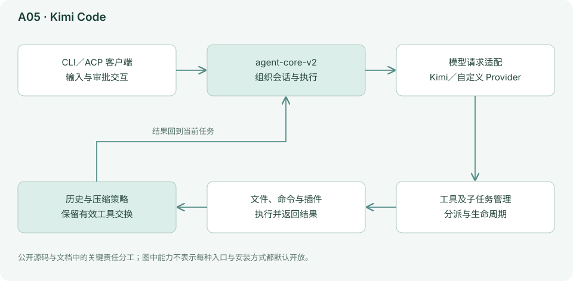

Kimi Code 将终端任务、编辑器连接、工具和独立子任务组合起来。ACP 让编辑器可以接入同一类代理会话，插件与 Hooks 扩展行为，不同子代理承担探索、规划和实现。这些部分共同组成一套覆盖开发流程的助手。

历史压缩根据上下文预算触发，并为下一步留出空间；压缩边界还要避开没有完成的工具交换。为什么要这样做？如果只留下“调用工具”的消息，却丢掉对应结果，下一轮模型会看到一段断裂的对话。长上下文管理首先是状态正确性问题，然后才是节省 Token。[压缩策略](https://github.com/MoonshotAI/kimi-code/blob/6451f1e056e90037bbf832f3578955cf8e55db64/packages/agent-core-v2/src/agent/fullCompaction/strategy.ts)、[模型请求层](https://github.com/MoonshotAI/kimi-code/blob/6451f1e056e90037bbf832f3578955cf8e55db64/packages/agent-core-v2/src/agent/llmRequester/llmRequester.ts)

可以把工具调用看成一封请求与一封回信。压缩时若只留下请求，模型可能以为动作还没完成；若只留下回信，也可能不知道结果对应哪个动作。Kimi 的压缩策略对这种边界做处理，目的是给下一轮留下可解释的历史。ACP 解决的则是界面连接问题：编辑器可以展示会话，但实际循环仍由 Kimi 负责。换编辑器不等于换了模型协议或执行权限。

#### 深入一层：请求适配与上下文压缩是两条独立职责

Kimi Code 的请求层把代理内部信息转换为具体 Provider 接口能接受的请求；压缩策略则负责在历史变长时重新组织可用材料。两者都影响模型看到什么，但解决的问题不同：接口适配处理格式，压缩处理容量。换一个兼容接口，不能据此保证原有长任务行为也完全一致。

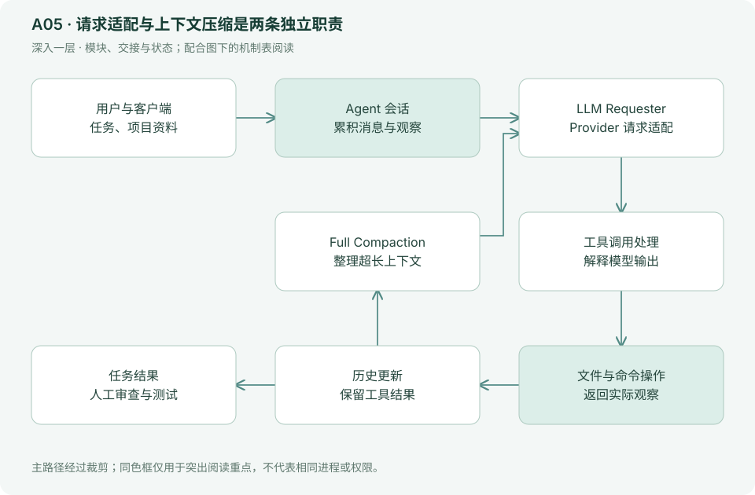

| 模块／交接点 | 怎样工作 | 状态与边界 |
|---|---|---|
| LLM Requester | 准备请求并处理服务端响应 | 认证成功只证明一层可用。 |
| Full Compaction | 在有限窗口中维持后续任务所需信息 | 旧细节可能不再逐字存在，关键约束要有稳定载体。 |
| 执行反馈 | 工具观察继续参与模型判断 | 摘要与聊天记录不能代替仓库里的实际补丁。 |

**沿着一次任务看数据怎样走。** 在大规模重命名中，前几轮找到调用点，后几轮修改并检查。发生压缩后，仍需知道哪些目录已完成、哪些测试失败、哪些公开接口不能变。若漏掉一个范围限制，应先检查输入和摘要，再断言模型理解能力不足。

**与相近工具的实质差别。** 与单轮聊天客户端相比，Kimi Code 的关键是持续的请求—观察过程。与其他编码代理比较时，固定任务长度，记录首次回答及压缩前后约束的保留情况。

本节细图与机制依据：[llmRequester.ts](https://github.com/MoonshotAI/kimi-code/blob/6451f1e056e90037bbf832f3578955cf8e55db64/packages/agent-core-v2/src/agent/llmRequester/llmRequester.ts)、[strategy.ts](https://github.com/MoonshotAI/kimi-code/blob/6451f1e056e90037bbf832f3578955cf8e55db64/packages/agent-core-v2/src/agent/fullCompaction/strategy.ts)、[providers.md](https://github.com/MoonshotAI/kimi-code/blob/6451f1e056e90037bbf832f3578955cf8e55db64/docs/en/configuration/providers.md)。图中选取主要模块与交接路径，完整结构及并行条件请结合所引材料阅读。

### 能力、状态与边界

| 观察项 | 实际机制／公开能力 | 对使用者意味着什么 |
|---|---|---|
| 项目身份 | 当前 kimi-code 多包实现 | 阅读旧 kimi-cli 教程前先核对版本和命令 |
| 长任务 | 上下文预算与完整工具交换共同决定压缩 | 用阶段性检查点补充摘要，观察检查点与摘要能否共同保留任务约束 |
| 多入口 | CLI 与 ACP 等连接方式 | 外部编辑器需要单独配置代理与认证 |
| 分工与扩展 | 子任务、插件和 Hooks | 先验证单代理循环，再增加独立调查职责 |
| 模型别名 | 账户目录与别名映射可以变化 | 试用记录保存实际模型 ID 与别名当时的指向 |
| 兼容服务 | Provider 文档提供配置路径 | 不同协议的工具、流和推理语义要重新验收 |

**把机制放进实际工作。**

上下文压缩首先需要保留一段合法的对话。工具调用和工具结果必须能对应，压缩边界不能随意切在两者中间。之后才是摘要质量：目标、约束、已改文件、失败方案和下一步应能支持继续工作。只留下漂亮的项目概述，往往不足以恢复真正的工程进度。

长窗口减少了部分切片需求，却不会自动告诉模型哪些资料最关键。迁移文档、旧接口和最新代码同时存在时，需要说明时效与优先级，否则模型可能把互相矛盾的版本混用。每阶段交付一个小而可验证的成果，有助于及时发现理解偏差，也能让恢复材料更准确。

ACP 连接失败时，应分别检查客户端配置、Kimi 进程启动和模型认证。客户端能显示历史，不代表当前模型账户可继续请求；命令能在终端运行，也不代表编辑器传入了同一个目录。把入口与环境分开核对，有助于避免把连接问题误认为长任务能力不足。

### 从安装到完成第一个任务

1. 从当前 kimi-code 的 README 安装发行版，在项目目录启动 kimi；配置说明也选用与该发行版对应的文档。

2. 在交互界面用 /login 完成认证，用 /model 查看本账户实际可用模型。核对订阅别名和 API 型号是否相同。

3. 先让它整理项目入口、测试命令和已有约束；提交一个需要读多个文件、但修改范围明确的任务，观察文件引用是否准确。

4. 长任务每完成一个阶段，要求记录已修改文件、验证结果和下一步；恢复后抽查这些事实，再继续实施。

5. 需要编辑器入口再配置 kimi acp；需要跨模型再按 Provider 文档增加一项配置，并重复同一组工具与恢复测试。

下面是启动命令或操作路线；路径、认证与功能入口请按自己的版本调整。

```bash
cd /path/to/project
kimi
# 在支持 ACP 的客户端中，按文档将代理启动命令设为：
kimi acp
```

### 典型任务与验收方法

下面是一份**可直接改写使用的试用任务**，属于本报告设计的验收示例，并非已完成的运行测试。

> 阅读这套旧接口和迁移说明，列出必须保持的行为。先迁移一个模块并补测试，把尚未处理的接口写成清单；下一次会话根据清单继续。

迁移后的行为比“读完了很多文件”更值得检查。对照旧测试和调用方，确认关键边界未丢失；暂停恢复后询问它仍未解决的事项，将回答与保存的进度、失败记录逐项核对。

### 模型搭配、适用方向与取舍

原生优先 Kimi。当前文档区分 K3 的不同上下文档位；`kimi-for-coding` 别名目前指向 K2.8 Preview，不能把这个别名永久当作某个固定旧版本。复杂、资料量大的任务可先试可用的 K3，日常工作比较 K2.8 路线。适合中文项目沟通、长资料辅助开发和 Kimi 订阅用户。上手难度：中。[模型说明](https://www.kimi.com/code/docs/en/kimi-code/models.html)、[更新记录](https://www.kimi.com/code/docs/en/kimi-code/whats-new.html)

| 选择路线 | 候选组合 | 怎样决定 |
|---|---|---|
| 原生日常 | Kimi 账户实际提供的型号 | 核对 kimi-for-coding 别名，不把套餐名当固定权重版本。 |
| 长资料与复杂实现 | 可用 K3 档位 | 先确认窗口和配额，再测试关键约束在长任务中是否保留。 |
| 成本对照 | K2.8 Preview 等当前服务路线 | 同任务比较输入、重试与人工检查；不因窗口更大就自动选最高档。 |

适合 Kimi 用户、中文交流和材料较多的工程任务。长上下文能少做一些切片，但仍需承担输入成本、摘要偏差和恢复核验。与 Hermes 比较时，前者偏开发任务，后者更强调长期个人经验与多入口持续工作。

### 资料依据与继续阅读

[当前仓库](https://github.com/MoonshotAI/kimi-code/blob/6451f1e056e90037bbf832f3578955cf8e55db64/README.md)、[压缩策略](https://github.com/MoonshotAI/kimi-code/blob/6451f1e056e90037bbf832f3578955cf8e55db64/packages/agent-core-v2/src/agent/fullCompaction/strategy.ts)、[模型请求层](https://github.com/MoonshotAI/kimi-code/blob/6451f1e056e90037bbf832f3578955cf8e55db64/packages/agent-core-v2/src/agent/llmRequester/llmRequester.ts)、[更新记录](https://www.kimi.com/code/docs/en/kimi-code/whats-new.html)。

源码链接指向固定提交；关键实现分析不等于对整个项目和依赖逐行审计。上面的流程建议与取舍是依据这些材料给出的选型判断；具体型号、权限和菜单以实际安装与账户为准。

<a id="a06"></a>

## A06 MiMo Code：按模型家族调整工具，而非假定所有模型用同一套手势

### 定位与设计理念

MiMo Code 继承了可辨认的 OpenCode 结构，同时加入自己的模型适配、记忆和任务模式。它关注不同模型在训练中形成的工具使用习惯，并据此调整运行时。[README](https://github.com/XiaomiMiMo/MiMo-Code/blob/1579e7d9ee5fca87b707c3892dc725316674a9d6/README.md)

MiMo Code 的一个重要判断是：工具接口会影响模型采取什么行动。模型在训练和使用中形成了不同的调用习惯，有的更适合补丁，有的更适合命令或可编程工具组合。因此，同一个任务可以保留外层会话结构，却为不同模型配置不同工具接口。这让模型适配深入到行为层，也增加了维护多条执行路径的成本。

### 工作原理与架构图

下图结合所引源码与文档，画出本工具的主要责任分工；为便于理解，省略次要模块与错误分支。


其 Codex microkernel 文档描述了面向 GPT 系列的工具接口组织：终端、补丁、图像以及可编程调用能力分别承担不同职责。这里的“微内核”是一种架构比喻，并不是说它变成了操作系统内核。QuickJS 中的脚本没有直接获得 Node、进程和网络能力，但它调用到的宿主工具仍然需要权限管理；尤其不能把“JavaScript 被隔离”误读为“终端命令也被系统沙箱隔离”。[架构说明](https://github.com/XiaomiMiMo/MiMo-Code/blob/1579e7d9ee5fca87b707c3892dc725316674a9d6/docs/architecture/codex-microkernel-runtime.en.md)、[工具注册](https://github.com/XiaomiMiMo/MiMo-Code/blob/1579e7d9ee5fca87b707c3892dc725316674a9d6/packages/opencode/src/tool/registry.ts)

当前设计包含跨会话记忆、检索和检查点文件，试图把目标、进展、约束保存成下一次可重新装载的材料。相较只留一句“之前我们讨论了登录功能”，这种方式更适合恢复“测试失败在哪里、哪些文件已经改过、下一步是什么”。但能恢复多少仍取决于写入内容和检索命中，不能保证毫无遗漏。[README](https://github.com/XiaomiMiMo/MiMo-Code/blob/1579e7d9ee5fca87b707c3892dc725316674a9d6/README.md)、[压缩实现](https://github.com/XiaomiMiMo/MiMo-Code/blob/1579e7d9ee5fca87b707c3892dc725316674a9d6/packages/opencode/src/session/compaction.ts)

在可编程调用路线中，脚本可以把多次工具调用组织成一次小流程，减少来回解释。但脚本虚拟机没有直接的文件或网络访问，只能说明脚本自身的能力受限；它转而调用的宿主终端仍可能执行有影响的命令。另一个设计重心是把进度写成可装载材料：检查点应说明已经做了什么、为什么失败和怎样继续，而不只是重复最初需求。两条机制分别解决调用效率与任务连续性。

#### 深入一层：同一 Session 内，模型工具表与脚本执行怎样分层

MiMo Code 的公开架构文档把 GPT 路线称为“Codex microkernel runtime”，这里的微内核是工具组织方式的比喻，并非操作系统内核，也不是另启一套 Codex 引擎。它仍使用统一 Session，只按模型调整提示和可见工具，并用 QuickJS 执行组合工具的脚本。真正读文件、启动进程和访问 MCP 的仍是宿主工具。

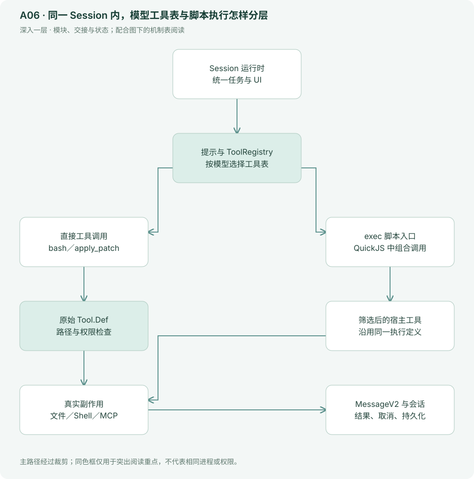

| 模块／交接点 | 怎样工作 | 状态与边界 |
|---|---|---|
| 工具表 | ToolRegistry 决定模型看到的能力 | 提示路由与工具路由是两套规则，不能只核对模型名字。 |
| 脚本隔离 | QuickJS 限制脚本本身的执行环境 | 脚本沙箱不等于 bash 运行在容器里。 |
| 副作用控制 | 直接调用和脚本子调用都回到宿主权限 | 批量组合不应扩大原有授权；多文件写入也不等于数据库事务。 |

**沿着一次任务看数据怎样走。** 例如一轮读取三个文件并比较：模型可用 exec 组合已允许的工具，把整理后的结果回传，减少冗长往返。但调用写入工具仍须通过原来的权限和路径检查；脚本失败后应检查已执行的动作，不能假定全部自动回滚。

**与相近工具的实质差别。** 与 DeepSeek Harness 的全插件能力接缝相比，这里的重点是统一 Session 上的模型工具契约。与 Pi 相比，模型专属工具组合和脚本宿主承担了更多产品策略。

本节细图与机制依据：[codex-microkernel-runtime.en.md](https://github.com/XiaomiMiMo/MiMo-Code/blob/1579e7d9ee5fca87b707c3892dc725316674a9d6/docs/architecture/codex-microkernel-runtime.en.md)、[registry.ts](https://github.com/XiaomiMiMo/MiMo-Code/blob/1579e7d9ee5fca87b707c3892dc725316674a9d6/packages/opencode/src/tool/registry.ts)。图中选取主要模块与交接路径，完整结构及并行条件请结合所引材料阅读。

### 能力、状态与边界

| 观察项 | 实际机制／公开能力 | 对使用者意味着什么 |
|---|---|---|
| 模型适配 | 不同家族可采用专门工具配置 | 兼容结论要精确到模型、协议和工具模式 |
| 任务模式 | Plan／Build／Compose 等有各自约束 | 切模式前确认是否改变可写能力和工具集 |
| 可编程工具 | QuickJS 等受限脚本环境 | 脚本限制不等于宿主命令已被操作系统隔离 |
| 长任务材料 | 记忆、检索与检查点 | 抽查内容是否准确、是否记录失败方案与下一步 |
| 上下文 | 压缩配合恢复材料 | 减少输入不保证遗漏最少，需要任务验证 |
| 继承与演化 | 继承 OpenCode 结构并加入自身产品能力 | 按当前发行版核对开关与默认值 |

**把机制放进实际工作。**

模型特定工具层意味着“同一份提示＋同一个模型”也不一定是同一次实验：工具名称、参数、补丁方式和调用组织改变后，模型看到的任务接口已经不同。比较 microkernel 路线时，同时记录模型型号与实际启用的工具。

脚本可以把独立查询合并处理，减少模型与工具之间的来回。但脚本编排一旦包含依赖关系、错误分支和有副作用的操作，仍需明确何时停止、哪些结果已经生效。脚本引擎限制只能保证其直接可用能力；调用宿主命令之后的资源边界，需要另外看权限和执行环境。

检查点的价值在恢复时最容易检验：故意在一个阶段完成后停止，再让任务说明实际文件、已通过检查及下一步。若检查点与磁盘不一致，应先核对事实再继续，不能让模型依据旧记录覆盖新改动。持久记忆、当前任务检查点与自动摘要应各有职责，避免同一条错误在多个位置被反复保存。

### 从安装到完成第一个任务

1. 按当前 README 安装 CLI，在项目目录启动 mimo；先选官方原生模型路线，建立一条能完成修改与测试的基线。

2. 用 Plan 讨论任务和验收，用 Build 实施一个范围明确的改动；切换前查看实际工具与权限，不把模式名当成唯一保障。

3. 要求将阶段成果写进项目中可查看的记录，包含文件、检查结果、失败原因和下一步。重新开启任务后验证恢复准确性。

4. 确需使用其他模型时，核对其适配路径和工具配置；先运行相同小任务，观察调用格式、补丁应用和错误处理是否稳定。

5. 再尝试可编程工具或 Compose。单独记录它节约的是往返次数、输入量还是人工干预，避免用更复杂的流程掩盖任务返工。

下面是启动命令或操作路线；路径、认证与功能入口请按自己的版本调整。

```bash
# 先满足官方运行环境要求
npm install -g @mimo-ai/cli
cd /path/to/project
mimo
```

### 典型任务与验收方法

下面是一份**可直接改写使用的试用任务**，属于本报告设计的验收示例，并非已完成的运行测试。

> 把三个重复的表单校验函数抽成共享模块。请先比较差异、写出必须保持的行为，再逐个迁移；每个阶段保存检查点，最后跑相关测试。

关注抽象是否保留了各表单的差异。为了减少重复而把业务例外抹平，属于失败。恢复检查点时，让它指出已迁移和未迁移的调用方；比较模型适配时，则观察同一类编辑能否稳定应用。

### 模型搭配、适用方向与取舍

原生优先 MiMo-V2.5 系列；较复杂代理任务可试 Pro。仓库也为 GPT 等模型做了专门适配，因此跨模型使用比单纯“兼容接口”更有研究价值，但本报告没有证明它在 GPT 上优于 Codex。MiMo-X 等受限预览与公开可用模型要分开看。适合愿意尝试模型特定工具配置、持久任务状态的开发者。难度：中；理解模式和适配细节：中高。[模型发布说明](https://mimo.mi.com/docs/en-US/news/latest/v2.5-open-sourced)

| 选择路线 | 候选组合 | 怎样决定 |
|---|---|---|
| 原生起点 | MiMo-V2.5 系列 | 先验证标准模式下的工具与恢复，再调高级功能。 |
| 复杂任务 | MiMo-V2.5-Pro | 对跨文件实现和困难诊断作对照，检查总调用与返工。 |
| 适配研究 | 有专门工具路径的 GPT 等 | 属于需验证的组合；确认实际启用的工具层，不等同于原生 Harness。 |

适合愿意研究模型与工具协同、希望任务进度可恢复的开发者。优势越依赖特殊适配，跨型号升级就越需要回归。若只需要简单多 Provider 终端工作，先比较 OpenCode；若重点是原生 MiMo 服务，MiMo Code 更值得先试。

### 资料依据与继续阅读

[README](https://github.com/XiaomiMiMo/MiMo-Code/blob/1579e7d9ee5fca87b707c3892dc725316674a9d6/README.md)、[架构说明](https://github.com/XiaomiMiMo/MiMo-Code/blob/1579e7d9ee5fca87b707c3892dc725316674a9d6/docs/architecture/codex-microkernel-runtime.en.md)、[工具注册](https://github.com/XiaomiMiMo/MiMo-Code/blob/1579e7d9ee5fca87b707c3892dc725316674a9d6/packages/opencode/src/tool/registry.ts)、[模型发布说明](https://mimo.mi.com/docs/en-US/news/latest/v2.5-open-sourced)。

源码链接指向固定提交；关键实现分析不等于对整个项目和依赖逐行审计。上面的流程建议与取舍是依据这些材料给出的选型判断；具体型号、权限和菜单以实际安装与账户为准。

<a id="a07"></a>

## A07 DeepSeek Harness：把代理循环本身也做成可替换部件

### 定位与设计理念

这是 DeepSeek 官方 `deepseek-ai/deepseek-harness` 项目，而非仅仅给第三方壳换一个名字。当前仍标为开发者预览。关注度高说明值得研究，不代表接口已经稳定，或适合立即承担所有生产任务。[仓库](https://github.com/deepseek-ai/deepseek-harness/blob/00102833dfaee1da9f48a3a8eae9d34005a75218/README.md)、[产品说明](https://deepseek.com/harness/en/)

DSH 更像一套能重新装配的代理系统。一般产品允许换模型、加工具，而它还把代理循环、会话存储和子代理后端做成可替换服务。对最终用户，标准配置仍可作为编程工具；对研究者，重要的是能比较不同执行方法，而不必重写整套界面。这种开放程度很高，却不会自动带来稳定的插件组合。

### 工作原理与架构图

下图结合所引源码与文档，画出本工具的主要责任分工；为便于理解，省略次要模块与错误分支。

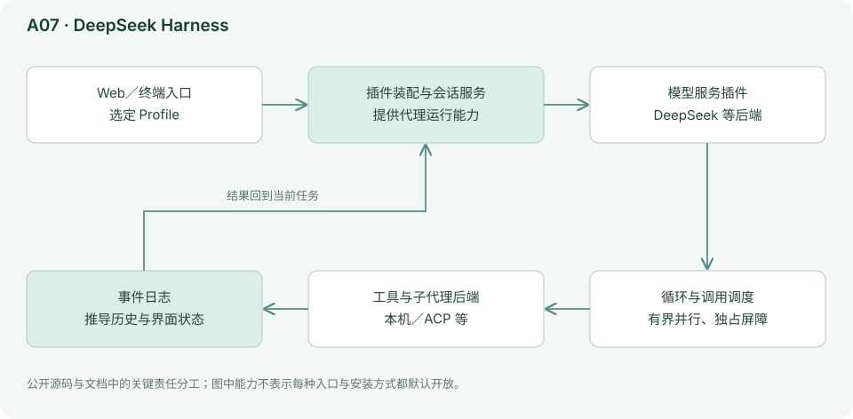

DSH 的中心思想是“连引擎也可以替换”。借助插件系统，模型、工具、会话存储、沙箱、代理循环以及界面被组织为可组合服务。Profile 决定装配哪些部件，再由配置层叠加修改。它既能成为终端／Web 产品，也能作为开发者搭建新代理的基础。[架构文档](https://github.com/deepseek-ai/deepseek-harness/blob/00102833dfaee1da9f48a3a8eae9d34005a75218/docs/architecture.md)

会话事件日志是核心依据，模型看到的历史由日志推导出来。这样可以区分模型输出、工具调用、工具结果和失败尝试，也方便重建界面、排查运行过程。但“能回放日志”不等于重新请求模型会得到一模一样的答案，更不等于自动撤销已经发送的邮件或修改过的外部数据库。[默认循环](https://github.com/deepseek-ai/deepseek-harness/blob/00102833dfaee1da9f48a3a8eae9d34005a75218/packages/core/agent-loop/src/agent.ts)

源码将必须独占的工具调用作为执行屏障，其他调用进入有界并行队列；即便工具并发执行，也要维持可理解的结果顺序。子代理又是一条可替换接缝，后端可采用内部会话、ACP 或其他代理系统；后端应明确返回不支持的能力，便于调用方调整流程。其开放性比“支持某个固定子代理按钮”更深，但集成测试负担也随之增加。[工具执行](https://github.com/deepseek-ai/deepseek-harness/blob/00102833dfaee1da9f48a3a8eae9d34005a75218/packages/core/agent-loop/src/tool-calls.ts)、[子代理后端](https://github.com/deepseek-ai/deepseek-harness/blob/00102833dfaee1da9f48a3a8eae9d34005a75218/docs/subsystems/subagent.md)

事件日志保存的是发生过的事情，例如一次工具调用请求、执行结果或错误；模型历史和界面再据此形成各自视图。这样，界面可以重建而不必再次执行工具。并行调度中，普通独立调用可以一起进行，需要独占的调用则像一扇临时关闭的门，等待前后批次衔接。开发插件时若忽略这种时序，即使每个工具单独能用，组合起来也可能发生先写后读顺序错误。

#### 深入一层：插件树、事件日志与模型可见历史

DeepSeek Harness 通过 Profile、Bundle 和有序补丁装配插件树，核心服务也参与这套组合机制。模型、工具、日志与循环都通过共享上下文协作。另一条重要边界是实时事件与持久事件：屏幕上的流式片段用于即时显示，已落入 SessionEvent 的事实才是恢复与历史投影的依据。

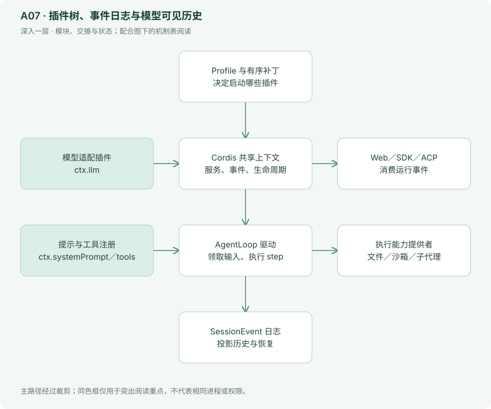

| 模块／交接点 | 怎样工作 | 状态与边界 |
|---|---|---|
| 启动组合 | 按 Bundle、用户与命令行补丁的顺序装配 | 替换服务时，核对依赖它的模块及相应配置。 |
| 能力接缝 | 接口定义、提供者和消费者分别承担职责 | 换远程文件系统时，相关进程环境也应一致。 |
| 历史投影 | 从日志生成模型可见消息 | 日志同时参与决定下一轮模型输入。 |

**沿着一次任务看数据怎样走。** 比如工具产生一条结果，循环把它写入会话事件，再由投影生成后续模型历史；Web 同时可以接收实时流更新。若进程在流输出尚未落定时丢失，不能保证每个屏幕片段都能恢复。调查问题时要区分即时显示、已提交事件和重建后的上下文。

**与相近工具的实质差别。** 与 OpenCode 的 SessionProcessor 路线相比，DSH 把替换点推进到共享服务与事件层。自由度更高，也意味着插件组合、生命周期及日志不变量需要共同维护。

本节细图与机制依据：[architecture.md](https://github.com/deepseek-ai/deepseek-harness/blob/00102833dfaee1da9f48a3a8eae9d34005a75218/docs/architecture.md)、[agent.ts](https://github.com/deepseek-ai/deepseek-harness/blob/00102833dfaee1da9f48a3a8eae9d34005a75218/packages/core/agent-loop/src/agent.ts)、[tool-calls.ts](https://github.com/deepseek-ai/deepseek-harness/blob/00102833dfaee1da9f48a3a8eae9d34005a75218/packages/core/agent-loop/src/tool-calls.ts)。图中选取主要模块与交接路径，完整结构及并行条件请结合所引材料阅读。

### 能力、状态与边界

| 观察项 | 实际机制／公开能力 | 对使用者意味着什么 |
|---|---|---|
| 装配 | Profile 选择部件，配置再覆盖 | 同时记录产品版本与最终装配结果 |
| 模型与循环 | 模型 Provider 和代理循环都可替换 | 换模型与换循环是两个实验变量 |
| 历史 | 事件日志作为重要状态依据 | 可重建过程，不保证重跑模型产生同样输出 |
| 工具 | 并发上限与独占调用屏障 | 依赖先后顺序的动作应明确表达依赖 |
| 子代理 | 内部会话、ACP 等后端接缝 | 不同后端并不提供完全相同的功能 |
| 成熟度 | 开发者预览及快速变化的接口 | 固定可用版本和插件集，升级后重做小型回归 |

**把机制放进实际工作。**

插件边界越开放，装配本身越需要可观察。某个 Profile 里虽然使用同一个模型，循环、工具、存储或子代理后端却可能不同。排查问题时先保存最终配置，确认实际加载了哪个服务，再沿调用路径找错误；只对照一个配置文件可能忽略叠加覆盖后的结果。

事件日志还需要区分意图与事实：记录“请求执行”不等于执行成功，记录“执行成功”也不等于业务效果正确。恢复界面可以重放事件，恢复任务则还要检查外部状态。对于不能安全重复的动作，必须先确认上一次是否已发生，而不是把重放历史当作重新执行工具。

有界并行和独占屏障降低部分执行冲突，但任务语义仍要表达依赖。读取旧文件、改写文件、再读取新结果不能任意重排；两个独立查询才更适合一起执行。开发自己的循环时，除完成路径外还应设计错误、取消与恢复，并用相同任务检验每次替换是否改变了这些行为。

### 从安装到完成第一个任务

1. 按官方 README 准备环境，使用标准入口与 Profile 启动；先确认模型认证、文件读写和工具结果展示正常。

2. 保存版本、Profile 和实际启用插件。让它完成一次最小修复，检查日志能否清楚区分请求、执行和结果。

3. 在同一配置下测试中断与恢复，确认恢复不会把已完成的工具误当成仍待执行；对有外部副作用的操作尤其要核对结果。

4. 有明确需求再更换一个部件，例如模型 Provider 或子代理后端；保留原配置作为对照，重复相同任务。

5. 开发新循环时，补齐错误、取消、权限和状态保存行为的设计，再接入 UI。能输出一个答案只是接口冒烟检查，不是代理系统验收。

下面是启动命令或操作路线；路径、认证与功能入口请按自己的版本调整。

```bash
# 标准 Web 入口；按官方文档配置认证与 Profile
npx @deepseek-ai/dsh web
```

### 典型任务与验收方法

下面是一份**可直接改写使用的试用任务**，属于本报告设计的验收示例，并非已完成的运行测试。

> 读取项目测试失败日志，修复一个独立错误。请保留关键执行证据；恢复会话后，准确说明哪些命令已成功、哪些仍待处理。

先比较事件记录与真实文件，确认没有只显示成功却漏写结果。研究不同循环时固定模型、项目状态和预算，统计任务完成、工具格式错误与人工干预；每轮尽量只改变一个因素，便于解释架构调整带来的影响。

### 模型搭配、适用方向与取舍

原生优先当前 DeepSeek API 模型，例如 `deepseek-flash` 对应的 V4.1 Flash 路线，以及适合更重任务的 Pro 路线；具体映射应当天核实。选型上更适合代理研发、需要可替换执行层的团队，以及愿意承担预览变动的高级用户。日常开发可先用小任务试用，验证稳定性后再逐步接入现有流程。难度：标准使用中；开发新 Harness 高。[API 模型目录](https://api-docs.deepseek.com/quick_start/pricing/)

| 选择路线 | 候选组合 | 怎样决定 |
|---|---|---|
| 原生起点 | DeepSeek Flash 当前映射 | 记录 deepseek-flash 实际版本，先跑标准 Profile。 |
| 困难任务 | DeepSeek Pro 路线 | 固定循环与插件再升级，避免把装配变化归因于模型。 |
| 研究对照 | 插件支持的其他 Provider | 改变一个变量，检查工具、历史和推理字段，保留原配置。 |

如果目标是开发、实验或嵌入代理运行时，DSH 的可替换边界值得研究。若只是日常修代码，开放性带来的收益可能小于维护预览配置的成本。与 Pi 比较时，一个侧重可理解且可扩展的核心，另一个将更多系统职责公开为装配接缝。

### 资料依据与继续阅读

[仓库](https://github.com/deepseek-ai/deepseek-harness/blob/00102833dfaee1da9f48a3a8eae9d34005a75218/README.md)、[产品说明](https://deepseek.com/harness/en/)、[架构文档](https://github.com/deepseek-ai/deepseek-harness/blob/00102833dfaee1da9f48a3a8eae9d34005a75218/docs/architecture.md)、[API 模型目录](https://api-docs.deepseek.com/quick_start/pricing/)。

源码链接指向固定提交；关键实现分析不等于对整个项目和依赖逐行审计。上面的流程建议与取舍是依据这些材料给出的选型判断；具体型号、权限和菜单以实际安装与账户为准。

<a id="a08"></a>

## A08 OpenCode：把模型和界面选择权留给使用者

### 定位与设计理念

OpenCode 的重点是开放、多 Provider 和多入口。模型服务、终端／桌面界面、会话和工具执行并非全部绑在一个厂商订阅里。它适合已经有 API 账户、想比较不同模型，又不愿为每个模型重学一套工具的用户。[README](https://github.com/anomalyco/opencode/blob/fe3f3a41f79ad292cc3c7c629567385a20ec5130/README.md)

OpenCode 把选择权放在模型和入口上：同一套会话与工具机制可以接不同 Provider，也能由不同界面使用。它对已有多个模型账户的用户很有吸引力。自由度带来的责任是明确记录究竟使用了哪个服务、哪套权限和哪些插件；“我用的是 OpenCode”本身并不足以复现一次任务。

### 工作原理与架构图

下图结合所引源码与文档，画出本工具的主要责任分工；为便于理解，省略次要模块与错误分支。

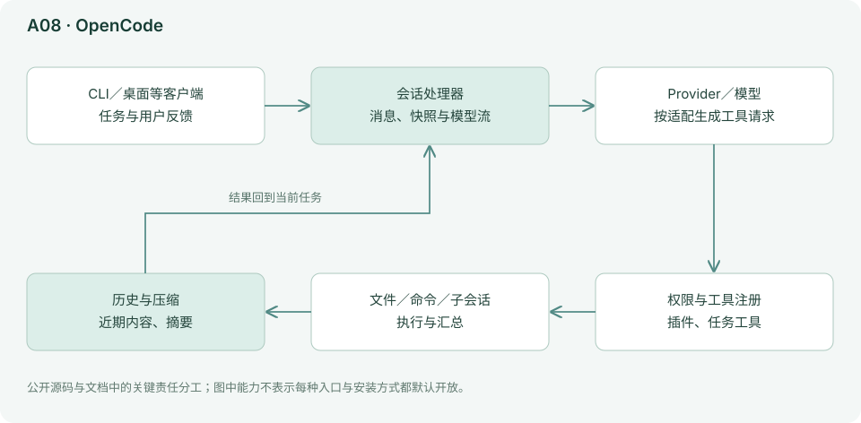

当前代码包括独立核心包以及会话、模型、权限、插件和快照服务。会话处理器将模型流转成消息与工具事件；还会在适当阶段准备快照。源码专门处理“工具可能早于某个流事件开始执行”的顺序问题，这说明保存状态不能只靠界面上看到的输出顺序。[会话处理器](https://github.com/anomalyco/opencode/blob/fe3f3a41f79ad292cc3c7c629567385a20ec5130/packages/opencode/src/session/processor.ts)

压缩不仅生成摘要，还涉及保留近期内容的预算、模型限制和大型附件溢出处理。任务工具创建独立子会话，并派生权限和模型设置。当前后台子代理还存在实验开关与深度限制；试用时需核对安装版本、实验开关和实际启用状态。[压缩](https://github.com/anomalyco/opencode/blob/fe3f3a41f79ad292cc3c7c629567385a20ec5130/packages/opencode/src/session/compaction.ts)、[任务工具](https://github.com/anomalyco/opencode/blob/fe3f3a41f79ad292cc3c7c629567385a20ec5130/packages/opencode/src/tool/task.ts)

会话处理器把流式模型回复转为可保存的消息和工具事件；某些事件先后顺序并不直观，因此不能只按终端文字出现顺序理解内部状态。快照、历史和压缩共同服务恢复，但分别处理文件状态、对话过程和窗口容量。任务工具创建的子会话可以带着派生模型与权限工作：这能分开探索细节，也可能让总账单包含多个模型。

#### 深入一层：流式处理、压缩与子会话的连接点

OpenCode 的 SessionProcessor 处理的不只是完整回复，而是模型流中的不同事件，并据此更新消息部件和工具状态。压缩模块单独管理历史整理；task 工具则把工作放进子会话。于是一个可恢复的任务至少涉及三类信息：对话内容、工具调用状态，以及仍然存在于工作目录中的文件。

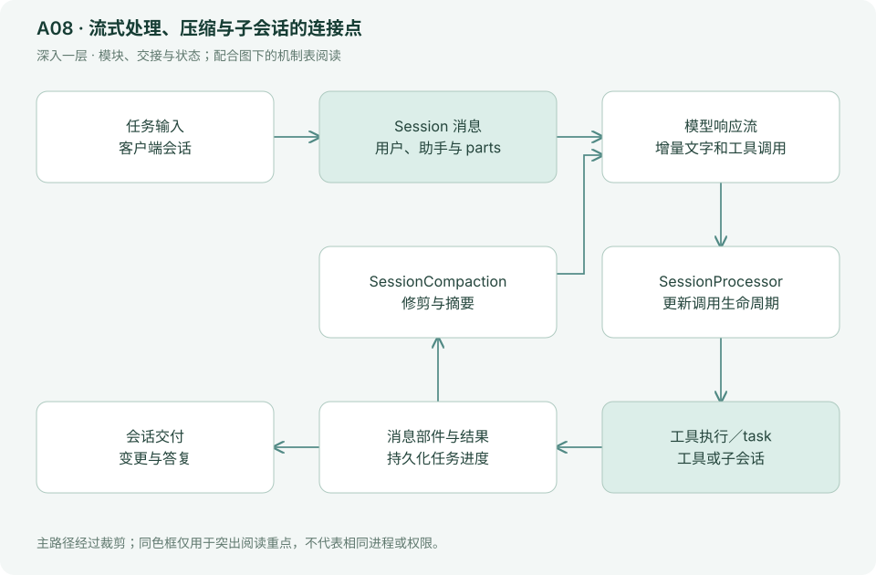

| 模块／交接点 | 怎样工作 | 状态与边界 |
|---|---|---|
| Processor | 消费流事件并推进工具状态 | 流中断可能留下未完成调用，不能按普通答复处理。 |
| Compaction | 清理或摘要较早上下文 | 减少输入体积不等于删除真实文件。 |
| task | 通过子会话完成委派 | 子会话 ID 与结果是交接线索，不自动隔离工作目录。 |

**沿着一次任务看数据怎样走。** 例如主任务改后端，同时委派调查前端调用点：task 返回调查结论，主任务继续处理。排查断线问题时，先看调用是否已执行、结果是否已记录，再决定续跑或重试，避免重复执行有副作用的命令。

**与相近工具的实质差别。** 与源自同一代码路线的产品比较，要分别看工具注册、模型适配、压缩和持久化改动。同样的 Session 名称不代表这些策略继续保持一致。

本节细图与机制依据：[processor.ts](https://github.com/anomalyco/opencode/blob/fe3f3a41f79ad292cc3c7c629567385a20ec5130/packages/opencode/src/session/processor.ts)、[compaction.ts](https://github.com/anomalyco/opencode/blob/fe3f3a41f79ad292cc3c7c629567385a20ec5130/packages/opencode/src/session/compaction.ts)、[task.ts](https://github.com/anomalyco/opencode/blob/fe3f3a41f79ad292cc3c7c629567385a20ec5130/packages/opencode/src/tool/task.ts)。图中选取主要模块与交接路径，完整结构及并行条件请结合所引材料阅读。

### 能力、状态与边界

| 观察项 | 实际机制／公开能力 | 对使用者意味着什么 |
|---|---|---|
| 模型自由 | 多个 Provider 与协议适配 | 模型列表多不代表所有组合都通过同等级测试 |
| 任务方式 | Plan 分析与 Build 实施 | 按实际工具策略确认各模式的操作范围 |
| 历史与文件 | 会话记录、快照及压缩各有职责 | 继续对话与恢复文件应分别验证 |
| 子任务 | 独立子会话、模型与权限派生 | 后台等能力需确认版本和实验开关 |
| 扩展 | 插件、LSP、MCP 等能力 | 一次增加一类能力，才能定位行为变化 |
| 迁移 | 模型与界面解耦降低部分绑定 | 账户授权、工具格式与历史结构仍有迁移成本 |

**把机制放进实际工作。**

开放 Provider 解决的是接入选择，不会消除模型在工具描述、推理状态与输出格式上的差异。发现模型开始重复调用或丢失工具结果时，优先检查适配和历史记录，定位信息在哪一步丢失。网关若只保留可见文本，可能使表面正常的聊天在多轮执行中失去必要信息。

会话记录、压缩摘要和文件快照分别回答不同问题：之前说过什么、下一轮需要记住什么、某时文件是什么样。恢复对话后应核对实际目录，特别是在人工已经改过文件或从其他分支带入变更时。继续执行前，先根据当前文件更新摘要中的过时信息。

子会话通过派生模型与权限开展局部工作，主任务则承担汇总和验收。给子任务限定文件范围与输出形式，可以减少无关修改和主上下文噪声。启用后台或实验功能时，应把版本、开关和取消行为一并记录；“支持子代理”不足以描述这个组合是否适合长任务。

### 从安装到完成第一个任务

1. 安装并进入仓库运行 opencode，连接一个 Provider；优先选择已经明确支持工具调用的模型，记录实际 ID。

2. 先用 Plan 让它解释修改范围、依赖和测试，再切换 Build 实施；将不变的项目约定写入文档支持的指令文件。

3. 做一次完整的小任务，包括读取、修改、运行检查和展示 diff。工具调用失败时先看协议与参数，再怀疑模型能力。

4. 保存任务的材料与验收条件，切换第二个模型重做同等任务；保持插件和模式一致，便于辨认模型切换带来的差异。

5. 长任务再试压缩与子会话。检查摘要是否保留约束、子任务是否只修改分配范围，以及合并结果能否通过统一检查。

下面是启动命令或操作路线；路径、认证与功能入口请按自己的版本调整。

```bash
# 完成官方安装后，在仓库内启动
cd /path/to/project
opencode
```

### 典型任务与验收方法

下面是一份**可直接改写使用的试用任务**，属于本报告设计的验收示例，并非已完成的运行测试。

> 将一个命令行脚本增加 dry-run 选项。预演时应展示将要发生的操作，但不修改文件；保持正常运行行为，并补上两类测试。

这是适合跨模型比较的小任务：要求清楚，既需要理解控制流，又能用测试验证是否真的没有副作用。记录补丁应用失败、工具参数错误和重试次数；最终代码相同但过程成本不同，也有选型意义。

### 模型搭配、适用方向与取舍

选型建议：在当前 Provider 确认支持的前提下，以 Sonnet 5／GPT-5.6 Terra 作为日常候选，复杂任务上探 Sol／Astra 或更强 Claude；重视成本与中文服务时比较 DeepSeek、Qwen、Kimi。模型广泛可接入是自由度，不是全部组合都同样可靠的保证。适合跨模型比较、个人开发、开放工作流和自定义扩展。难度：中；插件多了以后是中高。

| 选择路线 | 候选组合 | 怎样决定 |
|---|---|---|
| 日常基线 | 已适配 Sonnet 5／GPT-5.6 Terra | 优先稳定工具调用，先验证读、改、测与恢复。 |
| 较难任务 | 可用 Sol／Astra／较强 Claude | 只在证据显示推理或实现能力不足时提升，环境错误先单独解决。 |
| 成本与中文对照 | DeepSeek／Qwen／Kimi；Step 兼容路线 | 以当前 Provider 与官方接入说明为准；比较总重试和人工修正。 |

适合希望长期保留模型选择权的人。它让替换服务更容易，但没有消除服务差异。与 Kilo 比较时，关注是否需要账户与托管任务整合；与原生 Claude Code／Codex 比较时，关注模型适配成熟度及你愿意承担多少配置工作。

### 资料依据与继续阅读

[README](https://github.com/anomalyco/opencode/blob/fe3f3a41f79ad292cc3c7c629567385a20ec5130/README.md)、[会话处理器](https://github.com/anomalyco/opencode/blob/fe3f3a41f79ad292cc3c7c629567385a20ec5130/packages/opencode/src/session/processor.ts)、[压缩](https://github.com/anomalyco/opencode/blob/fe3f3a41f79ad292cc3c7c629567385a20ec5130/packages/opencode/src/session/compaction.ts)、[任务工具](https://github.com/anomalyco/opencode/blob/fe3f3a41f79ad292cc3c7c629567385a20ec5130/packages/opencode/src/tool/task.ts)。

源码链接指向固定提交；关键实现分析不等于对整个项目和依赖逐行审计。上面的流程建议与取舍是依据这些材料给出的选型判断；具体型号、权限和菜单以实际安装与账户为准。

<a id="a09"></a>

## A09 Pi：保留一个可理解的核心，把特殊需求交给扩展

### 定位与设计理念

Pi 当前仓库迁至 `earendil-works/pi`。它吸引人的地方是执行核心、模型接口、终端交互和扩展边界相对清晰。使用者既可以直接编码，也可以把它当成搭建自己代理的材料。[README](https://github.com/earendil-works/pi/blob/b4588f26af2f74f7b1387b548e04a3c8d81da75b/README.md)

Pi 的设计可以理解为一套可理解、可改造的工作底座。模型接口、代理循环和编码产品分层，让使用者能在某一层定制，而不必把整个项目复制后全面修改。它把许多产品偏好留给扩展，因此同名 Pi 安装之间也可能有很大差异。简洁的价值在于职责清楚，使用者更容易理解和调整工作流程。

### 工作原理与架构图

下图结合所引源码与文档，画出本工具的主要责任分工；为便于理解，省略次要模块与错误分支。

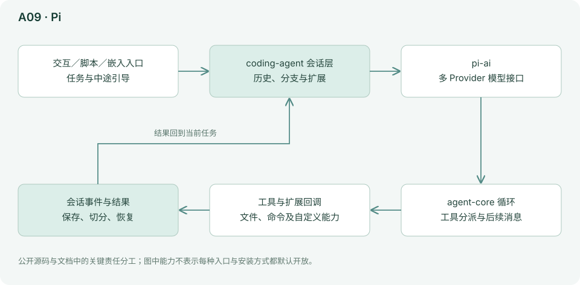

`agent-loop.ts` 将代理上下文转换成模型输入，处理工具结果、用户中途追加的引导和后续消息；准备下一回合时可以调整上下文、模型和推理设置。会话管理器则保留分支、模型变更、压缩等事件。这种设计便于研究“模型到底收到了什么”，也方便把 UI 换掉。[代理循环](https://github.com/earendil-works/pi/blob/b4588f26af2f74f7b1387b548e04a3c8d81da75b/packages/agent/src/agent-loop.ts)、[会话管理](https://github.com/earendil-works/pi/blob/b4588f26af2f74f7b1387b548e04a3c8d81da75b/packages/coding-agent/src/core/session-manager.ts)

扩展可以注册工具、命令、事件处理、Provider 和界面元素，参与多个层面的工作。因此 Pi 的团队、计划或审批体验会随所装扩展而变化。比较时应写“Pi＋哪些扩展”，否则不是同一个实验对象。[扩展文档](https://github.com/earendil-works/pi/blob/b4588f26af2f74f7b1387b548e04a3c8d81da75b/packages/coding-agent/docs/extensions.md)

Pi README 明确说明默认没有内置权限系统；运行进程拥有启动用户的系统权限。扩展也在 Pi 进程内执行。想把它放进可控边界，应主动选择容器、虚拟机或文档列出的隔离方案，不能把简洁误认为自动安全。[README](https://github.com/earendil-works/pi/blob/b4588f26af2f74f7b1387b548e04a3c8d81da75b/README.md)

模型适配包负责把不同服务的消息与流接到统一接口；代理核心处理下一轮、工具和中途引导；编码产品再加入会话树、终端 UI 与扩展。扩展既可以增加一个工具，也能在关键事件中调整行为，所以比较 Pi 的实验应记录扩展清单。会话树帮助你从某个思路重新开始，但此前写入磁盘的文件还在原处；想同时保留两套代码实验，仍需要独立目录或 Git 工作树。

#### 深入一层：小型代理循环与树状会话如何组合

Pi 在代理内部使用 AgentMessage，到调用模型时才转换成模型接口消息。循环内层处理工具与插入的指令，外层接续排队的后续任务；会话管理器则用带父子关系的条目表达历史分支。这样“继续当前工作”“在旧节点另开一条思路”“扩展工具”不必全部硬编码进一个庞大工作流。

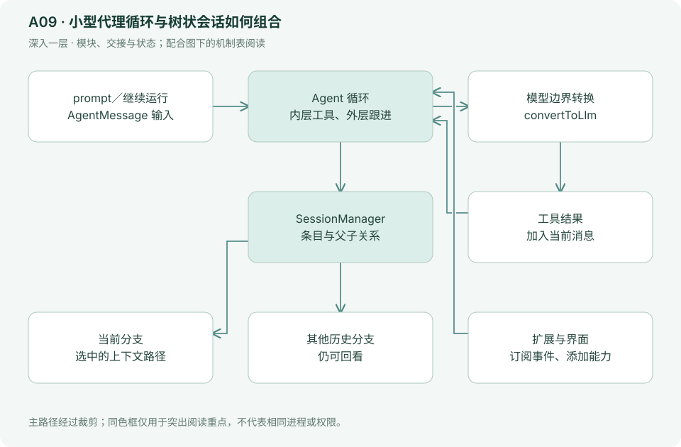

| 模块／交接点 | 怎样工作 | 状态与边界 |
|---|---|---|
| 循环边界 | 核心发出 agent、turn、message 等事件 | 界面可订阅事件，不能把显示层当成执行引擎。 |
| 消息转换 | 调用模型前才转成 Provider 可接受格式 | 自定义消息不是天然都能直接发送给模型。 |
| 历史树 | 当前节点决定选取哪条祖先路径 | 切换分支改变对话上下文，不自动回滚项目文件。 |

**沿着一次任务看数据怎样走。** 试想你在修复方案 A 的一半返回旧节点，尝试方案 B。Pi 可以从历史树取出新的上下文路径，但文件仍可能含有方案 A 的改动。因此要配合 Git 或独立工作目录验证，而不是把对话分叉当成代码分支。

**与相近工具的实质差别。** 与 Step Code 相比，Pi 展示了更小的核心和可扩展的会话底座；调度、目标追踪等上层产品语义应以各自实际实现为准，不能从共同血缘反推。

本节细图与机制依据：[agent-loop.ts](https://github.com/earendil-works/pi/blob/b4588f26af2f74f7b1387b548e04a3c8d81da75b/packages/agent/src/agent-loop.ts)、[session-manager.ts](https://github.com/earendil-works/pi/blob/b4588f26af2f74f7b1387b548e04a3c8d81da75b/packages/coding-agent/src/core/session-manager.ts)、[extensions.md](https://github.com/earendil-works/pi/blob/b4588f26af2f74f7b1387b548e04a3c8d81da75b/packages/coding-agent/docs/extensions.md)。图中选取主要模块与交接路径，完整结构及并行条件请结合所引材料阅读。

### 能力、状态与边界

| 观察项 | 实际机制／公开能力 | 对使用者意味着什么 |
|---|---|---|
| 分层 | pi-ai、agent-core、coding-agent | 改模型接口与改产品交互不必落在同一层 |
| 历史 | 分支、模型变更和压缩等会话事件 | 对话树不是文件系统快照 |
| 扩展 | 工具、命令、事件、Provider、UI | 说明所装扩展与版本，才能复现工作方式 |
| 分工与计划 | 可由扩展补充具体编排体验 | 记录具体扩展及其配置，说明能力来自哪里 |
| 权限 | 默认没有内置系统权限限制 | 工具和扩展按启动进程的权限运行 |
| 隔离 | 可采用容器或文档中的隔离方案 | 核对宿主挂载、网络和凭据，不能只看容器名称 |

**把机制放进实际工作。**

最小核心让行为来源更容易辨认，但前提是扩展数量受控。一个扩展可能注册新工具，另一个监听同一事件并改变上下文；两者各自正常，也可能在组合后产生顺序或状态问题。出现异常时从最小配置重现，逐个恢复扩展，比直接修改代理核心更容易定位。

会话树保留的是讨论与运行事件的分支。回到较早节点可以换一种思路，却不会让外部数据库、命令进程和文件自动倒退。需要比较两套实现时，应同时安排代码版本和对话分支；否则模型沿旧思路继续时，看到的可能已经是另一方案修改后的文件。

默认缺少内置权限系统，使运行边界尤其依赖启动方式。隔离方案不只是给程序套一个名字，还应检查目录挂载、网络和凭据。对研究者，这让实验条件可以明确控制；对普通用户，这意味着还需自行安排权限、隔离和维护。自由扩展与维护责任是一组相连的取舍。

### 从安装到完成第一个任务

1. 使用当前官方包名与安装说明，先运行最小配置。配置一个稳定的工具模型，确认终端中能看到文件操作和结果。

2. 在一次性测试项目中完成小修改；先了解启动进程可访问什么，再决定是否用容器或其他隔离环境。

3. 观察会话历史和分支功能。尝试从较早节点改变方案，然后检查磁盘，理解聊天状态与文件状态的区别。

4. 只安装一个有明确用途的扩展，例如固定检查或任务分工。查看它注册了什么工具、监听哪些事件，再重复基础任务。

5. 要开发自己的 Harness 时，先选需要复用的层；尽量在公开扩展接口内实现需求，确需改变核心语义再修改循环。

下面是启动命令或操作路线；路径、认证与功能入口请按自己的版本调整。

```bash
# 当前仓库使用的新包名；安装前核对 README 的环境要求
npm install -g --ignore-scripts @earendil-works/pi-coding-agent
cd /path/to/project
pi
```

### 典型任务与验收方法

下面是一份**可直接改写使用的试用任务**，属于本报告设计的验收示例，并非已完成的运行测试。

> 比较这个模块的两种重构办法。先读代码并给出取舍，再在一个独立代码分支上实现方案 A；保留一份说明，便于随后用相同测试比较方案 B。

用这个任务理解“思路分支”和“代码分支”两个层次。观察切换对话后是否仍知道实际文件状态；加入扩展前后比较工具集合、运行轮次和人工修正。比较时列明双方的扩展和配置，将核心与扩展各自的影响分开讨论。

### 模型搭配、适用方向与取舍

选型建议是先选一个能力稳定的云端模型建立基线，再用相同任务比较 DeepSeek／Qwen／Kimi 或本地模型。Pi 的优势在于能控制实验条件，便于辨认模型、工具和扩展各自的作用。适合熟练开发者、终端爱好者、代理研究和定制工具；不适合期待完整权限管理开箱即用的初学者。难度：日常中；定制高。

| 选择路线 | 候选组合 | 怎样决定 |
|---|---|---|
| 可控基线 | Pi 当前适配的强 GPT／Claude | 固定扩展、工具和任务，再评价核心与交互。 |
| 成本对照 | 当前适配的 DeepSeek／Qwen／Kimi | 逐一验证多轮工具调用、编辑和纠错。 |
| 本地研究 | 正确服务的开放编程模型 | 从局部任务起步，记录量化、上下文与工具模板，保持实验可解释。 |

它尤其适合终端熟手、研究者和想写自己工作方式的人。代价是权限、团队流程和扩展质量需要更主动地管理。若希望这些产品决策已经替你做好，可以比较 Step Code、Cline 或完整 IDE；如果乐于自己决定，Pi 的分层更有价值。

### 资料依据与继续阅读

[README](https://github.com/earendil-works/pi/blob/b4588f26af2f74f7b1387b548e04a3c8d81da75b/README.md)、[代理循环](https://github.com/earendil-works/pi/blob/b4588f26af2f74f7b1387b548e04a3c8d81da75b/packages/agent/src/agent-loop.ts)、[会话管理](https://github.com/earendil-works/pi/blob/b4588f26af2f74f7b1387b548e04a3c8d81da75b/packages/coding-agent/src/core/session-manager.ts)、[编码代理安装与使用](https://github.com/earendil-works/pi/blob/b4588f26af2f74f7b1387b548e04a3c8d81da75b/packages/coding-agent/README.md)。

源码链接指向固定提交；关键实现分析不等于对整个项目和依赖逐行审计。上面的流程建议与取舍是依据这些材料给出的选型判断；具体型号、权限和菜单以实际安装与账户为准。

<a id="a10"></a>

## A10 Cline：把过程看得见、能审查作为主要体验

### 定位与设计理念

Cline 重视逐步展示代理在读什么、改什么、运行什么，让用户在编辑器中持续参与。当前产品已有扩展、CLI 和 SDK 等入口，不能只依据早期 VS Code 插件判断整体能力。[README](https://github.com/cline/cline/blob/078f82b1e2617a6be421e34c08d35af1c3a78d87/README.md)

Cline 的起点是让用户看见过程并参与决定。它适合希望知道代理为什么读这个文件、为什么执行这条命令的人。Plan 与执行阶段帮助用户先对齐思路，再让代理动手。随着 CLI 和 SDK 发展，同一品牌的用途已经更广；选型时仍要把编辑器中的透明交互与命令行中的团队编排分别判断。

### 工作原理与架构图

下图结合所引源码与文档，画出本工具的主要责任分工；为便于理解，省略次要模块与错误分支。

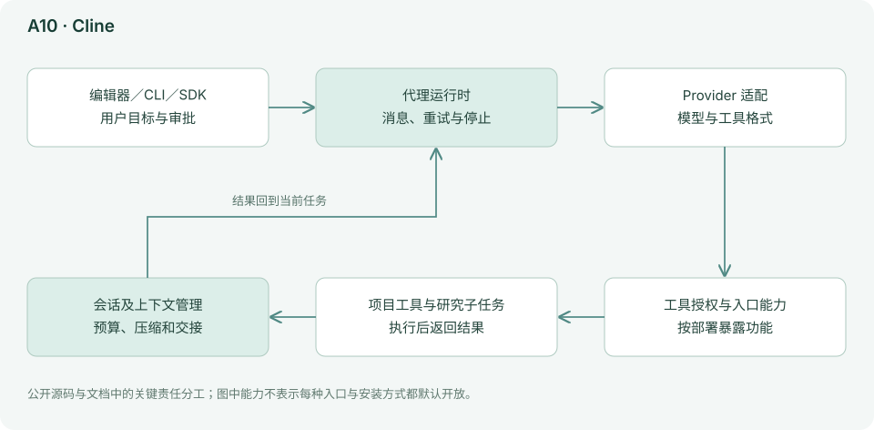

SDK 把代理循环、模型适配和会话／工具基础能力分开。运行时处理模型输出限额、瞬时错误和重试，上下文层处理压缩与预算。这类分工使代理逻辑可以被不同入口复用，但入口是否暴露同一个功能仍是产品问题。[代理运行时](https://github.com/cline/cline/blob/078f82b1e2617a6be421e34c08d35af1c3a78d87/sdk/packages/agents/src/agent-runtime.ts)、[压缩管线](https://github.com/cline/cline/blob/078f82b1e2617a6be421e34c08d35af1c3a78d87/sdk/packages/core/src/extensions/context/compaction.ts)

当前文档中的普通 Subagents 是独立上下文的只读研究代理，适合找文件、查代码并返回报告；不能据此说它们可以任意编辑、浏览器操作或继续嵌套。CLI／SDK／Kanban 的 Agent Teams 则有共享任务板、消息箱和持久任务状态，文档明确说这套团队功能当时还不适用于 VS Code 与 JetBrains 扩展。[只读子代理](https://github.com/cline/cline/blob/078f82b1e2617a6be421e34c08d35af1c3a78d87/docs/features/subagents.mdx)、[团队功能](https://github.com/cline/cline/blob/078f82b1e2617a6be421e34c08d35af1c3a78d87/docs/cli/agent-teams.mdx)

把研究交给只读子代理的好处是减少主会话噪声：它可以阅读相关文件，再返回路径和发现。主代理负责据此修改，不必接收每一次搜索输出。团队任务则多出共享任务板、消息和长期状态，需要处理工作交接。两者解决的问题不一样：只读探索无法替代多个可写工作者；有团队状态也不能免去最终集成检查。

#### 深入一层：运行时、上下文扩展与委派任务

Cline 的可见实现已经包含运行时与上下文扩展，不宜只用“编辑器里一个聊天窗口”描述。运行时组织代理生命周期，上下文压缩作为独立能力参与长任务，子代理和团队功能再负责不同范围的协作。单个子代理调用与具有任务协调语义的团队不是同一层机制。

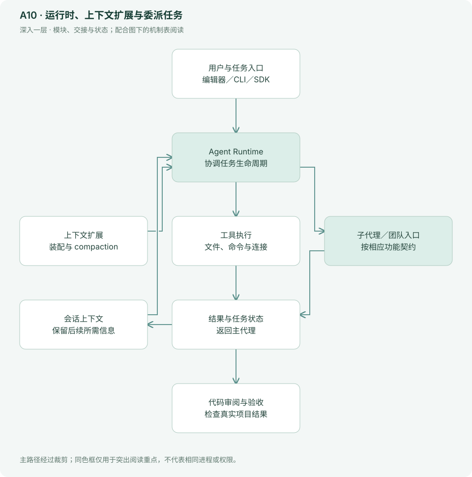

| 模块／交接点 | 怎样工作 | 状态与边界 |
|---|---|---|
| Runtime | 接收任务并协调代理执行 | 不同入口如何提供宿主能力，需要按发行版核对。 |
| Context extension | 在上下文容量约束下维持任务连续 | 压缩后仍需保留约束与尚未验证的结果。 |
| Delegation | 子任务与团队有各自生命周期 | 存在委派入口不等于每个模型都适配相同协作行为。 |

**沿着一次任务看数据怎样走。** 例如修复跨前后端问题：先确认主任务目标，再给调查者明确代码范围；实现者提交改动后由主任务跑集成检查。看到多个代理已结束，只说明子任务生命周期结束，不能取代端到端验收。

**与相近工具的实质差别。** 与 Roo 的历史多模式相比，这里需要区分“同一个代理换职责”和“另一个执行实体接任务”。与 Kilo 的共同历史也不能替代对当前运行时的逐项比较。

本节细图与机制依据：[agent-runtime.ts](https://github.com/cline/cline/blob/078f82b1e2617a6be421e34c08d35af1c3a78d87/sdk/packages/agents/src/agent-runtime.ts)、[compaction.ts](https://github.com/cline/cline/blob/078f82b1e2617a6be421e34c08d35af1c3a78d87/sdk/packages/core/src/extensions/context/compaction.ts)、[subagents.mdx](https://github.com/cline/cline/blob/078f82b1e2617a6be421e34c08d35af1c3a78d87/docs/features/subagents.mdx)、[agent-teams.mdx](https://github.com/cline/cline/blob/078f82b1e2617a6be421e34c08d35af1c3a78d87/docs/cli/agent-teams.mdx)。图中选取主要模块与交接路径，完整结构及并行条件请结合所引材料阅读。

### 能力、状态与边界

| 观察项 | 实际机制／公开能力 | 对使用者意味着什么 |
|---|---|---|
| 交互 | 操作过程与审批可见 | 根据具体风险授权，避免机械地全部点同意 |
| 规划 | Plan 与执行工作方式 | 计划中要有改动边界和验收，不只是步骤数量 |
| 只读研究 | 普通 Subagents 独立探索并汇总 | 不默认拥有任意编辑或继续派生能力 |
| 团队 | CLI／SDK 等有独立团队机制 | 所核验文档未把同等能力开放给所有 IDE 扩展 |
| 模型与错误 | 多 Provider、重试和输出限制处理 | 协议错误、限流和真正推理失败要区分 |
| 上下文 | 独立压缩管线与预算管理 | 长任务要保存关键约束并抽查交接摘要 |

**把机制放进实际工作。**

透明交互只有在用户看得懂时才有价值。审批消息应让你知道操作对象、目的和可能影响；如果每次都无条件批准，虽然界面保留了步骤，实际上已失去大部分人工判断作用。可以让模型先解释不熟悉的命令，再按当前任务授予所需范围的权限。

只读子代理适合回答清楚的问题，例如“这个配置有哪些覆盖入口”，交回路径与依据。它不适合承担本身需要大量写入验证的工作。CLI 团队又要管理任务板、消息与持久状态，主任务必须决定冲突怎样处理。把这两类功能混写，会使用户在错误入口期待并不存在的能力。

长任务失败时先看上下文管线与服务错误：模型输出受限、服务临时失败、压缩丢约束与真正改错代码，处理方式不同。恢复后让代理重新确认关键文件与测试结果，可以避免继续沿错误摘要工作。过程可见性的价值，可以通过误改是否减少、返工是否更容易来判断。

### 从安装到完成第一个任务

1. 安装自己常用编辑器的当前扩展，完成 Provider 与模型配置；检查账单所属服务以及自动批准范围。

2. 用 Plan 请求梳理问题和相关文件，先阅读方案。明确哪些文件可改、怎样运行测试，再进入执行。

3. 跟随一轮读取、修改与检查，查看工具请求和实际结果；遇到不理解的操作时，及时询问依据并补充约束。

4. 代码库较大时，再让只读研究子代理调查独立问题；要求返回文件位置与证据，由主代理统一实施。

5. 确需共享任务板和多工作者时改用相应 CLI／SDK 路线，先做一个可拆分试点；先核对团队功能在哪个入口开放。

下面是启动命令或操作路线；路径、认证与功能入口请按自己的版本调整。

```text
操作路线：安装 Cline 扩展 → 配置 Provider／模型
→ Plan 核对方案 → 执行并审阅工具操作 → 检查 diff 与测试
需要 Agent Teams 时，另按 CLI／SDK 的专门文档配置。
```

### 典型任务与验收方法

下面是一份**可直接改写使用的试用任务**，属于本报告设计的验收示例，并非已完成的运行测试。

> 这个页面偶尔重复发送请求。先追踪事件绑定与副作用，再说明最可能的原因；经核对后修复，验证首次加载、参数变化和快速点击三条路径。

观察它是否能把每一次搜索和修改连回具体假设。如果只是遍历很多文件，却没有提出可验证的解释，可要求收缩范围。这个试用主要检验透明交互能否帮助你参与判断；对新手而言，比一次生成多少行代码更重要。

### 模型搭配、适用方向与取舍

多模型是其优势。建议先试当前支持的 Sonnet 或 GPT 日常档位；预算敏感时比较 DeepSeek／Qwen。模型必须能稳定处理工具调用和代码编辑。适合希望逐步审阅、学习代码库、修复中小问题的开发者；团队功能适合愿意使用 CLI 的进阶用户。难度：扩展低中；SDK／团队中高。

| 选择路线 | 候选组合 | 怎样决定 |
|---|---|---|
| 日常基线 | 已适配 Sonnet 5／GPT-5.6 Terra | 优先稳定工具调用，先验证读、改、测与恢复。 |
| 较难任务 | 可用 Sol／Astra／较强 Claude | 只在证据显示推理或实现能力不足时提升，环境错误先单独解决。 |
| 成本与中文对照 | DeepSeek／Qwen／Kimi；Step 兼容路线 | 以当前 Provider 与官方接入说明为准；比较总重试和人工修正。 |

适合愿意逐步参与、希望在熟悉编辑器中学习代码与检查结果的人。频繁审批可能打断节奏，放宽审批又会减少人工观察；需要根据任务调整。可分别与 Cursor 比较编辑体验、与 CLI 团队产品比较任务交接，按问题组织结论。

### 资料依据与继续阅读

[README](https://github.com/cline/cline/blob/078f82b1e2617a6be421e34c08d35af1c3a78d87/README.md)、[代理运行时](https://github.com/cline/cline/blob/078f82b1e2617a6be421e34c08d35af1c3a78d87/sdk/packages/agents/src/agent-runtime.ts)、[压缩管线](https://github.com/cline/cline/blob/078f82b1e2617a6be421e34c08d35af1c3a78d87/sdk/packages/core/src/extensions/context/compaction.ts)、[团队功能](https://github.com/cline/cline/blob/078f82b1e2617a6be421e34c08d35af1c3a78d87/docs/cli/agent-teams.mdx)。

源码链接指向固定提交；关键实现分析不等于对整个项目和依赖逐行审计。上面的流程建议与取舍是依据这些材料给出的选型判断；具体型号、权限和菜单以实际安装与账户为准。

<a id="a11"></a>

## A11 Kilo Code：围绕开放执行核心提供更多产品化入口

### 定位与设计理念

Kilo 不能只用早期的 Cline／Roo 血缘来说明当前架构。当前仓库中已经有明显的 OpenCode 核心结构以及 Kilo 自己的会话处理层，同时覆盖 CLI、编辑器和云端服务。[README](https://github.com/Kilo-Org/kilocode/blob/651323d2b2f83b912f71f9e682a9caa7ebacb154/README.md)、[Kilo 会话处理](https://github.com/Kilo-Org/kilocode/blob/651323d2b2f83b912f71f9e682a9caa7ebacb154/packages/opencode/src/kilocode/session/processor.ts)

Kilo 的产品选择是把开放执行核心与统一服务入口结合：用户既能享受多模型选择，也能使用账户、托管任务和审查等整合功能。它适合不想为每个模型重新准备界面的人。判断其价值时应把代理本身、模型转发和云服务分别列出来，才能看清自己实际购买了什么。

### 工作原理与架构图

下图结合所引源码与文档，画出本工具的主要责任分工；为便于理解，省略次要模块与错误分支。

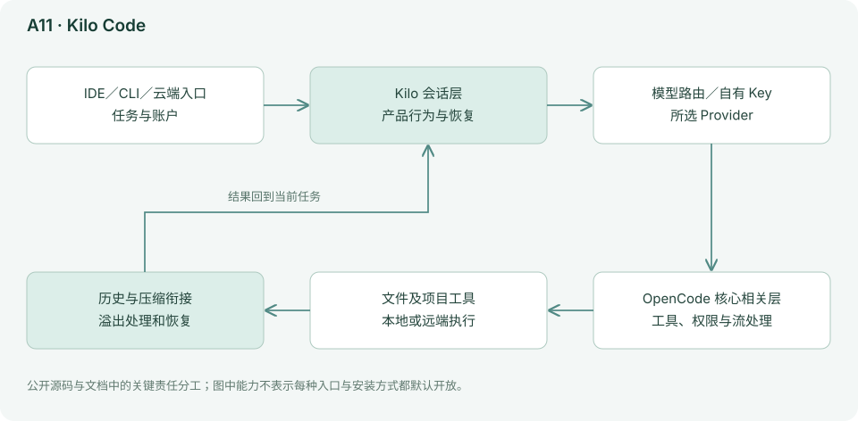

用户购买的不只是一个本地循环，也可能包括模型入口、远程任务和代码审查等产品能力。相同基础执行结构之上，账户、模型路由、错误恢复、任务管理和界面整合仍能带来明显体验差异。源码中的错误信息与溢出处理也体现了模型服务出错后如何向用户解释、何时先压缩再重试。[压缩衔接](https://github.com/Kilo-Org/kilocode/blob/651323d2b2f83b912f71f9e682a9caa7ebacb154/packages/opencode/src/kilocode/session/compaction.ts)

相同核心血缘不意味着相同产品。会话出错时怎样解释、是否先压缩后重试、模型目录怎样更新，都可能改变实际完成率。另一方面，云端任务多了环境与账户服务，本地可用的凭据未必在远端存在。迁移时应拆开四类东西：代码文件、项目规则、会话状态与服务授权；只有代码能打开，不能证明完整流程已经迁移。

#### 深入一层：产品配置怎样进入会话处理与压缩

Kilo 的当前固定快照含有自身目录下的 SessionProcessor 与 compaction 实现。对使用者来说，这意味着不能只拿早期编辑器扩展的印象理解所有入口；应该追踪当前入口究竟把任务交给哪条运行路径。模型渠道决定如何调用模型，会话处理决定工具和消息怎样延续，两者分别影响任务结果。

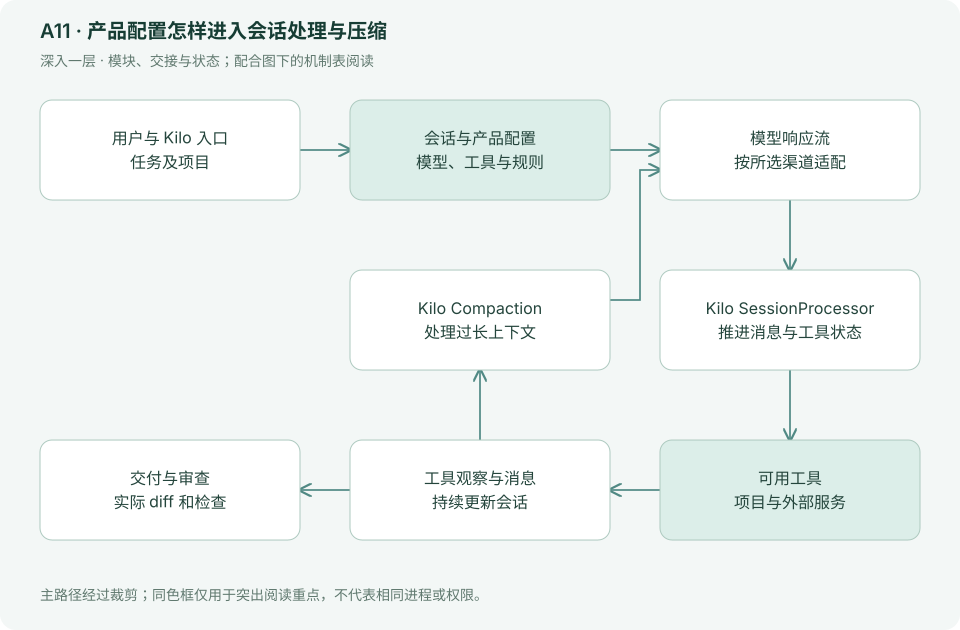

| 模块／交接点 | 怎样工作 | 状态与边界 |
|---|---|---|
| 入口到运行时 | 产品可能有多个交互入口 | 此图聚焦所引 Session 实现，不声明覆盖全部商业后端。 |
| 流事件处理 | 消息和工具状态随响应推进 | 工具完成与文本完成应分别观察。 |
| 压缩策略 | 持续任务需要裁剪或概括历史 | 换模型后要重新验收窗口与工具结果兼容。 |

**沿着一次任务看数据怎样走。** 当一项修复跨越多轮时，检查会话中是否保留最后一次失败测试、已修改文件和待办；若某工具执行成功却没有进入后续上下文，模型就可能重复操作。这类问题应沿会话处理链排查，定位工具结果是否进入后续输入。

**与相近工具的实质差别。** 与 OpenCode 比较时，看当前固定快照的差异；与 Roo 比较时，还要考虑维护状态与入口演变。这里保留实现血缘作为解释线索，不把它当作能力等价证明。

本节细图与机制依据：[processor.ts](https://github.com/Kilo-Org/kilocode/blob/651323d2b2f83b912f71f9e682a9caa7ebacb154/packages/opencode/src/kilocode/session/processor.ts)、[compaction.ts](https://github.com/Kilo-Org/kilocode/blob/651323d2b2f83b912f71f9e682a9caa7ebacb154/packages/opencode/src/kilocode/session/compaction.ts)、[README.md](https://github.com/Kilo-Org/kilocode/blob/651323d2b2f83b912f71f9e682a9caa7ebacb154/README.md)。图中选取主要模块与交接路径，完整结构及并行条件请结合所引材料阅读。

### 能力、状态与边界

| 观察项 | 实际机制／公开能力 | 对使用者意味着什么 |
|---|---|---|
| 入口 | CLI、编辑器与云端服务 | 分别确认运行目录、授权和功能范围 |
| 模型 | 托管路由与自有 Provider 选择 | BYOK 不代表其他平台能力也不收费 |
| 执行核心 | 当前包含 OpenCode 结构及 Kilo 会话层 | 旧 Roo／Cline 教程不能自动代表现版 |
| 恢复 | 错误信息、上下文溢出和压缩衔接 | 检查重试是否保留任务约束与有效工具结果 |
| 协作 | 按当前产品提供远程任务和审查等能力 | 分别核对本地扩展与云服务的职责 |
| 迁移 | 规则、模型、历史与权限分别处理 | 先迁一条完整任务，再迁全部配置 |

**把机制放进实际工作。**

比较 Kilo 与上游结构时，应观察产品行为的接缝：同样发生上下文溢出，是否压缩重试、怎样展示错误、哪些模型信息被记录，都可能改变实际体验。账户提供的模型目录与开放核心支持的协议，也不一定是同一范围。了解这两层能帮助解释为什么共享部分代码的产品仍然不同。

BYOK 主要说明主模型请求使用自己的凭据，并不自动说明云任务、知识服务或其他辅助能力免费。一次完整试用应同时检查 Provider 账单与产品消费，记录失败重试；否则很容易拿单次模型请求价格代表整套产品成本。

迁移旧 Roo 或 Cline 配置时，先核对当前字段含义与生效方式。逐项检查模式、项目指令、MCP、历史与权限的实际格式；先迁一条可验收流程，再迁其他内容。跨本地和云端时还要重新准备环境，因为本机能读取的文件、密钥和正在运行的服务不会自动出现在远端。

### 从安装到完成第一个任务

1. 先选一个常用入口完成安装，决定使用 Kilo 模型服务还是自己的 Provider；记录模型账单和平台账单的边界。

2. 导入一个小项目，确认当前模式、项目规则和执行权限。让它先说明运行方法，再实施一个易验收的修复。

3. 查看 diff 与执行证据，记录调用成本和等待时间；失败时区分路由、限流、上下文溢出与代码问题。

4. 需要远程任务时，另配置仓库访问与环境。用不依赖本机特殊文件的小任务验证，再把其他工作交出去。

5. 迁移旧配置时逐项核对规则、模式、MCP 和认证，不直接复制全部目录；升级后重复同一条基础任务。

下面是启动命令或操作路线；路径、认证与功能入口请按自己的版本调整。

```text
试用记录至少包含：
入口与版本：IDE／CLI／云端
模型渠道：Kilo 托管／自有 Provider
实际模型 ID、启用模式、工具权限
任务结果、模型费用、其他服务费用
```

### 典型任务与验收方法

下面是一份**可直接改写使用的试用任务**，属于本报告设计的验收示例，并非已完成的运行测试。

> 给这个工具增加 CSV 导出，并沿用已有列表筛选逻辑。先在当前入口实现与测试；若再交给云端，使用同一仓库状态和验收条件比较。

检查导出字段、编码和筛选结果是否一致；云端还要核对依赖和文件能否保存取回。评估产品整合带来的便利时，把登录、环境准备、模型调用和结果审查的人工时间一起记录。

### 模型搭配、适用方向与取舍

选型建议：优先从当前 Kilo 模型目录中选择已经完整支持的日常型号，再按复杂度升级；可比较 Claude、GPT、DeepSeek、Qwen 等家族。用实际编程任务比较候选模型的完成质量与返工成本。适合希望多入口、多模型，又愿意使用统一商业服务的开发者。难度：低中；复杂模型路由与云任务：中高。

| 选择路线 | 候选组合 | 怎样决定 |
|---|---|---|
| 日常基线 | 已适配 Sonnet 5／GPT-5.6 Terra | 优先稳定工具调用，先验证读、改、测与恢复。 |
| 较难任务 | 可用 Sol／Astra／较强 Claude | 只在证据显示推理或实现能力不足时提升，环境错误先单独解决。 |
| 成本与中文对照 | DeepSeek／Qwen／Kimi；Step 兼容路线 | 以当前 Provider 与官方接入说明为准；比较总重试和人工修正。 |

更适合既重视模型选择，又愿意使用整合服务的开发者。与 OpenCode 的差别不应只看共同源码，而应看账户、远程能力、错误恢复和费用；与单厂商原生代理相比，则更需要自己验收模型组合。

### 资料依据与继续阅读

[README](https://github.com/Kilo-Org/kilocode/blob/651323d2b2f83b912f71f9e682a9caa7ebacb154/README.md)、[Kilo 会话处理](https://github.com/Kilo-Org/kilocode/blob/651323d2b2f83b912f71f9e682a9caa7ebacb154/packages/opencode/src/kilocode/session/processor.ts)、[压缩衔接](https://github.com/Kilo-Org/kilocode/blob/651323d2b2f83b912f71f9e682a9caa7ebacb154/packages/opencode/src/kilocode/session/compaction.ts)。

源码链接指向固定提交；关键实现分析不等于对整个项目和依赖逐行审计。上面的流程建议与取舍是依据这些材料给出的选型判断；具体型号、权限和菜单以实际安装与账户为准。

<a id="a12"></a>

## A12 Goose：以工具扩展为中心，把编程代理拓展到其他工作

### 定位与设计理念

Goose 源于 Block，当前仓库已转到 `aaif-goose/goose`。它把外部能力接入放在很重要的位置，适合让代理同时操作代码、数据和业务工具。MCP 扩展是它组织外部能力的重要方式。[README](https://github.com/aaif-goose/goose/blob/91a5789bce40ee312675e6715c20eb3612d1a03c/README.md)

Goose 把外部工具接入放在中心。开发任务往往需要同时读取仓库、查询资料或检查业务系统，它希望在同一代理会话中组织这些能力。MCP 扩展让接入更标准化，但标准化的是调用方式，不是业务权限或返回数据质量。工具接得越多，越需要先想清楚这个任务真正需要哪些能力。

### 工作原理与架构图

下图结合所引源码与文档，画出本工具的主要责任分工；为便于理解，省略次要模块与错误分支。

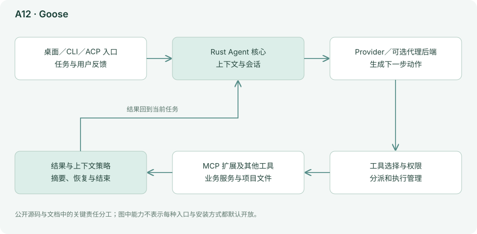

Rust 核心处理模型、会话、工具、权限和子代理等状态。上下文管理采用分层思路：接近限制时先主动压缩；仍溢出时再走后备策略。文档还区分桌面端和 CLI 的可选策略，说明“支持清空、截断、摘要”并不意味着每个界面都提供全部选项。[Agent 核心](https://github.com/aaif-goose/goose/blob/91a5789bce40ee312675e6715c20eb3612d1a03c/crates/goose/src/agents/agent.rs)、[上下文管理](https://github.com/aaif-goose/goose/blob/91a5789bce40ee312675e6715c20eb3612d1a03c/documentation/docs/guides/sessions/smart-context-management.md)

它也能参与 ACP 集成。需要特别区分“让编辑器驱动 Goose”和“Goose 使用另一个代理作为后端”：前者换交互入口，后者可能连执行逻辑也换掉。评估时必须记录到底是哪一种组合。

在一次跨系统查询中，模型会选择一个工具并提供参数，扩展实际连接服务，把结构化结果返回，再由代理决定是否继续。工具描述不清楚或返回整张数据库表，会让后续推理更困难。Goose 的上下文管理先主动处理容量，必要时再采用后备策略；这可以缓解长工具输出，但摘要之后仍应保留能复查的记录编号与来源。

#### 深入一层：Agent、扩展工具与上下文预算

Goose 的扩展既是“增加功能”的入口，也是模型能接触到哪些工具的边界。Agent 把 Provider、消息与工具能力组合起来；上下文管理需要处理越积越多的历史与工具输出。工具描述本身也消耗输入空间，因此接入更多扩展并非没有代价。

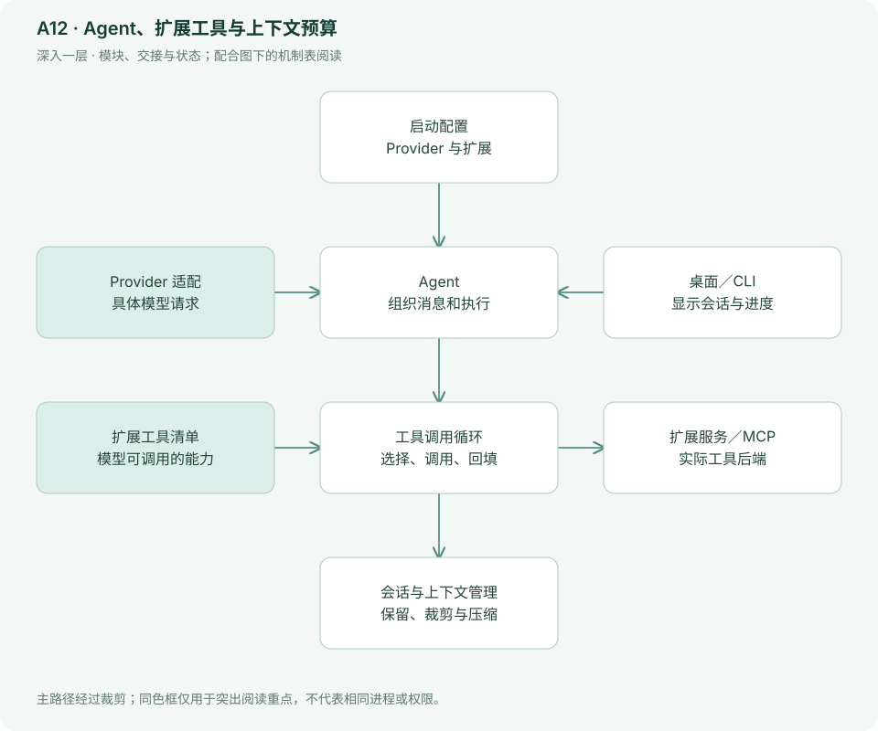

| 模块／交接点 | 怎样工作 | 状态与边界 |
|---|---|---|
| 扩展注册 | 把宿主或外部能力暴露为工具 | 工具所在服务的授权与本地权限仍需单独核对。 |
| Agent 组织 | 围绕会话反复请求模型与执行动作 | 模型替换后要验证调用参数和结果处理。 |
| 上下文管理 | 按容量处理历史与较长输出 | 细节被概括后，应能回到原文件或产物复查。 |

**沿着一次任务看数据怎样走。** 例如从代码库和工单系统整理修复计划：先启用必要的代码与工单能力，Agent 收集观察并生成方案。若大量工单内容淹没上下文，可以缩小查询范围，或先整理成带来源的材料供后续引用。

**与相近工具的实质差别。** 与固定编辑器工具集相比，Goose 更强调可组合扩展；与通用工作流相比，具体调查顺序更多由代理动态决定。可组合性换来灵活性，也带来工具契约与预算管理工作。

本节细图与机制依据：[agent.rs](https://github.com/aaif-goose/goose/blob/91a5789bce40ee312675e6715c20eb3612d1a03c/crates/goose/src/agents/agent.rs)、[smart-context-management.md](https://github.com/aaif-goose/goose/blob/91a5789bce40ee312675e6715c20eb3612d1a03c/documentation/docs/guides/sessions/smart-context-management.md)、[README.md](https://github.com/aaif-goose/goose/blob/91a5789bce40ee312675e6715c20eb3612d1a03c/README.md)。图中选取主要模块与交接路径，完整结构及并行条件请结合所引材料阅读。

### 能力、状态与边界

| 观察项 | 实际机制／公开能力 | 对使用者意味着什么 |
|---|---|---|
| 工具接入 | MCP 扩展是主要能力组织方式 | 先明确只读查询还是允许写回 |
| 运行核心 | Rust Agent 管模型、工具与会话 | 界面和执行逻辑分开核验 |
| 上下文 | 主动压缩与溢出后备策略 | 桌面与 CLI 的可选策略可能不同 |
| ACP | 既可作为被驱动代理，也有其他后端路线 | 记录是换了界面，还是换了执行核心 |
| 模型 | 多 Provider 与可靠工具模型 | 工具参数正确率比聊天风格更关键 |
| 数据路径 | 模型、扩展服务和本机各有边界 | 本地桌面不等于业务资料留在本机 |

**把机制放进实际工作。**

工具扩展像接入不同业务窗口，每个窗口都有自己的账户、数据范围和错误形式。一个只读数据库查询、一个文件工具和一个工单接口，即使都通过 MCP 连接，也不代表拥有相同权限和返回质量。先让每个工具独立完成小任务，再让代理组合使用，较容易定位错误。

长返回值会影响上下文：一整张大表既贵，又可能让模型错过关键字段。更合理的方案是由工具或查询限定范围，保留筛选条件和记录 ID，需要时再回查。自动摘要可以缓解容量，但不能保证全部业务细节保留；特别是数字报告，应把计算过程与原始结果另存为可核对材料。

ACP 使用还需区分方向。编辑器驱动 Goose 时，主要换的是交互入口；Goose 转用另一个代理后端时，执行语义也可能变化。费用、认证、权限和恢复都要跟着实际运行者判断。所谓统一工具生态，能够减少连接方式差异，却不会抹平这些产品责任。

### 从安装到完成第一个任务

1. 选择桌面或 CLI 安装，配置一个模型 Provider，先只用基本项目能力完成一轮读取和输出。

2. 增加一个与真实工作有关的扩展，例如只读数据查询；检查认证身份、可见范围和工具描述。

3. 给出资料来源与输出要求，让代理先查询再形成报告。核对查询参数和原始结果，确认没有凭空补齐缺失事实。

4. 长输出任务保存关键记录 ID、筛选条件与统计方法，再观察压缩后能否继续正确工作。

5. 需要跨系统写回或代理后端接入时再单独增加；按实际权限和后端验证取消、失败及恢复行为，避免把普通查询成功推及所有能力。

下面是启动命令或操作路线；路径、认证与功能入口请按自己的版本调整。

```text
配置顺序：Provider → 一个必要扩展 → 认证身份与权限
试用顺序：只读查询 → 保存结果 → 复查来源 → 再考虑写回
每增加一个扩展，重做一次基础查询与结果核对。
```

### 典型任务与验收方法

下面是一份**可直接改写使用的试用任务**，属于本报告设计的验收示例，并非已完成的运行测试。

> 读取本项目的错误日志，并通过已配置的只读工具查询对应工单。整理成问题分类表，保留工单链接、发生次数和待确认原因，先生成本地报告。

检查日志统计与工单关联是否可靠；相似标题不一定属于同一故障。这个任务能检验工具组合是否真正减少手工查找，以及长输出后来源是否仍能复核。接入多个工具并不意味着要让模型每次都用一遍。

### 模型搭配、适用方向与取舍

建议用支持可靠工具调用的 Claude／GPT 建立基线，再比较其他 Provider；任务如果大多是短工具调用，可测试更经济的型号。适合开发加办公、跨系统查资料、团队已有 MCP 服务的工作。优势是扩展空间，代价是连接器和权限需要自己管理。难度：中；企业工具集成高。

| 选择路线 | 候选组合 | 怎样决定 |
|---|---|---|
| 工具基线 | 当前适配的 Claude／GPT | 以参数准确、错误恢复稳定为第一标准。 |
| 跨系统难任务 | 同 Provider 较强档位 | 先确认工具返回的数据足够，再投入更强推理。 |
| 短调用与提取 | 已通过样本验收的经济模型 | 只读与格式明确任务先试，复杂写回还需比较准确率与返工成本。 |

适合开发与业务资料交叉、已有 MCP 服务的场景。代价是连接器、身份和权限维护，往往比安装 Goose 本体更复杂。若只是改仓库里的代码，普通编码代理可能更省事；需要团队共享门户时，则应再比较服务型产品。

### 资料依据与继续阅读

[README](https://github.com/aaif-goose/goose/blob/91a5789bce40ee312675e6715c20eb3612d1a03c/README.md)、[Agent 核心](https://github.com/aaif-goose/goose/blob/91a5789bce40ee312675e6715c20eb3612d1a03c/crates/goose/src/agents/agent.rs)、[上下文管理](https://github.com/aaif-goose/goose/blob/91a5789bce40ee312675e6715c20eb3612d1a03c/documentation/docs/guides/sessions/smart-context-management.md)。

源码链接指向固定提交；关键实现分析不等于对整个项目和依赖逐行审计。上面的流程建议与取舍是依据这些材料给出的选型判断；具体型号、权限和菜单以实际安装与账户为准。

<a id="a13"></a>

## A13 Crush：重视终端体验的开放编程伙伴

### 定位与设计理念

Charm 的 Crush 把终端交互质量作为产品的一部分。对于长期使用终端的人，清晰的状态、对话和工具反馈，可能比再增加几十个开关更有价值。[README](https://github.com/charmbracelet/crush/blob/72654940d9e46961a7d804d536c45761e7084a08/README.md)

对长期在终端里工作的人，交互本身会影响代理是否好用。工具正在做什么、错误能不能看清、插话和恢复是否顺手，都会改变人工参与成本。Crush 把这些体验放进产品重点，同时保留开放模型与工具接入。它适合把终端当作主工作台的人，而不要求用户为了 AI 换一套 IDE。

### 工作原理与架构图

下图结合所引源码与文档，画出本工具的主要责任分工；为便于理解，省略次要模块与错误分支。

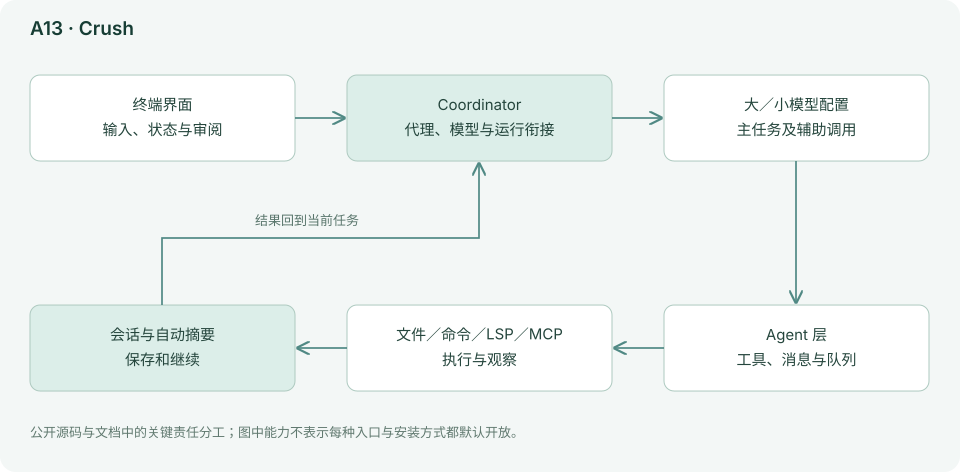

Go 实现的 Coordinator 管理当前代理、模型配置与运行衔接；Agent 层处理消息、工具、队列和自动摘要。源码还区分大模型和小模型配置。这里的小模型可以承担辅助工作，但不能假定主任务成本从此只有“小模型价格”。切换模型也要避免一次运行中状态被拆到两个不同实例。[协调器](https://github.com/charmbracelet/crush/blob/72654940d9e46961a7d804d536c45761e7084a08/internal/agent/coordinator.go)、[Agent](https://github.com/charmbracelet/crush/blob/72654940d9e46961a7d804d536c45761e7084a08/internal/agent/agent.go)

Coordinator 类似前台调度台，确保界面当前连接的是正确的代理与模型；Agent 层处理实际回合、工具和队列。两者分开有利于处理模型切换和中途输入，但也提醒我们：切换设置并不只是改一个下拉框。主模型承担实现，辅助模型承担某些轻任务，最终成本应合并计算。自动摘要则是为了让当前任务继续，并非另建一套永不遗忘的知识库。

#### 深入一层：协调器怎样管理主代理、模型与子任务

Crush 的 Coordinator 把 Provider、工具、主代理与子代理组合起来，而 SessionAgent 承担会话级执行。源码中可见排队提示、取消、摘要、子代理输出和父任务成本更新等职责。这说明漂亮的终端界面下面仍需要一套任务状态管理，不能把“界面不卡”理解成工具已经停止。

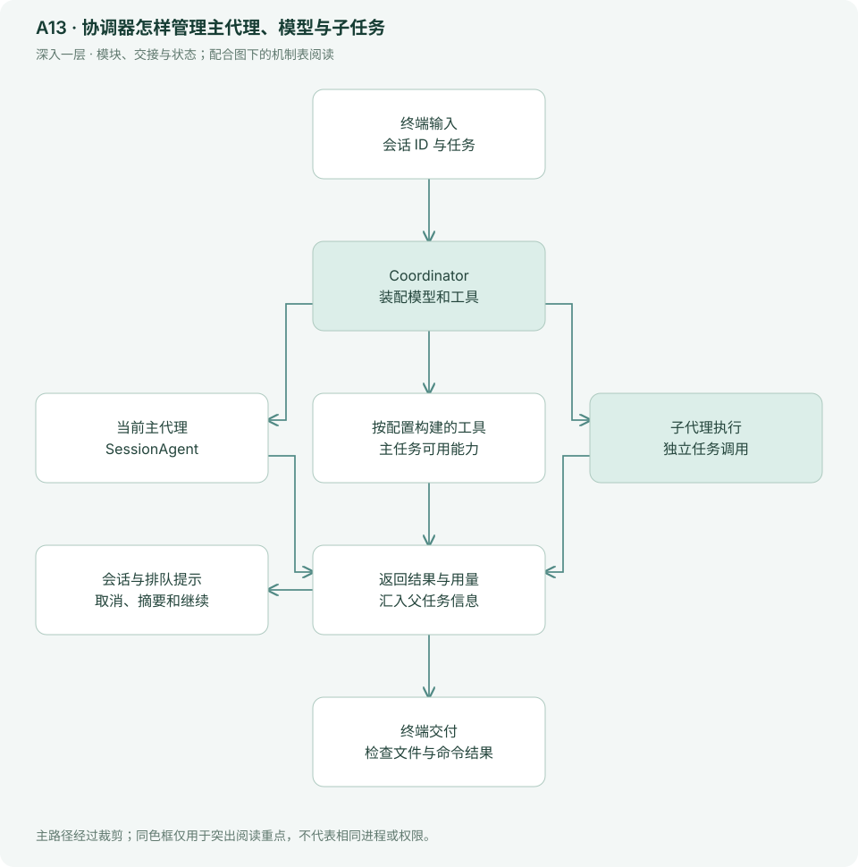

| 模块／交接点 | 怎样工作 | 状态与边界 |
|---|---|---|
| Coordinator | 构建模型和工具，并选择当前代理 | 配置错误可能发生在调用模型之前。 |
| SessionAgent | 在特定会话上运行任务 | 取消和排队以会话为边界，需要确认目标。 |
| 子代理汇总 | 返回子任务输出并处理用量关联 | 应统计整体成本，而非只看主代理响应。 |

**沿着一次任务看数据怎样走。** 例如调查测试失败时，一条子任务阅读相关包，主任务处理复现环境。终端可以显示进度，但真正的交接是子代理返回的结论及证据。需要中止时，应区分取消当前会话与清除后续排队任务。

**与相近工具的实质差别。** 与 Pi 的可扩展小核心相比，Crush 的协调器集中承担更多终端产品所需的装配与管理；与云端代理工作台相比，实际开发环境仍需按本地配置维护。

本节细图与机制依据：[coordinator.go](https://github.com/charmbracelet/crush/blob/72654940d9e46961a7d804d536c45761e7084a08/internal/agent/coordinator.go)、[agent.go](https://github.com/charmbracelet/crush/blob/72654940d9e46961a7d804d536c45761e7084a08/internal/agent/agent.go)、[README.md](https://github.com/charmbracelet/crush/blob/72654940d9e46961a7d804d536c45761e7084a08/README.md)。图中选取主要模块与交接路径，完整结构及并行条件请结合所引材料阅读。

### 能力、状态与边界

| 观察项 | 实际机制／公开能力 | 对使用者意味着什么 |
|---|---|---|
| 交互重点 | 面向持续使用的终端 UI | 评价长输出、审批、中断和恢复的可理解性 |
| 模型组织 | 大模型与小模型分开配置 | 辅助调用同样可能计费 |
| 运行衔接 | Coordinator 管当前代理与模型 | 运行中切换后核对实际模型与状态 |
| 上下文 | 消息队列与自动摘要 | 摘要需保留任务约束和验证进度 |
| 项目工具 | LSP、MCP 与规则接入 | 先让基础编辑稳定，再增加集成 |
| 环境 | 可在终端及 SSH 场景使用 | 远程启动时，文件和凭据位于那台机器 |

**把机制放进实际工作。**

队列与中途输入看似是界面细节，其实会影响任务正确性。用户补充一个约束后，应能判断它进入当前回合还是后续回合；长命令运行时，取消是否结束了对应操作也需要观察。好的终端交互应帮助用户看清执行状态，及时补充信息或停止操作。

大模型与小模型配置可以将辅助任务放到较经济路线，但主任务仍可能承担主要输入、工具和重试成本。比较时应查完整消费，不把界面显示的小模型名称理解成全部任务都按小模型计价。切换模型后，检查实际运行是否已经采用新配置。

SSH 场景中，启动 Crush 的那台机器才是文件和进程所在处。当前终端看起来相同，工作目录、服务端口与凭据却可能完全不同。故障先分主机和目录，再分模型与工具；这样能避免把远端环境缺依赖的错误当成代理写代码能力不足。

### 从安装到完成第一个任务

1. 按官方 README 安装，在测试项目中启动 crush，配置主模型；若使用辅助模型，也记录其型号与费用渠道。

2. 让它读项目入口并解释测试方法，先保持工具集合简单；检查终端字体、长输出和错误信息是否易读。

3. 提交一个小修复，在执行中补充约束，观察它是否正确接收而没有遗忘原目标。

4. 查看结果和 diff，再试中断后继续；确认模型切换、摘要和历史不会让它重复已经完成的动作。

5. 需要语言语义或外部服务时再接 LSP／MCP。SSH 使用时，单独核对远端目录、网络和凭据，不把它当成本机环境。

下面是启动命令或操作路线；路径、认证与功能入口请按自己的版本调整。

```bash
# 完成官方安装和 Provider 配置后
cd /path/to/project
crush
```

### 典型任务与验收方法

下面是一份**可直接改写使用的试用任务**，属于本报告设计的验收示例，并非已完成的运行测试。

> 这个日志解析器在空行和非法时间戳处报错。先确认当前行为，再增加容错与对应测试；处理中我会补充一个真实日志样例。

观察中途提供的样例是否被用于验证，长日志是否淹没关键错误，以及恢复后能否准确继续。对于每天使用终端的人，减少一次错误审批或一次找不到结果的翻屏，也有实际价值。

### 模型搭配、适用方向与取舍

建议为主要编辑任务选择已适配的强工具模型，为辅助任务配置经济模型。适合终端开发、远程 SSH 环境和偏好简洁交互的用户。若首要需求是成熟云端团队编排，需要另看 Factory、Devin 或 OpenHands。难度：中。

| 选择路线 | 候选组合 | 怎样决定 |
|---|---|---|
| 主任务 | 已适配的强工具模型 | 用于代码修改和困难诊断，检查编辑成功率。 |
| 辅助任务 | 单独配置的经济模型 | 用于产品支持的辅助职责；辅助消费也计入总账。 |
| 模型切换 | 同任务比较两个配置 | 确认实际运行实例和状态，避免把缓存或旧会话差异算成模型提升。 |

适合终端熟手与远程开发，选择它可以主要基于交互是否顺手。它并不因 UI 精致就自动具备托管工作机或复杂团队编排；有此需求应另比较 OpenHands、Factory。模型策略也应按完整账单与完成质量评估。

### 资料依据与继续阅读

[README](https://github.com/charmbracelet/crush/blob/72654940d9e46961a7d804d536c45761e7084a08/README.md)、[协调器](https://github.com/charmbracelet/crush/blob/72654940d9e46961a7d804d536c45761e7084a08/internal/agent/coordinator.go)、[Agent](https://github.com/charmbracelet/crush/blob/72654940d9e46961a7d804d536c45761e7084a08/internal/agent/agent.go)。

源码链接指向固定提交；关键实现分析不等于对整个项目和依赖逐行审计。上面的流程建议与取舍是依据这些材料给出的选型判断；具体型号、权限和菜单以实际安装与账户为准。

<a id="a14"></a>

## A14 Mistral Vibe：让 Mistral 模型进入可控的开发循环

### 定位与设计理念

Vibe 是 Mistral 的官方编程代理。它为希望使用 Devstral 等 Mistral 模型、同时保留可读源码和本地开发体验的人提供原生路径。[README](https://github.com/mistralai/mistral-vibe/blob/4a96003186b166d55b9f06895c45bb136eef61cd/README.md)

Vibe 是围绕 Mistral 编程模型组织的原生工具链，同时保留开放实现。它把模型、工具、权限与客户端通过清楚的接口衔接，适合既想直接开发，又希望读懂运行逻辑的人。官方原生适配可以减少部分工具格式摩擦，但某个型号是否最划算，仍取决于任务、服务端部署和失败重试。

### 工作原理与架构图

下图结合所引源码与文档，画出本工具的主要责任分工；为便于理解，省略次要模块与错误分支。

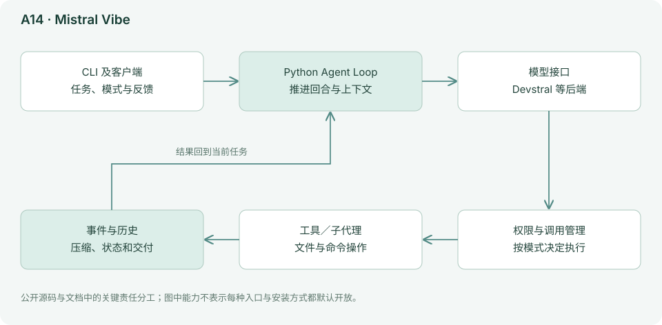

Python 核心通过模型、工具、权限、压缩和子代理接口组织执行；异步事件把执行状态交给不同客户端。这里值得关注的是业务逻辑与外部能力之间的接口边界，方便替换或测试某一部分，而不必重写整个界面。[执行循环](https://github.com/mistralai/mistral-vibe/blob/4a96003186b166d55b9f06895c45bb136eef61cd/vibe/core/agent_loop/_loop.py)

执行循环通过事件报告进度，让客户端知道代理是在等待模型、执行工具还是完成任务。对调用者而言，这比把所有输出当作一段普通文字更容易处理取消和审批。不同模式表达不同工作权限：分析、规划和接受编辑不是同一件事。开放模型部署时还多一层约束，服务端的工具模板、上下文长度与吞吐会影响整个循环。

#### 深入一层：代理循环如何把模型输出变成可执行动作

Mistral Vibe 的重点是让终端任务经过一个可追踪的 AgentLoop：组织输入、获得模型响应、处理工具请求、加入观察，再判断是否继续。模型给出的行动建议要经过工具层才产生实际效果；文字里写“已修改”不等于磁盘上的文件已改变。

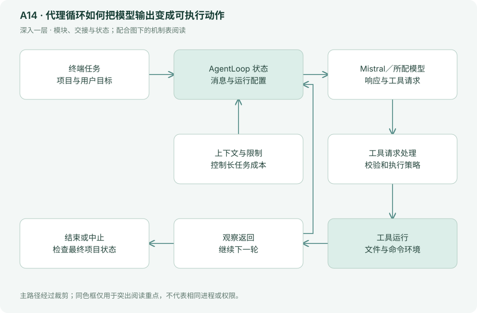

| 模块／交接点 | 怎样工作 | 状态与边界 |
|---|---|---|
| 循环状态 | 消息和配置决定下一轮请求 | 恢复时需要确认历史与实际工作目录对应。 |
| 工具调用 | 把结构化请求交给工具实现 | 工具参数、权限和环境是不同失败来源。 |
| 退出条件 | 结束、取消与限制触发应分别理解 | 达到预算上限不能算任务成功。 |

**沿着一次任务看数据怎样走。** 在“修改配置并跑测试”的任务中，先读配置，再生成编辑动作，随后读取测试退出码与输出；若测试失败，就把具体错误带回下一轮。验收时将模型总结与文件差异、测试结果相互核对。

**与相近工具的实质差别。** 与围绕大量第三方扩展构建的平台相比，Vibe 的终端编码路线更集中；这种集中能减少配置分叉，但跨渠道模型适配仍应独立验证。图不推断未公开服务内部。

本节细图与机制依据：[_loop.py](https://github.com/mistralai/mistral-vibe/blob/4a96003186b166d55b9f06895c45bb136eef61cd/vibe/core/agent_loop/_loop.py)、[README.md](https://github.com/mistralai/mistral-vibe/blob/4a96003186b166d55b9f06895c45bb136eef61cd/README.md)。图中选取主要模块与交接路径，完整结构及并行条件请结合所引材料阅读。

### 能力、状态与边界

| 观察项 | 实际机制／公开能力 | 对使用者意味着什么 |
|---|---|---|
| 原生模型 | 围绕 Mistral／Devstral 路线适配 | 通用新品不自动等于最佳编程后端 |
| 运行实现 | Python 循环与可替换接口 | 研究时固定模型与工具，逐项改变变量 |
| 交互状态 | 异步事件传递执行进度 | 客户端要正确区分等待、错误与完成 |
| 权限模式 | Ask、Plan、接受编辑等模式 | 启动前确认实际模式及工具范围 |
| 上下文与分工 | 压缩、工具和子代理接口 | 子代理数量增加后核对总成本与结果集成 |
| 开放部署 | 可研究适配的开放模型服务 | 硬件、模板和服务参数同样属于方案 |

**把机制放进实际工作。**

Python 接口分层使模型请求、工具和权限可以分别观察。一次调用失败，先区分模型服务拒绝参数、动作格式无法解析、权限不允许，还是程序运行报错。只在最后一种情况里改业务代码，能够减少代理为绕过环境问题而做无关修改。

Ask、Plan 和接受编辑等模式的意义是工作范围不同，不能只凭标签判断所有操作。尤其命令工具可能同时包含读取与写入效果，最终仍需看实际策略和执行环境。给子任务配置模型与工具时，也要确认它的权限和父任务要求一致。

开放模型的优势在可部署与可调整，但服务端模板、量化和上下文设置都可能影响多轮调用。小型号更省资源，却可能花更多回合纠错；强型号可能更贵，但一次完成率更高。比较时记录完整任务表现、实际硬件和人工检查成本，说明结论对应的运行条件。

### 从安装到完成第一个任务

1. 按当前安装指南运行 vibe，完成账户或 API 配置；先使用官方建议的模型路线验证基础操作。

2. 查看当前模式和权限，先要求只分析项目与测试方法；把模式变化与实际工具能力对应起来。

3. 给出一个小修改，观察从计划到编辑、测试、纠错的完整循环；结合实际运行与测试结果检查改动。

4. 若使用更小或自部署型号，用同样任务验证工具参数、多轮纠错和上下文承载；记录实际服务配置。

5. 最后再增加子代理与扩展。让每个子任务有具体输入、交付材料和停止条件，并由主任务统一检查修改。

下面是启动命令或操作路线；路径、认证与功能入口请按自己的版本调整。

```bash
# 完成官方安装与认证后
cd /path/to/project
vibe
```

### 典型任务与验收方法

下面是一份**可直接改写使用的试用任务**，属于本报告设计的验收示例，并非已完成的运行测试。

> 给文件上传模块增加大小限制与清楚的错误提示。保留现有合法上传路径，分别验证边界大小、超限和缺失文件。

相同任务可用于比较 Devstral 的不同档位。同时记录首轮速度、修改后的测试、格式错误和返工耗时。如果小模型首次便宜但多次误改，整项任务未必便宜。

### 模型搭配、适用方向与取舍

原生优先 Devstral 系列，复杂任务比较 Devstral 2，资源与预算受限时看 Devstral Small 2 等官方可用型号。新增通用型号时，先用同一编程任务检查它与 Vibe 的适配和完成质量。适合 Mistral 用户、开放模型部署试验，以及希望研究清晰 Python 代理结构的人。难度：中。[Mistral 模型目录](https://docs.mistral.ai/models)

| 选择路线 | 候选组合 | 怎样决定 |
|---|---|---|
| 原生起点 | Devstral 2 | 用于有代表性的开发任务，沿官方支持路径配置。 |
| 资源与预算对照 | Devstral Small 2 | 从短任务和小修复开始，观察工具失败与返工。 |
| 自部署 | 许可与服务端均合适的 Mistral 模型 | 另测硬件、模板和上下文；通用型号不能凭家族名替代编程适配。 |

适合 Mistral 生态用户、开放模型试验与 Python 运行时研究。自部署控制更强，同时也要维护推理服务；原生云服务配置更少，却仍有账户和模型更新约束。与 Qwen Code 比较时，优先看你实际需要的模型部署路线。

### 资料依据与继续阅读

[README](https://github.com/mistralai/mistral-vibe/blob/4a96003186b166d55b9f06895c45bb136eef61cd/README.md)、[执行循环](https://github.com/mistralai/mistral-vibe/blob/4a96003186b166d55b9f06895c45bb136eef61cd/vibe/core/agent_loop/_loop.py)、[Mistral 模型目录](https://docs.mistral.ai/models)。

源码链接指向固定提交；关键实现分析不等于对整个项目和依赖逐行审计。上面的流程建议与取舍是依据这些材料给出的选型判断；具体型号、权限和菜单以实际安装与账户为准。

<a id="a15"></a>

## A15 OpenHands：把代理和它的工作环境一起管理

### 定位与设计理念

当前 `OpenHands/OpenHands` 主仓库主要是 Agent Canvas；实际代理、会话、工作空间和服务接口在独立 Software Agent SDK 中继续实现。只读主仓库前端，不能得出执行引擎的完整结论。[Canvas](https://github.com/OpenHands/OpenHands/blob/ffdc65e10c3aa68ae1704eedbc6a011c02fcec8c/README.md)、[SDK](https://github.com/OpenHands/software-agent-sdk/blob/cd02db3a181c0bed5ee34711b46c06c88288854e/README.md)

OpenHands 把“代理有一台怎样的工作机”提升为一等问题。许多代码任务会受环境问题影响，例如依赖安装失败、测试数据缺失或产物未保存。将会话与工作空间一起管理，便于把相同任务交给不同运行环境，也便于团队批量处理问题。代价是环境生命周期本身成为需要维护的软件系统。

### 工作原理与架构图

下图结合所引源码与文档，画出本工具的主要责任分工；为便于理解，省略次要模块与错误分支。

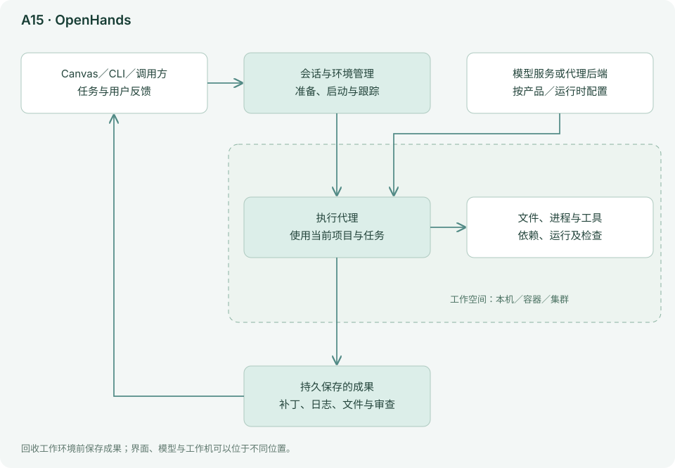

OpenHands 更接近“给代理配一台工作机”的路线。代理不仅要调用模型，还要有工作目录、依赖、命令环境、浏览器和会话服务。SDK／Agent Server 提供执行能力，Canvas 提供交互，自动化层再安排任务和环境生命周期。Canvas 也可接入 ACP 代理，因此“在 OpenHands 界面里运行”未必等于使用原生 OpenHands 循环。

工作空间可以是本机，也可以是 Docker／Kubernetes 等临时环境。这使批量任务更容易复制和隔离，但会增加环境构建、镜像、凭据和资源清理工作。不能把“支持容器”写成“任何安装默认都在容器里”。[SDK 工作空间说明](https://github.com/OpenHands/software-agent-sdk/blob/cd02db3a181c0bed5ee34711b46c06c88288854e/README.md)

Canvas 是用户看任务的地方，SDK 和 Agent Server 承担执行与服务责任，工作空间提供实际文件和进程。三者可以分开部署，因此重启界面、结束会话与销毁工作机不是同一个动作。选择 ACP 后端还可能换掉代理循环。做架构比较时应完整写成“Canvas＋哪种代理＋哪种工作空间”，否则无法判断结果来自模型、环境还是前端。

#### 深入一层：会话控制与远程工作环境如何分开

OpenHands 的理解重点是把代理逻辑、运行环境与产品界面分开。用户可以在工作台里看到一个任务，但代码与命令必须在某个真实环境中执行；SDK 提供可编程的代理能力，界面负责呈现和操作任务。当前产品与 SDK 分仓后，旧单仓架构说明不能自动覆盖所有部署。

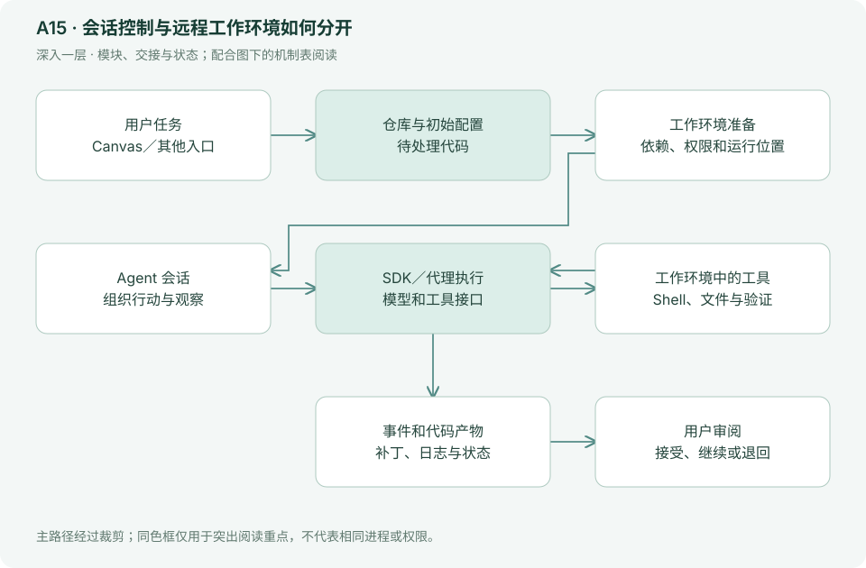

| 模块／交接点 | 怎样工作 | 状态与边界 |
|---|---|---|
| 会话控制 | 记录行动、观察与任务生命周期 | 关闭界面、停止会话和销毁环境不是同一个动作。 |
| 执行环境 | 提供仓库、依赖与工具副作用发生的位置 | 代理失败可能是环境准备失败，而非模型无法修复代码。 |
| SDK 边界 | 让代理能力被其他宿主调用 | SDK 开源不证明托管平台所有服务都公开。 |

**沿着一次任务看数据怎样走。** 例如接手一个 issue：先准备指定提交与依赖，再启动会话；代理读代码、改文件并运行测试，工作台显示事件与变更。交付时应保留环境条件和补丁，才能解释为什么同一任务在另一台机器上表现不同。

**与相近工具的实质差别。** 与在当前终端直接改文件的代理相比，环境生命周期是这里的一等问题；与 Devin 相比，可读的 SDK 提供更多实现证据，但托管产品仍需按公开边界描述。

本节细图与机制依据：[README.md](https://github.com/OpenHands/OpenHands/blob/ffdc65e10c3aa68ae1704eedbc6a011c02fcec8c/README.md)、[README.md](https://github.com/OpenHands/software-agent-sdk/blob/cd02db3a181c0bed5ee34711b46c06c88288854e/README.md)。图中选取主要模块与交接路径，完整结构及并行条件请结合所引材料阅读。

### 能力、状态与边界

| 观察项 | 实际机制／公开能力 | 对使用者意味着什么 |
|---|---|---|
| 项目拆分 | Canvas 与 Software Agent SDK 分仓 | 研究执行逻辑需进入 SDK，而非只看前端 |
| 执行后端 | 原生 SDK 或 ACP 代理 | 后端不同，模型与权限也可能不同 |
| 工作空间 | 本机、容器、集群等路线 | 支持容器不等于当前任务默认已隔离 |
| 依赖准备 | 环境是完整任务的一部分 | 记录镜像、安装脚本和可用资源 |
| 成果保存 | 会话事件与代码产物 | 回收环境前确认补丁、日志已可取回 |
| 规模化 | 可组合会话服务与多工作空间 | 还需配额、凭据、排队与资源清理 |

**把机制放进实际工作。**

环境生命周期包括准备、运行、保存和回收。任务运行时产生的文件若只留在临时工作空间，销毁环境后就可能无法交付；相反，长期不回收又会消耗资源并保留过期凭据。可靠流程应先明确哪些产物要持久保存，再让环境结束。

独立工作机能够减少开发者本机的隐含状态，却要求把依赖和服务关系写清楚。某个测试需要数据库、浏览器或外部 API，应给出可重复配置或合理替代；代理不断尝试安装依赖，未必意味着模型不够强，可能只是准备材料缺失。

Canvas 接原生 SDK 与接 ACP 外部代理是不同组合。比较时要记录前端、后端和工作空间，特别关注谁管理审批、历史与取消。批量任务还需限制并发和资源，检查失败后的清理。开放环境控制提供了空间，也把相应运维责任交给使用者。

### 从安装到完成第一个任务

1. 按当前 Canvas／SDK 文档选一条最小使用路线，明确代理后端和工作空间类型；安装与配置步骤以当前分仓文档为准。

2. 用一个小仓库验证环境：获取代码、安装依赖、运行原有测试。先把环境问题解决，再评价模型。

3. 提交独立 issue，要求保存修改与测试结果；确认任务产生的文件位于哪里，以及界面关闭后如何取回。

4. 重新创建工作空间，验证环境脚本能否重现；再运行同类任务，检查结果是否依赖残留缓存或本机秘密文件。

5. 批量部署时为任务分配独立工作空间，设置资源回收与凭据范围；交付前汇总补丁，做仓库级验证。

下面是启动命令或操作路线；路径、认证与功能入口请按自己的版本调整。

```text
建议保存的任务包：
仓库与提交 → 环境准备脚本 → 原有测试结果
问题描述 → 预算与模型配置 → 补丁和运行日志
确认产物可取回后，再回收临时工作空间。
```

### 典型任务与验收方法

下面是一份**可直接改写使用的试用任务**，属于本报告设计的验收示例，并非已完成的运行测试。

> 为这个仓库补齐一个已知 bug 的修复。请在干净环境安装依赖，先运行原有测试，再实现修复；输出补丁、测试日志和可复用的环境准备说明。

验收分两部分：代码是否正确，环境是否可重建。若只有保留旧容器才能跑通，就还没有形成可靠批量任务流程。还要确认销毁工作空间后补丁与日志仍存在，不能只在临时终端看到成功。

### 模型搭配、适用方向与取舍

以原生 SDK 文档支持的强编程模型为起点；若通过 ACP 使用 Claude Code／Codex，则遵循对应代理的模型建议，不能把它们算成同一种后端。适合批量 issue 修复、远程开发代理、组织内部代理平台和需要统一环境的实验。难度：本地中；规模化部署高。

| 选择路线 | 候选组合 | 怎样决定 |
|---|---|---|
| 原生 SDK | 当前文档支持的强编程模型 | 先固定干净环境，确认模型能完成工具与修改循环。 |
| ACP 后端 | Claude Code＋Claude／Codex＋GPT 等 | 属于另一套执行核心；记录后端，不能混为原生 SDK 成绩。 |
| 批量成本 | 样本通过的经济档位 | 先评估任务失败与环境启动成本，再扩大批量。 |

适合批量 issue、远程代理平台和可重复实验。个人小修改可能不值得启动与维护独立环境。与 Devin、Jules 比较时，主要取舍是环境控制和自托管责任；与本地 CLI 比较时，则是可复制性与启动成本。

### 资料依据与继续阅读

[Canvas](https://github.com/OpenHands/OpenHands/blob/ffdc65e10c3aa68ae1704eedbc6a011c02fcec8c/README.md)、[SDK](https://github.com/OpenHands/software-agent-sdk/blob/cd02db3a181c0bed5ee34711b46c06c88288854e/README.md)。

源码链接指向固定提交；关键实现分析不等于对整个项目和依赖逐行审计。上面的流程建议与取舍是依据这些材料给出的选型判断；具体型号、权限和菜单以实际安装与账户为准。

<a id="a16"></a>

## A16 Grok Build：开放源码的 Grok 编程运行时

### 定位与设计理念

Grok Build 提供终端 TUI、无界面脚本和 ACP 接入。当前公开仓库包含 Rust CLI／TUI 与代理运行时，并从内部大仓定期同步；这与“仅有安装说明的公开仓库”不同，但公开快照与最新商业二进制也不能自动视为完全相同。[README](https://github.com/xai-org/grok-build/blob/4247f661689354b831191f11eeeac8424993fe3d/README.md)

Grok Build 将 Grok 的原生编程体验做成可读源码的终端运行时，同时提供脚本与 ACP 入口。它允许研究者查看代理、工具和沙箱等责任边界，但公开同步的代码与正在发放的二进制不应自动视为完全一致。对用户而言，最有价值的起点是先核对实际加载配置，再判断执行行为。

### 工作原理与架构图

下图结合所引源码与文档，画出本工具的主要责任分工；为便于理解，省略次要模块与错误分支。

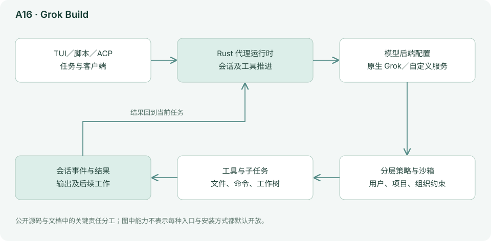

公开包按代理、工具、会话、终端和沙箱等职责拆分。官方文档支持项目指令、Skills、MCP、Hooks、子代理、工作树及后台任务。配置又区分用户、项目和组织管理层；项目配置并不是任意覆盖所有用户设置。需要理解的是：模型配置、工具权限和组织强制策略属于不同责任层。[设置](https://docs.x.ai/build/settings)

组织、用户与项目配置代表不同责任范围。组织约束可能不可由项目覆盖；用户默认也可能被当前任务具体设置改变。inspect 这类检查入口会展示合并后的有效状态，便于确认最终生效的配置。脚本模式又减少了实时人工交互，因此权限问题、错误状态和结果格式都应在接入自动化前验证。

#### 深入一层：编码动作与平台隔离后端的责任边界

Grok Build 的开源路径中可以看到独立的沙箱库。它的价值是把“模型要求执行什么”与“宿主允许怎么执行”分开。图中的两条路径并非各自无约束运行：代理选择动作，隔离接口为受控执行提供环境边界，最终工具结果再回到任务。

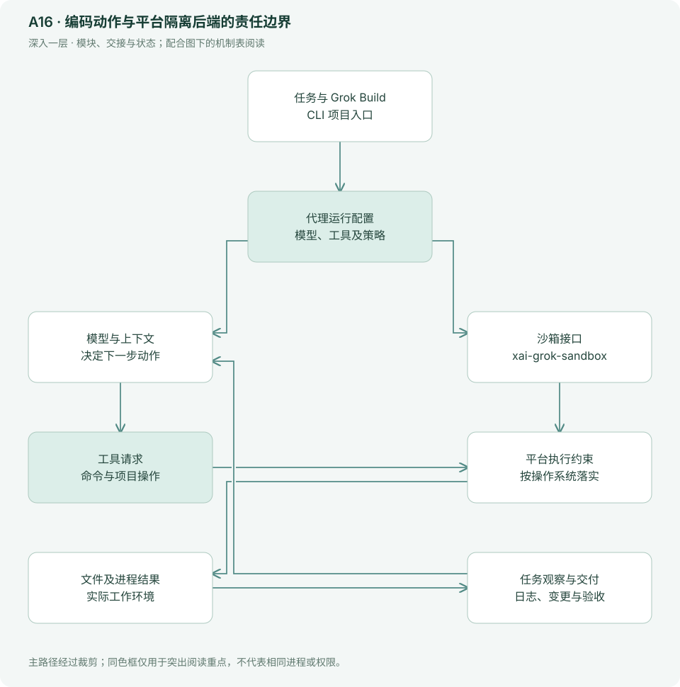

| 模块／交接点 | 怎样工作 | 状态与边界 |
|---|---|---|
| 模型决策 | 输出待执行的动作 | 模型愿意遵守规则不能取代技术限制。 |
| 沙箱库 | 抽象并落实平台相关执行约束 | 不同系统、配置和启动方式需要分别确认。 |
| 工作结果 | 文件变更和进程输出反馈给代理 | 中止任务后仍应检查已经产生的副作用。 |

**沿着一次任务看数据怎样走。** 例如请求运行项目测试：模型提出命令，工具路径结合执行配置启动进程，再把退出状态和输出送回会话。若因隔离条件被拒绝，应检查被限制的路径或能力，不应把拒绝解释成代码测试失败。

**与相近工具的实质差别。** 与只提供命令确认弹窗的包装器相比，独立沙箱实现给了更具体的边界证据；与 Codex 相比，也不能因为都使用平台沙箱，就认为策略与默认权限完全相同。

本节细图与机制依据：[lib.rs](https://github.com/xai-org/grok-build/blob/4247f661689354b831191f11eeeac8424993fe3d/crates/codegen/xai-grok-sandbox/src/lib.rs)、[README.md](https://github.com/xai-org/grok-build/blob/4247f661689354b831191f11eeeac8424993fe3d/README.md)。图中选取主要模块与交接路径，完整结构及并行条件请结合所引材料阅读。

### 能力、状态与边界

| 观察项 | 实际机制／公开能力 | 对使用者意味着什么 |
|---|---|---|
| 源码范围 | 公开 Rust CLI／TUI 与运行时快照 | 定期同步不保证与每个商业二进制逐字一致 |
| 入口 | 交互、脚本与 ACP | 无界面运行需要明确处理失败和审批条件 |
| 规则 | 项目指令、Skills、Hooks、MCP | 检查实际加载结果及生效范围 |
| 配置 | 用户、项目与组织分层 | 项目配置不能假定覆盖全部管理策略 |
| 并行 | 子代理、工作树和后台任务 | 分开确认上下文、目录和进程生命周期 |
| 模型 | 原生默认及自定义 API 配置 | 更换模型后重新验收工具和输出协议 |

**把机制放进实际工作。**

配置分层的实际作用在冲突时最清楚。项目希望放宽某项工具，而组织策略仍限制它，最终行为应按有效策略理解；单独读项目文件会产生错误预期。inspect 类能力帮助将“写了什么配置”转成“真正生效什么”，适合在复杂部署中作为排错起点。

脚本入口需要调用者处理状态，而非只接收一段自然语言。任务可能因为权限、认证、环境或预算未完成，程序应区分这些情况；看到模型生成了文字，不代表它修改了文件。需要结构化结果时应采用文档所述格式，并在一个故意失败的任务上检验调用方能否识别。

公开源码的同步节奏与发行版也应一起记录。研究某个提交里的工具或沙箱实现，可以证明那个版本存在相应路径，但不能直接推断所有已安装二进制已经包含。遇到功能差异先核对版本与构建，再比较模型；这样不会把发布差异误判为原生模型能力差异。

### 从安装到完成第一个任务

1. 安装官方发行版并登录，在项目目录运行 grok；记录版本及实际模型后端，先用原生路线完成一次小任务。

2. 运行 grok inspect 检查指令、工具和有效设置；核对项目配置是否被组织策略限制。

3. 让它分析测试方法，再给出范围有限的修改；检查工具权限、沙箱与真实文件变化。

4. 需要后台子任务时，先分清它运行在哪个目录、怎样取消、结果怎样返回；并行改动再考虑工作树。

5. 基础稳定后使用 -p 脚本模式，并按文档选结构化输出；自动化程序应处理错误与非完成状态，不只寻找成功文字。

下面是启动命令或操作路线；路径、认证与功能入口请按自己的版本调整。

```bash
cd /path/to/project
grok inspect
grok
# 无交互的小型只读查询示例
grok -p '说明这个项目的测试入口并引用文件路径'
```

### 典型任务与验收方法

下面是一份**可直接改写使用的试用任务**，属于本报告设计的验收示例，并非已完成的运行测试。

> 为一个过长的命令处理函数做最小重构，保持外部参数和输出一致。先列出有效项目规则，再实施、运行测试并解释行为兼容性。

除了代码本身，检查代理是否遵循实际生效的项目规则；如果设置文件说一套、执行行为是另一套，用 inspect 的输出定位配置来源。脚本接入时还要故意提供一个不可满足条件，确认失败能被调用方识别。

### 模型搭配、适用方向与取舍

官方配置示例将 `grok-build` 作为编程／代理会话的推荐默认，并提供 Grok 4.7 API 路径；其他模型通过自定义配置接入。原生组合值得 Grok 用户优先试用，跨模型组合仍应先做工具兼容测试。适合终端开发、CI 脚本和希望通过 ACP 使用 Grok 的人。难度：中。

| 选择路线 | 候选组合 | 怎样决定 |
|---|---|---|
| 原生起点 | grok-build 默认配置 | 核对 inspect 与服务端实际映射，保留可复现记录。 |
| 明确 API 路线 | Grok 4.7 等官方可用配置 | 按文档区分产品默认与普通 API 型号，验证参数和工具。 |
| 自定义模型 | 当前配置支持的其他后端 | 以最小工具与脚本结果测试为前提，不视为全部原生功能等价。 |

适合 Grok 用户、终端开发和需要结构化自动化入口的人。开放源码带来可观察性，原生模型带来适配便利；跨服务使用仍需付出兼容测试。组织部署尤其应核对配置最终形成的有效策略，并用执行记录验证。

### 资料依据与继续阅读

[README](https://github.com/xai-org/grok-build/blob/4247f661689354b831191f11eeeac8424993fe3d/README.md)、[设置](https://docs.x.ai/build/settings)、[入门](https://docs.x.ai/build/overview)。

源码链接指向固定提交；关键实现分析不等于对整个项目和依赖逐行审计。上面的流程建议与取舍是依据这些材料给出的选型判断；具体型号、权限和菜单以实际安装与账户为准。

<a id="a17"></a>

## A17 Step Code：在 Pi 核心上，围绕 Step 模型组织完整工作流程

### 定位与设计理念

Step Code 是在本机终端运行的编程代理，围绕读代码、修改、运行验证和交付产物组织工作。官方着重强调长任务、Token 效率和原生模型协同。这些是产品目标；“完成同样任务一定更省”仍需要在相同验收条件下测量。[产品说明](https://github.com/stepfun-ai/Step-Code/blob/adcf37b0572ff568b3fbff759f52267690c98c32/README.zh-CN.md)

其许可文件明确说明：**Step Code 派生自 Pi**，第一方代码默认采用 MIT 许可，派生部分继续保留上游声明。它的区别主要体现在如何把已有核心组合成产品：Step 认证与模型目录、工具接口、权限、多代理、任务目标、定时触发及插件。公开仓库含产品源码和构建材料，正式发布凭据、部分私有服务与观测实现不在其中。[许可与来源](https://github.com/stepfun-ai/Step-Code/blob/adcf37b0572ff568b3fbff759f52267690c98c32/LICENSE-STATUS.md)、[公开仓库边界](https://github.com/stepfun-ai/Step-Code/blob/adcf37b0572ff568b3fbff759f52267690c98c32/docs/open-source-status.md)

可以把它理解为在可扩展代理底座上做出一组明确产品选择：优先采用 Step 服务、提供现成任务控制，并为静态成果交付增加入口。底层血缘解释了为什么有熟悉的会话与扩展结构，产品层则解释了默认权限、认证、工具和编排为何与原版 Pi 不同。

### 工作原理与架构图

下图结合所引源码与文档，画出本工具的主要责任分工；为便于理解，省略次要模块与错误分支。

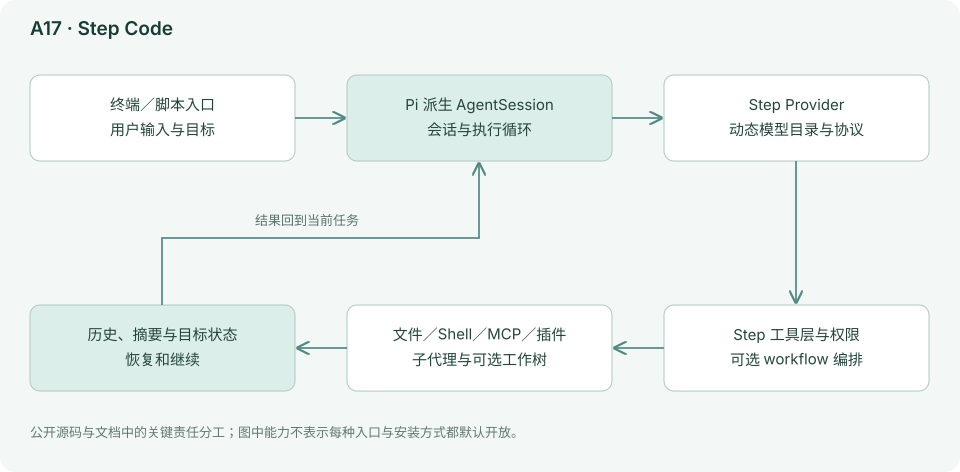

图中 Step 产品接口把输入、插话、中断和模型选择交给会话运行时；它没有再建立一套平行的状态机。底层循环根据模型结果分派工具，保存反馈，再决定是否继续。模型看到的 `read_file`、`edit_file`、`run_command` 等名称，由 Step 工具层映射到具体执行能力。这样既能保留 Pi 的扩展基础，也能调整模型熟悉的工具格式。[产品接口](https://github.com/stepfun-ai/Step-Code/blob/adcf37b0572ff568b3fbff759f52267690c98c32/packages/coding-agent/src/stepcode-runtime.ts)、[执行循环](https://github.com/stepfun-ai/Step-Code/blob/adcf37b0572ff568b3fbff759f52267690c98c32/packages/agent-core/src/agent-loop.ts)、[工具接口](https://github.com/stepfun-ai/Step-Code/blob/adcf37b0572ff568b3fbff759f52267690c98c32/packages/coding-agent/src/step/tool-profile.ts)

一条正常任务仍是“组装上下文→请求模型→检查并执行工具→保存结果→继续或结束”。子代理、goal、cron 和 workflow 是叠加在这条主线上、解决不同问题的能力。使用时应先把基本循环跑通，再按需要增加一种控制方式，才能判断问题出在模型、会话还是高级编排。

#### 深入一层：会话宿主、工具档案与有限编排

Step Code 在代理循环之上增加了产品宿主与编排语义：AgentSession 管理运行、压缩和取消，工具档案决定模型可见能力，workflow 在独立 VM 中组织子调用。子进程虽然有自己的代理轨迹，却继承父任务工作目录和项目信任，因此“进程分开”并不等于“文件天然隔离”。

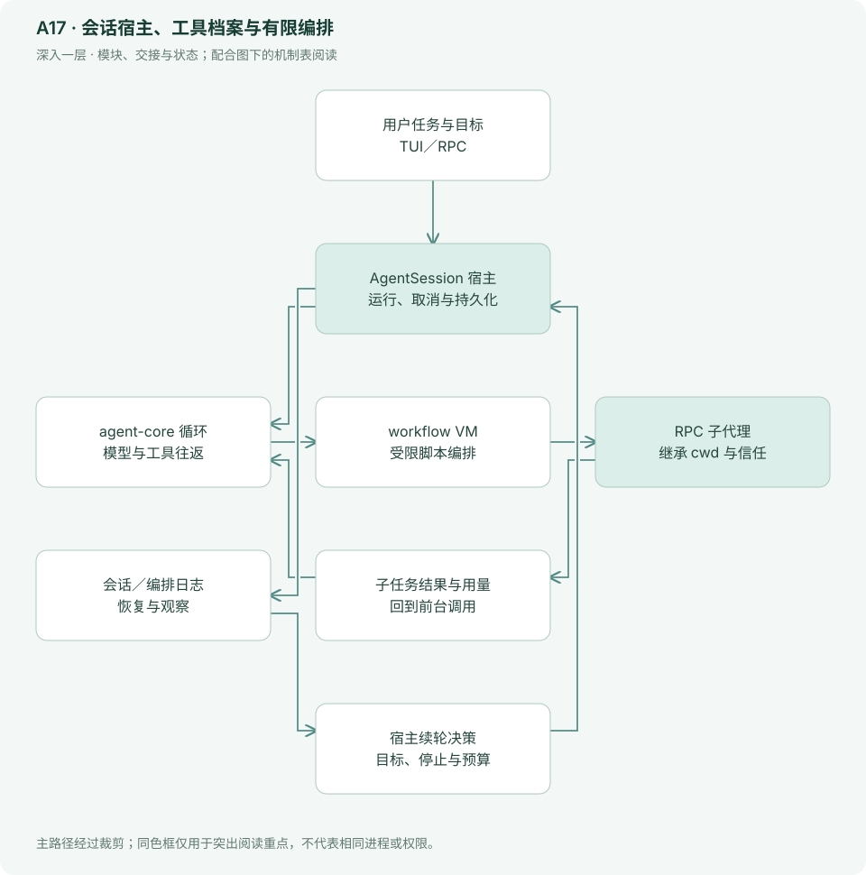

| 模块／交接点 | 怎样工作 | 状态与边界 |
|---|---|---|
| 工具档案 | 按模型和运行方式选择暴露能力 | 模型能调用的工具受具体档案约束。 |
| 有限扇出 | 宿主启动的子代理禁止再次启动子代理、workflow、cron 或 goal | 限制递归与后台任务逃逸；不等于禁止对子任务继续发消息。 |
| 目标与预算 | 宿主在一轮落定后决定是否安排续轮 | 预算阻止新调用，已在运行的一批仍可能超出剩余额度。 |

**沿着一次任务看数据怎样走。** 例如主任务用 workflow 并行调查三个模块：每个子调用先进入进度记录，再等待并发槽位；结果回到当前编排。用户取消时，请求需要沿宿主取消路径传递到正在运行的任务。需要持续目标时由宿主管理下一轮，不能让子代理自行留下无人接管的定时任务。

**与相近工具的实质差别。** 与 Pi 的差异落在宿主、模型工具档案和编排生命周期。与 MiMo 的 exec 相比，workflow 会管理子代理任务；二者虽然都执行脚本，却不是相同职责的脚本工具。

本节细图与机制依据：[agent-session.ts](https://github.com/stepfun-ai/Step-Code/blob/adcf37b0572ff568b3fbff759f52267690c98c32/packages/coding-agent/src/core/agent-session.ts)、[tool-profile.ts](https://github.com/stepfun-ai/Step-Code/blob/adcf37b0572ff568b3fbff759f52267690c98c32/packages/coding-agent/src/step/tool-profile.ts)、[orchestration-lifecycle.md](https://github.com/stepfun-ai/Step-Code/blob/adcf37b0572ff568b3fbff759f52267690c98c32/docs/orchestration-lifecycle.md)、[goal-lifecycle.md](https://github.com/stepfun-ai/Step-Code/blob/adcf37b0572ff568b3fbff759f52267690c98c32/docs/goal-lifecycle.md)。图中选取主要模块与交接路径，完整结构及并行条件请结合所引材料阅读。

#### 局部放大：一轮结束之后：目标、编排与日历触发

workflow 管当前编排中的子调用，goal 管同一会话是否继续推进显式目标，cron 管何时触发工作。三者不能用一个“自动执行”开关概括。取消或清除目标必须影响宿主后续调度，不能只修改显示文字；如果持久化失败，就不能声称目标已经清除。图中的续轮只有在目标状态、预算和取消条件允许时发生，子代理没有自行注册这些持续调度能力。

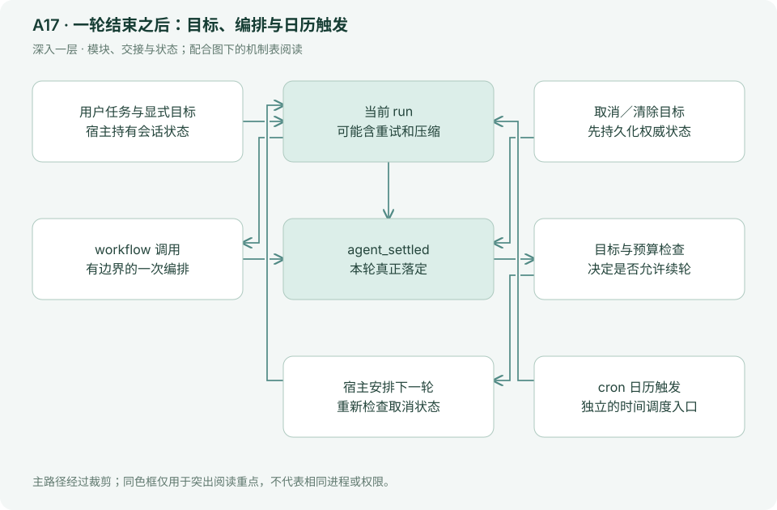

本图依据同节列出的固定源码与官方文档，表示所选子系统的主要路径。

### 能力、状态与边界

**上下文、记录与长期工作。**

| 机制 | 实际作用 | 使用时怎样理解 |
|---|---|---|
| 本地会话记录、恢复与导出 | 保存对话和工具过程，可继续或复制会话 | 能恢复聊天，不代表命令进程或外部动作也被恢复 |
| `/tree`、`/fork`、`/clone` | 从历史节点尝试另一条思路，或复制当前分支 | 对话分支不会撤销磁盘改动；代码实验仍需 Git 分支／工作树 |
| 自动压缩与 `/compact` | 总结早期过程，保留近期消息 | 摘要包含目标、文件、验证、失败方案和下一步；要检查约束是否保留 |
| `AGENTS.md`、`CLAUDE.md`、Skills | 保存可反复使用的项目规则和方法 | 不等于自动筛选、纠错并检索的长期个人记忆 |

会话层会在工具批次结束等合适时点检查上下文，接近容量时生成交接摘要；文件操作也参与摘要组织。源码另有“发送请求前精简内容”的可选路径，只改变发给模型的材料，不重写完整记录，当前默认关闭。因此不能把所有实验性节省机制都写成默认生效。[会话文档](https://platform.stepfun.ai/docs/en/step-code/guides/sessions.md)、[压缩实现](https://github.com/stepfun-ai/Step-Code/blob/adcf37b0572ff568b3fbff759f52267690c98c32/packages/coding-agent/src/core/compaction/compaction.ts)、[请求前精简开关](https://github.com/stepfun-ai/Step-Code/blob/adcf37b0572ff568b3fbff759f52267690c98c32/packages/coding-agent/src/core/agent-session.ts)

**子代理、workflow、goal 和 cron 各自负责什么。**

这四个名字很相近，职责却不同：**子代理负责分工，workflow 负责组织分工，goal 负责持续推进目标，cron 负责到了时间再触发。**

| 能力 | 当前实现与特色 | 主要边界 |
|---|---|---|
| 子代理 | 内置 general、explore、review、planner；支持单个、并行、顺序串联及后台任务 | 独立上下文与用量；默认可共享目录；review／planner 有命令工具，不能理解成系统级只读 |
| workflow／ultraloop | 用受限 JavaScript 脚本编排并行、阶段和迭代，保存运行记录 | 依赖原生 `isolated-vm`；当前代码对不能承载它的 Bun 单文件运行环境停用注册 |
| `/goal` | 保存目标与预算，当前轮结束后继续；支持暂停、恢复、清除 | 完成状态由工作代理提交，没有独立的完成评判代理；仍需外部验收 |
| `/cron` | 以时间表触发任务；可将任务持久保存到项目 | CLI 必须持续运行；保存到磁盘不等于关机后云端继续执行 |

子进程明确禁用再次派生、workflow、goal 和 cron，避免一层层放大代理数量或留下脱离父任务的定时工作。需要并行改代码时，可选择工作树，但独立目录与系统沙箱是两件事。目标预算和 workflow 预算的计数口径也有差别；正在生成的请求可能超过剩余额度，不能把 Token 限额当作绝对费用封顶。[子代理文档](https://platform.stepfun.ai/docs/en/step-code/customization/agents.md)、[生命周期约束](https://github.com/stepfun-ai/Step-Code/blob/adcf37b0572ff568b3fbff759f52267690c98c32/docs/orchestration-lifecycle.md)、[目标控制](https://github.com/stepfun-ai/Step-Code/blob/adcf37b0572ff568b3fbff759f52267690c98c32/docs/goal-lifecycle.md)

**高级编排要按安装方式验收。** 普通子代理和 workflow 是不同能力，前者可用不代表后者可用。源码的注册门控会因原生模块缺失或运行环境不支持而关闭 workflow；因此文档介绍的 `/ultraloop` 不能视为每个发布包的保证。它的使用授权主要通过提示约定和日志表达，缺少授权的调用会被记录，并非由这个约定本身强制拒绝。[注册门控](https://github.com/stepfun-ai/Step-Code/blob/adcf37b0572ff568b3fbff759f52267690c98c32/packages/coding-agent/src/features/workflow/registration-gate.ts)、[脚本运行环境](https://github.com/stepfun-ai/Step-Code/blob/adcf37b0572ff568b3fbff759f52267690c98c32/packages/coding-agent/src/features/workflow/vm.ts)

**权限、隔离与数据路径。**

Step Code 提供 Ask、Read Only、Bypass、Autopilot 四档。**本次源码及交互文档中的默认值是 Bypass**：普通工具不逐次询问。Ask 会对写入和执行等操作询问；Read Only 阻止相关工具；Autopilot 还包含自动继续机制。被规则识别的危险命令，以及无法充分分析的命令，需要单独处理；没有交互审批通道时会拒绝相应操作。这种规则检查不能分析所有程序内容，也不是操作系统沙箱。[权限源码](https://github.com/stepfun-ai/Step-Code/blob/adcf37b0572ff568b3fbff759f52267690c98c32/packages/coding-agent/src/step/permissions.ts)、[命令分析边界](https://github.com/stepfun-ai/Step-Code/blob/adcf37b0572ff568b3fbff759f52267690c98c32/docs/command-permissions.md)

安全文档明确把本地用户权限作为执行边界。工具命令可获得启动账户的系统权限，扩展与受信任项目也进入这一边界。工作流脚本受限、子代理上下文独立，都不能据此推出宿主文件和网络已被隔离。会话与配置在本地保存，选中的代码和资料仍会发往所配置的模型服务；联网工具和 StepPage 发布则增加各自的数据出口。[安全说明](https://github.com/stepfun-ai/Step-Code/blob/adcf37b0572ff568b3fbff759f52267690c98c32/SECURITY.md)、[本地数据目录](https://platform.stepfun.ai/docs/en/step-code/configuration/data-paths.md)

**扩展、迁移与静态网页交付。**

MCP、Skills 和插件可增加工具与工作方法。迁移界面能导入部分 Claude Code／Codex MCP 配置，并复用已有 `CLAUDE.md`。但服务授权要重新核对；不是所有传输方式、项目配置和插件机制都自动迁移。文档明确说明没有文件式 Hooks，需要用扩展事件实现相应逻辑。“大多数插件兼容”不能写成行为完全等价。[迁移说明](https://platform.stepfun.ai/docs/en/step-code/guides/migration.md)、[插件边界](https://platform.stepfun.ai/docs/en/step-code/customization/plugins.md)

StepPage 是很实用的产品差异：安装并启用 `steppage` 插件后，可以把本地静态输出目录发布成可访问网站，再管理版本、上线和回滚。它适合原型、产品介绍页、研究报告和数据展示页；后端程序与数据库需要另行部署。发布需要凭据和可用 MCP 服务，网站托管额度也不等于模型订阅额度。[StepPage 指南](https://platform.stepfun.ai/docs/en/step-code/reference/steppage.md)

**把机制放进实际工作。**

这些机制应分别验收：权限决定能否执行，目标状态决定是否继续，调度决定何时触发，发布插件决定产物怎样交付。某一项可用不能替另一项作保证；特别是可恢复的任务记录与仍在运行的进程，需要分别检查。

### 从安装到完成第一个任务

1. 按官方 README 为当前平台安装，确认 step --version；Windows 原生路线仍需核对 beta 限制，必要时采用官方推荐的 WSL。

2. 进入项目运行 step，用 /login 选择地区及订阅／API 渠道，再用 /model 和 /status 核对可用模型与账户。

3. 首次任务主动查看 /permissions，选择适合试用的 Ask 或 Read Only；用 /init 整理项目说明，先验证读取、修改和检查这条基础链。

4. 完成一个可重现的小修复后，查看文件变更与测试结果；使用 step -c 继续，并抽查目标、约束及已完成动作是否正确保留。

5. 再分别试子代理、目标预算与插件。高级 workflow 按安装包确认可用性；无界面 step -p 则要另行核对审批条件和退出状态。

下面是启动命令或操作路线；路径、认证与功能入口请按自己的版本调整。

```bash
cd /path/to/project
step --version
step
# 继续最近会话
step -c
```

### 典型任务与验收方法

下面是一份**可直接改写使用的试用任务**，属于本报告设计的验收示例，并非已完成的运行测试。

> 修复这个静态文档站的失效目录链接，验证页面与锚点，输出修改清单。先只生成本地成果；确认验收后，再按已配置的发布插件流程交付。

分别验收代码修改、任务恢复和静态发布。网页能上传，不代表链接正确；会话能继续，不代表原来的命令进程仍在；goal 显示完成，也不能代替链接检查。每种能力都应有自己的成功证据。

### 模型搭配、适用方向与取舍

**原生首选是 Step-5-Preview。** 源码默认模型 ID 为 `step-5-preview`，但登录后仍从当前服务发现实际可用模型；目录读取失败不等于账户已拥有默认型号。普通摘要、小修改可以比较同服务中的 Step-3.7-Flash；纯文本高频任务再考虑 Step-3.5-Flash。具体角色建议及价格见[第六章的模型与成本比较](06-模型搭配与成本.md)。[默认模型](https://github.com/stepfun-ai/Step-Code/blob/adcf37b0572ff568b3fbff759f52267690c98c32/packages/coding-agent/src/step/defaults.ts)、[模型发现](https://github.com/stepfun-ai/Step-Code/blob/adcf37b0572ff568b3fbff759f52267690c98c32/packages/providers/src/step-provider/index.ts)

**跨厂商使用有一处文档冲突。** 网站“Platforms and models”仍描述多厂商登录和多种云平台；当前 README 与源码则明确：默认产品只内置 Step，其他模型可通过 `models.json` 等自定义路径接入。源码保留 OpenAI Chat Completions／Responses 与 Anthropic Messages 适配代码，并不等于文档列出的每种原生登录、云平台和协议都已在此发行版验证。本报告将“Step 原生”作为可靠的起点，把 Claude、GPT、DeepSeek、Qwen 或本地服务归入需要单独验证的自定义组合，不给出“只填 Key 就全部可用”的承诺。[网站模型文档](https://platform.stepfun.ai/docs/en/step-code/configuration/models.md)、[内置目录边界](https://github.com/stepfun-ai/Step-Code/blob/adcf37b0572ff568b3fbff759f52267690c98c32/packages/providers/src/providers/all.ts)、[协议兼容层](https://github.com/stepfun-ai/Step-Code/blob/adcf37b0572ff568b3fbff759f52267690c98c32/packages/providers/src/compat.ts)

**适用方向与难度。** 适合愿意使用终端、主要采用 Step 模型的开发者：中小功能、跨文件修复、测试与技术文档、可拆分的仓库调查，以及需要发布静态成果的任务。基础使用难度中等；跨模型定制、长任务预算和高级编排为中高。对于要求完整 IDE 调试体验、全天候云端任务，或已验证企业隔离治理的场景，应继续比较对应专门产品。当前推荐等级是“值得纳入试用的新候选”，尚未经过本报告的统一运行测试。

| 选择路线 | 候选组合 | 怎样决定 |
|---|---|---|
| 原生旗舰 | Step-5-Preview | 复杂修改、长材料和多步工具任务先建立基线，核对地区与渠道。 |
| 日常成本对照 | Step-3.7-Flash／3.5-Flash | 摘要、局部修改和重复提取可先试；角色分配属于建议而非实测结论。 |
| 自定义后端 | models.json 支持的协议路线 | 分别验证工具、推理字段、窗口与审批；源码适配存在不等于原生登录可用。 |

它适合希望采用 Step 模型，又需要现成任务与静态交付流程的终端用户。偏自由扩展可比较 Pi，偏 IDE 交互可比较 Cline，偏全天候远程工作可比较云端代理。新项目的版本稳定性与实际使用规模仍应继续观察。

### 资料依据与继续阅读

[仓库](https://github.com/stepfun-ai/Step-Code)、[产品说明](https://github.com/stepfun-ai/Step-Code/blob/adcf37b0572ff568b3fbff759f52267690c98c32/README.zh-CN.md)、[许可与来源](https://github.com/stepfun-ai/Step-Code/blob/adcf37b0572ff568b3fbff759f52267690c98c32/LICENSE-STATUS.md)、[协议兼容层](https://github.com/stepfun-ai/Step-Code/blob/adcf37b0572ff568b3fbff759f52267690c98c32/packages/providers/src/compat.ts)。

源码链接指向固定提交；关键实现分析不等于对整个项目和依赖逐行审计。上面的流程建议与取舍是依据这些材料给出的选型判断；具体型号、权限和菜单以实际安装与账户为准。

