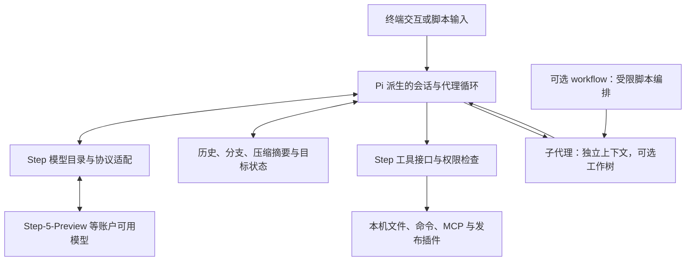

# 03A｜终端与开放编程代理：从“帮我改一下”到可编排的执行系统

这里的“终端”指主要交互入口，不代表只能在黑色命令行窗口里使用。同一套执行引擎，可能同时服务终端、编辑器、桌面应用和自动化任务。读这一章时，重点看：**谁负责组织工作，任务状态怎样保存，工具怎样执行，以及模型能否真正换得动。**

本章的模型建议分两种：**原生优先**表示官方围绕该模型生态提供了直接支持；**选型建议**表示依据架构和任务提出的试用方案，并非本报告实测出的胜者。型号、权限和订阅差异集中见[第六章](06-模型搭配与成本.md)。难度是作者对安装、配置、运维负担的判断，不是测量成绩。

## A01 Claude Code：让强模型直接操作开发环境

**定位与理念。** Claude Code 把开发看成一个持续循环：读资料、采取行动、观察结果，再决定下一步。它不像固定流水线那样要求用户事先画好每一步，更依赖模型自己找文件、使用终端、修改代码和验证。它的优势来自 Claude 模型、工具描述、提示和运行环境的配合，而不仅是一个聊天窗口。[工作原理](https://code.claude.com/docs/en/how-claude-code-works.md)

**架构怎么理解。** 可以把它看成“主对话＋工具执行层＋可插拔工作规范”。项目说明、记忆、Skills 为模型补充做事方法；Hooks 在确定的生命周期节点执行程序；MCP 接入外部工具；子代理拥有独立上下文，完成局部任务后交回结果。Skills 更像工作手册，子代理则像另开一张办公桌，两者不应混为一谈。[记忆](https://code.claude.com/docs/en/memory.md)、[子代理](https://code.claude.com/docs/en/sub-agents.md)、[Hooks](https://code.claude.com/docs/en/hooks.md)

它也有 Agent Teams，但团队协作与普通子代理不是同一个功能开关。是否启用、可用界面、并行开销和任务边界都要单独确认。权限审批负责决定能不能做；沙箱进一步限制命令实际接触的文件和网络。允许一次命令，并不等于让全部后续动作永久放行。[团队](https://code.claude.com/docs/en/agent-teams.md)、[沙箱](https://code.claude.com/docs/en/sandboxing.md)

**源码边界。** 官方 GitHub 仓库可用于查看 README、扩展、发布和问题记录，但不能据此声称已经审计完整的商业运行时。本报告对其内部架构的描述以官方公开行为和接口为边界。[官方仓库](https://github.com/anthropics/claude-code)

**怎样上手。** 按官方安装页安装，在项目目录运行 `claude`，先让它解释项目与测试方法，再给一个有明确验收标准的小任务。将稳定的项目约定写进 `CLAUDE.md`，需要反复执行的方法做成 Skill。首次使用保留审批，熟悉后再按工具、目录和命令缩小授权范围。不要一开始把所有插件都装进去。

**模型与适用方向。** 原生优先 Claude。当前官方直连别名中，Sonnet 5 适合作为日常起点；复杂设计和长任务再试账户可用的 Opus 或 Fable。不同云供应商的同名别名可能落到不同版本，因此应记录实际模型 ID。适合跨文件修复、项目探索、测试驱动的实现，也能处理目录中的文档和资料。若主要诉求是随意更换各家模型，应优先比较 OpenCode、Pi、Kilo。上手难度：中；深度扩展：中高。[模型配置](https://code.claude.com/docs/en/model-config.md)

## A02 Codex：把任务、执行环境和审查组织成一套系统

**定位与理念。** Codex 的关键不只是生成补丁，而是让代理在明确工作空间中持续执行任务，留下可审查的变更。CLI、编辑器和桌面入口可以提供不同交互方式；不能因为名称相同，就假定每个入口拥有完全一样的功能、模型和权限设置。[CLI](https://learn.chatgpt.com/docs/codex/cli.md)、[工作树](https://learn.chatgpt.com/docs/environments/git-worktrees.md)

**源码揭示的结构。** 当前公开核心以 Rust 为主。`codex-rs/core` 放可复用业务逻辑，app-server 通过结构化协议把任务、回合和输出事件交给界面。通俗地说，界面负责“怎样看和怎样点”，核心负责“任务到底跑到了哪里”。这使桌面交互、自动化客户端和执行逻辑可以分开演进。[核心说明](https://github.com/openai/codex/blob/8a577399c774d1881ef030971d8f271694f55536/codex-rs/core/README.md)、[app-server](https://github.com/openai/codex/blob/8a577399c774d1881ef030971d8f271694f55536/codex-rs/app-server/README.md)

权限也不是一串提示词。源码将沙箱策略选择、命令转换和执行请求衔接起来；子代理创建时处理父级与请求权限的有效边界，并管理运行容量。其含义是：一个子代理不该因为“另起了会话”就自动获得比父任务更大的权限。具体平台使用的沙箱实现有所不同，部署时要看对应系统说明。[沙箱适配](https://github.com/openai/codex/blob/8a577399c774d1881ef030971d8f271694f55536/codex-rs/core/src/sandboxing/mod.rs)、[子代理创建](https://github.com/openai/codex/blob/8a577399c774d1881ef030971d8f271694f55536/codex-rs/core/src/agent/control/spawn.rs)

**上下文与分工。** `AGENTS.md`、Skills、记忆与历史压缩分别解决项目规则、可复用方法、跨任务信息和当前窗口容量问题。压缩有本地／远端处理路径，不等于原始文件消失。工作树能够减少并行改代码时的文件冲突，但最后仍要集成、检查测试和审阅变更。[压缩实现](https://github.com/openai/codex/blob/8a577399c774d1881ef030971d8f271694f55536/codex-rs/core/src/compact.rs)、[自定义](https://learn.chatgpt.com/docs/customization/overview.md)、[子代理文档](https://learn.chatgpt.com/docs/agent-configuration/subagents.md)

**怎样上手。** 在应用中打开仓库，或安装 CLI 后在项目目录运行 `codex`；先检查工作目录、模型和执行权限。用“重现问题→提出原因→修改→运行相关检查→解释 diff”的完整任务开始。稳定规则放进 `AGENTS.md`，多个独立改动再考虑独立工作树。不要把某个桌面版本的按钮名当成所有部署都适用的命令。

**模型与适用方向。** 原生优先当前官方 GPT 系列：日常先试 GPT-5.6 Terra，重复且容易验收的任务试 Luna，较深推理和成品质量需求试 Sol，最复杂的长任务试 GPT-6 Astra。选择必须以所在产品实际开放的模型为准。自定义 Provider 可以接入其他服务，但“接口能调用”不等于工具格式、推理状态和长任务行为已经同等优化。适合完整功能实现、迁移、复杂调试、需要反复运行验证的任务。上手难度：中；工作树和自动化管理：中高。[模型说明](https://learn.chatgpt.com/docs/models.md)、[配置](https://learn.chatgpt.com/docs/config-file/config-basic.md)

## A03 Gemini CLI：把 Google 模型和检索能力带进终端

**定位与理念。** Gemini CLI 是开放的终端代理，面向 Gemini 生态。适合希望保留命令行工作习惯，又需要联网查资料、多模态输入和项目操作的用户。Google 账户、API Key、Vertex AI 等接入方式对应的计费、限额和组织管理方式不同，不能统一概括为“免费无限用”。[项目说明](https://github.com/google-gemini/gemini-cli/blob/d5b3e3accb26000d273abf16e0f1dd83aa5428a9/README.md)

**源码结构。** 核心客户端处理对话和模型流，调度器处理工具批次、策略判断、审批和执行状态。模型说“执行这个工具”和工具真的执行，中间隔着一个明确的调度层。例如工具策略可以直接拒绝，也可以转入询问，正在运行的批次还会影响后续队列。[客户端](https://github.com/google-gemini/gemini-cli/blob/d5b3e3accb26000d273abf16e0f1dd83aa5428a9/packages/core/src/core/client.ts)、[调度器](https://github.com/google-gemini/gemini-cli/blob/d5b3e3accb26000d273abf16e0f1dd83aa5428a9/packages/core/src/scheduler/scheduler.ts)

这类分层的价值在于，终端界面不需要自己理解每一种工具的全部生命周期。项目上下文、扩展、MCP 和权限机制则围绕这条执行链提供能力。它仍然是能操作环境的代理，不是把 Google 搜索结果拼进聊天框那么简单。

**怎样上手。** 按官方说明安装 `@google/gemini-cli`，进入项目运行 `gemini`，选择认证方式；用 `GEMINI.md` 写项目规则。先验证文件读取、命令执行、模型选择和联网工具是否按预期工作，再添加扩展。只有确实需要访问浏览器或其他业务系统时，才接入相应工具。

**模型与适用方向。** 原生优先 Gemini。当前官方目录中的 Gemini 3.8 Flash 可作为快速任务候选，复杂任务比较账户可用的 Pro 型号，例如 3.1 Pro Preview；预览型号要单列记录。适合带检索的开发、资料到代码的转换、图片辅助理解，以及 Google Cloud 生态。若核心需求是跨厂商随时替换，OpenCode／Qwen Code 的入口通常更直接。上手难度：中。[当前 Gemini 模型](https://ai.google.dev/gemini-api/docs/models)

## A04 Qwen Code：在熟悉的终端代理结构上扩大模型与渠道覆盖

**定位与理念。** Qwen Code 既服务 Qwen 生态，也重视多协议接入。当前版本已不宜只用“Gemini CLI 的中文分支”概括：历史来源解释了部分结构，但现有模型配置、团队功能和入口已经继续演化。[README](https://github.com/QwenLM/qwen-code/blob/99bf4ce86b32010644538046ea37b0ef0ad23921/README.md)

**架构与特色。** 模型客户端中可以看到压缩、上下文精简和目标预算相关逻辑；代理工具则把子任务的生命周期、权限、会话和工作目录纳入管理。它不是简单将请求中的模型名替换成 Qwen。[客户端](https://github.com/QwenLM/qwen-code/blob/99bf4ce86b32010644538046ea37b0ef0ad23921/packages/core/src/core/client.ts)

一个有代表性的源码细节是：某些 shell 沙箱环境只允许在同一工作空间内运行子代理，工作树、另选工作目录和队友功能会受到限制；前台子代理也需要处理父任务取消的向下传播。由此可见，宣传页上的“支持子代理”“支持沙箱”，并不保证两者在每一种组合中完全可用。[代理工具](https://github.com/QwenLM/qwen-code/blob/99bf4ce86b32010644538046ea37b0ef0ad23921/packages/core/src/tools/agent/agent.ts)

**怎样上手。** 按官方文档安装并运行 `qwen`，通过认证配置选择 Qwen 或其他支持的 Provider。先设项目规则和模型，再开长任务、记忆或团队功能。接本地 Ollama／vLLM 时，除了地址，还要核实模型实际上下文、工具调用格式和服务端模板；服务启动成功只是第一步。[文档仓库](https://github.com/QwenLM/qwen-code-docs)

**模型与适用方向。** 原生优先 Qwen 的编程／推理模型，当前服务目录包括 Qwen3.8 系列；跨厂商接入以文档支持的协议为准。若重视开放权重和本地试验，可测试 Qwen3-Coder-30B-A3B-Instruct 这类有官方模型卡的模型，但不要期待小模型承担和最大云端模型一样的长链条任务。适合中文开发协作、多协议部署、国内服务接入和本地模型探索。难度：中；自建推理服务：高。[Qwen 模型目录](https://www.alibabacloud.com/help/en/model-studio/models)、[本地候选模型卡](https://huggingface.co/Qwen/Qwen3-Coder-30B-A3B-Instruct/raw/main/README.md)

## A05 Kimi Code：围绕 Kimi 的长任务体验重新组织执行核心

**先辨认项目。** 本报告使用的是 `MoonshotAI/kimi-code`。旧 `kimi-cli` 的架构介绍不能直接套到新代码。当前仓库是 TypeScript 多包结构，`agent-core-v2` 是需要重点看的执行核心；发布的独立程序也不意味着用户必须先搭建 Node 开发环境。[当前仓库](https://github.com/MoonshotAI/kimi-code/blob/6451f1e056e90037bbf832f3578955cf8e55db64/README.md)

**设计重心。** Kimi Code 将终端任务、编辑器连接、工具和独立子任务组合起来。ACP 让编辑器可以接入同一类代理会话，插件与 Hooks 扩展行为，不同子代理承担探索、规划和实现。它更接近一套完整开发助手，而不是模型 API 的薄转发层。

**源码中的关键点。** 历史压缩根据上下文预算触发，并为下一步留出空间；压缩边界还要避开没有完成的工具交换。为什么要这样做？如果只留下“调用工具”的消息，却丢掉对应结果，下一轮模型会看到一段断裂的对话。长上下文管理首先是状态正确性问题，然后才是节省 Token。[压缩策略](https://github.com/MoonshotAI/kimi-code/blob/6451f1e056e90037bbf832f3578955cf8e55db64/packages/agent-core-v2/src/agent/fullCompaction/strategy.ts)、[模型请求层](https://github.com/MoonshotAI/kimi-code/blob/6451f1e056e90037bbf832f3578955cf8e55db64/packages/agent-core-v2/src/agent/llmRequester/llmRequester.ts)

**怎样上手。** 安装当前 Kimi Code，运行 `kimi`，使用 `/login` 和 `/model` 完成登录、模型选择。需要在支持的编辑器中使用时，按 ACP 文档配置 `kimi acp`。先让它处理可验收的小模块，再引入项目指令、插件和独立探索代理。自定义 Provider 时检查协议和模型能力，而不只填入一个名字。[Provider 配置](https://github.com/MoonshotAI/kimi-code/blob/6451f1e056e90037bbf832f3578955cf8e55db64/docs/en/configuration/providers.md)

**模型与适用方向。** 原生优先 Kimi。当前文档区分 K3 的不同上下文档位；`kimi-for-coding` 别名目前指向 K2.8 Preview，不能把这个别名永久当作某个固定旧版本。复杂、资料量大的任务可先试可用的 K3，日常工作比较 K2.8 路线。适合中文项目沟通、长资料辅助开发和 Kimi 订阅用户。上手难度：中。[模型说明](https://www.kimi.com/code/docs/en/kimi-code/models.html)、[更新记录](https://www.kimi.com/code/docs/en/kimi-code/whats-new.html)

## A06 MiMo Code：按模型家族调整工具，而非假定所有模型用同一套手势

**定位与理念。** MiMo Code 继承了可辨认的 OpenCode 结构，同时加入自己的模型适配、记忆和任务模式。最值得关注的不是支持多少模型，而是承认：不同模型训练时学会的工具习惯可能不同，运行时需要据此调整。[README](https://github.com/XiaomiMiMo/MiMo-Code/blob/1579e7d9ee5fca87b707c3892dc725316674a9d6/README.md)

**深入看架构。** 其 Codex microkernel 文档描述了面向 GPT 系列的工具接口组织：终端、补丁、图像以及可编程调用能力分别承担不同职责。这里的“微内核”是一种架构比喻，并不是说它变成了操作系统内核。QuickJS 中的脚本没有直接获得 Node、进程和网络能力，但它调用到的宿主工具仍然需要权限管理；尤其不能把“JavaScript 被隔离”误读为“终端命令也被系统沙箱隔离”。[架构说明](https://github.com/XiaomiMiMo/MiMo-Code/blob/1579e7d9ee5fca87b707c3892dc725316674a9d6/docs/architecture/codex-microkernel-runtime.en.md)、[工具注册](https://github.com/XiaomiMiMo/MiMo-Code/blob/1579e7d9ee5fca87b707c3892dc725316674a9d6/packages/opencode/src/tool/registry.ts)

**长任务怎么保留状态。** 当前设计包含跨会话记忆、检索和检查点文件，试图把目标、进展、约束保存成下一次可重新装载的材料。相较只留一句“之前我们讨论了登录功能”，这种方式更适合恢复“测试失败在哪里、哪些文件已经改过、下一步是什么”。但能恢复多少仍取决于写入内容和检索命中，不能保证毫无遗漏。[README](https://github.com/XiaomiMiMo/MiMo-Code/blob/1579e7d9ee5fca87b707c3892dc725316674a9d6/README.md)、[压缩实现](https://github.com/XiaomiMiMo/MiMo-Code/blob/1579e7d9ee5fca87b707c3892dc725316674a9d6/packages/opencode/src/session/compaction.ts)

**怎样上手。** 按官方指引安装 `@mimo-ai/cli` 并运行 `mimo`。先熟悉 Build／Plan；Compose 具有独立的模式约束，不宜在不了解工具变化的情况下频繁切换。让它先列出计划和验收，再实施一个小任务；查看它写出的进度、记忆与检查点是否准确。

**模型与适用方向。** 原生优先 MiMo-V2.5 系列；较复杂代理任务可试 Pro。仓库也为 GPT 等模型做了专门适配，因此跨模型使用比单纯“兼容接口”更有研究价值，但本报告没有证明它在 GPT 上优于 Codex。MiMo-X 等受限预览与公开可用模型要分开看。适合愿意尝试模型特定工具配置、持久任务状态的开发者。难度：中；理解模式和适配细节：中高。[模型发布说明](https://mimo.mi.com/docs/en-US/news/latest/v2.5-open-sourced)

## A07 DeepSeek Harness：把代理循环本身也做成可替换部件

**身份与成熟度。** 这是 DeepSeek 官方 `deepseek-ai/deepseek-harness` 项目，而非仅仅给第三方壳换一个名字。当前仍标为开发者预览。关注度高说明值得研究，不代表接口已经稳定，或适合立即承担所有生产任务。[仓库](https://github.com/deepseek-ai/deepseek-harness/blob/00102833dfaee1da9f48a3a8eae9d34005a75218/README.md)、[产品说明](https://deepseek.com/harness/en/)

**设计理念。** DSH 的中心思想是“连引擎也可以替换”。借助插件系统，模型、工具、会话存储、沙箱、代理循环以及界面被组织为可组合服务。Profile 决定装配哪些部件，再由配置层叠加修改。它既能成为终端／Web 产品，也能作为开发者搭建新代理的基础。[架构文档](https://github.com/deepseek-ai/deepseek-harness/blob/00102833dfaee1da9f48a3a8eae9d34005a75218/docs/architecture.md)

**状态是怎么保存的。** 会话事件日志是核心依据，模型看到的历史由日志推导出来。这样可以区分模型输出、工具调用、工具结果和失败尝试，也方便重建界面、排查运行过程。但“能回放日志”不等于重新请求模型会得到一模一样的答案，更不等于自动撤销已经发送的邮件或修改过的外部数据库。[默认循环](https://github.com/deepseek-ai/deepseek-harness/blob/00102833dfaee1da9f48a3a8eae9d34005a75218/packages/core/agent-loop/src/agent.ts)

**工具与子代理。** 源码将必须独占的工具调用作为执行屏障，其他调用进入有界并行队列；即便工具并发执行，也要维持可理解的结果顺序。子代理又是一条可替换接缝，后端可采用内部会话、ACP 或其他代理系统；不具备的能力应明确拒绝，而不是假装实现。其开放性比“支持某个固定子代理按钮”更深，但集成测试负担也随之增加。[工具执行](https://github.com/deepseek-ai/deepseek-harness/blob/00102833dfaee1da9f48a3a8eae9d34005a75218/packages/core/agent-loop/src/tool-calls.ts)、[子代理后端](https://github.com/deepseek-ai/deepseek-harness/blob/00102833dfaee1da9f48a3a8eae9d34005a75218/docs/subsystems/subagent.md)

**怎样上手。** 官方入口之一是 `npx @deepseek-ai/dsh web`。先运行标准 Profile，再查看配置和已启用插件；需要理解装配结果时使用文档中的配置导出能力。只有标准模式跑稳后，再尝试 Code／Minimal／Creator 等模式或替换代理循环。预览项目应固定版本，保存可工作的配置。

**模型与适用方向。** 原生优先当前 DeepSeek API 模型，例如 `deepseek-flash` 对应的 V4.1 Flash 路线，以及适合更重任务的 Pro 路线；具体映射应当天核实。选型上更适合代理研发、需要可替换执行层的团队，以及愿意承担预览变动的高级用户。普通日常开发可以试，但不应仅凭 GitHub 星数取代成熟流程。难度：标准使用中；开发新 Harness 高。[API 模型目录](https://api-docs.deepseek.com/quick_start/pricing/)

## A08 OpenCode：把模型和界面选择权留给使用者

**定位与理念。** OpenCode 的重点是开放、多 Provider 和多入口。模型服务、终端／桌面界面、会话和工具执行并非全部绑在一个厂商订阅里。它适合已经有 API 账户、想比较不同模型，又不愿为每个模型重学一套工具的用户。[README](https://github.com/anomalyco/opencode/blob/fe3f3a41f79ad292cc3c7c629567385a20ec5130/README.md)

**源码结构。** 当前代码包括独立核心包以及会话、模型、权限、插件和快照服务。会话处理器将模型流转成消息与工具事件；还会在适当阶段准备快照。源码专门处理“工具可能早于某个流事件开始执行”的顺序问题，这说明保存状态不能只靠界面上看到的输出顺序。[会话处理器](https://github.com/anomalyco/opencode/blob/fe3f3a41f79ad292cc3c7c629567385a20ec5130/packages/opencode/src/session/processor.ts)

**上下文与分工。** 压缩不仅生成摘要，还涉及保留近期内容的预算、模型限制和大型附件溢出处理。任务工具创建独立子会话，并派生权限和模型设置。当前后台子代理还存在实验开关与深度限制；不要把源码中存在一条路径写成所有版本默认可用。[压缩](https://github.com/anomalyco/opencode/blob/fe3f3a41f79ad292cc3c7c629567385a20ec5130/packages/opencode/src/session/compaction.ts)、[任务工具](https://github.com/anomalyco/opencode/blob/fe3f3a41f79ad292cc3c7c629567385a20ec5130/packages/opencode/src/tool/task.ts)

**怎样上手。** 安装后在仓库运行 `opencode`，连接 Provider，选择模型，先用 Plan 分析，再用 Build 实施。将项目约定放入文档支持的指令文件，按需接 LSP、MCP 和插件。切换模型后做一次最小工具测试，确认读文件、改文件、命令执行、恢复历史都正常。

**模型与适用方向。** 选型建议：在当前 Provider 确认支持的前提下，以 Sonnet 5／GPT-5.6 Terra 作为日常候选，复杂任务上探 Sol／Astra 或更强 Claude；重视成本与中文服务时比较 DeepSeek、Qwen、Kimi。模型广泛可接入是自由度，不是全部组合都同样可靠的保证。适合跨模型比较、个人开发、开放工作流和自定义扩展。难度：中；插件多了以后是中高。

## A09 Pi：保留一个可理解的核心，把特殊需求交给扩展

**定位与理念。** Pi 当前仓库迁至 `earendil-works/pi`。它吸引人的地方是执行核心、模型接口、终端交互和扩展边界相对清晰。使用者既可以直接编码，也可以把它当成搭建自己代理的材料。[README](https://github.com/earendil-works/pi/blob/b4588f26af2f74f7b1387b548e04a3c8d81da75b/README.md)

**源码里的循环。** `agent-loop.ts` 将代理上下文转换成模型输入，处理工具结果、用户中途追加的引导和后续消息；准备下一回合时可以调整上下文、模型和推理设置。会话管理器则保留分支、模型变更、压缩等事件。这种设计便于研究“模型到底收到了什么”，也方便把 UI 换掉。[代理循环](https://github.com/earendil-works/pi/blob/b4588f26af2f74f7b1387b548e04a3c8d81da75b/packages/agent/src/agent-loop.ts)、[会话管理](https://github.com/earendil-works/pi/blob/b4588f26af2f74f7b1387b548e04a3c8d81da75b/packages/coding-agent/src/core/session-manager.ts)

扩展不是只能追加几句提示：它可以注册工具、命令、事件处理、Provider 和界面元素。因此 Pi 的团队、计划或审批体验可能来自扩展，而不是所有安装都自带同一套行为。比较时应写“Pi＋哪些扩展”，否则不是同一个实验对象。[扩展文档](https://github.com/earendil-works/pi/blob/b4588f26af2f74f7b1387b548e04a3c8d81da75b/packages/coding-agent/docs/extensions.md)

**一个必须知道的取舍。** Pi README 明确说明默认没有内置权限系统；运行进程拥有启动用户的系统权限。扩展也在 Pi 进程内执行。想把它放进可控边界，应主动选择容器、虚拟机或文档列出的隔离方案，不能把简洁误认为自动安全。[README](https://github.com/earendil-works/pi/blob/b4588f26af2f74f7b1387b548e04a3c8d81da75b/README.md)

**怎样上手。** 使用当前 README 的安装方式，而不要机械照搬旧包名。先运行原生配置，接一个确认支持工具调用的模型，只加入真正需要的扩展。若目标是代理开发，先读 `pi-ai → agent-core → coding-agent` 的责任分工，再改循环。

**模型与适用方向。** 选型建议是先选一个能力稳定的云端模型建立基线，再用相同任务比较 DeepSeek／Qwen／Kimi 或本地模型。Pi 的优势在于能控制实验条件，而不是天然让弱模型变强。适合熟练开发者、终端爱好者、代理研究和定制工具；不适合期待完整权限管理开箱即用的初学者。难度：日常中；定制高。

## A10 Cline：把过程看得见、能审查作为主要体验

**定位与理念。** Cline 重视逐步展示代理在读什么、改什么、运行什么，让用户在编辑器中持续参与。当前产品已有扩展、CLI 和 SDK 等入口，不能只依据早期 VS Code 插件判断整体能力。[README](https://github.com/cline/cline/blob/078f82b1e2617a6be421e34c08d35af1c3a78d87/README.md)

**当前分层。** SDK 把代理循环、模型适配和会话／工具基础能力分开。运行时处理模型输出限额、瞬时错误和重试，上下文层处理压缩与预算。这类分工使代理逻辑可以被不同入口复用，但入口是否暴露同一个功能仍是产品问题。[代理运行时](https://github.com/cline/cline/blob/078f82b1e2617a6be421e34c08d35af1c3a78d87/sdk/packages/agents/src/agent-runtime.ts)、[压缩管线](https://github.com/cline/cline/blob/078f82b1e2617a6be421e34c08d35af1c3a78d87/sdk/packages/core/src/extensions/context/compaction.ts)

**“多代理”尤其需要分清。** 当前文档中的普通 Subagents 是独立上下文的只读研究代理，适合找文件、查代码并返回报告；不能据此说它们可以任意编辑、浏览器操作或继续嵌套。CLI／SDK／Kanban 的 Agent Teams 则有共享任务板、消息箱和持久任务状态，文档明确说这套团队功能当时还不适用于 VS Code 与 JetBrains 扩展。[只读子代理](https://github.com/cline/cline/blob/078f82b1e2617a6be421e34c08d35af1c3a78d87/docs/features/subagents.mdx)、[团队功能](https://github.com/cline/cline/blob/078f82b1e2617a6be421e34c08d35af1c3a78d87/docs/cli/agent-teams.mdx)

**怎样上手。** 安装对应编辑器扩展，配置 Provider 和模型，保留重要操作审批；用 Plan 整理思路，再进入执行。若确实需要持续团队任务，另按 CLI 文档使用团队模式，而不要在扩展里找不存在的同等功能。

**模型与适用方向。** 多模型是其优势。建议先试当前支持的 Sonnet 或 GPT 日常档位；预算敏感时比较 DeepSeek／Qwen。模型必须能稳定处理工具调用和代码编辑。适合希望逐步审阅、学习代码库、修复中小问题的开发者；团队功能适合愿意使用 CLI 的进阶用户。难度：扩展低中；SDK／团队中高。

## A11 Kilo Code：围绕开放执行核心提供更多产品化入口

**定位与演化。** Kilo 不能只用早期的 Cline／Roo 血缘来说明当前架构。当前仓库中已经有明显的 OpenCode 核心结构以及 Kilo 自己的会话处理层，同时覆盖 CLI、编辑器和云端服务。[README](https://github.com/Kilo-Org/kilocode/blob/651323d2b2f83b912f71f9e682a9caa7ebacb154/README.md)、[Kilo 会话处理](https://github.com/Kilo-Org/kilocode/blob/651323d2b2f83b912f71f9e682a9caa7ebacb154/packages/opencode/src/kilocode/session/processor.ts)

**值得关注的差别。** 用户购买的不只是一个本地循环，也可能包括模型入口、远程任务和代码审查等产品能力。相同基础执行结构之上，账户、模型路由、错误恢复、任务管理和界面整合仍能带来明显体验差异。源码中的错误信息与溢出处理也体现了模型服务出错后如何向用户解释、何时先压缩再重试。[压缩衔接](https://github.com/Kilo-Org/kilocode/blob/651323d2b2f83b912f71f9e682a9caa7ebacb154/packages/opencode/src/kilocode/session/compaction.ts)

**怎样上手。** 在自己最常用的编辑器或 CLI 中选一个入口，明确使用 Kilo 托管模型还是自己的 Provider，再比较费用和可用模型。先跑一个任务，不必同时启用所有云端服务。需要迁移时，检查规则、凭据、会话历史和模式配置分别如何导出；同源代码不代表这些格式完全兼容。

**模型与适用方向。** 选型建议：优先从当前 Kilo 模型目录中选择已经完整支持的日常型号，再按复杂度升级；可比较 Claude、GPT、DeepSeek、Qwen 等家族。不要把“模型数量很多”直接当成编程质量证据。适合希望多入口、多模型，又愿意使用统一商业服务的开发者。难度：低中；复杂模型路由与云任务：中高。

## A12 Goose：以工具扩展为中心，把编程代理拓展到其他工作

**定位与理念。** Goose 源于 Block，当前仓库已转到 `aaif-goose/goose`。它把外部能力接入放在很重要的位置，适合让代理同时操作代码、数据和业务工具。MCP 扩展在这里不是装饰，而是能力组织的重要方式。[README](https://github.com/aaif-goose/goose/blob/91a5789bce40ee312675e6715c20eb3612d1a03c/README.md)

**架构与上下文。** Rust 核心处理模型、会话、工具、权限和子代理等状态。上下文管理采用分层思路：接近限制时先主动压缩；仍溢出时再走后备策略。文档还区分桌面端和 CLI 的可选策略，说明“支持清空、截断、摘要”并不意味着每个界面都提供全部选项。[Agent 核心](https://github.com/aaif-goose/goose/blob/91a5789bce40ee312675e6715c20eb3612d1a03c/crates/goose/src/agents/agent.rs)、[上下文管理](https://github.com/aaif-goose/goose/blob/91a5789bce40ee312675e6715c20eb3612d1a03c/documentation/docs/guides/sessions/smart-context-management.md)

它也能参与 ACP 集成。需要特别区分“让编辑器驱动 Goose”和“Goose 使用另一个代理作为后端”：前者换交互入口，后者可能连执行逻辑也换掉。评估时必须记录到底是哪一种组合。

**怎样上手。** 安装桌面端或 CLI，配置一个 Provider，再添加工作真正需要的扩展，例如文件、数据库只读查询或项目工具。先用低风险任务检查工具参数和权限，再扩大自动执行范围。

**模型与适用方向。** 建议用支持可靠工具调用的 Claude／GPT 建立基线，再比较其他 Provider；任务如果大多是短工具调用，可测试更经济的型号。适合开发加办公、跨系统查资料、团队已有 MCP 服务的工作。优势是扩展空间，代价是连接器和权限需要自己管理。难度：中；企业工具集成高。

## A13 Crush：重视终端体验的开放编程伙伴

**定位与理念。** Charm 的 Crush 把终端交互质量作为产品的一部分。对于长期使用终端的人，清晰的状态、对话和工具反馈，可能比再增加几十个开关更有价值。[README](https://github.com/charmbracelet/crush/blob/72654940d9e46961a7d804d536c45761e7084a08/README.md)

**结构与取舍。** Go 实现的 Coordinator 管理当前代理、模型配置与运行衔接；Agent 层处理消息、工具、队列和自动摘要。源码还区分大模型和小模型配置。这里的小模型可以承担辅助工作，但不能假定主任务成本从此只有“小模型价格”。切换模型也要避免一次运行中状态被拆到两个不同实例。[协调器](https://github.com/charmbracelet/crush/blob/72654940d9e46961a7d804d536c45761e7084a08/internal/agent/coordinator.go)、[Agent](https://github.com/charmbracelet/crush/blob/72654940d9e46961a7d804d536c45761e7084a08/internal/agent/agent.go)

**怎样上手。** 安装 `crush`，配置 Provider，在项目内启动，逐步加入 LSP、MCP 和规则。以实际终端使用体验判断是否合适：长输出容易看吗、审批容易理解吗、中断和恢复顺手吗？这些问题不能由功能列表替代。

**模型与适用方向。** 建议为主要编辑任务选择已适配的强工具模型，为辅助任务配置经济模型。适合终端开发、远程 SSH 环境和偏好简洁交互的用户。若首要需求是成熟云端团队编排，需要另看 Factory、Devin 或 OpenHands。难度：中。

## A14 Mistral Vibe：让 Mistral 模型进入可控的开发循环

**定位与理念。** Vibe 是 Mistral 的官方编程代理。它为希望使用 Devstral 等 Mistral 模型、同时保留可读源码和本地开发体验的人提供原生路径。[README](https://github.com/mistralai/mistral-vibe/blob/4a96003186b166d55b9f06895c45bb136eef61cd/README.md)

**架构特色。** Python 核心通过模型、工具、权限、压缩和子代理接口组织执行；异步事件把执行状态交给不同客户端。这里值得关注的是业务逻辑与外部能力之间的接口边界，方便替换或测试某一部分，而不必重写整个界面。[执行循环](https://github.com/mistralai/mistral-vibe/blob/4a96003186b166d55b9f06895c45bb136eef61cd/vibe/core/agent_loop/_loop.py)

**怎样上手。** 安装后运行 `vibe`，选择登录／API 配置，查看当前代理模式。Ask、Plan、Accept-edits 和更自动的模式表达的是不同授权策略；应先了解自己的默认模式，再运行会修改环境的任务。需要接子代理时，验证模型、工具与权限组合。

**模型与适用方向。** 原生优先 Devstral 系列，复杂任务比较 Devstral 2，资源与预算受限时看 Devstral Small 2 等官方可用型号。不要因为某个 Mistral 通用模型更新，就自动认定它是 Vibe 最佳编程后端。适合 Mistral 用户、开放模型部署试验，以及希望研究清晰 Python 代理结构的人。难度：中。[Mistral 模型目录](https://docs.mistral.ai/models)

## A15 OpenHands：把代理和它的工作环境一起管理

**先更新印象。** 当前 `OpenHands/OpenHands` 主仓库主要是 Agent Canvas；实际代理、会话、工作空间和服务接口在独立 Software Agent SDK 中继续实现。只读主仓库前端，不能得出执行引擎的完整结论。[Canvas](https://github.com/OpenHands/OpenHands/blob/ffdc65e10c3aa68ae1704eedbc6a011c02fcec8c/README.md)、[SDK](https://github.com/OpenHands/software-agent-sdk/blob/cd02db3a181c0bed5ee34711b46c06c88288854e/README.md)

**设计理念。** OpenHands 更接近“给代理配一台工作机”的路线。代理不仅要调用模型，还要有工作目录、依赖、命令环境、浏览器和会话服务。SDK／Agent Server 提供执行能力，Canvas 提供交互，自动化层再安排任务和环境生命周期。Canvas 也可接入 ACP 代理，因此“在 OpenHands 界面里运行”未必等于使用原生 OpenHands 循环。

**关键取舍。** 工作空间可以是本机，也可以是 Docker／Kubernetes 等临时环境。这使批量任务更容易复制和隔离，但会增加环境构建、镜像、凭据和资源清理工作。不能把“支持容器”写成“任何安装默认都在容器里”。[SDK 工作空间说明](https://github.com/OpenHands/software-agent-sdk/blob/cd02db3a181c0bed5ee34711b46c06c88288854e/README.md)

**怎样上手。** 单人先按当前 Canvas／CLI 文档运行一个本地任务；需要可重复执行或团队部署时，再使用 Agent Server 和独立工作空间。验证流程至少应包含：拉取仓库、安装依赖、运行测试、保存变更、回收环境。环境没有准备好时，换更强模型往往无济于事。

**模型与适用方向。** 以原生 SDK 文档支持的强编程模型为起点；若通过 ACP 使用 Claude Code／Codex，则遵循对应代理的模型建议，不能把它们算成同一种后端。适合批量 issue 修复、远程开发代理、组织内部代理平台和需要统一环境的实验。难度：本地中；规模化部署高。

## A16 Grok Build：开放源码的 Grok 编程运行时

**定位。** Grok Build 提供终端 TUI、无界面脚本和 ACP 接入。当前公开仓库包含 Rust CLI／TUI 与代理运行时，并从内部大仓定期同步；这与“仅有安装说明的公开仓库”不同，但公开快照与最新商业二进制也不能自动视为完全相同。[README](https://github.com/xai-org/grok-build/blob/4247f661689354b831191f11eeeac8424993fe3d/README.md)

**架构与功能。** 公开包按代理、工具、会话、终端和沙箱等职责拆分。官方文档支持项目指令、Skills、MCP、Hooks、子代理、工作树及后台任务。配置又区分用户、项目和组织管理层；项目配置并不是任意覆盖所有用户设置。需要理解的是：模型配置、工具权限和组织强制策略属于不同责任层。[设置](https://docs.x.ai/build/settings)

**怎样上手。** 按官方渠道安装，在仓库执行 `grok`，完成登录；使用 `grok inspect` 确认当前实际装载了哪些配置、指令和工具。脚本模式使用 `grok -p`，需要程序消费结果时选择结构化输出。自定义模型填写 API 后端与服务地址，不要只改显示名称。[入门](https://docs.x.ai/build/overview)

**模型与适用方向。** 官方配置示例将 `grok-build` 作为编程／代理会话的推荐默认，并提供 Grok 4.7 API 路径；其他模型通过自定义配置接入。原生组合值得 Grok 用户优先试用，跨模型组合仍应先做工具兼容测试。适合终端开发、CI 脚本和希望通过 ACP 使用 Grok 的人。难度：中。

---

## A17 Step Code：在 Pi 核心上，围绕 Step 模型组织完整工作流程

**本条增补核验日期：2026 年 9 月 23 日。** 对应官方仓库 `stepfun-ai/Step-Code`，本次固定提交为 `adcf37b0572ff568b3fbff759f52267690c98c32`。抓取时为 349 星、当日仍有推送。这能证明新项目已有公开关注与开发活动，尚不足以证明大规模稳定使用；此处按用户指定的新发布官方产品纳入，不把它包装成已经充分成熟的老牌工具。[仓库](https://github.com/stepfun-ai/Step-Code)

### 定位、理念与源码血缘

Step Code 是在本机终端运行的编程代理，围绕读代码、修改、运行验证和交付产物组织工作。官方着重强调长任务、Token 效率和原生模型协同。这些是产品目标；“完成同样任务一定更省”仍需要在相同验收条件下测量。[产品说明](https://github.com/stepfun-ai/Step-Code/blob/adcf37b0572ff568b3fbff759f52267690c98c32/README.zh-CN.md)

其许可文件明确说明：**Step Code 派生自 Pi**，第一方代码默认采用 MIT 许可，派生部分继续保留上游声明。它的区别主要体现在如何把已有核心组合成产品：Step 认证与模型目录、工具接口、权限、多代理、任务目标、定时触发及插件。公开仓库含产品源码和构建材料，正式发布凭据、部分私有服务与观测实现不在其中。[许可与来源](https://github.com/stepfun-ai/Step-Code/blob/adcf37b0572ff568b3fbff759f52267690c98c32/LICENSE-STATUS.md)、[公开仓库边界](https://github.com/stepfun-ai/Step-Code/blob/adcf37b0572ff568b3fbff759f52267690c98c32/docs/open-source-status.md)

### 一条任务怎样执行

图中 Step 产品接口把输入、插话、中断和模型选择交给会话运行时；它没有再建立一套平行的状态机。底层循环根据模型结果分派工具，保存反馈，再决定是否继续。模型看到的 `read_file`、`edit_file`、`run_command` 等名称，由 Step 工具层映射到具体执行能力。这样既能保留 Pi 的扩展基础，也能调整模型熟悉的工具格式。[产品接口](https://github.com/stepfun-ai/Step-Code/blob/adcf37b0572ff568b3fbff759f52267690c98c32/packages/coding-agent/src/stepcode-runtime.ts)、[执行循环](https://github.com/stepfun-ai/Step-Code/blob/adcf37b0572ff568b3fbff759f52267690c98c32/packages/agent-core/src/agent-loop.ts)、[工具接口](https://github.com/stepfun-ai/Step-Code/blob/adcf37b0572ff568b3fbff759f52267690c98c32/packages/coding-agent/src/step/tool-profile.ts)

### 上下文、记录与长期工作

| 机制 | 实际作用 | 使用时怎样理解 |
|---|---|---|
| 本地会话记录、恢复与导出 | 保存对话和工具过程，可继续或复制会话 | 能恢复聊天，不代表命令进程或外部动作也被恢复 |
| `/tree`、`/fork`、`/clone` | 从历史节点尝试另一条思路，或复制当前分支 | 对话分支不会撤销磁盘改动；代码实验仍需 Git 分支／工作树 |
| 自动压缩与 `/compact` | 总结早期过程，保留近期消息 | 摘要包含目标、文件、验证、失败方案和下一步；要检查约束是否保留 |
| `AGENTS.md`、`CLAUDE.md`、Skills | 保存可反复使用的项目规则和方法 | 不等于自动筛选、纠错并检索的长期个人记忆 |

会话层会在工具批次结束等合适时点检查上下文，接近容量时生成交接摘要；文件操作也参与摘要组织。源码另有“发送请求前精简内容”的可选路径，只改变发给模型的材料，不重写完整记录，当前默认关闭。因此不能把所有实验性节省机制都写成默认生效。[会话文档](https://platform.stepfun.ai/docs/en/step-code/guides/sessions.md)、[压缩实现](https://github.com/stepfun-ai/Step-Code/blob/adcf37b0572ff568b3fbff759f52267690c98c32/packages/coding-agent/src/core/compaction/compaction.ts)、[请求前精简开关](https://github.com/stepfun-ai/Step-Code/blob/adcf37b0572ff568b3fbff759f52267690c98c32/packages/coding-agent/src/core/agent-session.ts)

### 子代理、workflow、goal 和 cron 各自负责什么

这四个名字很相近，职责却不同：**子代理负责分工，workflow 负责组织分工，goal 负责持续推进目标，cron 负责到了时间再触发。**

| 能力 | 当前实现与特色 | 主要边界 |
|---|---|---|
| 子代理 | 内置 general、explore、review、planner；支持单个、并行、顺序串联及后台任务 | 独立上下文与用量；默认可共享目录；review／planner 有命令工具，不能理解成系统级只读 |
| workflow／ultraloop | 用受限 JavaScript 脚本编排并行、阶段和迭代，保存运行记录 | 依赖原生 `isolated-vm`；当前代码对不能承载它的 Bun 单文件运行环境停用注册 |
| `/goal` | 保存目标与预算，当前轮结束后继续；支持暂停、恢复、清除 | 完成状态由工作代理提交，没有独立的完成评判代理；仍需外部验收 |
| `/cron` | 以时间表触发任务；可将任务持久保存到项目 | CLI 必须持续运行；保存到磁盘不等于关机后云端继续执行 |

子进程明确禁用再次派生、workflow、goal 和 cron，避免一层层放大代理数量或留下脱离父任务的定时工作。需要并行改代码时，可选择工作树，但独立目录与系统沙箱是两件事。目标预算和 workflow 预算的计数口径也有差别；正在生成的请求可能超过剩余额度，不能把 Token 限额当作绝对费用封顶。[子代理文档](https://platform.stepfun.ai/docs/en/step-code/customization/agents.md)、[生命周期约束](https://github.com/stepfun-ai/Step-Code/blob/adcf37b0572ff568b3fbff759f52267690c98c32/docs/orchestration-lifecycle.md)、[目标控制](https://github.com/stepfun-ai/Step-Code/blob/adcf37b0572ff568b3fbff759f52267690c98c32/docs/goal-lifecycle.md)

**高级编排要按安装方式验收。** 普通子代理和 workflow 是不同能力，前者可用不代表后者可用。源码的注册门控会因原生模块缺失或运行环境不支持而关闭 workflow；因此文档介绍的 `/ultraloop` 不能视为每个发布包的保证。它的使用授权主要通过提示约定和日志表达，缺少授权的调用会被记录，并非由这个约定本身强制拒绝。[注册门控](https://github.com/stepfun-ai/Step-Code/blob/adcf37b0572ff568b3fbff759f52267690c98c32/packages/coding-agent/src/features/workflow/registration-gate.ts)、[脚本运行环境](https://github.com/stepfun-ai/Step-Code/blob/adcf37b0572ff568b3fbff759f52267690c98c32/packages/coding-agent/src/features/workflow/vm.ts)

### 权限、隔离与数据路径

Step Code 提供 Ask、Read Only、Bypass、Autopilot 四档。**本次源码及交互文档中的默认值是 Bypass**：普通工具不逐次询问。Ask 会对写入和执行等操作询问；Read Only 阻止相关工具；Autopilot 还包含自动继续机制。被规则识别的危险命令，以及无法充分分析的命令，需要单独处理；没有交互审批通道时会拒绝相应操作。这种规则检查不能分析所有程序内容，也不是操作系统沙箱。[权限源码](https://github.com/stepfun-ai/Step-Code/blob/adcf37b0572ff568b3fbff759f52267690c98c32/packages/coding-agent/src/step/permissions.ts)、[命令分析边界](https://github.com/stepfun-ai/Step-Code/blob/adcf37b0572ff568b3fbff759f52267690c98c32/docs/command-permissions.md)

安全文档明确把本地用户权限作为执行边界。工具命令可获得启动账户的系统权限，扩展与受信任项目也进入这一边界。工作流脚本受限、子代理上下文独立，都不能据此推出宿主文件和网络已被隔离。会话与配置在本地保存，选中的代码和资料仍会发往所配置的模型服务；联网工具和 StepPage 发布则增加各自的数据出口。[安全说明](https://github.com/stepfun-ai/Step-Code/blob/adcf37b0572ff568b3fbff759f52267690c98c32/SECURITY.md)、[本地数据目录](https://platform.stepfun.ai/docs/en/step-code/configuration/data-paths.md)

### 扩展、迁移与静态网页交付

MCP、Skills 和插件可增加工具与工作方法。迁移界面能导入部分 Claude Code／Codex MCP 配置，并复用已有 `CLAUDE.md`。但服务授权要重新核对；不是所有传输方式、项目配置和插件机制都自动迁移。文档明确说明没有文件式 Hooks，需要用扩展事件实现相应逻辑。“大多数插件兼容”不能写成行为完全等价。[迁移说明](https://platform.stepfun.ai/docs/en/step-code/guides/migration.md)、[插件边界](https://platform.stepfun.ai/docs/en/step-code/customization/plugins.md)

StepPage 是很实用的产品差异：安装并启用 `steppage` 插件后，可以把本地静态输出目录发布成可访问网站，再管理版本、上线和回滚。它适合原型、产品介绍页、研究报告和数据展示页；后端程序与数据库需要另行部署。发布需要凭据和可用 MCP 服务，网站托管额度也不等于模型订阅额度。[StepPage 指南](https://platform.stepfun.ai/docs/en/step-code/reference/steppage.md)

### 怎样开始，以及模型应该怎么配

1. 从官方 README 安装，确认 `step --version`；Windows 原生 PowerShell 当前为 beta，官方建议优先 WSL。
2. 在项目目录运行 `step`，通过 `/login` 选择中国区／海外区以及订阅／API 渠道。
3. 用 `/model`、`/status` 确认模型和账户；首次试用主动通过 `/permissions` 选择 Ask 或 Read Only，再做一次小范围任务。
4. 用 `/init` 整理项目说明，让它先解释如何运行项目，再实施一个可验证的修复；需要继续时用 `step -c`。
5. 基础循环稳定后，再尝试子代理、目标预算或发布插件。无界面的 `step -p` 另有审批条件，应先按 CLI 文档配置和验证。

**原生首选是 Step-5-Preview。** 源码默认模型 ID 为 `step-5-preview`，但登录后仍从当前服务发现实际可用模型；目录读取失败不等于账户已拥有默认型号。普通摘要、小修改可以比较同服务中的 Step-3.7-Flash；纯文本高频任务再考虑 Step-3.5-Flash。具体角色建议及价格见[第六章 Step 专项](06-模型搭配与成本.md)。[默认模型](https://github.com/stepfun-ai/Step-Code/blob/adcf37b0572ff568b3fbff759f52267690c98c32/packages/coding-agent/src/step/defaults.ts)、[模型发现](https://github.com/stepfun-ai/Step-Code/blob/adcf37b0572ff568b3fbff759f52267690c98c32/packages/providers/src/step-provider/index.ts)

**跨厂商使用有一处文档冲突。** 网站“Platforms and models”仍描述多厂商登录和多种云平台；当前 README 与源码则明确：默认产品只内置 Step，其他模型可通过 `models.json` 等自定义路径接入。源码保留 OpenAI Chat Completions／Responses 与 Anthropic Messages 适配代码，并不等于文档列出的每种原生登录、云平台和协议都已在此发行版验证。本报告将“Step 原生”作为可靠的起点，把 Claude、GPT、DeepSeek、Qwen 或本地服务归入需要单独验证的自定义组合，不给出“只填 Key 就全部可用”的承诺。[网站模型文档](https://platform.stepfun.ai/docs/en/step-code/configuration/models.md)、[内置目录边界](https://github.com/stepfun-ai/Step-Code/blob/adcf37b0572ff568b3fbff759f52267690c98c32/packages/providers/src/providers/all.ts)、[协议兼容层](https://github.com/stepfun-ai/Step-Code/blob/adcf37b0572ff568b3fbff759f52267690c98c32/packages/providers/src/compat.ts)

**适用方向与难度。** 适合愿意使用终端、主要采用 Step 模型的开发者：中小功能、跨文件修复、测试与技术文档、可拆分的仓库调查，以及需要发布静态成果的任务。基础使用难度中等；跨模型定制、长任务预算和高级编排为中高。对于要求完整 IDE 调试体验、全天候云端任务，或已验证企业隔离治理的场景，应继续比较对应专门产品。当前推荐等级是“值得纳入试用的新候选”，尚未经过本报告的统一运行测试。

---

下一步可以读[IDE、云端与托管工作台](03B-编辑器与托管工作台.md)，或直接进入[架构分类与取舍](04-架构分类与取舍.md)。
