# 03B｜编辑器与托管工作台：把代理放进完整的工作流程

这一类产品通常替用户整合了界面、项目上下文、账户、模型路由和任务管理。代价是：可替换的部件少一些，产品方案、套餐和管理策略的影响更大。

**阅读边界：** Zed、Neovim 插件与 VS Code 的相关部分有公开源码；本章多数商业产品没有公开完整运行时。以下架构是根据官方接口和功能还原的责任分工，不冒充内部源码审计。模型建议均以所在入口和账户实际可选为前提；“Auto／内置路由”本身也是一种合理组合，不必硬填一个产品没有开放选择的模型名。


**档案读法：** 每个工具均按七个相同维度展开。架构图用于理解责任分工；上手步骤与任务卡用于实际试用。代码块是命令或操作示例，不表示本报告已经运行全部工具。

<a id="b01"></a>

## B01 Cursor：把编辑器里的即时上下文变成代理的工作起点

### 定位与设计理念

Cursor 的优势是人仍在编辑器中工作，代理却能持续获得文件、选择区域、诊断与项目线索，并直接提出和执行修改。Agent 的工具、指令与模型适配共同构成执行体验；代码索引是帮助它找到相关材料的一条路径，不意味着每轮把整个仓库全部塞给模型。[Agent 文档](https://cursor.com/docs/agent/overview)

Cursor 把代理放在开发者已经工作的编辑器里。当前文件、选区、诊断和项目搜索共同构成任务起点，用户可以边看代码边修正代理方向。这降低了交接成本，尤其适合需求逐步成形的界面开发。与一次性把 issue 交给远程工作者不同，这条路线的收益很大一部分来自人与代理之间快速来回，而非无人参与的最长运行时间。

### 工作原理与架构图

下图依据官方公开接口整理，表示责任分工，不代表已审计闭源内部实现。

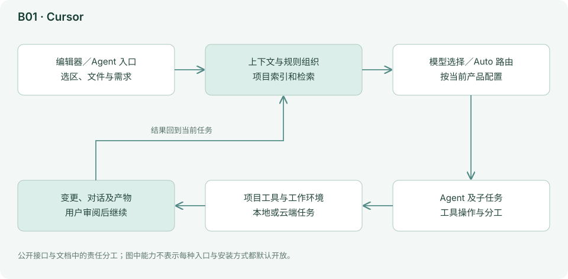

当前产品还扩展了子代理、项目协调和云端工作。应把本地交互式编辑、后台任务和自动化分别评估：它们接触的环境、凭据和可运行时长可能不同。子代理能够减少主对话被探索细节占满的问题，但最终仍要有人检查集成结果。[子代理](https://cursor.com/docs/subagents)

代码索引相当于项目的查找目录：它先帮助找相关材料，再由模型根据本轮任务阅读和行动。索引能减少盲目搜索，但被排除的文件、陈旧内容和隐含业务规则仍可能遗漏。子代理可以承接调查，主代理再整合结果。云端 Agent 则多出独立环境、仓库授权和结果取回过程，所以本地 Agent 跑通并不能证明云端任务也已配置好。

#### 深入一层：编辑器现场、模型适配与专用子代理

Cursor 的公开说明强调，Agent 会围绕支持的模型调整提示和工具；它不是把同一段请求原封不动发给所有模型。编辑器提供当前代码现场，检索补充未知部分，子代理则在自己的上下文中完成较窄的任务。这里的架构图是公开职责拆解，未推断其索引服务或服务端调度的内部实现。

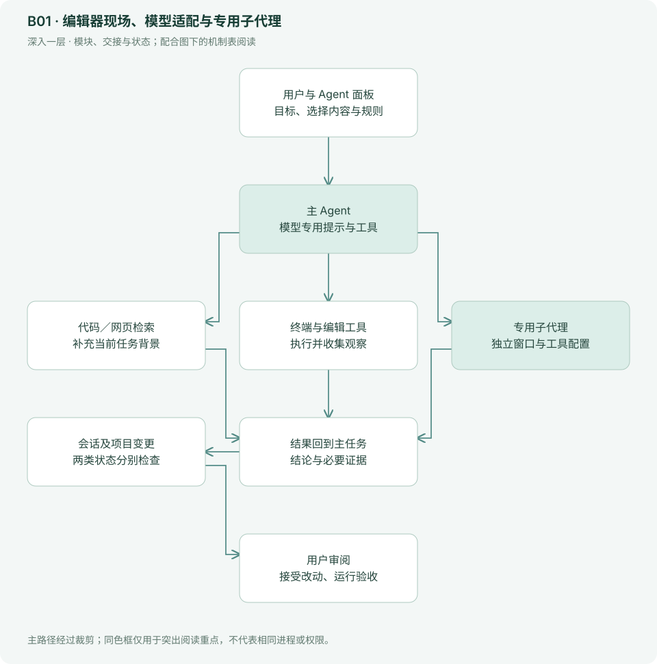

| 模块／交接点 | 怎样工作 | 状态与边界 |
|---|---|---|
| 编辑现场 | 选区、文件与项目规则提供初始上下文 | 当前打开的文件不等于任务涉及的全部代码。 |
| 模型适配 | 模型与提示、工具一起形成工作方式 | 同型号在其他 Harness 上未必表现相同。 |
| 子代理 | 独立上下文处理调查或专门工作 | 减少主窗口负担，但需要准确交接证据。 |

**沿着一次任务看数据怎样走。** 例如改认证流程：主任务掌握需求，检索定位入口，子代理调查测试约束，主任务实施并跑检查。若调查结论缺少文件位置，主任务仍需重新核实；委派节省的是上下文与分工成本，不是免除验收。

**与相近工具的实质差别。** 与纯模型聊天窗口相比，Cursor 的价值来自编辑现场与模型适配；与 Zed 承载外部代理的路线相比，这里许多策略由产品整体决定。

本节细图与机制依据：[cursor-agent](https://cursor.com/docs/agent/overview)、[cursor-subagents](https://cursor.com/docs/subagents)。箭头表示主要信息或控制交接，不表示所有分支必然并行；省略的模块不能视为不存在。

### 能力、状态与边界

| 观察项 | 实际机制／公开能力 | 对使用者意味着什么 |
|---|---|---|
| 即时上下文 | 文件、选区、诊断与项目线索 | 给出具体入口通常比泛泛要求重写项目有效 |
| 项目索引 | 检索相关代码后进入模型上下文 | 用已知答案抽查检索，不把索引视为整仓理解 |
| 交互方式 | 补全、局部编辑与多步 Agent | 按任务尺度选择，减少不必要的长循环 |
| 分工 | 子代理与项目协调等能力 | 独立探索后仍需检查接口和文件冲突 |
| 云端 | 独立任务环境与自动化 | 重新配置依赖、秘密信息与仓库权限 |
| 模型 | Auto／Composer 与可选固定型号 | 比较时记录实际路由、模式和账单规则 |

**把机制放进实际工作。**

编辑器天然拥有即时线索，但这些线索不一定完整。当前文件很容易进入上下文，真正的错误却可能在配置或后端；索引能帮助查找，又可能漏掉排除目录。让代理说明它依据哪些文件作判断，可以发现“读到了很多内容”与“找到了关键证据”的区别。

本地协作适合边做边改需求：用户看到 diff 或预览后立即反馈，代理再修正。云端委托则要求任务说明更加完整，因为当前编辑器里的未提交改动、打开文件和本机服务不会自动成为相同环境。选择后台任务前，应先把隐含背景写进仓库或任务。

Auto 和固定模型解决不同需求。Auto 省配置，但路由变化会影响费用和复现；固定型号便于比较，却要求自己判断什么时候升级。界面、检索、工具与模型共同影响结果，不能用一次 Auto 任务得出的感觉永久评价某个模型。最可靠的比较是同一仓库状态、同类任务和相同验收。

### 从安装到完成第一个任务

1. 安装并打开真实仓库，等待必要的项目初始化；选择当前账户可用的模型或 Auto 路线，确认相关规则生效范围。

2. 先选中一个模块，请代理解释职责与调用关系。用你已知的信息校验它是否找到了正确文件，再补充未写在代码里的业务约束。

3. 修改小区域时用局部编辑；跨文件任务再用 Agent。要求列出改动范围，边看 diff 边反馈，不让无关重构混入功能实现。

4. 让代理运行项目检查，并在你熟悉的预览或调试流程中检查真实行为；前端任务同时测试异常与空状态。

5. 需要离开电脑后继续处理独立任务，再试云端环境。单独验证环境启动、凭据范围和结果取回，最后将补丁放回正常审查流程。

下面是启动命令或操作路线；路径、认证与功能入口请按自己的版本调整。

```text
打开仓库 → 检查规则与索引范围 → 选择模型／Auto
选中相关文件并提出任务 → 审阅修改 → 运行项目检查
云端任务另行确认：仓库、环境脚本、凭据、结果分支。
```

### 典型任务与验收方法

下面是一份**可直接改写使用的试用任务**，属于本报告设计的验收示例，并非已完成的运行测试。

> 这个设置页面需要增加“保存中”和“保存失败”状态。请复用现有组件与请求层，保留原布局，验证快速重复点击、请求失败后重试和成功反馈。

试用重点是交互速度与项目一致性：它是否沿用了已有样式和状态管理，能否根据你的即时反馈收缩修改。不要只看第一张截图；按钮重复提交、错误恢复和键盘操作都可能暴露真实问题。

### 模型搭配、适用方向与取舍

日常可以从内置 Auto／Composer 路线开始，需控制变量时固定当前目录中的 Claude 或 GPT 型号。当前 Auto 还区分成本、平衡、智能等路线，收费与路由不能用早期套餐规则代替。它适合前端迭代、跨文件小中型实现、边写边改；如果要求每个模型、每条系统提示都由自己掌控，开放 Harness 更合适。难度：低中。[模型与计费](https://cursor.com/docs/models)

| 选择路线 | 候选组合 | 怎样决定 |
|---|---|---|
| 减少配置 | Auto／Composer 等内置路线 | 先建立日常编辑基线，记录当前路由与费用规则。 |
| 控制变量 | 选择器中的固定 Claude／GPT 等型号 | 需要比较时固定模型，并保持相同项目与工具。 |
| 复杂任务 | 账户可用的更强模型或档位 | 先判断瓶颈是检索、实现还是云环境，再升级。 |

适合经常边写边调、希望 AI 与编辑器融为一体的人。代价是更依赖产品模型路由与配置体系，云端功能还增加环境边界。若已有非常固定的编辑器习惯，可先比较插件或 ACP 宿主；若强调可修改运行时，则比较开放 CLI。

### 资料依据与继续阅读

[Agent 文档](https://cursor.com/docs/agent/overview)、[子代理](https://cursor.com/docs/subagents)、[模型与计费](https://cursor.com/docs/models)。

完整商业运行时未公开，结构判断以官方可见行为和接口为限。上面的流程建议与取舍是依据这些材料给出的选型判断；具体型号、权限和菜单以实际安装与账户为准。

<a id="b02"></a>

## B02 GitHub Copilot：嵌入代码协作平台的一组代理入口

### 定位与设计理念

Copilot 的补全、IDE Chat／Agent、CLI 和云端编码代理不是同一个执行环境。IDE 代理在开发者附近修改和验证；云端代理围绕 issue、分支、PR 等协作对象工作。选择 Copilot，往往也是选择 GitHub 的协作入口、组织账户和审查流程。[官方功能文档](https://docs.github.com/en/copilot/concepts/agents/cloud-agent/about-cloud-agent)

Copilot 的优势是把 AI 接进已有协作对象：开发者在 IDE 工作，团队通过 issue 表达需求，通过 PR 审阅结果。对于已经使用 GitHub 的组织，账户、代码权限与协作流程的整合往往比另装一套代理更省沟通成本。但它是多个产品入口的集合，必须先选清楚具体是哪一条路线，才能讨论模型、权限和费用。

### 工作原理与架构图

下图依据官方公开接口整理，表示责任分工，不代表已审计闭源内部实现。

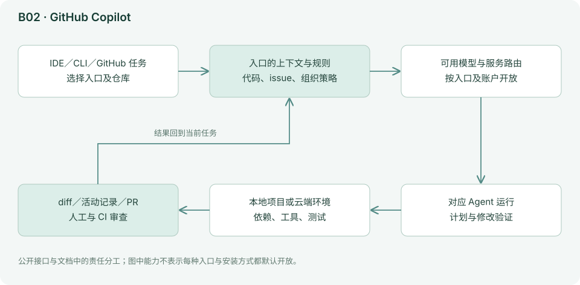

旧 `microsoft/vscode-copilot-chat` 已归档，相关开发迁入 VS Code 主仓库。不能因旧仓库归档就断言 Copilot 停止开发，也不能因 VS Code 开源就声称 GitHub 托管代理的全部服务端已经开源。公开仓库用于核对编辑器侧实现，云端行为以服务文档为准。[旧仓库](https://github.com/microsoft/vscode-copilot-chat)、[VS Code 当前源码](https://github.com/microsoft/vscode)

IDE 代理围绕当前开发环境工作；云端代理则需要从仓库、任务说明和环境配置重新建立上下文。因此，口头说过但没有写进 issue 的背景，远端任务未必知道。PR 提供了清楚的交接点：需求、补丁、CI 与人工评审能放在一起；但 PR 是交付容器，不是质量证明。公开的编辑器侧源码也不能替代云端服务端实现的证据。

#### 深入一层：本地编辑器代理与云端分支任务的交接

Copilot 是产品家族，不能用一张图混同编辑器 Agent 与云端 Agent。这里把更容易被误解的云端路径展开：任务在 GitHub 侧研究、规划并修改分支，用户可先迭代，之后再创建 PR。不同集成入口支持的阶段并不完全相同；本地编辑器任务则作用于开发者环境，不能套用云端执行位置。

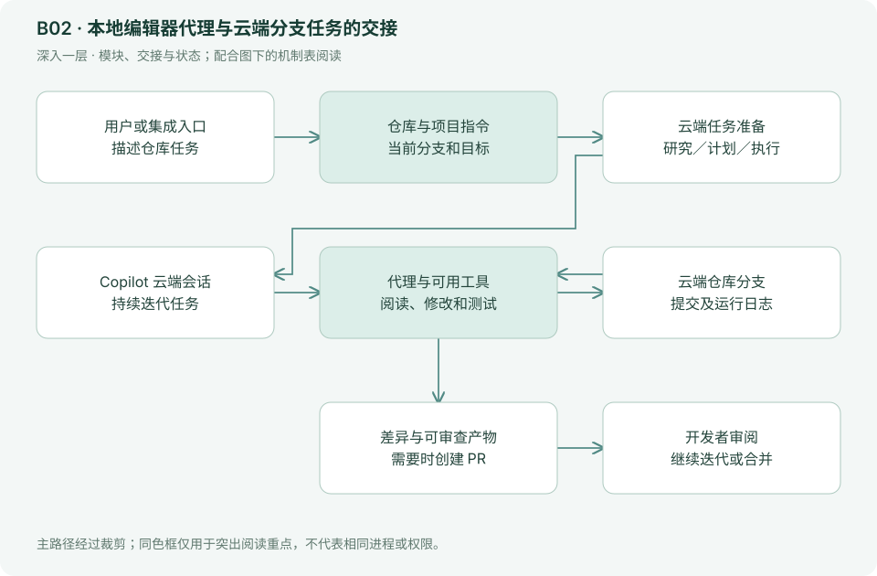

| 模块／交接点 | 怎样工作 | 状态与边界 |
|---|---|---|
| 入口差异 | GitHub 页面与其他集成可提供不同任务步骤 | 不要假定所有入口都支持同样的先研究后建 PR 流程。 |
| 状态载体 | 云端分支、提交和日志承载工作结果 | 聊天总结不是唯一证据，应检查实际 diff。 |
| 交付门槛 | 生成修改、创建 PR 与合并是不同阶段 | 代理完成任务不代表变更已进入主分支。 |

**沿着一次任务看数据怎样走。** 例如让云端代理修一个 issue：先限定仓库与预期行为，审查计划和改动，必要时继续追问，确认后形成 PR。验收要包含运行日志与回归测试，也要检查改动是否只落在目标分支。

**与相近工具的实质差别。** 与本地终端代理相比，云端路线减少占用当前工作区，但依赖远程环境和仓库集成。与 Jules 相比，主要区别应查入口、计划交互与交付契约，而非都叫“云代理”就视为同一种产品。

本节细图与机制依据：[copilot-agent](https://docs.github.com/en/copilot/concepts/agents/coding-agent/about-coding-agent)、[copilot-models](https://docs.github.com/en/copilot/reference/ai-models/supported-models)。箭头表示主要信息或控制交接，不表示所有分支必然并行；省略的模块不能视为不存在。

### 能力、状态与边界

| 观察项 | 实际机制／公开能力 | 对使用者意味着什么 |
|---|---|---|
| 入口差异 | 补全、IDE Agent、CLI 与云端代理 | 先选入口，再查模型和权限，不按品牌一概而论 |
| 协作载体 | issue、分支与 PR | 验收标准放进任务，结果回到正常审查 |
| 组织治理 | 账户、仓库访问与模型可用性 | 个人能选的模型不一定获组织允许 |
| 执行环境 | IDE 附近的本地环境或云端环境 | 云端需独立准备依赖和所需资料 |
| 源码边界 | 编辑器侧实现与闭源托管部分并存 | 旧仓库迁移不能解读成全产品停止 |
| 完成定义 | 任务产物与后续审查分开 | 创建 PR 后仍需测试、审阅和合并决定 |

**把机制放进实际工作。**

团队协作对象本身就是上下文。issue 说明为什么做，分支保存改动，PR 连接审查与 CI。把这些材料写清楚，有助于云端代理独立工作；如果需求只存在于口头沟通，代理就可能根据常见做法补出错误假设。任务发起者需要把关键例外写成明确条件。

IDE 侧公开实现与托管服务是不同证据范围。前者能帮助研究编辑器怎样组织上下文和工具，后者的环境、调度与内部服务只能依据公开文档判断。旧仓库迁移也只是开发位置变化，不能单独证明品牌停止或全部核心已公开。

PR 中的测试结果要回到需求看覆盖范围。构建通过只能证明某类静态或运行检查成功，不能证明新权限和业务边界都正确。代理批量产生 PR 后，审查可能成为瓶颈；选型时应统计每项变更需要多少人工核验，而不是只统计一天创建了多少任务。

### 从安装到完成第一个任务

1. 确认组织政策和订阅，选择你实际会用的入口。先在 IDE 中检查模型目录、工具权限和项目指令，建立基础体验。

2. 用一个有测试的小 bug 验证本地代理，记录它需要哪些隐含背景；把可复用背景整理成仓库说明。

3. 迁到云端前，把需求改写成独立 issue：复现步骤、期望行为、文件范围、测试命令和不应改变的接口都写明。

4. 核对云端环境与仓库访问后再启动任务，跟踪计划与执行结果；遇到环境失败，修正准备步骤，不靠反复重试期待偶然成功。

5. 审阅产出的 PR，检查 diff、CI 和需求对应关系。批量维护从一类成熟任务开始，再扩大到更多仓库。

下面是启动命令或操作路线；路径、认证与功能入口请按自己的版本调整。

```text
适合交给云端代理的 issue 模板：
现象与复现：
期望行为与兼容边界：
涉及模块与已知线索：
环境准备和测试命令：
完成标准与需要人工确认的事项：
```

### 典型任务与验收方法

下面是一份**可直接改写使用的试用任务**，属于本报告设计的验收示例，并非已完成的运行测试。

> 修复文档生成脚本在空目录时报错的问题。issue 中给出最小复现、预期输出和测试入口；代理完成后提交可审阅变更，并解释是否影响现有构建。

看它能否仅凭 issue 与仓库材料独立推进，而不是依赖你在 IDE 中打开的文件。PR 的描述应与真实修改一致，CI 通过后还要检查空目录这个具体需求是否被覆盖。

### 模型搭配、适用方向与取舍

当前支持目录包括多个 GPT、Claude、Gemini 和其他型号，但可用性按产品入口划分，不能把网页目录的并集当成某个按钮的选项。日常选择入口中可用的 Sonnet 5／GPT-5.6 Terra；复杂任务比较更强型号或内置路由。适合现有 GitHub 团队、代码审查、常规维护、从 issue 到 PR 的工作。难度：个人低中；组织治理中。[模型支持矩阵](https://docs.github.com/en/copilot/reference/ai-models/supported-models)

| 选择路线 | 候选组合 | 怎样决定 |
|---|---|---|
| 组织日常 | 该入口与组织允许的模型 | IDE、CLI、云端目录分别核对，先遵守已有团队配置。 |
| 困难工程 | 目录内较强 GPT／Claude 等 | 任务与环境保持一致再比较，不能推定所有入口都支持新型号。 |
| 异步维护 | 云端代理原生路由 | 任务标准化与 CI 验收往往比自由更换模型更重要。 |

适合已经围绕 GitHub 组织工作的团队，尤其是标准化维护与异步修复。高度整合能降低交接成本，也会把部分选择绑定到组织政策和平台。需要自由控制执行环境可比较 OpenHands；需要更即时的编辑器互动可比较 Cursor 或 Cline。

### 资料依据与继续阅读

[官方功能文档](https://docs.github.com/en/copilot/concepts/agents/cloud-agent/about-cloud-agent)、[旧仓库](https://github.com/microsoft/vscode-copilot-chat)、[VS Code 当前源码](https://github.com/microsoft/vscode)、[模型支持矩阵](https://docs.github.com/en/copilot/reference/ai-models/supported-models)。

完整商业运行时未公开，结构判断以官方可见行为和接口为限。上面的流程建议与取舍是依据这些材料给出的选型判断；具体型号、权限和菜单以实际安装与账户为准。

<a id="b03"></a>

## B03 Devin／Devin Desktop：从编辑器协作延伸到远程交付

### 定位与设计理念

旧 Windsurf 文档已迁入 Devin Desktop 文档体系，Cascade 仍是需要辨认的本地代理体验；它与 Devin 云端任务不能混为一谈。报告按产品家族合并说明，避免将迁移前后的名字重复计成两个完全独立竞品。[Cascade 文档](https://docs.devin.ai/desktop/cascade/cascade.md)

Devin 产品家族同时覆盖本地开发交互与远程任务。远程路线的核心价值是把一份描述足够完整的工作交出去，由服务提供环境和持续执行，再回来检查产物。它更像任务委托，而不是随打随出的补全。能否成功很大程度取决于任务边界和环境准备，不能只把表现归因于一个模型名字。

### 工作原理与架构图

下图依据官方公开接口整理，表示责任分工，不代表已审计闭源内部实现。

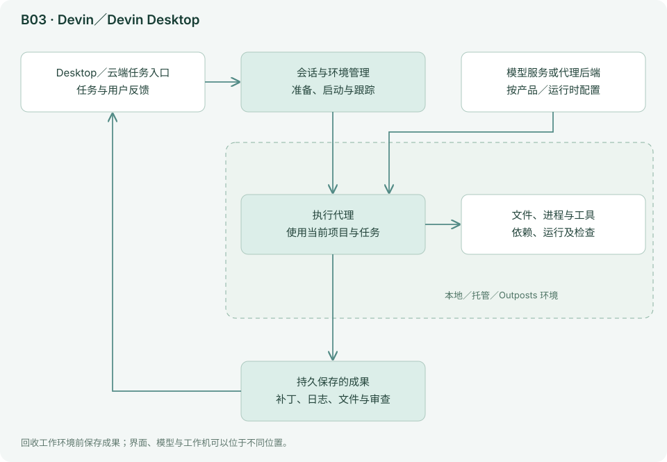

本地 Cascade 围绕编辑器上下文、规划、代码修改和检查点工作；远程 Devin 更强调把仓库、执行环境、任务和协作交付组织起来。需要企业自有基础设施时，还有 Outposts 路线。其架构差别主要在“工作机和任务生命周期由谁管理”，而不只在模型名字。[Devin 入门](https://docs.devin.ai/get-started/first-run.md)、[Outposts](https://docs.devin.ai/cloud/outposts/overview.md)

本地模式可以利用开发者正在使用的环境，远端则要自己拉代码和准备依赖。项目索引或 DeepWiki 帮助代理找背景，却不能补出从未记录的业务决策。Outposts 又把环境控制转向组织管理的基础设施；这提升环境可控性，也把运维责任带回团队。比较时应把入口、运行位置和模型路由三者同时记下来。

#### 深入一层：远程工作机、会话控制与知识材料

Devin 路线把一台能够开发的软件环境交给代理，工作台负责把它的操作过程呈现给人。代码知识材料帮助定位和理解，但不替代运行环境中的真实文件。Devin Desktop、旧 Windsurf 路线与云端 Devin 的入口和交付方式需要分别判断；图只展开远程任务路径。

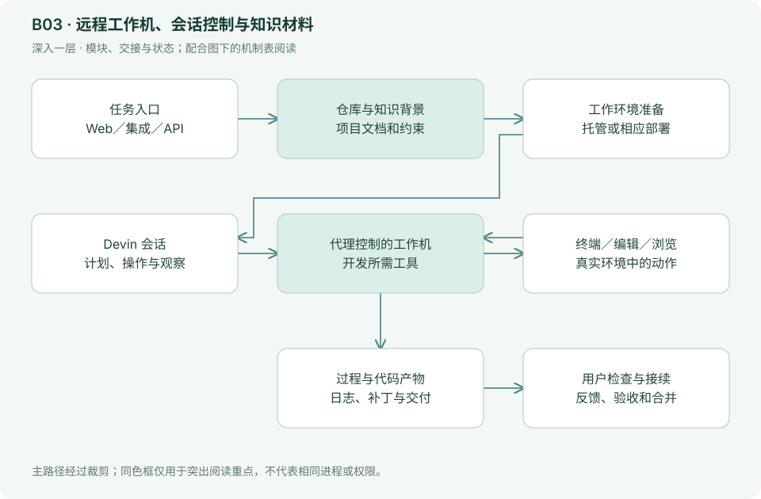

| 模块／交接点 | 怎样工作 | 状态与边界 |
|---|---|---|
| 环境状态 | 依赖、进程和文件在工作环境内持续变化 | 恢复聊天不保证缺失依赖或失效凭据自动恢复。 |
| 任务状态 | 计划、观察、暂停与接续围绕会话组织 | 远程任务可能在浏览器关闭后继续，须看实际部署契约。 |
| 知识背景 | 代码知识与仓库资料辅助理解 | 知识索引与当前分支可能不同步，关键结论应回到代码。 |

**沿着一次任务看数据怎样走。** 例如委派版本升级：准备仓库与升级约束，代理在工作机上改依赖并运行检查。若构建因私有包认证失败，应先解决环境问题；让模型重新规划无法凭空补齐访问条件。

**与相近工具的实质差别。** 与编辑器里的短任务助手相比，远程工作机承载更多环境生命周期。与 OpenHands 相比，Devin 商业运行时的可见证据较少，因此不能画成已经审计过的内部服务图。

本节细图与机制依据：[devin-index](https://docs.devin.ai/llms.txt)、[devin-index-a-repository](https://docs.devin.ai/onboard-devin/index-repo.md)、[devin-devin-outposts-self-hosted-infrastructure](https://docs.devin.ai/cloud/outposts/overview.md)。箭头表示主要信息或控制交接，不表示所有分支必然并行；省略的模块不能视为不存在。

### 能力、状态与边界

| 观察项 | 实际机制／公开能力 | 对使用者意味着什么 |
|---|---|---|
| 本地与远端 | Desktop 交互和异步任务 | 即时协作与完整委托适合不同任务 |
| 代码知识 | 项目索引、知识材料及相关服务 | 先用已知问题验证理解，别把文档生成视为事实核验 |
| 环境 | 托管与 Outposts 等路线 | 自管环境需要安装、网络和资源维护 |
| 长任务 | 会话推进与任务产物交接 | 需求、进度和验收必须能独立理解 |
| 模型 | Desktop／CLI 选择与云端路由有差异 | 不推定所有入口都支持任意 BYOK |
| 交付 | 代码、分支、执行结果 | 任务完成后仍进入团队审查与测试 |

**把机制放进实际工作。**

远程委托首先是把项目变成可独立启动的工作环境。依赖、测试数据、内部服务和权限缺一项，代理都可能停在准备阶段。将环境问题与需求问题分开记录，能够判断是否应该改善安装脚本、补充业务背景，还是换更强模型。

项目知识与索引帮助找到线索，但对关键接口仍需回到最新代码。自动生成的说明可能省去新人探索时间，也可能保存过时结构；迁移任务尤其应要求列出真实调用方和兼容依据。任务跨度越长，越需要阶段成果和明确停点，避免一次性大改后才发现方向错误。

组织自管 Outposts 一类环境，会把部分平台依赖转成自己的基础设施责任。网络、凭据和数据范围更可控，同时也需要容量、升级与故障恢复。比较托管与自管不应只看月费，还要计入环境准备和运维的人力；这与本地 Desktop 的即时使用是不同成本结构。

### 从安装到完成第一个任务

1. 先决定自己需要本地协作还是远程委托，选定一个入口；检查可用模型、仓库授权和账户费用。

2. 为远程任务准备可重复的环境步骤，让它在未改代码前跑通现有检查。涉及内部服务时明确访问方式和可替代测试。

3. 给出独立完整的任务，要求先确认理解与关键接口；不要把只存在于聊天前文的背景留作隐含条件。

4. 中途查看真实产物、日志和阻塞原因；必要时补充信息，而不是频繁要求笼统“继续努力”。

5. 完成后核对需求、diff 与测试，整理哪些信息缺失导致返工。相似任务重复成功后，再尝试并行委托或组织自管环境。

下面是启动命令或操作路线；路径、认证与功能入口请按自己的版本调整。

```text
远程任务交接包：需求说明＋固定仓库状态＋环境准备
＋可运行检查＋接口约束＋期望产物
回收时核对：修改范围、测试证据、遗留问题、运行成本。
```

### 典型任务与验收方法

下面是一份**可直接改写使用的试用任务**，属于本报告设计的验收示例，并非已完成的运行测试。

> 将一个内部 SDK 从旧接口迁到新接口，保持公开方法签名。先处理一个模块，交付兼容性说明与测试；验证通过后再扩展到其余模块。

迁移试点能揭示环境与任务委托成本。若大部分时间花在缺失凭据或理解未写出的接口约定，先改善交接材料。检查是否真的保持兼容，而不是只把新接口调用接通。

### 模型搭配、适用方向与取舍

Desktop／CLI 以当前模型选择器为准，可比较其支持的 Claude、GPT、Gemini、Cognition 及开放模型；云端原生任务则优先使用产品调优的默认组合，不臆造无限 BYOK 能力。适合团队中长任务、异步修复、迁移和远程交付；即兴的小修改未必值得环境启动与任务交接成本。难度：本地低中；远程部署中高。[CLI 模型说明](https://docs.devin.ai/cli/models.md)

| 选择路线 | 候选组合 | 怎样决定 |
|---|---|---|
| 本地开发 | Desktop／CLI 选择器内模型 | 从当前可用 Claude、GPT 等路线试实际项目。 |
| 远程交付 | Devin 原生服务组合 | 环境、任务交接和产物验证与模型一起评价。 |
| 控制成本 | 缩小试点与分批迁移 | 不假定云端可任意 BYOK；先减少环境失败和无效委托。 |

适合能拆成独立交付件的中长任务、异步维护和批量迁移。小改动可能被环境启动与交接成本抵消。与 Jules 比较任务控制和环境需求，与 OpenHands 比较可控性和自管成本，而非只比较宣传中的自治时长。

### 资料依据与继续阅读

[Cascade 文档](https://docs.devin.ai/desktop/cascade/cascade.md)、[Devin 入门](https://docs.devin.ai/get-started/first-run.md)、[Outposts](https://docs.devin.ai/cloud/outposts/overview.md)、[CLI 模型说明](https://docs.devin.ai/cli/models.md)。

完整商业运行时未公开，结构判断以官方可见行为和接口为限。上面的流程建议与取舍是依据这些材料给出的选型判断；具体型号、权限和菜单以实际安装与账户为准。

<a id="b04"></a>

## B04 Kiro：让需求、设计和任务清单成为持续上下文

### 定位与设计理念

Kiro 的辨识度在于 Spec 工作方式：先把需求、设计与实施任务写成可查看、可修改的材料，再让代理推进。它适合需求需要解释、多人需要对齐、实现时间跨度较长的项目。Spec 的价值是明确共识，不是生成文档越多越好。[Specs](https://kiro.dev/docs/specs/)

Kiro 将需求、设计和任务列表视为开发过程中持续使用的材料。模型不只是读一条临时消息，而是围绕可修订的规范推进。对业务规则多、需要跨人交接的功能，这可以减少来回解释；对已经完全明确的一行修复，则可能增加不必要的文档成本。关键在于规范能否帮助做决定，而不是规范写得多像正式文件。

### 工作原理与架构图

下图依据官方公开接口整理，表示责任分工，不代表已审计闭源内部实现。

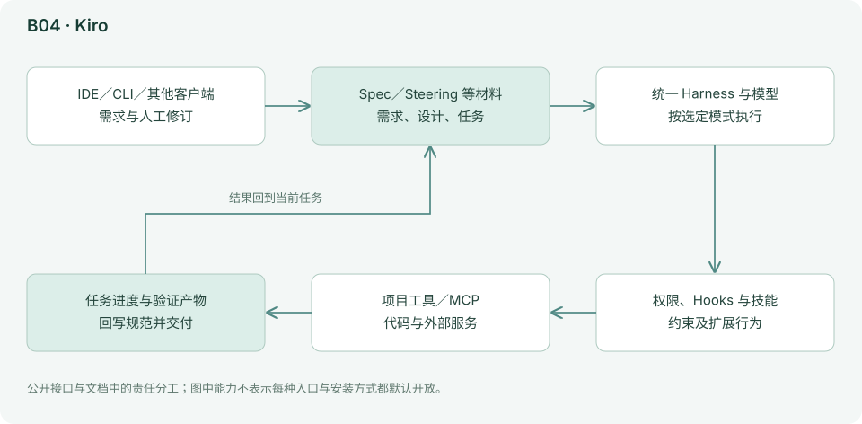

官方说明将其描述为跨 IDE、CLI、Web、移动入口的统一独立进程 Harness，通过 ACP 及相关扩展连接客户端。规则、Hooks、MCP、Skills 等围绕同一个核心配置，但功能在各入口仍有差异。“同一核心”意味着复用执行责任，不意味着所有界面功能完全相等。[工作原理](https://kiro.dev/docs/how-kiro-works/)

需求说明应回答用户要什么，设计说明回答准备用什么结构实现，任务列表回答当前先做哪一小步。三者形成可查看的交接材料，但它们也可能过时：代码改了、业务条件变了，就需要同步修订。统一进程 Harness 和 ACP 解决跨入口复用；Spec 解决工作方法，两者是不同层面的设计，不能把用了同一核心理解成所有客户端功能完全一样。

#### 深入一层：共享 Harness、界面工具与配置作用域

Kiro 官方把多入口描述为共享同一 Harness，但执行地点随入口变化。IDE 还可以用编辑器自身 API 替代部分内置文件操作，说明界面并非完全没有执行职责。项目级配置跟随仓库，用户级配置跟随本机账户，工作区信任另存于机器侧；三者分开，是为了避免仓库自行给自己授予信任。

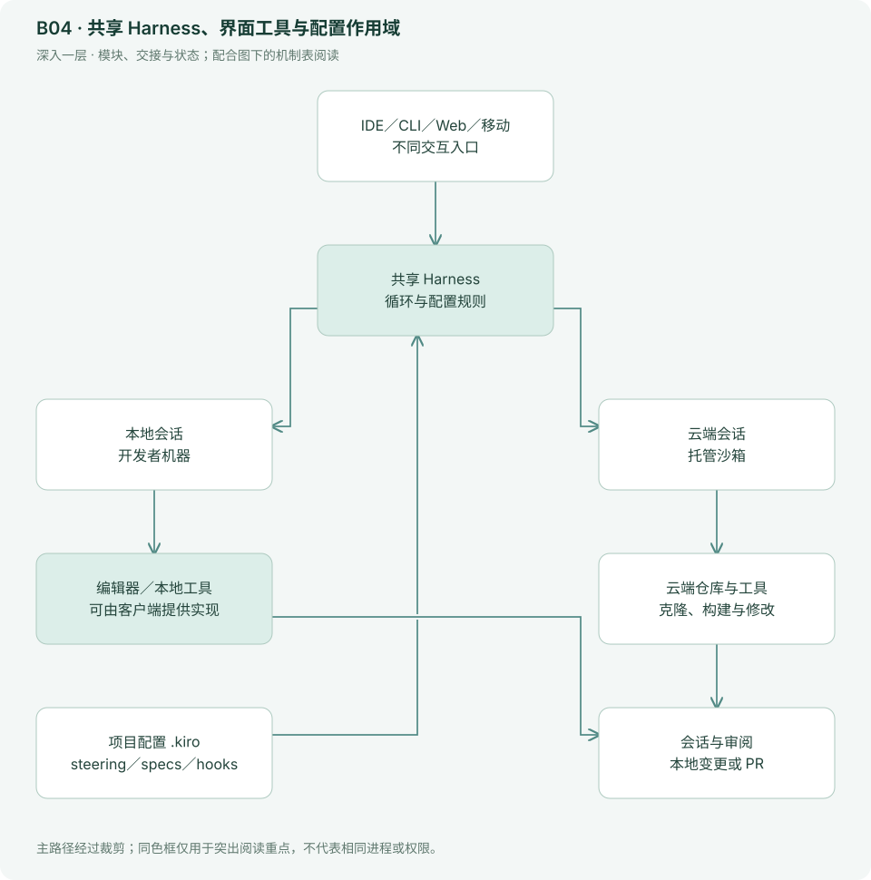

| 模块／交接点 | 怎样工作 | 状态与边界 |
|---|---|---|
| 项目配置 | 规则、规格、代理和 Hooks 可随仓库分发 | 团队共享行为材料，不等于共享每个人的授权。 |
| 客户端工具 | IDE 可贡献编辑器原生能力 | 同一循环在不同入口可能调用不同工具实现。 |
| 本地与云端 | 相同逻辑在不同机器执行 | 依赖、凭据、网络与交付方式需要重新确认。 |

**沿着一次任务看数据怎样走。** 例如按规格增加一个接口：项目中的规格与设计约束引导实施；本地会话改当前工作区，云端会话则在克隆环境中完成并交付。迁移入口时，应核对项目配置是否带上、所需依赖是否存在，而非只检查对话是否可见。

**与相近工具的实质差别。** 与以自由聊天为中心的工具相比，Kiro 把规格与共享配置放在显眼位置；与 ACP 宿主相比，它公开强调的是共享自身 Harness，而非任意外部代理都由界面统一接管。

本节细图与机制依据：[kiro-how](https://kiro.dev/docs/how-kiro-works/)、[kiro-specs](https://kiro.dev/docs/specs/)。箭头表示主要信息或控制交接，不表示所有分支必然并行；省略的模块不能视为不存在。

### 能力、状态与边界

| 观察项 | 实际机制／公开能力 | 对使用者意味着什么 |
|---|---|---|
| 需求材料 | Spec 将需求、设计与任务显式保存 | 用户需删掉空话，补上例外和验收 |
| 长期规则 | Steering 等持续背景 | 区分全项目约定与一次任务进度 |
| 跨入口 | 统一核心与 ACP 等连接方式 | 逐入口确认支持程度和可见功能 |
| 扩展 | Hooks、MCP、Skills 等 | 确定性触发与模型判断的方法要分清 |
| 模型 | Auto 及当前可选型号 | 档位变化后用同一规范测试结果 |
| 维护 | 规范与代码需要共同演进 | 完成后清除过时任务，记录真实设计差异 |

**把机制放进实际工作。**

规范可以减少歧义，也可能把模型猜测固化成看似正式的文档。审核时先找无法由已有材料确定的业务决定，如取消条件、权限与默认值，把它们交给真正了解业务的人确认。用规范约束实施的前提，是规范本身值得信任。

需求、设计和任务应保持对应关系。某项需求没有实施任务，容易被遗漏；某项任务找不到需求依据，可能是无关扩展。完成后将实际实现和设计对照，记录合理偏差，才能让这些材料继续用于维护，而不是交付后立即过时。

Hooks 适合在确定时机执行检查，Skills 适合复用需理解的方法，MCP 适合连接外部能力。这些扩展不能替代需求判断。简单修复可以直接完成；只有协调和返工成本值得时，再使用完整 Spec 流程。评价 Kiro 时，应把规范节约的沟通和维护规范的时间一起计算。

### 从安装到完成第一个任务

1. 打开一个已有项目，确认构建和测试能运行；选择一个真正需要业务说明的小功能，从当前产品入口创建相应任务。

2. 让代理形成需求材料，逐条检查对象、输入、输出、边界和异常；不懂的业务点由人决定，不让模型默默补成假设。

3. 审阅设计，确认数据结构、接口和依赖符合现有项目。将大任务拆成能独立验证的小步，避免一项任务涵盖整个系统。

4. 逐步实施并核对产物；需求发生变化时先更新规范，再继续改代码，减少前后解释不一致。

5. 收尾时对照验收标准检查，更新实际采用的设计和遗留事项。简单后续修复直接对话即可，不必强迫所有任务重走完整规范流程。

下面是启动命令或操作路线；路径、认证与功能入口请按自己的版本调整。

```text
需求示例：用户可以撤销尚未发货的订单。
必须明确：谁可撤销、截止状态、重复请求、库存回补、失败提示。
设计确认后拆任务：状态规则 → 接口 → 界面 → 验收。
每项任务都对应可观察的结果。
```

### 典型任务与验收方法

下面是一份**可直接改写使用的试用任务**，属于本报告设计的验收示例，并非已完成的运行测试。

> 增加订单撤销功能。先整理需求与异常场景，明确库存回补和幂等规则，再设计接口与状态变化；逐步实现并对照规范验收。

最有辨识度的指标是规范能否减少返工。检查“重复撤销不能重复回补库存”这类关键规则是否同时出现在需求、实现和测试里。文档很完整但代码漏了约束，说明流程尚未闭合。

### 模型搭配、适用方向与取舍

当前 Kiro 已提供多个 GPT、Claude 和其他模型，并非只支持某一个旧 Claude 版本。一般从 Auto 或可用的 Sonnet 5／GPT-5.6 Terra 开始；复杂规范与实现比较更强档位。预览模型受地区与组织治理约束。适合中型功能、正式需求开发、跨人协作、验收明确的长期改造。难度：低中；高质量 Spec 写作需要业务判断。[模型矩阵](https://kiro.dev/docs/models/)

| 选择路线 | 候选组合 | 怎样决定 |
|---|---|---|
| 规范与日常实现 | Auto／可用 Sonnet 5 或 Terra | 用需求、设计与实现一致性验收。 |
| 复杂设计 | 当前可用较强 GPT／Claude | 先补全业务决策，再比较架构与边界推理。 |
| 简单后续任务 | 较快档位或直接对话 | 保持既有规范，避免每次重建长文档和全套流程。 |

适合需求需要讨论、多人需要共识、中等以上复杂度的功能。代价是规范维护与前期思考，过度使用会拖慢简单任务。与直接执行型 CLI 比较时，应把减少的返工和增加的文档时间一起计入，而非只看第一份代码多快生成。

### 资料依据与继续阅读

[Specs](https://kiro.dev/docs/specs/)、[工作原理](https://kiro.dev/docs/how-kiro-works/)、[模型矩阵](https://kiro.dev/docs/models/)。

完整商业运行时未公开，结构判断以官方可见行为和接口为限。上面的流程建议与取舍是依据这些材料给出的选型判断；具体型号、权限和菜单以实际安装与账户为准。

<a id="b05"></a>

## B05 JetBrains Junie：让代理使用 IDE 已经理解的代码结构

### 定位与设计理念

Junie 的差异化在 JetBrains IDE 的代码理解能力：项目、符号、导航、诊断和运行配置已经存在，代理可以借此工作，而不必完全依赖文本搜索。当前产品还包含 CLI、CI 和远程监控等入口，已经不是只能在 IDE 中调用单一模型的小功能。[官方产品页](https://junie.jetbrains.com/)

Junie 利用 JetBrains IDE 已经建立的项目理解：符号、引用、诊断与运行配置能为代理提供比纯文本更有结构的入口。对于依赖 IDE 的大型 Java、Kotlin 或 Python 项目，沿用这些能力可以减少重新建立工作环境的成本。前提是项目本身已经正确加载；错误的 SDK 或构建配置不会因为加了模型就自动消失。

### 工作原理与架构图

下图依据官方公开接口整理，表示责任分工，不代表已审计闭源内部实现。

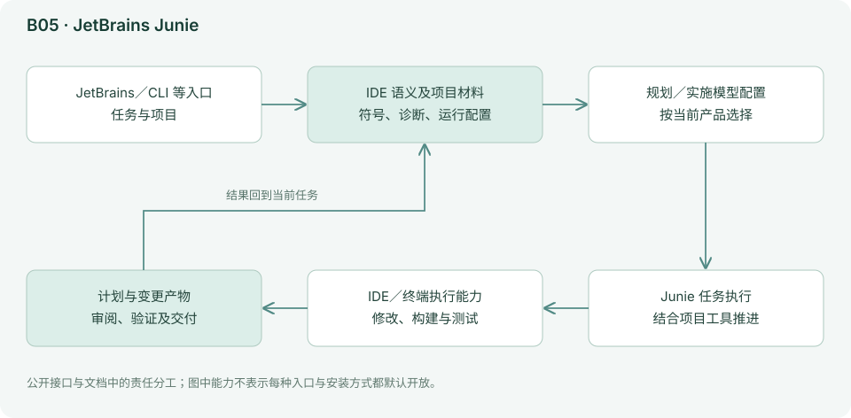

计划阶段可以形成可编辑、可提交的需求／设计／交付材料；实施阶段可用另一档模型。其价值是让“为什么这样改”保存在项目中，同时使用 IDE 的已有工具验证结果。需要注意，宣传中的基准成绩属于厂商材料，本报告没有据此宣布它普遍优于其他代理。

文本搜索擅长找字符串，IDE 的语义能力则可以帮助区分同名符号、调用与类型关系。代理因此有机会做更精确的定位，但是否正确仍要看实际操作与补丁。规划和实施可以使用不同模型，是把成本投入与职责分开的一种方法；如果规划中的接口约定没有进入实施上下文，再强的规划模型也无法保证最终一致。

#### 深入一层：计划、IDE 项目理解与开发者检查点

Junie 的公开产品流程强调先整理需求、设计和交付阶段，再进行代码工作。理解它时要把 IDE 提供的项目现场、代理的任务判断以及用户检查点分开：代码分析帮助代理定位，计划帮助人确认方向，实际正确性仍由修改和验证结果决定。闭源内部如何建立索引与安排模型请求并未在此得到源码证明。

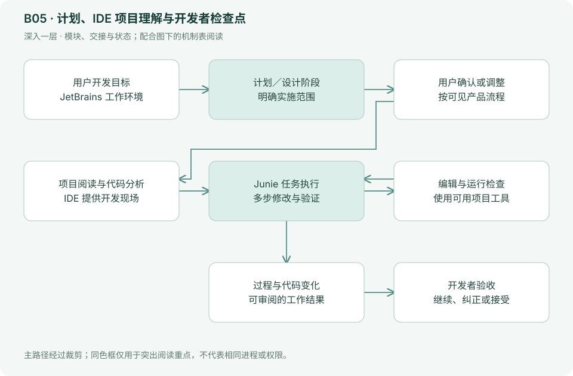

| 模块／交接点 | 怎样工作 | 状态与边界 |
|---|---|---|
| 计划材料 | 把目标转为可检查的实施路径 | 计划合理不代表生成代码已经正确。 |
| IDE 现场 | 项目结构、编辑和运行工具提供执行背景 | 能力与具体 IDE、版本和配置有关。 |
| 用户接续 | 审阅与反馈影响后续任务 | 不要把一键执行理解成所有动作无需检查。 |

**沿着一次任务看数据怎样走。** 例如给服务增加字段校验：先确认校验位置与兼容要求，再在 IDE 中定位实现，修改并运行相关测试。若计划与现有项目结构不符，应在实施前纠正背景；若测试配置失败，则需要单独处理环境。

**与相近工具的实质差别。** 与终端代理相比，Junie 直接服务于现有 IDE 工作方式；与规格文件驱动的路线相比，是否把计划长期保存为项目资产，需要依具体产品功能判断。

本节细图与机制依据：[junie-home](https://www.jetbrains.com/junie/)。箭头表示主要信息或控制交接，不表示所有分支必然并行；省略的模块不能视为不存在。

### 能力、状态与边界

| 观察项 | 实际机制／公开能力 | 对使用者意味着什么 |
|---|---|---|
| 项目理解 | IDE 的导航、符号、诊断与运行配置 | 先确认项目索引与构建正确 |
| 规划材料 | 可编辑、可保留的设计与交付说明 | 计划需要具体到接口和兼容要求 |
| 实施 | 在既有开发环境修改并验证 | 代理用的运行配置应与人工一致 |
| 入口 | IDE 之外还有 CLI／CI 等路线 | 不要假定所有入口具有同样语义能力 |
| 模型 | 当前产品提供 BYOK／本地等配置路线 | 部署路线和具体型号仍需账户与版本核对 |
| 成本 | 规划和实施可分配不同能力 | 以整项任务及返工衡量，不能只看实施模型便宜 |

**把机制放进实际工作。**

IDE 语义能力只有在项目正确加载时才有价值。错误 SDK、缺失模块或未解析依赖会使导航与诊断不完整，代理可能误判引用关系。开始试用前人工跑通基础检查，能够把环境缺陷与代理能力分开。

大型重构应先比较符号关系，再做小批修改。纯字符串替换可能误伤同名变量，语义导航则有助于区分不同对象；但代理是否真正采用正确工具仍要看实际结果。要求它列出受影响调用方和兼容条件，比笼统说“使用 IDE 能力”更容易验收。

规划与实施用不同模型时，交接材料必须可独立理解。架构理由、接口、异常条件与不可改变行为都应进入实施任务，不能只留一句“按计划做”。如果更便宜的实施模型因上下文不足反复返工，分工并未真正节约。模型组合应根据最终可审查补丁与总时间决定。

### 从安装到完成第一个任务

1. 在日常使用的 JetBrains 项目中启用 Junie，先修好 SDK、依赖和运行配置；人工运行一次原有测试建立基线。

2. 给出一个模块级任务，让它说明将使用哪些项目线索与检查；补入隐藏业务约定和不可变接口。

3. 较大任务先审阅计划材料，特别检查类职责、调用方和迁移顺序。选择当前支持的规划与实施模型组合。

4. 实施后在 IDE 查看真实 diff、诊断和测试；确认不是通过削弱断言、跳过测试或改运行配置掩盖问题。

5. 同类任务稳定后再考虑 CLI／CI 或本地模型路线；重新验证环境与模型能力，而不把 IDE 试用结论直接照搬。

下面是启动命令或操作路线；路径、认证与功能入口请按自己的版本调整。

```text
IDE 项目检查：SDK／解释器正确 → 依赖可解析
→ 原有运行配置可用 → 测试基线可重现
再让 Junie：分析符号与调用方 → 修改 → 用同一配置验证。
```

### 典型任务与验收方法

下面是一份**可直接改写使用的试用任务**，属于本报告设计的验收示例，并非已完成的运行测试。

> 将这个服务的一个旧数据访问接口迁移到新接口，保持调用方行为。请查清所有引用，分批改动，并用现有运行配置执行相关测试。

重点观察语义导航是否帮助找齐真实调用方，以及是否误改同名但无关的接口。大型项目还要区分编译成功与业务测试通过；如果只有某个 IDE 缓存状态下成功，应重新检查环境。

### 模型搭配、适用方向与取舍

官方当前提供 BYOK 和本地模型支持。建议从可选的强编程云端模型开始，复杂规划用较强档位，简单实施再比较较快档位；具体型号以当前模型菜单验证。适合 JVM、复杂 IDE 项目、框架升级和已有 JetBrains 工作习惯的人。难度：低中。其优势依赖项目在 IDE 中被正确加载，项目配置损坏时不能靠模型补救。

| 选择路线 | 候选组合 | 怎样决定 |
|---|---|---|
| IDE 基线 | 当前菜单中的强编程云模型 | 优先检验语义导航、修改与运行配置协同。 |
| 规划／实施分工 | 规划较强、实施经济档 | 检查接口交接及总返工，不能只节省实施调用。 |
| BYOK／本地 | 当前版本明确支持的路线 | 独立验收服务端模板、延迟和多轮工具能力。 |

适合已有 JetBrains 工作习惯和复杂 IDE 项目的团队。优势来自环境整合，换成不熟悉或不支持的项目体系后未必同样明显。与 Cline、Cursor 比较时，先评估是否值得迁移编辑器；与 CLI 比较时，看语义工具带来的收益能否抵消环境依赖。

### 资料依据与继续阅读

[官方产品页](https://junie.jetbrains.com/)。

完整商业运行时未公开，结构判断以官方可见行为和接口为限。上面的流程建议与取舍是依据这些材料给出的选型判断；具体型号、权限和菜单以实际安装与账户为准。

<a id="b06"></a>

## B06 Zed：编辑器可以是代理的宿主，不必包办代理的全部能力

### 定位与设计理念

Zed 是开放的高性能编辑器，同时提供自有 Agent 和 ACP 外部代理接入。它最有启发性的设计是将编辑器与代理运行时分开：用户可以喜欢 Zed 的交互，却选择 Codex、Claude、OpenCode、Pi 等代理执行任务。[项目](https://github.com/zed-industries/zed/blob/16c9aa7ea6d897a8044d9501cde1b295256722f2/README.md)、[AI 概览](https://zed.dev/docs/ai/overview)

Zed 把编辑器与代理明确分开。用户可以保留一个轻快的编辑器，选择内置 Agent，也可以把任务交给外部完整代理。这样，喜欢某个界面与喜欢某种执行方式不必成为同一个决定。开放协议降低了入口替换成本，但不会统一所有后端的模型、工具权限和收费方式。

### 工作原理与架构图

下图结合所引源码与文档，画出本工具的主要责任分工；为便于理解，省略次要模块与错误分支。

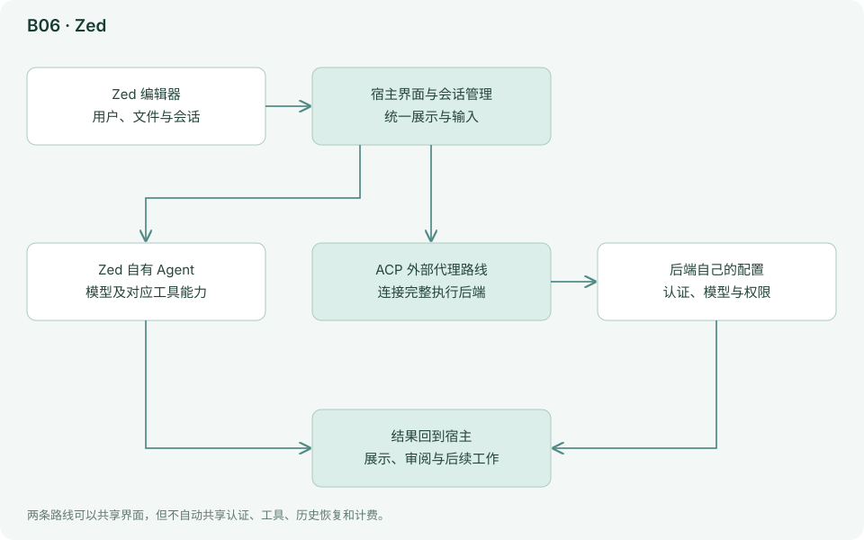

外部代理通常拥有自己的认证、模型选择、工具和配置；Zed 展示会话和交互。给 Zed 自有模型入口填了 API Key，并不自动意味着外部 Codex 或 Claude 也完成了相应认证。它们的费用、数据处理和权限仍要看各自运行时。[外部代理文档](https://github.com/zed-industries/zed/blob/16c9aa7ea6d897a8044d9501cde1b295256722f2/docs/src/ai/external-agents.md)

选择内置 Agent 时，Zed 负责组织较多代理行为；选择 ACP 时，Zed 更像客户端，把会话输入、权限交互和更新连到外部进程。这个差别会影响排错：外部模型认证失败，要检查外部代理配置；编辑器显示异常，则可能是连接或展示问题。统一面板能够减少学习入口的成本，却不能保证不同代理的历史、命令和能力一一对应。

#### 深入一层：宿主编辑器与外部代理之间的 ACP 边界

Zed 承载外部 Agent 时，ACP 是编辑器和独立代理之间的通信协议。Zed 管线程界面，外部代理通常管自己的运行时、登录、模型和工具。另一条 Zed 自身模型路线有自己的配置；在其中填入 API Key，并不自动完成外部 Claude、Codex 或 Cursor 的认证。

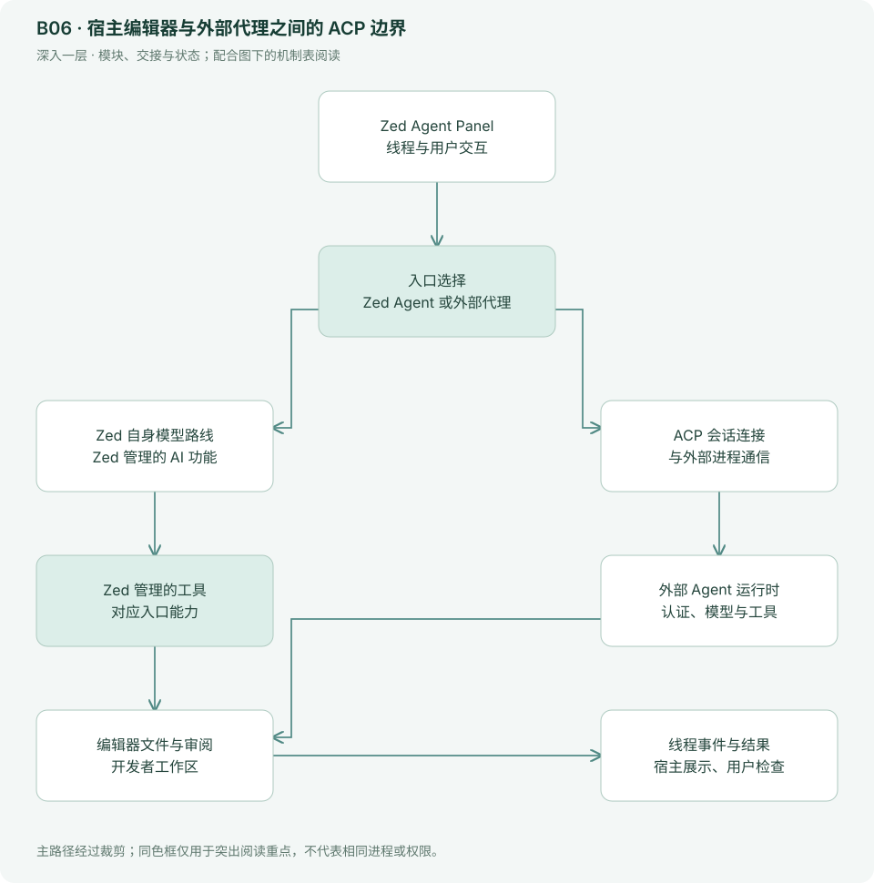

| 模块／交接点 | 怎样工作 | 状态与边界 |
|---|---|---|
| 宿主界面 | 展示线程、消息和编辑结果 | 统一界面不等于统一计费、数据留存或权限实现。 |
| ACP 连接 | 把任务与事件传给代理进程 | 协议兼容要连同工具和会话恢复一起验证。 |
| 外部运行时 | 拥有其原生配置及 Provider 关系 | 切换代理可能改变工具语义与账单归属。 |

**沿着一次任务看数据怎样走。** 例如在 Zed 内使用 Codex：从外部代理入口启动并按其流程登录，随后由 Codex 的运行时处理任务；Zed 呈现交互与变更。排错时先判断是编辑器连接失败，还是代理认证、模型调用或工具执行失败。

**与相近工具的实质差别。** 与自带完整代理策略的 IDE 相比，Zed 更明确地保留宿主与外部代理边界。与 CodeCompanion 的双路线相似，但原生界面与协议集成细节仍不同。

本节细图与机制依据：[external-agents.md](https://github.com/zed-industries/zed/blob/16c9aa7ea6d897a8044d9501cde1b295256722f2/docs/src/ai/external-agents.md)。箭头表示主要信息或控制交接，不表示所有分支必然并行；省略的模块不能视为不存在。

### 能力、状态与边界

| 观察项 | 实际机制／公开能力 | 对使用者意味着什么 |
|---|---|---|
| 两条路线 | 内置 Agent 与 ACP 外部代理 | 试用时明确当前谁负责执行循环 |
| 上下文 | 编辑器项目线索与代理自身规则 | 检查文件选择怎样进入外部会话 |
| 认证 | 内置模型与外部代理可分开管理 | 给 Zed 配 Key 不自动登录外部代理 |
| 权限 | 客户端呈现交互，后端有自身执行边界 | 确认远端／本机执行位置和实际授权 |
| 模型选择 | 取决于所选运行时 | 组合应写成 Zed＋代理＋模型 |
| 迁移 | 统一入口有助于比较后端 | 历史恢复与特殊命令仍须逐个验证 |

**把机制放进实际工作。**

ACP 将交互与执行分开，但双方仍需正确协商能力。客户端能展示的命令、附件或审批，与代理实际支持的内容可能不同。不能因为在同一面板看到多个后端，就推定每项按钮在它们之间语义相同；应按具体功能试用。

遇到问题时可以先在外部代理自身入口重现。若独立运行也失败，检查代理认证、模型和工具；独立运行正常而编辑器中失败，再检查启动命令、目录与协议连接。这种分层排错，比同时重装编辑器和更换模型更有效。

统一编辑器能保留文件浏览、快捷键和审阅习惯，降低替换代理的成本；历史、规则和权限仍可能绑定后端。切换前把关键进度落成可读材料，再由新代理核对真实文件。它降低的是一部分绑定，而不是让整套执行状态随时无损搬家。

### 从安装到完成第一个任务

1. 安装 Zed 并打开项目，先选择内置 Agent 或一款 ACP 代理，不同时更换两条路线。

2. 内置路线配置模型；外部路线按 Registry 和代理文档完成安装与认证。先发一个只读查询确认连接正常。

3. 让代理解释当前文件与调用关系，核对编辑器选区和项目背景是否正确进入任务。

4. 交付一个小修改，观察权限请求、工具输出和 diff 是否完整；失败时分别检查编辑器连接与代理日志。

5. 用相同任务再比较第二个后端，记录模型、权限、工具及完成成本。需要恢复旧会话时单独验证，不推定所有后端互通。

下面是启动命令或操作路线；路径、认证与功能入口请按自己的版本调整。

```text
请把试用对象写完整：
Zed＋内置 Agent＋所选模型
或 Zed＋ACP 代理（如 Codex／OpenCode）＋其实际模型
认证、权限与账单按对应后端分别核对。
```

### 典型任务与验收方法

下面是一份**可直接改写使用的试用任务**，属于本报告设计的验收示例，并非已完成的运行测试。

> 在当前模块添加一个输入校验，复用现有错误类型并补测试。用两种代理后端分别完成同等任务，比较操作可见性与修改质量。

先确认比较没有偷偷改变模型和任务难度。观察外部代理的操作是否在面板中清楚呈现、审批是否可理解、最后的文件状态是否一致。界面相同可以帮助控制变量，但不代表所有变量已经相同。

### 模型搭配、适用方向与取舍

“Zed＋Codex＋GPT”“Zed＋OpenCode＋Claude”是不同组合。前者遵循 Codex 的模型与权限配置，后者遵循 OpenCode。适合喜欢轻快编辑器、想在统一界面比较不同代理、重视开放协议的开发者。难度：中；跨代理配置中高。

| 选择路线 | 候选组合 | 怎样决定 |
|---|---|---|
| 内置路线 | Zed 自有 Agent 支持的模型 | 按编辑器 Provider 配置认证与预算。 |
| 原生外部代理 | Zed＋Codex／Claude Code 等 | 沿相应运行时原生模型选择，另核对代理认证。 |
| 跨模型路线 | Zed＋OpenCode／Pi 等 | 自由度来自外部后端，完整记录代理、扩展和模型。 |

适合喜欢 Zed、又不想把代理选择绑定在编辑器上的开发者。代价是双层配置和排错：客户端一层、外部代理一层。与 Cursor 比较整合程度，与终端 CLI 比较编辑器便利；如果常换后端，ACP 的边界会格外有价值。

### 资料依据与继续阅读

[项目](https://github.com/zed-industries/zed/blob/16c9aa7ea6d897a8044d9501cde1b295256722f2/README.md)、[AI 概览](https://zed.dev/docs/ai/overview)、[外部代理文档](https://github.com/zed-industries/zed/blob/16c9aa7ea6d897a8044d9501cde1b295256722f2/docs/src/ai/external-agents.md)。

源码链接指向固定提交；关键实现分析不等于对整个项目和依赖逐行审计。上面的流程建议与取舍是依据这些材料给出的选型判断；具体型号、权限和菜单以实际安装与账户为准。

<a id="b07"></a>

## B07 TRAE／SOLO：从编程界面走向可交付的完整工作

### 定位与设计理念

TRAE 产品、SOLO 工作方式，以及 GitHub 上的 `trae-agent` 研究代码不能互相替代。后者维护状态并不能证明商业产品当前活跃程度。本报告将 TRAE／SOLO 作为商业产品家族，研究仓库另列观察项。

TRAE／SOLO 强调从需求走到成品。编程之外，资料、数据和报告也可以作为任务对象，用户无需每一步都手动把聊天内容复制成文件。对于不想配置大量工具的人，这种工作台有吸引力；但托管产品的内部路由和运行时不完全公开，因此应通过具体成果检验，而不根据角色名推断内部架构。

### 工作原理与架构图

下图依据官方公开接口整理，表示责任分工，不代表已审计闭源内部实现。


官方已将 SOLO 扩展到独立桌面和 Web 体验，并区分偏编程的工作与 More Than Coding 的资料、报告、数据任务。其方向是减少“模型回答完，用户再手工整理成品”的断层。但闭源运行时的调度、压缩和内部模型路由无法从公开网页完整还原。[官方产品页](https://www.trae.ai/)、[SOLO 说明](https://www.trae.ai/blog/new_solo_beta_0331)

从用户可见流程看，输入不仅是一句提问，还包括项目、附件和输出格式；代理将工作分阶段推进，并把结果放回可查看的产物。这个结构适合“先收材料、再分析、再制作”的任务。需要分别检查各阶段：读到资料不等于事实正确，生成文件不等于排版可用，原型跑起来也不等于后端、权限和部署已经完成。

#### 深入一层：任务工作台、项目上下文与交付检查

TRAE／SOLO 的公开产品定位围绕任务工作台与开发流程。较细一层应追踪“需求怎样进入项目、代理从哪里取得背景、改动在哪里执行、用户怎样验收”。这些是公开可见的责任边界，并非已经确认的服务端模块。尤其不能拿 bytedance/trae-agent 的研究代码直接给商业产品画内部实现图。

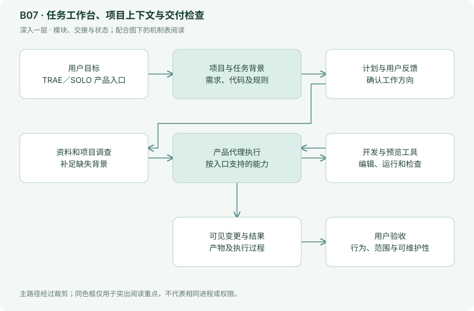

| 模块／交接点 | 怎样工作 | 状态与边界 |
|---|---|---|
| 任务输入 | 需求和项目材料影响执行范围 | 模糊目标容易得到能演示但不符合约束的结果。 |
| 开发现场 | 编辑、运行和预览能力依产品入口开放 | 浏览器预览成功不证明后端和异常路径正确。 |
| 结果接收 | 过程、文件与实际行为共同构成交付 | 研究仓库的日志字段不能套到商业界面。 |

**沿着一次任务看数据怎样走。** 例如制作带登录的原型：先给出真实角色与权限规则，再让代理实现并预览；验收应包含未登录、无权限和异常数据。遇到问题时区分需求遗漏、工具执行失败和产品能力边界。此路径是试用分析，不是运行实测。

**与相近工具的实质差别。** 与 H04 的研究框架相比，这里评估的是商业工作流与交付体验；与 Replit 相比，是否包含完整托管部署链应按所选产品和入口确认。

本节细图与机制依据：[trae-home](https://www.trae.ai/)。箭头表示主要信息或控制交接，不表示所有分支必然并行；省略的模块不能视为不存在。

### 能力、状态与边界

| 观察项 | 实际机制／公开能力 | 对使用者意味着什么 |
|---|---|---|
| 产品身份 | 商业 TRAE／SOLO 与研究 trae-agent 分开 | 研究仓库状态不能代表商业产品维护 |
| 任务范围 | 编程及部分资料、报告、数据工作 | 按具体入口确认可交付文件与工具 |
| 地区差异 | 国内／国际及不同版本 | 模型目录、额度和服务可用性分别核验 |
| 成品流程 | 任务执行与产物呈现结合 | 需检查中间依据和最终文件，不只看摘要 |
| 模型 | 产品可选型号或内置路由 | 不假定每个版本都有自由 BYOK |
| 透明程度 | 商业内部实现未完整公开 | 以公开接口和实用验收为证据边界 |

**把机制放进实际工作。**

成品任务往往有多个质量门槛。资料报告需要事实、引用、结构与排版；应用原型需要运行、流程、数据与权限。产品将这些步骤放在同一界面，并不意味着每一步都会自动达标。使用者应为每阶段提出可观察结果，避免只在最后检查一个看起来完整的文件。

闭源产品的角色名、模式名和宣传图不足以证明内部调度。报告只能依据公开功能解释工作分工；实际选型应观察它怎样处理缺材料、工具失败和需求变化。若每次失败都只能整体重做，长期成本可能高于首次生成时的便利。

不同地区、桌面和 Web 入口可能使用不同模型或工具，比较时需要完整记录。对于代码项目，保存运行和部署说明；对于资料项目，保存原文与引用。这样既方便审查，也减少以后更换工作台时对私有会话的依赖。商业产品和研究仓库应始终分开评价。

### 从安装到完成第一个任务

1. 选定地区与入口，检查实际模型、额度和功能；编程任务打开仓库，资料任务建立明确材料范围。

2. 描述读者或使用者、核心需求和输出格式。例如报告要说明篇幅、引用、图表和文件形式；应用要说明主要用户流程。

3. 先让代理检查材料与环境，确认缺失信息和关键假设。对不确定事实要求标明，不让它为凑齐成品自行补造。

4. 按阶段检查产物：先结构，再实现或正文，最后预览与验证。需求变动时明确指出哪些已有工作仍然有效。

5. 保存最终文件和必要源材料。涉及发布或外部服务时单独核对运行费用、账户和部署条件，再决定长期维护方案。

下面是启动命令或操作路线；路径、认证与功能入口请按自己的版本调整。

```text
成品任务输入模板：
给谁用／读：
必须完成的三件事：
可以使用的材料与来源：
输出文件或应用形式：
怎样判断完成，以及哪些事实仍需确认：
```

### 典型任务与验收方法

下面是一份**可直接改写使用的试用任务**，属于本报告设计的验收示例，并非已完成的运行测试。

> 用给定访谈材料制作一份产品需求报告，包含用户问题、证据、优先级和待验证假设；每个判断能追溯到材料，交付可继续编辑的文件。

这能检验资料到成品是否真正闭合。核对引文、统计、建议与证据的关系，打开最终文件检查版式与可编辑性。代码任务则额外检查运行、异常路径与依赖，不能用报告型任务的好表现推断工程可靠性。

### 模型搭配、适用方向与取舍

推荐先使用产品实际提供的内置路由或当前模型选项。尚未核实每个版本都支持同等自由的 BYOK，因此不给出“任意 TRAE＋任意模型”的保证。适合希望减少配置、直接从需求得到原型或文档的用户。难度：低中；专业开发仍需会检查代码与部署结果。

| 选择路线 | 候选组合 | 怎样决定 |
|---|---|---|
| 产品基线 | 所用地区与入口的默认路由 | 先比较成品与人工整理时间，不臆造固定型号。 |
| 可选固定型号 | 当前界面实际提供的模型 | 相同资料与任务验收，区分写作、代码和数据能力。 |
| 需要完全控制 | 另选明确支持 BYOK 的 Harness | 先评估迁移收益，不假定所有 TRAE 入口支持任意服务。 |

适合希望减少配置、直接组织产物的用户。便利来自产品整合，也意味着模型路由与部署细节更受平台控制。专业开发可与 Codex／Cursor 比较；固定资料问答可与 AnythingLLM 比较；不同目标不宜共用一个排名。

### 资料依据与继续阅读

[官方产品页](https://www.trae.ai/)、[SOLO 说明](https://www.trae.ai/blog/new_solo_beta_0331)。

完整商业运行时未公开，结构判断以官方可见行为和接口为限。上面的流程建议与取舍是依据这些材料给出的选型判断；具体型号、权限和菜单以实际安装与账户为准。

<a id="b08"></a>

## B08 Augment／Auggie：先解决“找对代码和业务背景”

### 定位与设计理念

对大型代码库来说，模型不一定缺少编程知识，更常缺少“这家公司把事情放在哪里、为什么这样做”。Augment 的 Context Engine 围绕项目和相关仓库提供检索与上下文。Auggie 则把这种能力带入 CLI。[Agent 文档](https://docs.augmentcode.com/jetbrains/using-augment/agent.md)、[Auggie 入门](https://docs.augmentcode.com/cli/overview.md)

Augment 的重点是让代理先拿到正确背景。大型仓库里，困难往往不是写出一个函数，而是知道已有实现、隐含约定和跨仓库依赖在哪里。Context Engine 把查找材料放到模型之前，Auggie 再据此执行任务。这条路线更适合知识分散的成熟项目，而不是文件很少的新原型。

### 工作原理与架构图

下图依据官方公开接口整理，表示责任分工，不代表已审计闭源内部实现。

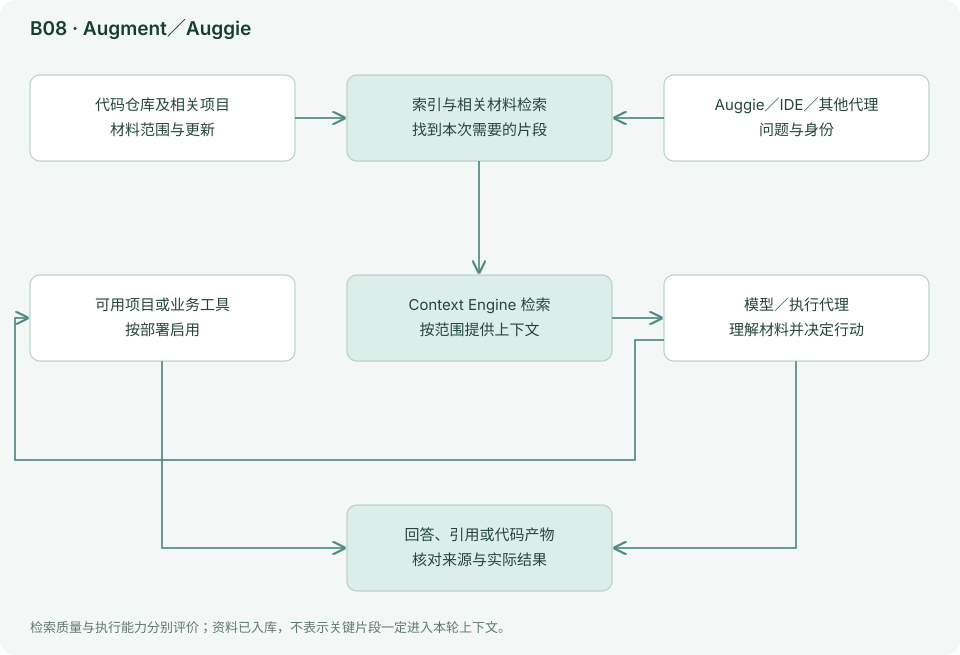

索引和检索层位于模型之前，负责找材料；代理再决定怎样行动。索引需要维护，文件排除范围、更新延迟和访问权限会影响结果。它不保证一个名字相似的检索结果就是正确依赖。Context Engine 也能作为 MCP 服务给其他代理使用，这意味着团队可以只替换“找资料”这一层。[Context Engine MCP](https://docs.augmentcode.com/context-services/mcp/overview.md)

索引相当于预先制作一份能检索的项目地图，查询时再挑选与任务有关的片段。这可以减少手工找文件，却会受覆盖范围、更新时机和权限影响。Context Engine 通过 MCP 提供给其他代理时，只替换了“找材料”这一层，后面的执行核心和模型仍由原工具负责。这样可以复用知识基础设施，但也要分别评价检索质量与代理实施能力。

#### 深入一层：代码上下文引擎与执行代理的分离

Augment 的 Context Engine 可以通过 MCP 为其他工具提供代码背景，因此“检索层”和“执行代理”不能画成同一个盒子。Auggie 可以消费背景并行动，其他 Harness 也可通过连接取得上下文。检索服务帮助回答“该看哪里”，具体编辑、权限与长任务循环仍由执行宿主承担。

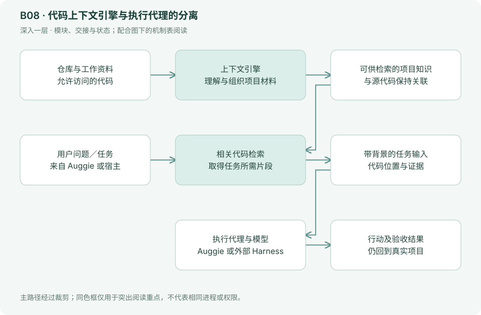

| 模块／交接点 | 怎样工作 | 状态与边界 |
|---|---|---|
| 项目知识 | 组织仓库信息以便相关检索 | 索引状态、可见范围和源分支需要核对。 |
| MCP 接口 | 向其他 Harness 暴露上下文能力 | 接入 Context Engine 不会自动替换对方的整个运行时。 |
| 执行宿主 | 模型决策与工具动作发生在相应代理中 | 一项结果可能同时受检索质量和执行策略影响。 |

**沿着一次任务看数据怎样走。** 例如排查跨仓库接口不一致：上下文引擎帮助找出调用关系，代理再读取关键实现、形成修改并测试。如果返回的是旧分支材料，再强的执行模型也可能改错方向，应先确认资料时效和出处。

**与相近工具的实质差别。** 与单纯增加上下文窗口相比，相关性筛选更重要；与 Open WebUI 的文档检索相比，这里重点是代码项目关系，并不据此推断两者使用相同索引算法。

本节细图与机制依据：[augment-context-engine-mcp](https://docs.augmentcode.com/context-services/mcp/overview.md)、[augment-auggie](https://docs.augmentcode.com/cli/overview.md)、[augment-using-agent](https://docs.augmentcode.com/jetbrains/using-augment/agent.md)。箭头表示主要信息或控制交接，不表示所有分支必然并行；省略的模块不能视为不存在。

### 能力、状态与边界

| 观察项 | 实际机制／公开能力 | 对使用者意味着什么 |
|---|---|---|
| 上下文服务 | Context Engine 的代码索引与检索 | 用真实业务问题验证，而不是只测关键词命中 |
| 仓库范围 | 按配置覆盖项目与相关材料 | 纳入正确依赖，比无差别扩大范围更重要 |
| 时效 | 索引与代码更新需要衔接 | 变更后抽查是否仍返回旧实现 |
| 权限 | 上下文材料的可见范围 | 组织资料进入检索前要有明确访问控制 |
| 独立接入 | Context Engine MCP 可服务其他代理 | 组合应区分检索层、执行层与模型层 |
| 成本 | 索引维护与实际任务调用 | 检索省时需与维护及服务成本一起评估 |

**把机制放进实际工作。**

上下文服务的错误可以分成三类：材料没进入索引，进入后没被检索到，检索到了却被代理理解错。三类问题对应范围、检索和模型推理，不能全靠升级大模型解决。用已知答案提问，是低成本区分这些问题的方法。

跨仓库检索尤其需要时效和权限。找到某个旧接口的全部调用方，并不意味着找齐新版本的调用方；可访问一个仓库，也不能推定可访问整个组织。让答案保留代码位置与版本线索，有助于判断它是否与当前修改对象一致。

Context Engine 与外部 Harness 配合时，要分别评价找材料和执行任务。可以先让原代理在没有检索服务时调查，再加入服务比较探索时间与遗漏；实施阶段保持相同模型。若同时换模型、索引和代理，虽然体验可能改善，却很难判断该继续投入哪一层。

### 从安装到完成第一个任务

1. 选择一个真实仓库建立索引，核对纳入与排除范围；先别急着让代理改代码。

2. 准备五个你知道答案的问题，如权限检查入口、配置读取路径或跨服务调用方，检查检索证据是否完整且最新。

3. 对漏检问题补充相关仓库或调整范围，辨认是根本没索引到、检索没命中，还是模型误解了已找到的内容。

4. 再让 Auggie 实施一个跨文件小修改，要求解释每项改动依赖的项目约定，并运行有关检查。

5. 需要保留原 Harness 时，通过文档支持的 MCP 路线连接 Context Engine，用同类任务评估这层检索是否减少探索与返工。

下面是启动命令或操作路线；路径、认证与功能入口请按自己的版本调整。

```text
检索验收问题示例：
1. 权限检查有哪些真实入口？
2. 这个配置值在哪里被覆盖？
3. API 字段变更会影响哪些调用方？
答案需带文件、位置、调用关系及索引未覆盖范围。
```

### 典型任务与验收方法

下面是一份**可直接改写使用的试用任务**，属于本报告设计的验收示例，并非已完成的运行测试。

> 为共享 API 增加一个可选字段。先找齐相关定义、序列化和调用方，再说明兼容方案；依据确认的依赖关系修改并验证。

重点看遗漏率与证据准确性。返回很多文件不代表找齐了依赖，返回一个相似函数也不代表选中了真正入口。若模型已得到正确材料仍改错，应评估执行模型；若根本没找到关键文件，先改进上下文层。

### 模型搭配、适用方向与取舍

Auggie 内部选项按当前产品提供的路由选择；也可以采用“Codex／Claude Code＋Context Engine”的组合，此时模型仍由原代理决定。适合大型仓库、复杂内部业务、跨仓库改动和新成员熟悉项目。难度：中；索引与组织权限管理中高。

| 选择路线 | 候选组合 | 怎样决定 |
|---|---|---|
| 完整产品 | Auggie 当前内置路由 | 先验证检索质量，再评价修改能力。 |
| 保留原代理 | Claude Code／Codex＋Context Engine | 模型沿原代理配置，检索服务作为独立一层。 |
| 降低成本 | 减少无关索引与重复调查 | 检索没命中时先修资料与范围，不急着升模型。 |

适合大型业务仓库、跨仓库改动和新人熟悉项目。小仓库可能不需要专门索引服务。与大上下文模型比较时，应看检索能否更精准和及时；与其他 Harness 搭配时，保留双方账单与数据路径，避免把组合效果只归功于其中一方。

### 资料依据与继续阅读

[Agent 文档](https://docs.augmentcode.com/jetbrains/using-augment/agent.md)、[Auggie 入门](https://docs.augmentcode.com/cli/overview.md)、[Context Engine MCP](https://docs.augmentcode.com/context-services/mcp/overview.md)。

完整商业运行时未公开，结构判断以官方可见行为和接口为限。上面的流程建议与取舍是依据这些材料给出的选型判断；具体型号、权限和菜单以实际安装与账户为准。

<a id="b09"></a>

## B09 Amp：把能力档位定义为一整套执行配置

### 定位与设计理念

Amp 当前的 low／medium／high／ultra 不只是更换模型。每档组合了模型、推理强度、系统提示、工具和 Oracle 等能力。它体现了一种产品判断：用户选“这个任务值得投入多少能力”，具体执行组合由产品组织。[模式与模型](https://ampcode.com/docs/markdown/models-and-subagents)

Amp 把“愿意为这项任务投入多少能力”做成档位，而不是要求用户理解每一个模型参数。档位可能同时改变模型、推理强度、工具和专家调用。这样能降低调参负担，但也意味着两次不同档位的比较，不是严格的单模型实验。产品替用户做了一部分编排决策，用户仍要判断这些额外能力是否值得。

### 工作原理与架构图

下图依据官方公开接口整理，表示责任分工，不代表已审计闭源内部实现。

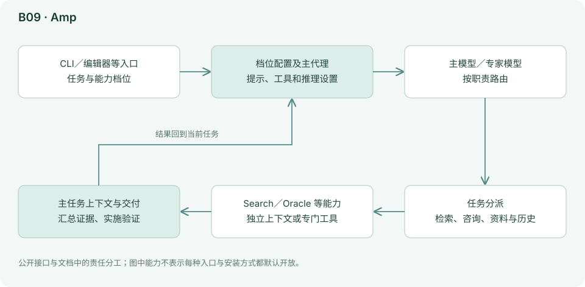

Search、Oracle、Librarian、Read Thread 等专门处理代码检索、难题推理、外部资料和历史任务。它们通常拥有独立上下文，主代理收到汇总；文档明确区分这种分工与可彼此随意沟通的团队。Orbs 则扩展到持久远程工作环境。[工具](https://ampcode.com/docs/markdown/tools)、[Orbs 入门](https://ampcode.com/docs/markdown/orbs/getting-started)

主代理遇到难题时可以咨询 Oracle，调查外部材料时使用 Librarian，检索代码则有其他专门能力。这些职责通常交回结论，帮助主对话避免被大量中间过程占满。它们不是必然彼此通信的一个团队。升档增加的能力可能减少返工，也可能对简单任务产生额外调用，因此应评估总耗时、调用和人工纠正，而非只看回答更长。

#### 深入一层：主模式、专用子代理与模型角色

Amp 官方把模式描述为模型、推理强度、系统提示、工具与辅助角色的组合。主代理推进任务，专用子代理在自己的窗口处理一部分工作，Oracle 等角色承担困难推理或规划。因此选择模式不等于只在下拉框换一个模型，辅助调用也属于整项任务的运行路径。

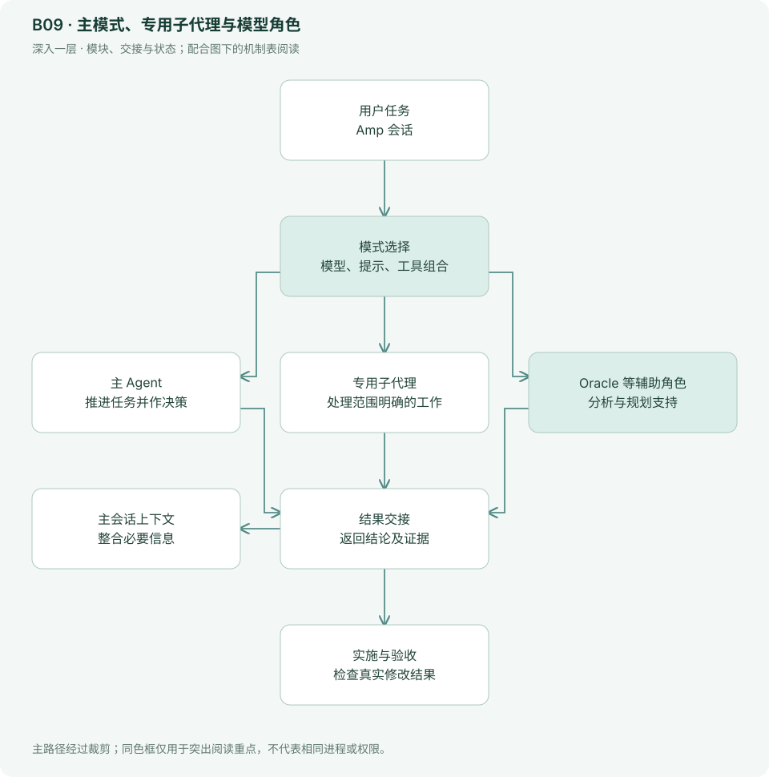

| 模块／交接点 | 怎样工作 | 状态与边界 |
|---|---|---|
| 模式组合 | 角色和工具策略随模式一起变化 | 比较模式时不能把结果差异全部归因于模型。 |
| 独立窗口 | 子代理隔离其长调查上下文 | 交接遗漏仍会影响主任务判断。 |
| 辅助角色 | 支持性模型处理特定工作 | 总成本应包含这些调用与重试。 |

**沿着一次任务看数据怎样走。** 例如复杂迁移：主代理协调实施，专用调查找出旧 API 使用点，困难设计问题交给分析角色。最终仍由任务验收检查是否遗漏调用方；多个角色给出一致意见并不构成正确性证明。

**与相近工具的实质差别。** 与用户逐个配置 Provider 的开放终端工具相比，Amp 更强调产品化的角色配方。它降低搭配成本，同时减少使用者对每次内部模型分配的控制。

本节细图与机制依据：[amp-modes-models](https://ampcode.com/docs/markdown/models-and-subagents)、[amp-agent-to-agent](https://ampcode.com/docs/markdown/orbs/agent-to-agent)。箭头表示主要信息或控制交接，不表示所有分支必然并行；省略的模块不能视为不存在。

### 能力、状态与边界

| 观察项 | 实际机制／公开能力 | 对使用者意味着什么 |
|---|---|---|
| 能力档位 | low／medium／high／ultra 等组合配置 | 档位不只是模型名或单一推理参数 |
| 专家分工 | Search、Oracle、Librarian 等 | 核对角色实际职责，不按名称幻想权限 |
| 上下文 | 专门任务与主任务之间进行汇总 | 交接需要证据和文件位置，不能只有结论 |
| 历史 | Read Thread 等历史访问能力 | 历史可访问不代表每轮自动全部读入 |
| 远程环境 | Orbs 等持久工作路线 | 另检查环境、凭据与生命周期 |
| 可复现性 | 官方路由可能随产品更新 | 记录档位、实际模型、工具配置和版本 |

**把机制放进实际工作。**

能力档位是一组产品决策。升档后不仅可能思考更多，还可能调用不同专家或采用不同工具。因此，比较档位是在比较完整配置，而不是孤立测模型智力。记录实际调用与结果，才能解释更高档究竟改善了哪一步。

独立上下文的专家适合处理边界清楚的问题。向 Oracle 提问“这段并发控制的两个假设哪个更符合日志”，通常比让它泛泛审查整个项目更容易得到可用结论。交回的依据必须让主代理能继续核验，否则专家只是又一层听起来权威的回答。

历史访问和持久远程环境解决不同连续性问题：前者找回曾经讨论的材料，后者保存工作现场的某些条件。两者都需要核对现状，不能把旧线程说服务正常当作当前环境正常。小任务不必使用全部能力，减少无效专家调用有时比单纯换便宜模型更有帮助。

### 从安装到完成第一个任务

1. 按官方入门选择入口，先用中等能力档位做一项你熟悉的任务，保存完成结果与成本。

2. 任务中要求指出依据和验收；观察主代理在什么情况下调用专门能力，以及汇总是否真的帮助推进。

3. 对确实失败或困难的环节升档，比较是否减少错误或人工干预，不仅比较措辞与推理长度。

4. 需要持久远程环境再配置 Orbs；先验证项目运行、资料可用性和结果保存，而不把远程环境等同于更强模型。

5. 再考虑插件或自定义分工，清楚规定输入、输出和工具；保留标准档位任务作为升级后的回归基线。

下面是启动命令或操作路线；路径、认证与功能入口请按自己的版本调整。

```text
对照记录：相同仓库与任务
medium：实际模型／专家调用／耗时／成本／人工纠正
high：同样记录，并解释新增能力改善了哪一步
只有验收一致时，成本差异才有可比性。
```

### 典型任务与验收方法

下面是一份**可直接改写使用的试用任务**，属于本报告设计的验收示例，并非已完成的运行测试。

> 调查一个偶发并发错误，给出可验证的根因、最小修复和回归测试。需要额外推理时说明要咨询的问题，交付时保留支持结论的代码证据。

困难调试适合检验专家分工。重点看咨询是否提出了新且可验证的假设，主代理是否据此重现并修复；多个角色重复同一句猜测不能算相互验证。

### 模型搭配、适用方向与取舍

首选“任务档位＋当前官方路由”，并记录实际模型；需要固定模型或 BYOK 时按当前文档配置。其路由会更新，因此不能长期宣称 Amp 永久绑定某一家模型。适合希望减少自行调参、又需要专家分工的熟练开发者。难度：中；自定义编排中高。

| 选择路线 | 候选组合 | 怎样决定 |
|---|---|---|
| 日常 | medium 等当前标准档位 | 记录整套配置和专家调用，不只记录模型名。 |
| 困难推理 | high／ultra 等较强配置 | 验收是否减少根因误判与返工，升档可能同时改变工具。 |
| 简单任务 | low 或其他合适经济路线 | 先看是否足够完成；不要为机械任务默认调用全部专家。 |

适合希望减少配置、愿意由产品选择执行组合的熟练用户。代价是模型和工具变化的透明度要求更高，升档收益需以实际完成任务衡量。要严格固定模型研究循环，可比较 Pi／mini-SWE-agent；要规范化交付流程，可比较 Factory。

### 资料依据与继续阅读

[模式与模型](https://ampcode.com/docs/markdown/models-and-subagents)、[工具](https://ampcode.com/docs/markdown/tools)、[Orbs 入门](https://ampcode.com/docs/markdown/orbs/getting-started)。

完整商业运行时未公开，结构判断以官方可见行为和接口为限。上面的流程建议与取舍是依据这些材料给出的选型判断；具体型号、权限和菜单以实际安装与账户为准。

<a id="b10"></a>

## B10 Factory Droid：把大任务组织成可验证的交付过程

### 定位与设计理念

Droid 提供通用代理执行，Missions 进一步安排规划、工作者和验证。与简单地“同时开五个聊天窗口”相比，其重点是任务交接、状态和完成标准。[Missions](https://docs.factory.ai/missions/overview.md)

Factory Droid 把大任务看成一组需要交接和验证的工作。Missions 的价值不在于能开多少代理，而在于规划者、工作者与验证之间有可查看的材料和完成条件。只有接口明确、各部分能检验时，拆分才可能提高吞吐；需求模糊时增加工作者，往往只是更快地产生彼此不一致的代码。

### 工作原理与架构图

下图依据官方公开接口整理，表示责任分工，不代表已审计闭源内部实现。

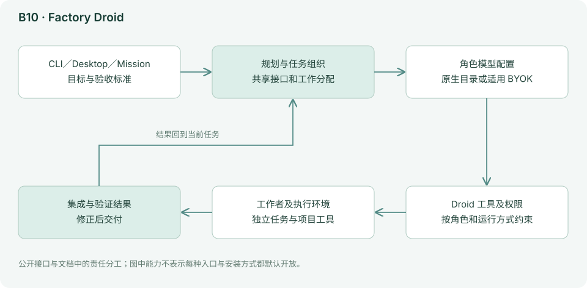

自定义 Droid 用项目级或用户级 Markdown 配置，指定职责、模型和工具；被调用时拥有独立上下文。官方还明确描述了工作者的限制，例如特定非交互式子任务不能像主代理那样随意向用户提问或继续套娃调用。限制能减少失控，也意味着主任务必须给出足够明确的输入。[子代理](https://docs.factory.ai/harness/subagents.md)

BYOK 也有入口范围：当前说明针对 CLI／Desktop 配置，不应扩展为所有托管 Web、移动入口自动支持相同自定义模型。权限和沙箱同样要分别配置。[BYOK](https://docs.factory.ai/model-independence/byok.md)、[沙箱](https://docs.factory.ai/autonomy-and-safety/sandbox.md)

自定义 Droid 文件为一类任务定义职责、模型和工具，被调用后拥有自己的上下文。这让主任务可以把大量实现细节交出去，但也失去对子任务隐含假设的直接掌握。非交互工作者无法随时追问用户，因此规划阶段要把必要信息给足。验证者应依据代码与运行结果判断，不能只是重新读取工作者的成功总结。

#### 深入一层：主 Droid、专用子任务与较长任务的组织

Factory 的 Droid 路线把执行代理与可配置的专门角色组合起来。公开资料中的子代理、模型选择与 Missions 等任务组织方式应分层理解：角色配置回答“谁擅长哪一段”，长任务组织回答“怎样推进和验收整个目标”。图只表达这些可见职责，不推断其商业调度服务内部。

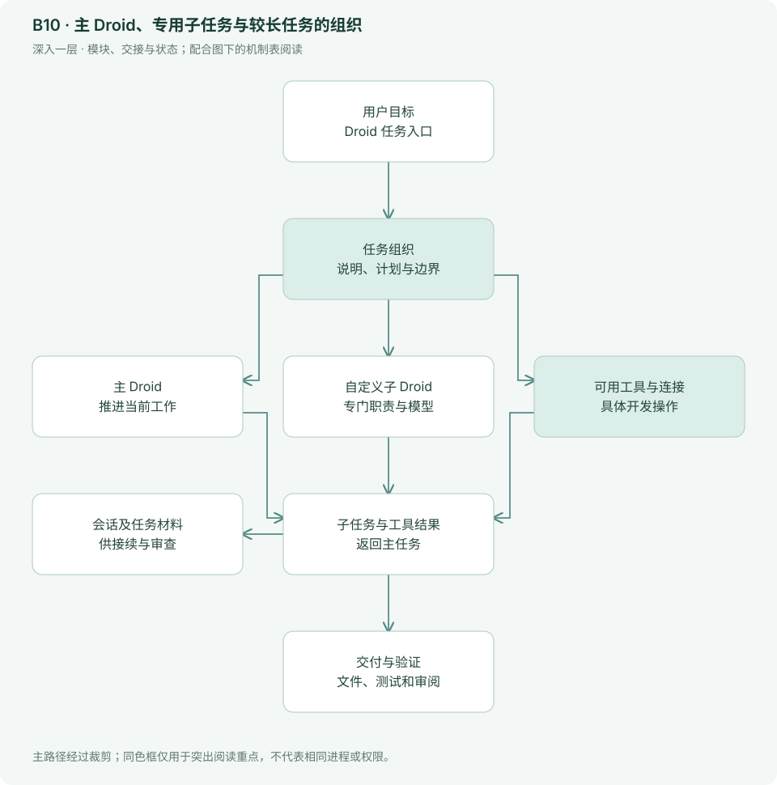

| 模块／交接点 | 怎样工作 | 状态与边界 |
|---|---|---|
| 主任务 | 保留目标、范围与最终交付责任 | 不能因为子任务完成就跳过集成验证。 |
| 子 Droid | 以专用说明、工具和模型承担一段工作 | 角色名称应落实为输入输出与工具边界。 |
| 模型渠道 | 产品支持的模型或 BYOK 路线 | 渠道可用不等于所有任务功能完全等价。 |

**沿着一次任务看数据怎样走。** 例如把一个旧模块迁到新接口：先建立整体验收条件，再分别调查依赖、修改实现与检查回归，主任务汇总差异。对于长任务，保留计划、完成状态与失败证据，比不断扩充角色数量更有价值。

**与相近工具的实质差别。** 与 Amp 相比，两者都有角色分工，但可配置维度和任务组织契约应分别查证。与固定工作流相比，Droid 的具体执行仍有较多代理动态决策。

本节细图与机制依据：[factory-subagents](https://docs.factory.ai/harness/subagents.md)、[factory-factory-missions](https://docs.factory.ai/missions/overview.md)、[factory-byok](https://docs.factory.ai/model-independence/byok.md)。箭头表示主要信息或控制交接，不表示所有分支必然并行；省略的模块不能视为不存在。

### 能力、状态与边界

| 观察项 | 实际机制／公开能力 | 对使用者意味着什么 |
|---|---|---|
| 任务层次 | 普通 Droid 与 Missions | 小任务不一定需要完整编排 |
| 角色配置 | Markdown 定义职责、模型和工具 | 角色描述要能转化为明确的交付件 |
| 上下文 | 子代理拥有独立任务上下文 | 接口与共享事实需要显式传递 |
| 工作者限制 | 某些非交互路径限制提问和继续派生 | 不确定信息应在任务下发前解决 |
| 模型独立 | CLI／Desktop 等入口有 BYOK 路线 | 不把该能力扩展到所有托管入口 |
| 完成控制 | 计划、实施和验证组成交付过程 | 证据需独立可查，避免代理自评替代验收 |

**把机制放进实际工作。**

复杂任务最容易在交接处丢信息。规划者知道整体目标，工作者只看到分配给自己的部分；如果共享接口、错误行为和测试要求没写清，各自完成后可能无法组合。Mission 的任务材料应围绕这些交接点设计，而不只是把大目标拆成很多标题。

非交互工作者不能随时问人，使“输入是否充分”成为重要条件。可以先让主任务解决业务疑问，再把稳定部分交出去；尚未确定接口的前后端不宜同时自主设计。并行的收益应来自真正独立的工作，而非同时修改同一个高耦合模块。

验证应看实际产物和环境，不只看工作者总结。一个独立检查角色若仍只阅读成功声明，并没有形成独立验收。模型成本应合计规划、所有工作者、验证和返工；当集成成为主要负担时，减少代理或缩小批次往往比继续增加并行更有效。

### 从安装到完成第一个任务

1. 从单个 Droid 开始，完成一个小功能，确认模型、权限、沙箱和测试都能工作；先不要把整项目交给 Mission。

2. 挑选能拆分的需求，定义共享接口、目录责任和验收方式。例如先统一 API 再分前后端，而不是让双方各自设计。

3. 按职责配置工作者的模型和工具，给非交互子任务完整输入；预算中同时计入规划、实施与验证。

4. 检查中间产物是否符合接口，再集成修改；冲突交给有完整上下文的主任务处理，不让工作者相互猜测。

5. 用独立检查核对真实运行结果，记录遗漏与返工。重复成功后再扩大任务规模或引入自定义模型。

下面是启动命令或操作路线；路径、认证与功能入口请按自己的版本调整。

```text
Mission 任务拆分示例：
共享契约：请求参数、响应结构、错误码、目录责任
工作者 A：后端接口与测试
工作者 B：按契约实现前端
集成验收：真实用户流程、异常路径与回归检查
```

### 典型任务与验收方法

下面是一份**可直接改写使用的试用任务**，属于本报告设计的验收示例，并非已完成的运行测试。

> 增加一个可筛选的管理页面。先定义接口与权限规则，再分别实现后端、前端和测试，最后统一集成并展示验收证据。

看任务交接能否减少返工：前后端是否使用同一字段，权限是否只停留在界面，验证是否真的从用户入口走完整流程。并行速度快但最后大量重写，并不说明编排有效。

### 模型搭配、适用方向与取舍

官方当前目录提供 GPT-6 Astra、GPT-5.6、Claude 等多档选择。建议规划／疑难诊断用较强模型，可机械验收的实施用经济档，再由独立检查收尾。适合较完整的功能交付、重复开发流程和愿意为任务编排投入配置的团队。难度：中高。[模型目录](https://docs.factory.ai/models.md)

| 选择路线 | 候选组合 | 怎样决定 |
|---|---|---|
| 规划与集成 | 当前可用 Astra／较强 Claude 等 | 用于边界、接口和困难问题，保证共享契约清楚。 |
| 可验收实施 | GPT-5.6 等适合任务的日常档 | 按工作者职责分配，统计所有子任务与重试。 |
| 自有服务 | CLI／Desktop 支持的 BYOK | 不推及所有托管入口，逐角色验证工具和权限。 |

适合完整功能、重复开发流程和愿意维护角色配置的团队。代价是前期拆分、调用成本与集成负担。高度耦合的小修复通常交给单代理更直接；多代理收益应按总交付时间而非同时运行数量计算。

### 资料依据与继续阅读

[Missions](https://docs.factory.ai/missions/overview.md)、[子代理](https://docs.factory.ai/harness/subagents.md)、[BYOK](https://docs.factory.ai/model-independence/byok.md)、[模型目录](https://docs.factory.ai/models.md)。

完整商业运行时未公开，结构判断以官方可见行为和接口为限。上面的流程建议与取舍是依据这些材料给出的选型判断；具体型号、权限和菜单以实际安装与账户为准。

<a id="b11"></a>

## B11 Warp／Automation Platform：从终端会话走向可触发的代理任务

### 定位与设计理念

Warp 原生终端会把命令、输出与上下文组织得更结构化。其代理在这样的工作环境中使用工具；同时也支持把 Claude Code、Codex、OpenCode 等第三方 CLI 放进 Warp。后者使用的代理核心仍属于第三方，而不是一律变成 Warp Agent。[Agents 文档](https://docs.warp.dev/_llms-txt/agents.txt)

Warp 从终端出发，把命令及其输出组织成容易理解的工作单元；原生 Agent 在此基础上完成多步操作，Automation Platform 再把稳定工作转成可触发任务。这条路线适合本来就在终端处理构建、日志和环境的人。需要先分清自己是在 Warp 里运行第三方 CLI，还是使用 Warp 自己的代理，因为两者的模型和执行逻辑不同。

### 工作原理与架构图

下图依据官方公开接口整理，表示责任分工，不代表已审计闭源内部实现。

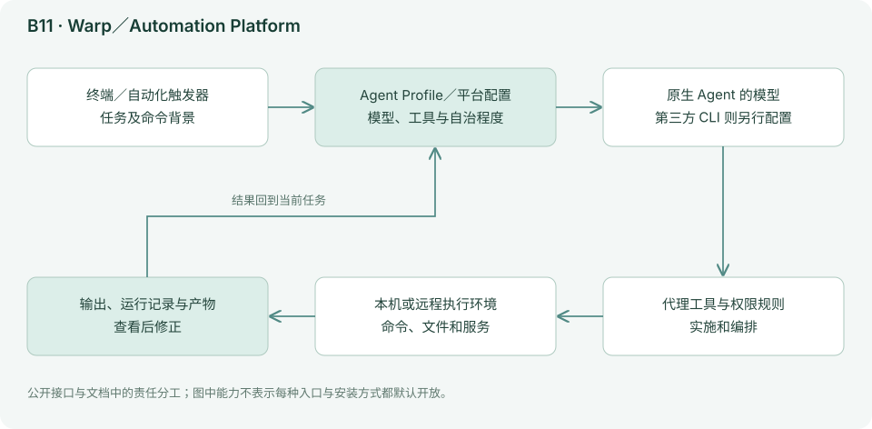

Agent Profiles 配置模型、自治程度、工具与命令权限；Automation Platform 再提供远程环境、触发器、编排和观察能力。部分接口与应用仍使用 Oz 名称。比较时应区分“Warp 作为终端”“Warp 原生 Agent”和“平台上的远程执行”。[CLI 文档](https://docs.warp.dev/_llms-txt/warp-agent-cli.txt)

终端保留命令与输出，有助于模型把错误和具体操作对应起来。Profile 将模型、工具和自治程度保存为一组配置，让重复任务少一些临时设置；触发器只负责何时开始，远程环境负责在哪里执行。一个本机排障任务变成定时自动化时，输入、凭据、重复执行和失败通知都需要重新设计，不能只给同一句提示加一个时间表。

#### 深入一层：真实终端、代理会话与云端自动化

Warp 的终端不是只用来显示文本的窗口。代理可以在真实终端中运行命令并读取动态输出，这与一次性执行命令后收集字符串的工具有区别。App、CLI 与云端自动化提供不同入口；规则、技能和上下文可以共享，但本地与云端的进程、凭据及环境仍然不同。

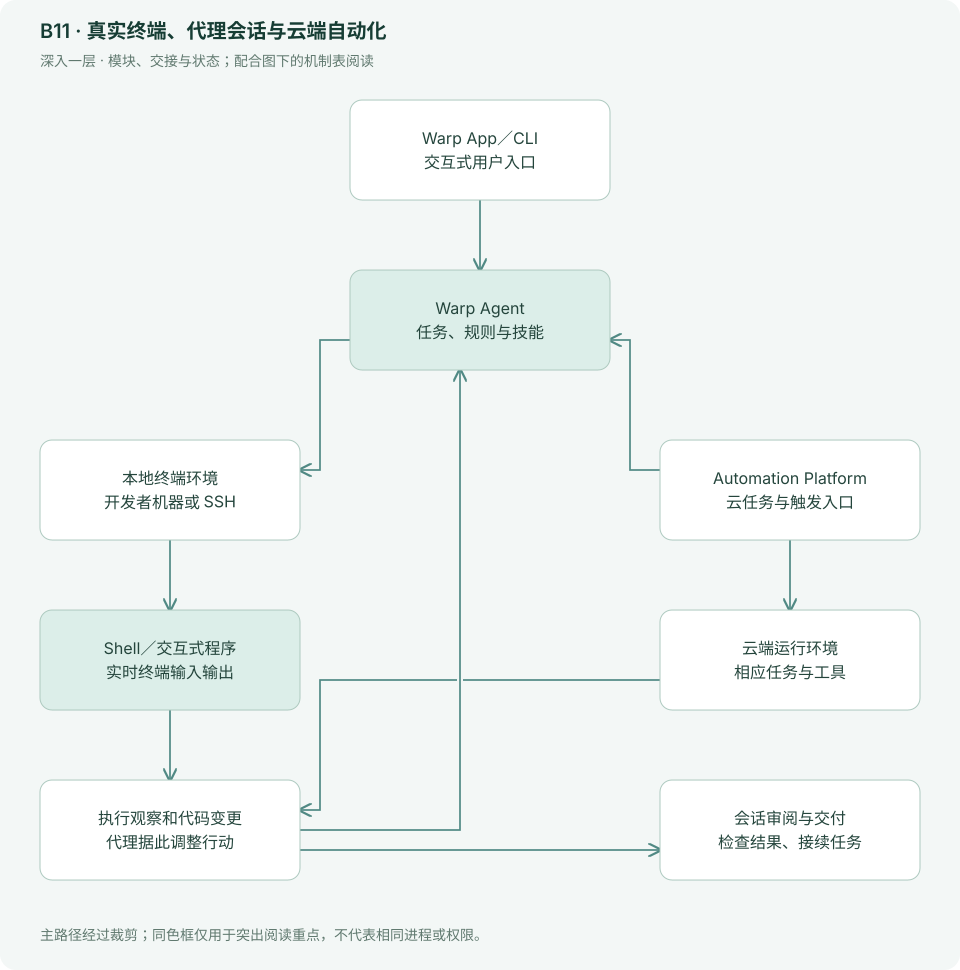

| 模块／交接点 | 怎样工作 | 状态与边界 |
|---|---|---|
| 终端状态 | 交互程序可能等待输入而非已经退出 | 提示符、退出状态和实时输出都影响后续动作。 |
| 代理入口 | App 与 CLI 承载同一产品路线 | 终端模拟器和代理运行时仍是不同概念。 |
| 云自动化 | 触发、环境与运行观察由平台承担 | 计划触发不等于当前本地会话一直在线。 |

**沿着一次任务看数据怎样走。** 例如在数据库 Shell 中排查问题，代理需要理解当前程序状态再发送下一步输入。若改为云端定时任务，应重新准备连接和运行环境；复制聊天记录不能搬走仍在本机运行的进程。

**与相近工具的实质差别。** 与纯聊天终端界面相比，Warp 的差异在真实终端交互；与 n8n 相比，其自动化更围绕代理运行环境，而非首先围绕显式业务节点图。

本节细图与机制依据：[warp-agents](https://docs.warp.dev/_llms-txt/agents.txt)、[warp-cli](https://docs.warp.dev/_llms-txt/warp-agent-cli.txt)。箭头表示主要信息或控制交接，不表示所有分支必然并行；省略的模块不能视为不存在。

### 能力、状态与边界

| 观察项 | 实际机制／公开能力 | 对使用者意味着什么 |
|---|---|---|
| 终端宿主 | 可运行第三方编码 CLI | 第三方核心与账单仍按其自身规则 |
| 原生 Agent | 结合终端上下文与工具执行 | 核对读取到的命令输出与实际运行环境 |
| Profiles | 模型、工具、自治与命令权限 | 配置保存后仍需按任务限制能力 |
| 自动化平台 | 触发、远程环境、编排与观察 | 启动成功不代表业务任务完成 |
| 生命周期 | 本机会话与远程任务分开 | 退出终端后是否继续取决于运行路线 |
| 权限 | 执行凭据与命令权限共同限制影响 | 产品界面的确认不能替代系统账户边界 |

**把机制放进实际工作。**

终端背景有助于定位问题，但输入范围仍需选择。一个失败命令后可能产生很多连锁报错，代理应找到首个相关原因，而不是逐条机械修复。保留原命令、目录、退出状态和关键输出，可以帮助区分环境错误与代码错误。

将临时操作保存成 Profile，只是固定了一组能力与设置；把它变成自动化还需定义输入、触发、失败和结果保存。一次救火中临时扩大过的权限，不应不加判断地成为日常任务默认。对于会修改外部状态的任务，重跑前还要检查上一次是否已经生效。

Warp 中运行第三方 CLI 时，代理模型和会话仍由对方管理。原生 Agent、第三方代理和远程平台可能同时出现在同一个终端体验中，但账单和权限不一定合并。排错时先确定实际执行者与主机，再查看对应配置，可以避免在错误产品里寻找模型设置。

### 从安装到完成第一个任务

1. 先把 Warp 当作日常终端使用，确认项目命令、输出和路径；选择原生 Agent 或第三方 CLI，明确当前执行者。

2. 给原生 Agent 一个解释错误或整理日志的任务，先保留审查，核对它是否读到了正确命令的输出。

3. 重复任务稳定后保存 Profile，写清可用工具、命令范围、模型和预期产物；不要把救火时的临时权限永久保留。

4. 需要自动运行再准备独立环境与触发条件，设置不会重复产生副作用的任务边界，并明确失败后如何检查。

5. 在测试环境触发一次完整运行，核对日志、产物与费用。相同输入重跑时检查是否重复写入，再决定上线频率。

下面是启动命令或操作路线；路径、认证与功能入口请按自己的版本调整。

```text
从临时排障到自动任务：
解释日志 → 人工确认处理方式 → 保存 Profile
→ 准备远程环境 → 测试触发与失败分支 → 定期检查结果
若运行的是 Claude Code／Codex CLI，沿用相应工具的配置。
```

### 典型任务与验收方法

下面是一份**可直接改写使用的试用任务**，属于本报告设计的验收示例，并非已完成的运行测试。

> 分析最近一次构建失败，定位首个相关错误并给出最小修复。修复流程稳定后，把它整理成定期检查依赖兼容性的任务，先只产出报告。

排障阶段看是否抓住第一个根因，避免被后续连锁错误带偏；自动化阶段看任务输入、结果和重复执行是否可控。只有自然语言总结，没有保存实际日志或报告，就难以长期维护。

### 模型搭配、适用方向与取舍

原生 Agent 使用当前 Profile 可选模型；第三方 CLI 遵循对应 Harness 的模型方案。适合日常终端操作、开发环境排障、运维脚本和周期性开发任务。难度：终端低中；平台自动化中高。涉及生产系统时，真正限制影响范围的是凭据和执行权限。

| 选择路线 | 候选组合 | 怎样决定 |
|---|---|---|
| Warp 原生 | Agent Profile 实际可选模型 | 按终端任务和工具稳定性选择。 |
| 第三方 CLI | 对应 Harness 的原生组合 | 如 Codex＋GPT；Warp 在此主要是终端宿主。 |
| 周期任务 | 通过固定样本的经济档 | 将失败重跑和外部操作纳入成本，先稳定流程再降档。 |

适合终端排障、开发环境和周期性工程任务。相比通用自动化平台，它更贴近开发环境；相比单纯 CLI，它提供更完整的终端与远程组织。成本是 Profile、执行环境与触发流程的维护，特别是在涉及共享系统时。

### 资料依据与继续阅读

[Agents 文档](https://docs.warp.dev/_llms-txt/agents.txt)、[CLI 文档](https://docs.warp.dev/_llms-txt/warp-agent-cli.txt)。

完整商业运行时未公开，结构判断以官方可见行为和接口为限。上面的流程建议与取舍是依据这些材料给出的选型判断；具体型号、权限和菜单以实际安装与账户为准。

<a id="b12"></a>

## B12 Google Antigravity：让代码、浏览器和任务产物一起进入代理流程

### 定位与设计理念

Antigravity 把多步开发与可查看的产物结合，代理不仅输出代码，也通过计划、说明和浏览器结果帮助用户判断任务是否完成。其价值在于让开发验证进入同一工作过程。[Agent 文档](https://www.antigravity.google/docs/agent)

Antigravity 将代码、浏览器操作和可查看的任务产物放进同一开发流程。对 Web 开发而言，模型需要的不只是编辑文件，还要观察页面实际如何运行。计划和验证材料帮助用户检查过程，但任何可视化产物都只是证据的一种：截图可以证明某个瞬间的外观，不能证明所有交互和异常路径正确。

### 工作原理与架构图

下图依据官方公开接口整理，表示责任分工，不代表已审计闭源内部实现。

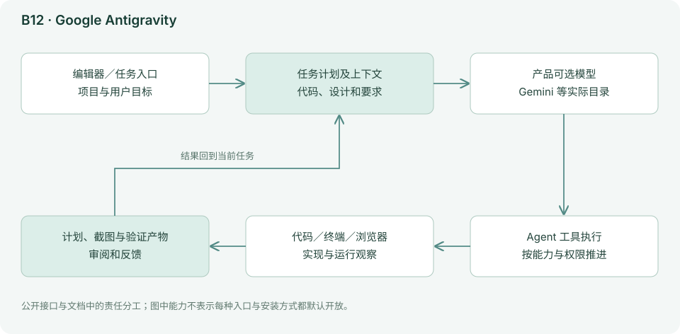

对浏览器的操作、终端命令、项目修改和并行会话应分别看权限与环境。产物展示能提高可审查性，但截图好看不等于功能、无障碍和异常状态都正确。

浏览器反馈把“我写了样式”变成“我看到了渲染结果”，有助于发现布局、资源和交互问题。代理仍需决定访问哪条路径、输入什么数据、如何判断成功；如果测试步骤只打开首页，报告就无法支持登录和权限已正确的结论。并行任务也应约定组件与接口边界，避免不同代理同时改全局样式或共享配置。

#### 深入一层：任务、可检查产物与浏览器观察

Antigravity 的公开 Agent 说明把任务、产物和工具放在一起：代理不仅写代码，也能通过浏览器观察运行结果，并用产物与用户沟通。这里的产物是可检查的工作材料，不应理解为模型内部记忆的完整镜像。多会话并行增加工作容量，也增加工作区和结果归属管理的需求。

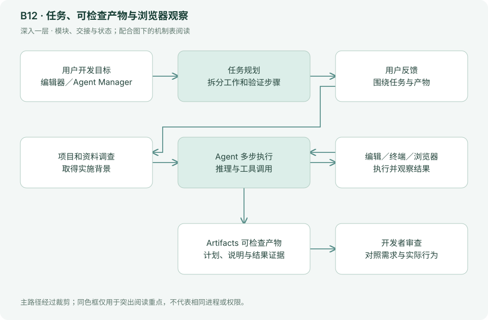

| 模块／交接点 | 怎样工作 | 状态与边界 |
|---|---|---|
| 任务组织 | 把目标拆成可跟进的工作 | 状态显示完成仍须对照验收条件。 |
| 浏览器工具 | 观察界面和运行反馈 | 看见页面不代表已经验证所有权限与异常路径。 |
| Artifacts | 向人展示计划、结果及证据 | 产物有解释价值，但应能对应当前代码版本。 |

**沿着一次任务看数据怎样走。** 例如修复表单交互：代理先修改前端，再用浏览器触发流程，记录可检查结果。若用户随后改了代码，旧截图与旧报告不能为新版本背书；应把证据和当前实现对应起来。

**与相近工具的实质差别。** 与只在终端里运行测试的代理相比，浏览器观察扩展了反馈范围；与远程工作机路线相比，具体工具运行位置和账户权限仍需按当前入口确认。

本节细图与机制依据：[antigravity-agent](https://www.antigravity.google/docs/agent)、[antigravity-index](https://www.antigravity.google/llms.txt)。箭头表示主要信息或控制交接，不表示所有分支必然并行；省略的模块不能视为不存在。

### 能力、状态与边界

| 观察项 | 实际机制／公开能力 | 对使用者意味着什么 |
|---|---|---|
| 工作对象 | 代码、浏览器与任务产物 | 把功能路径纳入验收，不只看生成代码 |
| 计划 | 可查看的任务组织材料 | 用户应确认范围、假设和验证步骤 |
| 视觉验证 | 浏览器操作与截图等产物 | 截图只支持被实际观察到的状态 |
| 执行权限 | 文件、终端和浏览器各有能力范围 | 分别检查账户、目录和网页操作权限 |
| 模型 | 以当前官方模型目录为准 | 不能把别处发布的型号推定为这里可选 |
| 交付 | 代码修改与运行材料一起审查 | 还要覆盖无障碍、错误、空数据与响应式 |

**把机制放进实际工作。**

浏览器证据需要和验证问题对应。首页截图只支持外观判断，不能证明表单校验、网络错误或权限正确。要求代理写出具体操作与观察结果，可以把“测试过了”变成可检查证据，也方便用户复现。

视觉任务包含两类迭代：一类是布局与样式，另一类是交互与状态。前者可通过不同尺寸截图发现问题，后者需要点击、输入和等待真实响应。只改截图里看得见的元素，容易遗漏焦点、加载、错误与长文本等状态。

代码、终端和浏览器分别拥有自己的环境与权限。页面能打开，但后端可能仍使用测试数据；工具能点击，但登录身份未必是目标用户。验收时明确测试环境和角色，再判断结果能否推广到真实使用。闭源内部调度不可见，反而更应把可见产物与操作证据组织清楚。

### 从安装到完成第一个任务

1. 打开已有 Web 项目，确认启动命令与本地预览可用；选择当前账户可用模型，明确浏览器与项目执行范围。

2. 给出具体页面或流程，先让代理列计划和验收路径。设计要求应包括尺寸、组件规范和异常状态。

3. 实施后要求运行页面，从真实入口操作；让每个测试结果对应具体路径和可见证据。

4. 除了正常流程，再检查错误输入、空数据、窄屏和键盘操作。发现问题后回到代码修复，再复查受影响路径。

5. 保存代码、说明和验证产物，区分已运行与未运行的检查。需要并行时按页面或独立模块划分，统一全局组件和接口。

下面是启动命令或操作路线；路径、认证与功能入口请按自己的版本调整。

```text
前端验收卡：
正常路径：从入口到成功结果
异常路径：空输入、错误返回、重试
展示：窄屏、长文本、加载和空状态
可用性：键盘操作、焦点和可读提示
```

### 典型任务与验收方法

下面是一份**可直接改写使用的试用任务**，属于本报告设计的验收示例，并非已完成的运行测试。

> 制作一个可搜索的资料列表页，复用现有设计系统。完成后在浏览器验证加载、搜索无结果、请求错误、重试和手机宽度，交付相应证据。

检查每项声称测试过的行为是否都有实际操作依据。漂亮的静态列表不能证明搜索和重试正常；自动截图也可能漏掉屏幕下方内容。适合用同一功能比较“写代码”和“运行后修正”的差异。

### 模型搭配、适用方向与取舍

当前官方列表以 Gemini 为主要路线，也列出部分 Claude 与 GPT-OSS 型号，并区分企业可用性。优先比较 Gemini 3.8 Flash 与可用的 3.1 Pro；不能因为别处发布了 GPT-6，就假定这里已经可选。适合前端、Web 应用、需要视觉验证的任务。难度：低中。[模型列表](https://www.antigravity.google/docs/models/)

| 选择路线 | 候选组合 | 怎样决定 |
|---|---|---|
| 快速日常 | Gemini 3.8 Flash | 短任务和有清楚验收的修改先试，检查工具与视觉输入是否完整。 |
| 复杂任务 | 可用 Gemini Pro，如 3.1 Pro Preview | 复杂资料与推理再比较；预览可用性、额度按入口核对。 |
| 保持可比 | 固定模型与输入类型 | 先固定检索、图片与工具配置，再比较不同档位，不混淆材料差异。 |

适合 Web 原型、前端迭代和需要视觉反馈的任务。复杂后端、数据库与权限系统仍需要相应工程验证。与普通 IDE 比较浏览器反馈是否减少返工，与托管应用平台比较部署便利和环境控制，不能只凭成品截图评分。

### 资料依据与继续阅读

[Agent 文档](https://www.antigravity.google/docs/agent)、[模型列表](https://www.antigravity.google/docs/models/)。

完整商业运行时未公开，结构判断以官方可见行为和接口为限。上面的流程建议与取舍是依据这些材料给出的选型判断；具体型号、权限和菜单以实际安装与账户为准。

<a id="b13"></a>

## B13 Replit Agent：把从想法到可运行应用的环境准备一起包起来

### 定位与设计理念

Replit Agent 面向“我想做一个东西”的用户，把项目生成、运行环境、预览和发布串在一起。对初学者而言，省去安装依赖和配置服务往往比多一个模型选项更重要。[Agent 介绍](https://docs.replit.com/features/agent/overview.md)

Replit Agent 把搭环境这件事也包含在产品里。初学者不必先理解本地依赖、预览服务器和部署步骤，就能从需求开始做应用。这降低了从想法到可运行原型的门槛；当原型成为真实业务时，数据、认证、运行费用和迁移才会变成主要问题。起步简单与长期维护简单是两个阶段的判断。

### 工作原理与架构图

下图依据官方公开接口整理，表示责任分工，不代表已审计闭源内部实现。

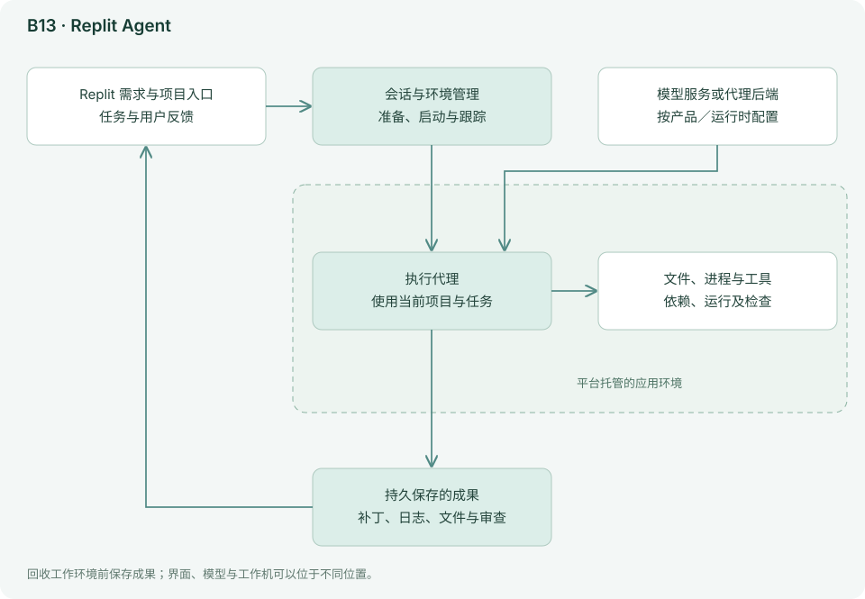

这是托管开发环境中的代理。平台控制环境与部分路由，因此起步快；迁出时需要确认代码、数据库、秘密配置、运行方式和部署依赖分别如何处理。一个可以下载的源码目录，不一定等于完整可迁移的线上系统。

平台同时管理代理和应用环境，所以生成代码后能较快进入预览。真正发布时，还会涉及持续运行、数据库与秘密配置；这些不是一次模型调用费用。迁移也因此应按组件检查：下载源码只带走代码，数据库内容、环境变量和部署设置可能需要另外导出与重建。能力档位由产品组合路由，不能把一个档位永久等同于某个型号。

#### 深入一层：从需求到可运行应用的环境链

Replit Agent 的路线把开发环境、运行预览与产品交付紧密结合。对外行用户，这降低了从想法到能打开页面的门槛；对架构理解，则必须区分“代码生成完成”“应用测试通过”和“应用已经发布”。三者依赖的环境、数据与操作并不完全相同。

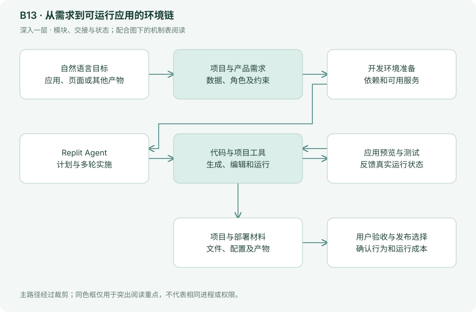

| 模块／交接点 | 怎样工作 | 状态与边界 |
|---|---|---|
| 项目环境 | 代码与依赖在产品环境中组织 | 迁出时要带走配置和数据依赖，而不只下载源文件。 |
| 运行反馈 | 预览和应用测试参与迭代 | 演示路径可用不等于生产异常路径可靠。 |
| 交付阶段 | 开发、发布与持续运行有不同成本 | Agent 使用费不能代表应用上线后的总费用。 |

**沿着一次任务看数据怎样走。** 例如生成预约系统：先明确用户身份、时区和重复预约规则，再实现并测试。预览成功后，仍需核对真实数据、认证、部署配置和回滚方式，才能判断它是否适合长期使用。

**与相近工具的实质差别。** 与现有仓库中的编码代理相比，Replit 更强调完整应用起步；与 Dify 的业务流程应用相比，交付的是可运行软件项目，其维护责任也随之增加。

本节细图与机制依据：[replit-agent](https://docs.replit.com/replitai/agent.md)、[replit-build-with-agent](https://docs.replit.com/learn/build-with-agent.md)、[replit-autonomy](https://docs.replit.com/replitai/autonomy-level.md)。箭头表示主要信息或控制交接，不表示所有分支必然并行；省略的模块不能视为不存在。

### 能力、状态与边界

| 观察项 | 实际机制／公开能力 | 对使用者意味着什么 |
|---|---|---|
| 起步 | 需求、代码和环境在同一平台 | 适合先验证核心流程，减少本地搭建成本 |
| 预览 | 生成后运行并交互检查 | 预览可用不等于生产部署已准备完成 |
| 模型选择 | Lite／Economy／Power 等能力路线 | 按任务与预算选档，不臆造固定模型映射 |
| 数据与认证 | 随应用引入相关服务 | 先设计真实数据和账户边界 |
| 费用 | Agent 使用及应用持续运行等项目 | 分别记录开发成本和上线后的月成本 |
| 迁移 | 源码、数据库、配置与部署分别处理 | 演练重建，确认离开平台还能运行 |

**把机制放进实际工作。**

平台降低了开发环境门槛，也容易让原型与生产系统看起来过于相似。几条测试数据可以展示流程，真实使用却要考虑并发、输入错误、权限与数据恢复。应在引入真实用户前明确哪些部分已经验证，哪些只是演示。

部署费用与 Agent 费用应分开。一次生成完成后，应用可能继续占用计算、数据库或外部服务；为了上线不断返工，也会继续产生开发消费。先估算一个月实际使用规模，再选择部署方案，比只比较首轮生成价格更合理。

迁移演练可以发现隐藏依赖。把代码取出，在独立环境按说明启动，检查数据库、环境变量与部署配置是否齐全；只下载源码不能证明可离开平台。对初学者而言，托管起步的便利仍很有价值，但应把数据与运行方式尽早记录，而不是等业务扩大才第一次梳理。

### 从安装到完成第一个任务

1. 先写清目标用户与一个核心流程，例如录入事项、查询和导出；不要第一轮要求完整商业平台。

2. 让 Agent 生成最小版本，用预览逐步验收。发现偏差时说明具体行为，避免反复整体重做。

3. 准备使用真实数据前，检查存储、认证和访问规则；需要登录或支付时单独设计和验证。

4. 根据任务复杂度选择能力档位与预算，关注多轮返工的累计费用。较小修改优先试轻档，确有困难再提升。

5. 发布前核对持续运行成本与服务配置；保存源码和重建说明，试着导出必要数据。正式业务还需安排监控、备份与维护责任。

下面是启动命令或操作路线；路径、认证与功能入口请按自己的版本调整。

```text
第一版需求建议控制为：
一个主要用户角色＋一条核心流程＋少量必要数据
验收顺序：可运行 → 流程正确 → 数据正确 → 权限正确
随后再决定部署、付费功能与规模扩展。
```

### 典型任务与验收方法

下面是一份**可直接改写使用的试用任务**，属于本报告设计的验收示例，并非已完成的运行测试。

> 做一个团队书籍借阅原型：登记书籍、借出、归还和查询。先使用测试数据，明确哪些功能只是演示，再决定真实账户与数据存储方案。

用同一本书重复借出、归还不存在的记录和空字段测试业务约束。若页面完整但数据状态混乱，就仍是界面原型。额外记录从开始到可验收版本的总费用，而不是只记录第一轮生成。

### 模型搭配、适用方向与取舍

推荐使用产品提供的 Lite／Economy／Power 等能力档位与内置路由，而不承诺某个具体模型永远位于某个档位。小调整使用轻档，大改造再提高能力与预算。适合原型、内部小工具、演示应用和非开发者试验。难度：低；维护真实业务仍需要工程知识。[使用与费用](https://docs.replit.com/learn/build-with-agent.md)、[预算管理](https://docs.replit.com/billing/managing-spend.md)

| 选择路线 | 候选组合 | 怎样决定 |
|---|---|---|
| 快速原型 | 产品默认或合适的 Lite／Economy | 先用小范围需求获得可验收版本。 |
| 复杂改造 | Power 等产品开放档位 | 明确预算与边界后升级，不承诺永久绑定某个型号。 |
| 上线成本 | 模型与运行服务分开核算 | 数据库、托管与持续服务不是一次 Agent 费用。 |

适合非开发者验证想法、内部小工具和演示应用。便利来自平台承担环境与部署，代价是服务依赖和迁移工作。复杂长期系统可用它做原型，但不应跳过后续工程设计；已有成熟仓库则可能更适合本地或远程编码代理。

### 资料依据与继续阅读

[Agent 介绍](https://docs.replit.com/features/agent/overview.md)、[使用与费用](https://docs.replit.com/learn/build-with-agent.md)、[预算管理](https://docs.replit.com/billing/managing-spend.md)。

完整商业运行时未公开，结构判断以官方可见行为和接口为限。上面的流程建议与取舍是依据这些材料给出的选型判断；具体型号、权限和菜单以实际安装与账户为准。

<a id="b14"></a>

## B14 Qoder：把项目知识和目标式执行放在同一个产品里

### 定位与设计理念

Qoder 同时强调代码理解、项目知识材料与较完整任务的推进。Quest 等工作方式希望把“告诉它目标”转成持续执行；Repo Wiki 则试图让项目背景成为可复用材料。[产品概览](https://docs.qoder.com/qoder/overview.md)、[Quest](https://docs.qoder.com/user-guide/quest/overview.md)

Qoder 将项目知识与目标式执行放在一起：先帮助理解已有仓库，再推进较完整的开发任务。Repo Wiki 是一种可复用的项目说明，Quest 等方式则强调围绕目标持续工作。这个组合适合刚进入陌生项目的人，但自动生成的知识材料应视为待核对的地图，而不是比代码更权威的真相。

### 工作原理与架构图

下图依据官方公开接口整理，表示责任分工，不代表已审计闭源内部实现。

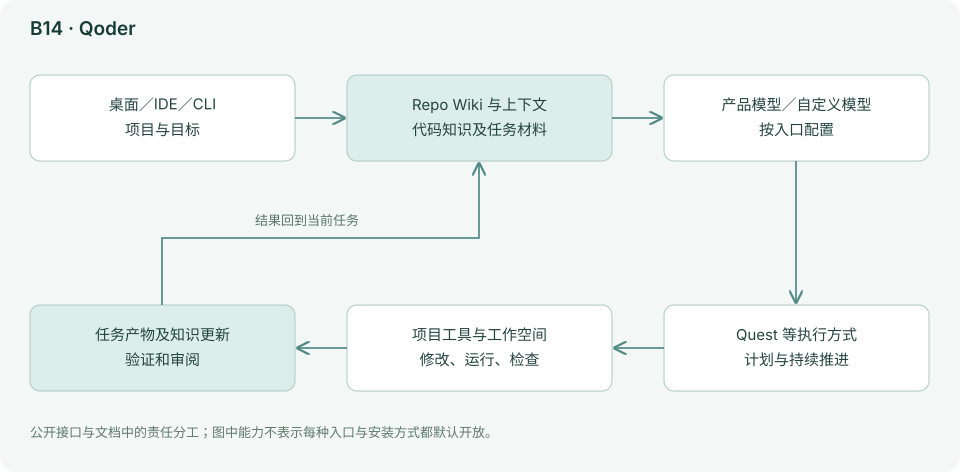

当前桌面、IDE、CLI 等入口的历史和配置不应默认完全互通；文档对导入与独立空间有具体说明。自定义模型也不代表所有辅助能力都使用自己的 Key，例如 Repo Wiki 使用固定模型并单独消耗平台额度。[自定义模型](https://docs.qoder.com/qoder/custom-models.md)

项目知识可以减少每次从零探索的成本，但代码持续变化后，说明也需要更新。任务运行时仍要回到真实文件确认关键行为。自定义模型与平台辅助能力又是两条费用路径：即使主要对话使用自己的 Key，Repo Wiki 等功能仍可能调用产品固定模型并消耗平台额度。因此需要按能力拆账，而非简单分成 BYOK 或订阅两类。

#### 深入一层：Quest 任务、知识背景与代码审阅

Qoder 的 Quest 把任务作为较完整的工作单元：创建时选择场景和模式，执行中可以查看步骤与资料引用，之后在 Review 中审查文件差异。Repo Wiki、知识卡片和记忆帮助提供背景，但最终修改仍需对照当前仓库。官方文档还区分对话编辑触发的回滚与普通持续追问，不能把所有“返回上一条”都理解成相同操作。

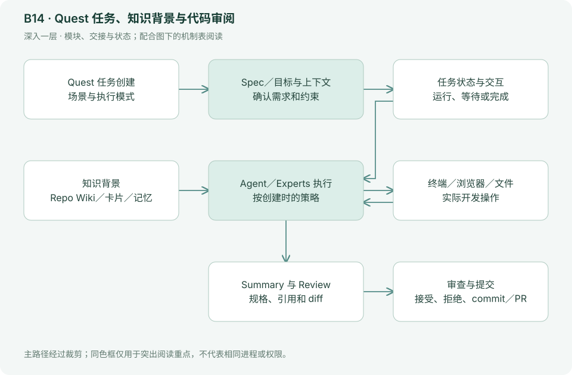

| 模块／交接点 | 怎样工作 | 状态与边界 |
|---|---|---|
| 任务配置 | 场景与 Agent／Experts 策略在创建时确定 | 运行后并非所有设置都可随意切换。 |
| 知识与引用 | 资料进入执行，并可在 Summary 中查看 | 知识背景需要核对当前版本，不能替代实际代码。 |
| 审阅与回滚 | Review 支持检查或拒绝改动；编辑消息有其回滚语义 | 操作前确认影响的是对话、文件还是两者。 |

**沿着一次任务看数据怎样走。** 例如按 Spec 新增 API：先确认接口约束，执行时查看所引用的仓库知识，完成后逐文件审查，再提交。若重写旧消息，应先理解文档中的工作区回滚行为，避免把已经手工修改的内容当成普通聊天重试。

**与相近工具的实质差别。** 与 ZCode 的会话分叉相比，文件是否回滚是实质差异；与一般编辑器聊天相比，Quest 把任务状态和审阅面板连接得更紧密。

本节细图与机制依据：[qoder-quest](https://docs.qoder.com/user-guide/quest/overview.md)、[qoder-overview](https://docs.qoder.com/qoder/overview.md)。箭头表示主要信息或控制交接，不表示所有分支必然并行；省略的模块不能视为不存在。

### 能力、状态与边界

| 观察项 | 实际机制／公开能力 | 对使用者意味着什么 |
|---|---|---|
| 知识材料 | Repo Wiki 等项目说明 | 先核对关键入口和数据流，保留原始代码依据 |
| 目标执行 | Quest 等持续任务工作方式 | 完成标准需具体到结果和测试 |
| 多入口 | 桌面、IDE、CLI 各有配置范围 | 导入不等于历史与所有配置自动互通 |
| 模型 | 产品目录与部分自定义 Provider | 按当前入口验证实际模型 ID |
| 辅助费用 | 部分知识能力固定使用平台模型 | 自有 Key 不会覆盖所有平台消费 |
| 迁移 | 代码、知识、规则与会话分开 | 保存关键需求和检查点后再切模型或入口 |

**把机制放进实际工作。**

Repo Wiki 为陌生项目建立入口，但它仍是根据代码与资料形成的说明。最需要核对的是关键业务规则、数据流和跨模块关系，而不是目录名是否都出现。说明与源码冲突时，先查真实行为与版本，不让生成文档成为新的错误权威。

目标式执行需要当前目标、进度和验证条件共同存在。切换模型前只保存初始需求，可能丢失已经排除的方案和失败原因。把这些材料写成可读检查点，再由新会话核对实际文件，可以减少重复调查。

主模型与辅助知识能力的收费范围不同，是多入口产品常见的取舍。用户使用自有 Key 时，仍应检查平台是否对 Wiki、远程任务或其他服务另外扣费。比较时不仅要记录调用量，也要观察这些能力是否减少了理解项目的人工时间；只有费用和收益一起看，才知道整合是否值得。

### 从安装到完成第一个任务

1. 选定一个常用入口导入仓库，确认实际模型与计费方式；先让它说明项目结构和运行方法。

2. 使用项目知识功能后，抽查数据流、入口和关键业务规则；对错误内容回到代码修正，而不是继续引用。

3. 提交一个有明确输出的任务，用 Quest 等工作方式推进；要求保留阶段成果、测试结果和未解决事项。

4. 切换模型或入口前保存关键约束，再核对新会话是否读到相同材料。自定义模型单独测试工具和恢复。

5. 完成后检查代码与知识说明是否一致，同时核对模型费用和平台辅助能力消耗，判断是否值得长期保留。

下面是启动命令或操作路线；路径、认证与功能入口请按自己的版本调整。

```text
陌生项目试用路线：
项目知识 → 抽查三条关键事实 → 明确任务与验收
→ 目标执行 → 检查代码与知识是否同步
费用记录分开列：主模型、Repo Wiki 等辅助能力。
```

### 典型任务与验收方法

下面是一份**可直接改写使用的试用任务**，属于本报告设计的验收示例，并非已完成的运行测试。

> 根据项目现状补充一个管理员筛选功能。先确认已有权限与查询规则，再实现；最后更新相关项目说明，指出哪些原有知识已经过时。

这个任务同时检验知识与执行两层。若说明写得流畅却引用旧代码，应先修知识；若依据正确但实现不符，则检查执行模型和任务边界。关注完成后知识是否被主动或人工同步。

### 模型搭配、适用方向与取舍

当前 CLI 文档列出 Qwen3.8-Max、Kimi-K3、GLM-5.3、DeepSeek-V4 等选项，并支持若干 Provider 的自定义模型。可按同一任务比较中文项目理解、成本和工具稳定性。适合大型项目入门、中文开发、既要项目知识又要目标执行的用户。难度：低中。[模型配置](https://docs.qoder.com/cli/model.md)

| 选择路线 | 候选组合 | 怎样决定 |
|---|---|---|
| 中文工程 | 当前 Qwen／Kimi／GLM／DeepSeek 选项 | 用同一项目验证理解、编辑与恢复。 |
| 自定义路线 | 对应入口支持的 Provider | 实际模型 ID、上下文与工具能力单独核对。 |
| 辅助知识 | Repo Wiki 等产品固定能力 | 自有 Key 不能替代所有平台额度，单列消费。 |

适合项目入门、中文开发和希望知识材料与目标执行结合的人。代价是知识维护及多路费用。与 Augment 比较时，关注检索服务与显式 Wiki 的不同；与 Kiro 比较时，关注理解现有项目和定义新需求的不同。

### 资料依据与继续阅读

[产品概览](https://docs.qoder.com/qoder/overview.md)、[Quest](https://docs.qoder.com/user-guide/quest/overview.md)、[自定义模型](https://docs.qoder.com/qoder/custom-models.md)、[模型配置](https://docs.qoder.com/cli/model.md)。

完整商业运行时未公开，结构判断以官方可见行为和接口为限。上面的流程建议与取舍是依据这些材料给出的选型判断；具体型号、权限和菜单以实际安装与账户为准。

<a id="b15"></a>

## B15 腾讯 CodeBuddy：面向中文开发生态的多入口代理

### 定位与设计理念

CodeBuddy 覆盖 IDE、插件和 CLI；其上下文入口包括文件、代码片段、文档、Git 与终端。对微信小程序、腾讯云相关开发者，现成资料入口和中文工作流有实用价值，但这不等于其他项目不能用。[上下文文档](https://www.codebuddy.ai/docs/ide/User-guide/Context)

CodeBuddy 把代理能力放进多种开发入口，同时面向中文和腾讯相关开发生态。对于已有小程序、云服务与团队工具链的用户，现成上下文入口可能比自己拼装连接器更方便。它的价值应在真实项目中衡量；国内、国际、IDE 和 CLI 各自提供什么，不能只凭共同品牌推断。

### 工作原理与架构图

下图依据官方公开接口整理，表示责任分工，不代表已审计闭源内部实现。

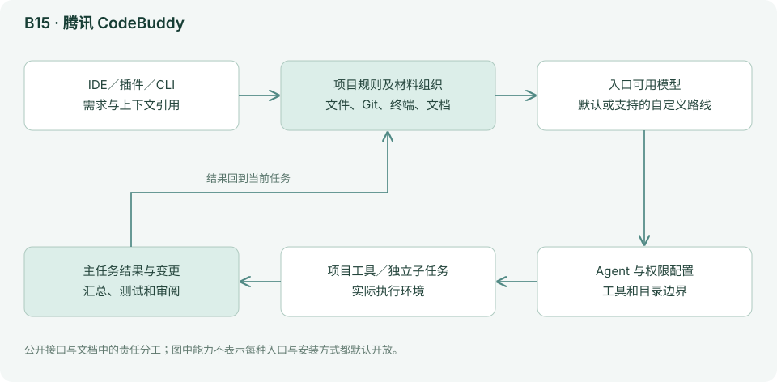

CLI 的自定义子代理可以配置职责、工具和独立上下文，结果返回主代理；项目级与用户级配置承担不同作用。官方还提供团队、工作树、沙箱与 SDK 等文档入口。由于完整商业运行时未公开，本报告只确认文档所述行为，不推断它内部一定复用了某个竞品的实现。[子代理](https://www.codebuddy.cn/docs/cli/sub-agents)、[设置](https://www.codebuddy.cn/docs/cli/settings)

精确引用报错、Git 变更和文件，可以帮助代理从正确位置开始；如果上下文没有指向真正模块，中文对话再顺畅也可能改错。CLI 自定义子代理把一类职责独立保存，主代理调用后获得汇总。工具和权限可能存在继承关系，因此“新建一个研究角色”并不天然意味着只读，要核对最终工具集。

#### 深入一层：产品入口、项目工具与模型渠道

CodeBuddy 的公开能力应按具体入口、地区和账户理解。较细一层可以确定的是：用户资料要进入上下文，模型产生工具意图，工具在相应环境执行，再把观察送回任务。图采用这种公开接口级拆解，不给尚未公开的内部调度器、存储引擎或压缩算法杜撰名称。

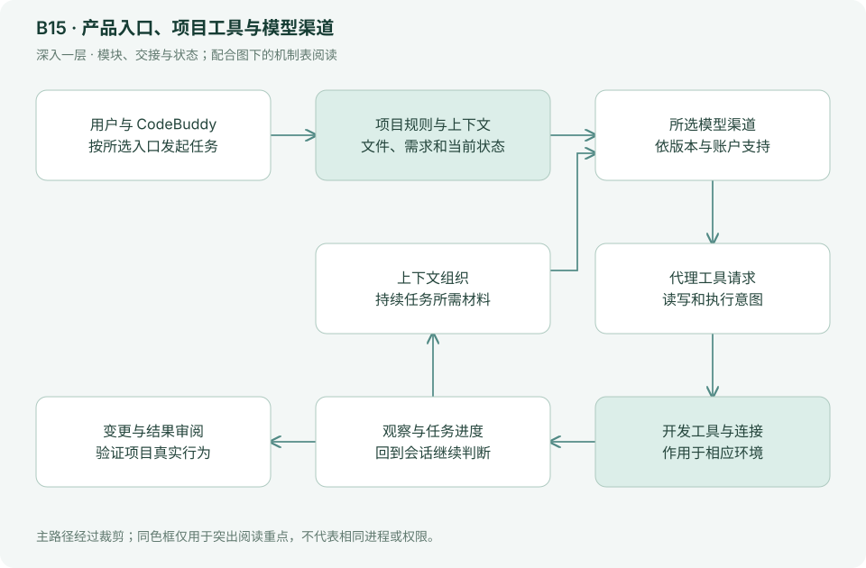

| 模块／交接点 | 怎样工作 | 状态与边界 |
|---|---|---|
| 入口与环境 | IDE、其他客户端或服务对应不同使用条件 | 先确认当前入口支持的工具与执行位置。 |
| 模型渠道 | 模型选择经过产品提供的接入方式 | 一个渠道能聊天，不证明所有 Agent 功能等价。 |
| 结果检查 | 任务输出应与代码变更和运行结果对应 | 界面成功提示不能代替具体行为验收。 |

**沿着一次任务看数据怎样走。** 例如修复业务规则：提供受影响模块与不能改变的行为，让代理读取实现、修改并检查。若想换模型，应在同一入口、相同初始代码和权限下重做任务，才能更清楚地比较差异。

**与相近工具的实质差别。** 与能够逐文件分析的开源循环相比，这里的内部证据较有限；与其他商业开发工作台相比，入口、渠道及实际执行边界比模型列表长度更有选型价值。

本节细图与机制依据：[codebuddy-cn](https://www.codebuddy.cn/)、[codebuddy-index](https://www.codebuddy.ai/docs/llms.txt)。箭头表示主要信息或控制交接，不表示所有分支必然并行；省略的模块不能视为不存在。

### 能力、状态与边界

| 观察项 | 实际机制／公开能力 | 对使用者意味着什么 |
|---|---|---|
| 产品入口 | IDE、插件和 CLI | 功能与模型按版本和地区分别核对 |
| 上下文 | 文件、代码片段、文档、Git 与终端 | 优先提供与问题直接相关的材料 |
| 子代理 | 独立职责、上下文与工具配置 | 检查继承后的有效权限 |
| 扩展路线 | 团队、工作树、沙箱与 SDK 文档 | 可用性以对应入口说明为准 |
| 生态 | 中文及腾讯相关开发场景 | 生态熟悉度不能替代项目实际验证 |
| 商业边界 | 完整运行时未公开 | 不推断内部一定使用某款竞品核心 |

**把机制放进实际工作。**

上下文引用可以减少代理猜测，但要选择正确证据。报错来自运行时，Git diff 描述最近改动，接口文档说明预期契约，三者各有作用。代理需要把它们联系起来，而不是只因为某个文件最近改过，就认定它一定是根因。

子代理的职责与权限应一起定义。“研究员”可以要求只返回结论，却仍可能继承命令工具；真正只读需要对应执行限制。团队或工作树功能则另涉及目录、取消与结果集成，不能由一个角色配置文件推断全部能力。

相关生态可以减少查找资料和配置入口的成本，但实际项目仍可能使用不同 API 版本或自定义组件。让代理对照当前依赖与真实输出验证。国内外版本、插件和 CLI 的模型及额度也应分别记录，避免把一个入口的成功经验直接当作整个产品家族的承诺。

### 从安装到完成第一个任务

1. 选定国内或国际版本及一个入口，完成登录与模型配置；查看实际权限，确认账单和组织政策。

2. 打开真实项目，显式引用出问题的文件、终端输出或 Git 变更；让代理先说明调用关系和运行方法。

3. 给出最小修复任务，保持业务边界清楚。涉及小程序或云服务时，用项目实际配置和官方接口资料核对实现。

4. 需要反复进行同类调查时，再在 CLI 建立职责清楚的子代理，检查其工具和权限，而不只看角色描述。

5. 完成后检查代码、运行结果和部署假设。需要团队或工作树再逐项试验，不把另一个入口的教程直接套过来。

下面是启动命令或操作路线；路径、认证与功能入口请按自己的版本调整。

```text
给代理的上下文建议：
相关文件＋真实报错＋当前 Git 变更＋复现路径
然后说明：期望行为、允许修改范围、验证命令
子代理则另外写清职责、输出格式与工具权限。
```

### 典型任务与验收方法

下面是一份**可直接改写使用的试用任务**，属于本报告设计的验收示例，并非已完成的运行测试。

> 小程序的分页列表在切换筛选后出现旧数据混入。请引用现有状态管理和接口代码，修复竞态，验证快速切换、空页和网络错误。

检查它是否理解请求顺序和状态重置，而不是简单清空数组掩盖问题。生态资料可以帮助定位 API，但最终应以实际项目运行和测试为准。比较不同地区版本时记录模型和工具差异，避免错误归因。

### 模型搭配、适用方向与取舍

以当前版本实际提供的模型和自定义接入为准，优先产品默认路线；需要固定模型时先验证工具调用。适合中文团队、小程序、腾讯云相关开发以及希望兼顾插件和 CLI 的人。难度：低中。WorkBuddy 属于扩展到办公任务的相邻产品，不能用它的能力反推所有 CodeBuddy 入口。

| 选择路线 | 候选组合 | 怎样决定 |
|---|---|---|
| 生态基线 | 当前版本默认或可选模型 | 先验收相关项目和工具，地区目录分别记录。 |
| 困难开发 | 入口允许的更强工具模型 | 以重现、修改、测试的完整结果判断。 |
| 自定义路线 | 仅使用明确支持的服务配置 | 不凭国际版或另一入口的文档推断可用性。 |

适合中文团队、相关云生态和希望兼顾插件与 CLI 的用户。优势是现成整合，代价是地区、入口与配置差异。复杂多模型研究更适合开放底座；单一生态开发则可能因少配一些东西而节省更多时间。

### 资料依据与继续阅读

[上下文文档](https://www.codebuddy.ai/docs/ide/User-guide/Context)、[子代理](https://www.codebuddy.cn/docs/cli/sub-agents)、[设置](https://www.codebuddy.cn/docs/cli/settings)。

完整商业运行时未公开，结构判断以官方可见行为和接口为限。上面的流程建议与取舍是依据这些材料给出的选型判断；具体型号、权限和菜单以实际安装与账户为准。

<a id="b16"></a>

## B16 ZCode：把 GLM 的长任务能力放进目标管理流程

### 定位与设计理念

ZCode 官方明确围绕 GLM-5.3 适配，重点包括复杂项目理解、长任务、连续代码修改和恢复。Goal Mode 将目标、完成检查和状态恢复放在一个流程里，方向类似“任务尚未完成，就保留继续工作的依据”。[Agent 文档](https://zcode.z.ai/en/docs/agents)

ZCode 将长任务与目标管理结合，希望代理不仅处理当前一句话，还能保留继续工作的依据。对跨多次会话的改造，这比单纯增加窗口长度更有意义。但目标保存只解决“回来时知道要做什么”，完成判断仍需要测试、文件和需求证据，不能由一句自我报告决定。

### 工作原理与架构图

下图依据官方公开接口整理，表示责任分工，不代表已审计闭源内部实现。


文件引用、工作空间、Git 分支、执行模式和推理档位共同决定代理的工作上下文。持久目标不等于模型拥有无限记忆，仍依赖任务状态被正确保存和重新装载。官方还特别说明 `CLAUDE.md` 在迁移时可作为一次性来源，后续使用 `AGENTS.md`；不能看到熟悉的文件名就假定运行时一直自动读取它。

持续目标可以在一轮结束后帮助决定是否继续，也能在暂停后装载当前进度。真正关键的是恢复材料包含哪些事实：已经改过的文件、验证结果、仍未解决的问题和下一步。若只是重复初始需求，模型仍可能重做工作。项目指令迁移同样需要明确：将旧 CLAUDE.md 导入一次，与每次运行持续读取该文件，是不同机制。

#### 深入一层：主会话、侧边讨论与分叉历史的不同语义

ZCode 的会话分叉有明确的产品语义：从干净完成的助手消息处分出历史，而不是复制所有后台运行状态；排队输入、在途工作和后台任务不会一并复制。更重要的是，分叉不回滚磁盘文件，两个会话仍面对同一个工作区。侧边讨论也应和分叉分别理解，不要仅凭多个聊天面板推断隔离。

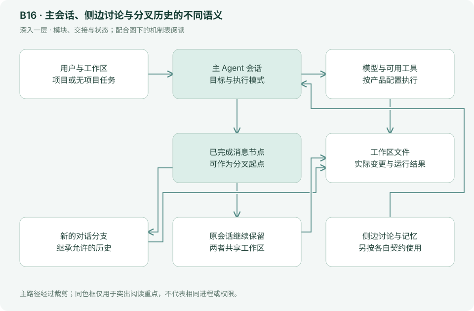

| 模块／交接点 | 怎样工作 | 状态与边界 |
|---|---|---|
| 分叉起点 | 已完成的助手消息才可作为起点 | 失败的半条回复或工具结果不能随意当恢复点。 |
| 共享文件 | 两条会话操作相同工作区 | 同时实施不同方案可能互相覆盖。 |
| 接续状态 | 队列与后台工作不随历史复制 | 新会话需要重新确认正在运行的操作。 |

**沿着一次任务看数据怎样走。** 例如在方案 A 后分叉讨论方案 B：新对话有继承的历史，但文件仍含当前改动。应先查看 diff，再决定只讨论、创建代码分支或实施；不能以为“新分支”已经自动给你一份干净仓库。

**与相近工具的实质差别。** 与 Qoder 编辑旧消息触发的回滚不同，ZCode 明确把对话分叉和文件回滚分开。与 Pi 的树状历史相似之处在于上下文分支，具体宿主状态仍各自管理。

本节细图与机制依据：[zcode-agent](https://zcode.z.ai/en/docs/agents)。箭头表示主要信息或控制交接，不表示所有分支必然并行；省略的模块不能视为不存在。

### 能力、状态与边界

| 观察项 | 实际机制／公开能力 | 对使用者意味着什么 |
|---|---|---|
| 原生适配 | 围绕 GLM-5.3 的官方路线 | 产品适配主张与跨产品胜负分开理解 |
| 目标管理 | Goal Mode、状态及恢复 | 完成标准需外部可查，不能只凭目标状态 |
| 项目上下文 | 工作空间、文件引用与指令 | 让关键约束进入实际读取的文件 |
| 迁移规则 | 旧指令可作迁移来源，后续使用 AGENTS.md | 修改旧文件后不要假定当前任务自动更新 |
| 执行设置 | 模式、分支与推理档位 | 目录隔离、权限和模型能力分别核对 |
| 兼容性 | 其他 Provider 按实际版本确认 | 不把原生模型表现推及任意自定义后端 |

**把机制放进实际工作。**

持续目标需要明确结束条件。比如“完成配置迁移”应包含哪些调用方必须替换、哪些兼容测试必须通过，而不是只凭模型觉得工作差不多。目标越抽象，自动继续越可能变成无止境扩展；设置阶段成果与验收有助于让任务及时停下。

暂停恢复是检查状态质量的好方法。让代理指出已完成文件、实际验证和下一步，再与磁盘核对；若只复述最初目标，说明恢复材料不够。人手修改过文件后尤其要重新核对，避免旧检查点覆盖最新进展。

项目指令迁移也需区分一次导入与持续读取。修改旧规则文件后行为没有变化，可能是当前运行时已经使用另一份文件，而非模型故意不遵守。先核对真实来源与生效范围，再调整提示或推理档位。原生模型适配能改善部分执行，不能替代任务状态和项目配置正确性。

### 从安装到完成第一个任务

1. 导入一个已有仓库，确认模型、项目目录和执行模式；核对当前项目指令实际来自哪里。

2. 用一个当天可以完成的需求试 Goal Mode，写清完成条件和改动范围，不使用“尽可能完善”这类无终点目标。

3. 要求在阶段结束保存文件、检查和待办，主动暂停一次，再恢复并核对这些事实。

4. 实施过程中遇到目标变化，明确更新目标与验收，而不是继续沿用旧任务清单。

5. 交付后查看 diff 和真实测试，记录恢复是否减少重复工作；稳定后再扩大任务长度或尝试其他模型路线。

下面是启动命令或操作路线；路径、认证与功能入口请按自己的版本调整。

```text
长任务检查点建议：
目标与不可改变的约束
已完成文件与验证证据
失败尝试及原因
下一步和仍需决定的问题
恢复时先核对检查点，再继续修改。
```

### 典型任务与验收方法

下面是一份**可直接改写使用的试用任务**，属于本报告设计的验收示例，并非已完成的运行测试。

> 分阶段替换项目中的旧配置读取方式。每完成一个模块保存进度与检查结果；暂停后从未完成部分继续，保持旧配置兼容。

恢复测试要检查是否重复修改已完成模块、是否遗漏兼容要求，以及结束时是否仍有旧调用残留。运行时间长不是质量指标，能够准确推进和停在真正完成的位置才是。

### 模型搭配、适用方向与取舍

原生优先 GLM-5.3。官方的性能描述属于厂商主张，本报告确认其适配方向，不将“长任务更强”当作已经独立验证的跨产品结论。适合 GLM 用户、中文开发、需要持续目标管理的任务。难度：低中；涉及其他 Provider 的完整兼容程度仍需按版本核实。[模型介绍](https://docs.z.ai/guides/llm/glm-5.3)

| 选择路线 | 候选组合 | 怎样决定 |
|---|---|---|
| 原生基线 | GLM-5.3 | 优先验证长任务与目标恢复，而非只看单轮生成。 |
| 较难任务 | 原生模型的合适推理档位 | 先检查目标与材料是否充分，再提高投入。 |
| 跨模型对照 | 实际版本确认支持的 Provider | 无充分兼容证据时不当默认推荐，先跑基础工具测试。 |

适合 GLM 用户、中文工程沟通和持续目标改造。若需求经常变化，应先建立规范或任务边界；若只修一个小问题，目标模式可能没有额外收益。与 Step Code 比较时看持续控制，与 Kiro 比较时看前期规范，三者不必互相替代。

### 资料依据与继续阅读

[Agent 文档](https://zcode.z.ai/en/docs/agents)、[模型介绍](https://docs.z.ai/guides/llm/glm-5.3)。

完整商业运行时未公开，结构判断以官方可见行为和接口为限。上面的流程建议与取舍是依据这些材料给出的选型判断；具体型号、权限和菜单以实际安装与账户为准。

<a id="b17"></a>

## B17 Avante.nvim：在 Neovim 里获得可直接应用的代理修改

### 定位与设计理念

Avante 希望让用户保留 Neovim 的键盘工作习惯，同时获得类似 AI IDE 的项目对话、修改与差异审查。当前已有多 Provider、项目指令、可选检索、工具和 ACP 接入，不只是代码补全插件。[README](https://github.com/avante-corp/avante.nvim/blob/18316361891e59f3d18732fea0b1fe68c8be56e9/README.md)

Avante 将代理修改带进 Neovim，而不要求熟练用户离开已有键盘工作流。它不仅显示答案，也围绕选中文件、修改建议和差异审查组织使用。对已经维护 Lua 配置的人，这种可定制性很自然；对新手而言，插件依赖、模型接入与编辑器配置会叠加学习成本。

### 工作原理与架构图

下图结合所引源码与文档，画出本工具的主要责任分工；为便于理解，省略次要模块与错误分支。

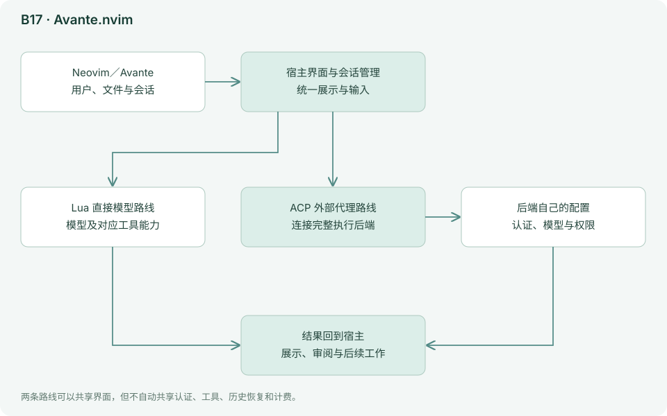

Lua 模型层区分直接调用 Provider 与 ACP 路径，并处理流、工具和记忆摘要。所检查的 `dispatch_agent` 面向独立的只读搜索任务，不能因此理解为一套默认可写文件的团队。ACP 路线又可能把代理运行交给 Codex、Gemini 等外部进程。[模型层](https://github.com/avante-corp/avante.nvim/blob/18316361891e59f3d18732fea0b1fe68c8be56e9/lua/avante/llm.lua)、[分派工具](https://github.com/avante-corp/avante.nvim/blob/18316361891e59f3d18732fea0b1fe68c8be56e9/lua/avante/llm_tools/dispatch_agent.lua)

直接 Provider 路线由插件组织模型消息和工具，ACP 路线则把完整代理职责交给外部进程。两者在编辑器里可能看起来相似，但认证、权限和恢复路径不同。源码中的 dispatch_agent 是受限的搜索分派，适合调查而非任意实施；不能看到一个 agent 名称就推断有完整可写团队。修改建议最后仍需按真实 diff 审查。

#### 深入一层：Neovim 上下文、模型适配与委派工具

Avante 把 Neovim 的编辑现场接到模型与工具流程中，LLM 层和 dispatch_agent 说明它并非只生成待复制的代码。理解编辑器插件时，还应单独看缓冲区：屏幕中已改的内容、磁盘文件和 Git 差异可能处于不同阶段。图聚焦所引直接请求与委派路径，不宣称覆盖所有可选外部 Agent 接法。

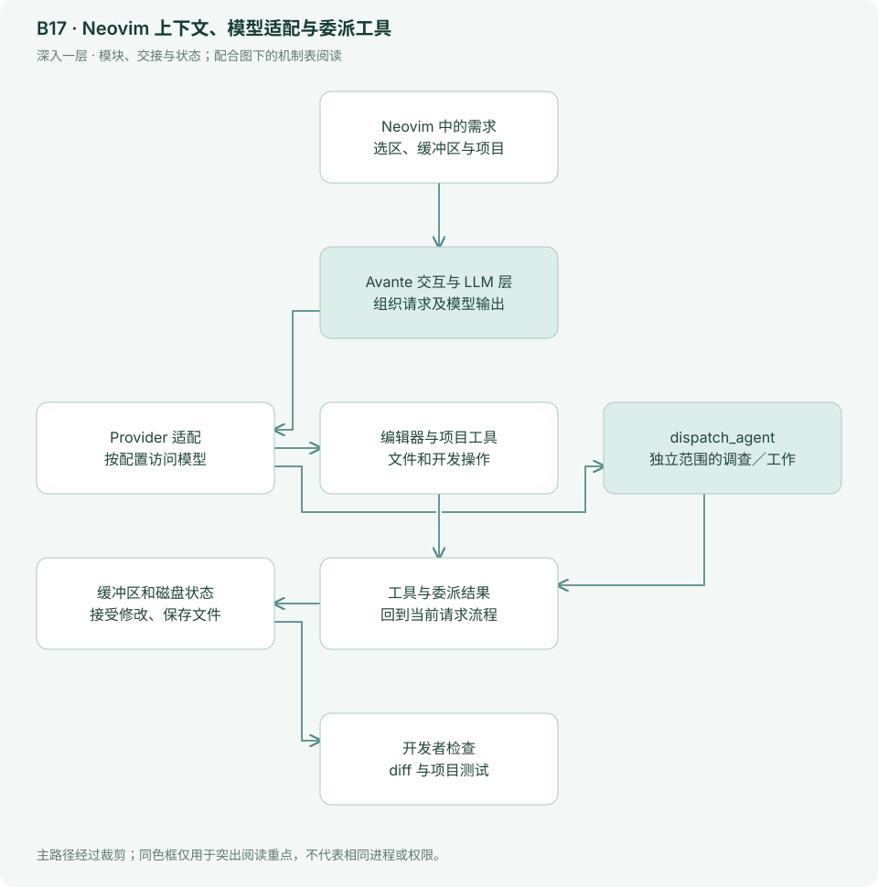

| 模块／交接点 | 怎样工作 | 状态与边界 |
|---|---|---|
| LLM 层 | 处理请求、输出及工具衔接 | 模型格式与工具契约需要一起适配。 |
| dispatch_agent | 把明确范围交给另一个任务执行实体 | 返回结论必须能支撑主任务继续。 |
| 编辑器状态 | 修改可能先体现在缓冲区 | 验收前确认保存状态与实际测试读取的文件一致。 |

**沿着一次任务看数据怎样走。** 例如修改 Lua 插件配置：先提供目标选区，再让代理调查相关模块，审查生成修改并保存，最后运行对应检查。若测试仍读到旧文件，问题可能出在未保存的缓冲区，而非代理忽略了改动。

**与相近工具的实质差别。** 与独立终端代理相比，编辑器现场是优势也是额外状态；与 CodeCompanion 相比，两者都需理解适配路径，但交互设计和工具实现不能混为一谈。

本节细图与机制依据：[llm.lua](https://github.com/avante-corp/avante.nvim/blob/18316361891e59f3d18732fea0b1fe68c8be56e9/lua/avante/llm.lua)、[dispatch_agent.lua](https://github.com/avante-corp/avante.nvim/blob/18316361891e59f3d18732fea0b1fe68c8be56e9/lua/avante/llm_tools/dispatch_agent.lua)、[README.md](https://github.com/avante-corp/avante.nvim/blob/18316361891e59f3d18732fea0b1fe68c8be56e9/README.md)。箭头表示主要信息或控制交接，不表示所有分支必然并行；省略的模块不能视为不存在。

### 能力、状态与边界

| 观察项 | 实际机制／公开能力 | 对使用者意味着什么 |
|---|---|---|
| 工作位置 | Neovim 内的项目对话与编辑 | 使用已有缓冲区和键盘习惯 |
| 两条后端 | 直接模型与 ACP 外部代理 | 明确当前由谁管理工具循环 |
| 项目规则 | avante.md 等支持的指令 | 规则路径与生效范围按版本核对 |
| 独立调查 | 所核验 dispatch_agent 为只读搜索 | 不可据此推定可写团队或无限派生 |
| 依赖 | Neovim、插件及部分构建依赖 | 先确认基础插件正常，再调模型 |
| 成本与权限 | 由所选 Provider／外部代理决定 | 编辑器统一不代表账户与授权统一 |

**把机制放进实际工作。**

插件在编辑器里获得选区和缓冲区内容，但用户仍需确认任务涉及哪些文件。只选中一个函数时，模型可能不了解调用方约定；盲目扩大上下文又会增加干扰。先局部解释，再按需要加入调用方，是较容易核对的使用方式。

HTTP 与 ACP 两条路径的错误位置不同。直接模型请求失败，应看 Provider、参数和工具格式；外部代理失败，应再看进程启动、认证、工作目录与其自身权限。不能因为界面相同，就在插件配置里寻找外部代理管理的全部设置。

diff 审查仍是最终控制点。接受建议前检查是否误改选区之外内容，接受后运行相关检查。只读调查子任务能帮助找线索，却不能代表任意可写团队。升级插件、语言环境或后端时，应先重做一个小修改，确认自己依赖的日常操作仍然可靠。

### 从安装到完成第一个任务

1. 按当前 README 检查 Neovim 版本与依赖，通过自己的插件管理方式安装；确认界面和必要构建步骤正常。

2. 先选择一个直接 Provider 或一个 ACP 后端，完成认证；不同时加入检索、多个模型与额外工具。

3. 选中小段代码，用 AvanteAsk 提出解释或修改，练习查看与接受 diff，确认实际应用位置。

4. 再让它处理跨文件任务，将长期约定放入文档支持的项目规则；只读调查任务要求返回文件与证据。

5. 需要外部 ACP 时单独检查代理安装、模型和权限。更新插件或后端后重复一次小修改，防止接口变化影响日常工作。

下面是启动命令或操作路线；路径、认证与功能入口请按自己的版本调整。

```vim
" 在 Neovim 中、插件已正确安装后执行
:AvanteAsk 解释当前函数的输入边界并提出最小修复
```

### 典型任务与验收方法

下面是一份**可直接改写使用的试用任务**，属于本报告设计的验收示例，并非已完成的运行测试。

> 当前函数对空字符串和缺失字段处理不一致。先解释调用方预期，再给出最小修改和测试；不要调整无关格式与接口。

观察上下文是否来自正确缓冲区、修改能否准确应用到目标范围，以及接受建议后的文件是否符合预期。Neovim 用户还应评估操作是否打断已有编辑节奏，不能只比较回答内容。

### 模型搭配、适用方向与取舍

按当前 Neovim 版本要求安装插件和依赖，先配置一个 Provider，再练习选取文件、提出修改和接受 diff；项目规则可放在 `avante.md`。直接接模型时选择已适配的 Claude／GPT 或其他工具模型；接外部 ACP 代理则沿用对方模型方案。适合熟练 Neovim 用户和终端开发者。难度：已有 Neovim 配置者中；初学者高。

| 选择路线 | 候选组合 | 怎样决定 |
|---|---|---|
| 直接模型 | 插件已适配 Claude／GPT 等 | 局部转换可用较快档，复杂编辑优先工具稳定。 |
| 完整代理 | ACP 接 Codex／Claude Code 等 | 模型、认证与权限沿外部代理配置。 |
| 本地或经济模型 | 已通过工具测试的兼容服务 | 先从选区与短任务开始，记录格式与补丁错误。 |

适合熟练 Neovim 用户和愿意配置工具的人。主要收益是保留工作习惯，代价是插件、依赖和后端的组合维护。与 CodeCompanion 比较交互和工作流设计；需要开箱即用 IDE 体验的人可能更适合商业编辑器或普通扩展。

### 资料依据与继续阅读

[README](https://github.com/avante-corp/avante.nvim/blob/18316361891e59f3d18732fea0b1fe68c8be56e9/README.md)、[模型层](https://github.com/avante-corp/avante.nvim/blob/18316361891e59f3d18732fea0b1fe68c8be56e9/lua/avante/llm.lua)、[分派工具](https://github.com/avante-corp/avante.nvim/blob/18316361891e59f3d18732fea0b1fe68c8be56e9/lua/avante/llm_tools/dispatch_agent.lua)。

源码链接指向固定提交；关键实现分析不等于对整个项目和依赖逐行审计。上面的流程建议与取舍是依据这些材料给出的选型判断；具体型号、权限和菜单以实际安装与账户为准。

<a id="b18"></a>

## B18 CodeCompanion.nvim：把模型适配和完整代理接入明确分开

### 定位与设计理念

CodeCompanion 提供对话、局部转换、代码审查、工具和工作流，同时保留较强的编辑器配置自由。它适合希望在 Neovim 内按自己的习惯组合 AI 能力的人。[README](https://github.com/olimorris/codecompanion.nvim/blob/3af636c9892c70c5a4e91604718bf902076aff26/README.md)

CodeCompanion 把 Neovim 当作可组合的 AI 工作台，提供聊天、局部转换、审查与自定义工作流。它清楚区分模型适配和代理连接，使用户可以按任务选择：简单转换直接请求模型，复杂开发交给完整代理。灵活性很高，但用户要愿意明确每条路线的责任和配置。

### 工作原理与架构图

下图结合所引源码与文档，画出本工具的主要责任分工；为便于理解，省略次要模块与错误分支。

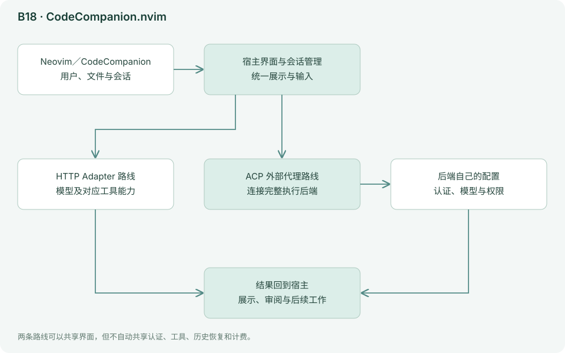

HTTP Adapter 处理模型请求、响应和工具格式；ACP Connection 处理外部代理的会话、能力、权限请求和流式更新。前者是“自己组织对话并请求模型”，后者是“把完整任务交给另一个代理”。两者都出现在同一编辑器里，但负责执行的人不同。[HTTP 适配](https://github.com/olimorris/codecompanion.nvim/blob/3af636c9892c70c5a4e91604718bf902076aff26/lua/codecompanion/adapters/http/init.lua)、[ACP 连接](https://github.com/olimorris/codecompanion.nvim/blob/3af636c9892c70c5a4e91604718bf902076aff26/lua/codecompanion/acp/init.lua)

HTTP Adapter 处理的是向模型发请求、解析流和工具格式；ACP Connection 处理的是与一个会自己执行任务的代理交流，包括会话更新与权限请求。前者类似给模型接插座，后者类似接一位完整同事。排错时先辨认这层边界：模型参数不支持与外部代理无法启动，不应采用同一种修复办法。

#### 深入一层：HTTP 模型适配与 ACP 代理适配的双路线

CodeCompanion 的 HTTP 与 ACP 适配层连接的对象不同。HTTP 连接的是模型接口，宿主需要组织工具调用；ACP 连接的是已经带有自身工具和会话逻辑的代理进程。两种配置都可能显示为聊天，但执行权、认证和恢复责任的位置不同。

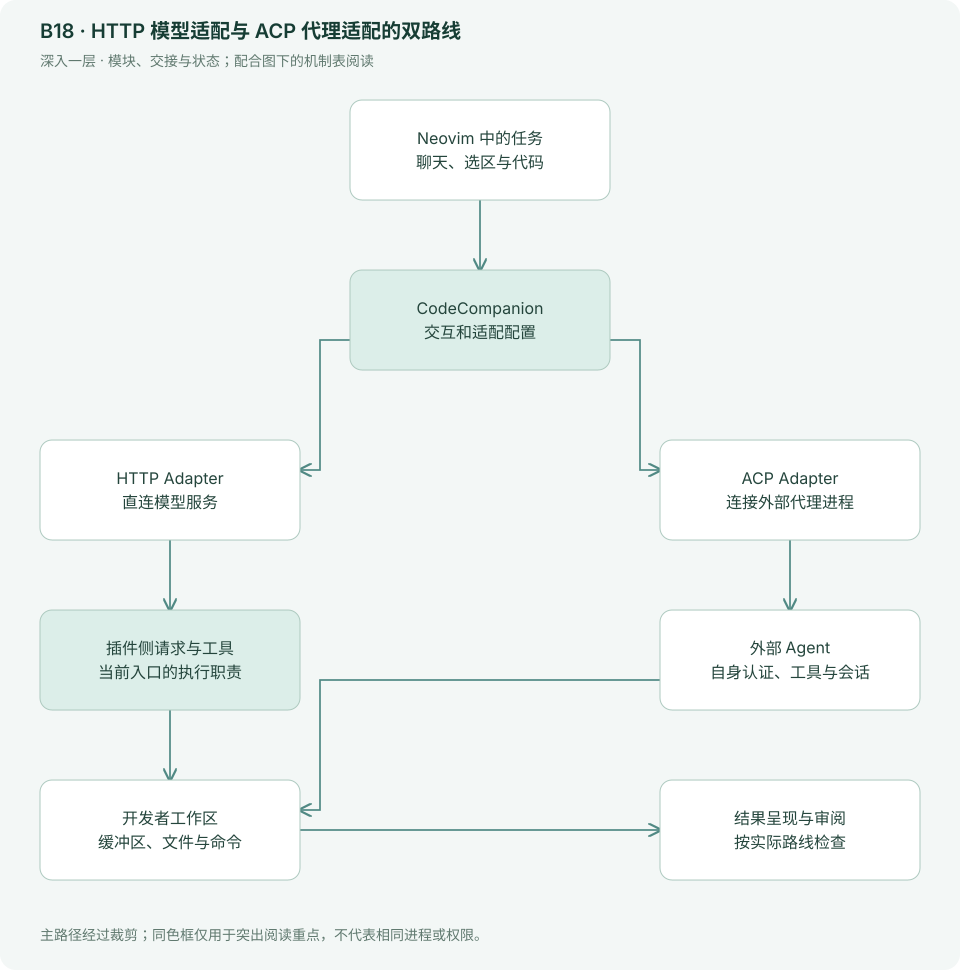

| 模块／交接点 | 怎样工作 | 状态与边界 |
|---|---|---|
| HTTP 路线 | 模型服务返回生成内容与工具意图 | 插件和配置需承担相应执行组织。 |
| ACP 路线 | 独立代理通过协议与编辑器沟通 | 模型和原生设置可能由外部代理管理。 |
| 共享界面 | 同一编辑器呈现不同运行路线 | 不能因为 UI 一样就沿用另一条路线的权限结论。 |

**沿着一次任务看数据怎样走。** 例如同样让它修改一份配置：HTTP 路线要检查插件工具是否开放，ACP 路线要检查外部代理是否登录、是否有访问工作区的权限。排错从适配入口开始，能避免反复修改无关的模型字段。

**与相近工具的实质差别。** 与 Avante 的直接代理能力相比，CodeCompanion 的双适配边界尤其值得单列；与 Zed 类似，编辑器可以是代理宿主，而不必拥有对方完整运行时。

本节细图与机制依据：[init.lua](https://github.com/olimorris/codecompanion.nvim/blob/3af636c9892c70c5a4e91604718bf902076aff26/lua/codecompanion/adapters/http/init.lua)、[init.lua](https://github.com/olimorris/codecompanion.nvim/blob/3af636c9892c70c5a4e91604718bf902076aff26/lua/codecompanion/acp/init.lua)、[README.md](https://github.com/olimorris/codecompanion.nvim/blob/3af636c9892c70c5a4e91604718bf902076aff26/README.md)。箭头表示主要信息或控制交接，不表示所有分支必然并行；省略的模块不能视为不存在。

### 能力、状态与边界

| 观察项 | 实际机制／公开能力 | 对使用者意味着什么 |
|---|---|---|
| 交互 | Chat、局部转换、审查和工作流 | 根据编辑尺度选择，不把所有操作变成长任务 |
| HTTP Adapter | 模型消息与工具格式适配 | 兼容服务需核对参数和返回格式 |
| ACP Connection | 外部代理会话、能力及审批 | 代理模型与权限在相应后端配置 |
| 规则和扩展 | 可按需接规则、Skills、MCP 等 | 配置越多，越需保留最小可用基线 |
| 运行责任 | 插件与外部代理分工明确 | 同一界面下可能有不同状态保存方式 |
| 维护 | 编辑器、插件和后端共同变化 | 升级分批进行，便于定位失效层 |

**把机制放进实际工作。**

一个轻量转换不一定需要完整代理。例如改写注释或转换选中代码，直接模型请求可能已足够；需要读多个文件、运行检查并纠错时，再使用完整工具循环或外部 ACP 代理。按工作尺度选择，能减少等待和不必要的配置。

自定义工作流应写清输入和输出，特别是结果应用到哪个缓冲区、是否允许跨文件修改、错误时怎样结束。一个漂亮提示模板如果没有这些约定，重复运行也可能产生不同副作用。先固定少量高频工作流，比把社区配置全部装进来更容易维护。

排错可以按编辑器、适配器、外部代理与模型四层进行。先确认选区和项目路径，再确认连接与认证，最后看工具与模型结果。只在 HTTP 路线正常，不能证明 ACP 路线也已配置好；反过来，外部代理本身可运行，也不能保证编辑器传递了正确上下文。

### 从安装到完成第一个任务

1. 安装符合当前要求的插件，先选 HTTP 或 ACP 一条路线；完成对应认证，确认简单提问能返回结果。

2. 从局部转换开始，如解释函数或改写注释，检查选区与输出插入方式；熟悉后再处理文件级修改。

3. 将重复提示整理成工作流，明确输入、输出和可用工具。不要一次添加所有社区配置。

4. 复杂任务接外部代理时，先在其自身入口验证，再通过 ACP 连接，检查审批、工具结果和会话结束能否正确呈现。

5. 升级或切换后端后，用相同小任务检查上下文、修改应用和权限；把工作流配置与模型版本一起记录。

下面是启动命令或操作路线；路径、认证与功能入口请按自己的版本调整。

```text
选择路线：
局部文本／代码转换 → HTTP Adapter → 模型
完整项目任务 → ACP Connection → 外部代理 → 其模型与工具
实际编辑器命令与适配器字段按当前 README 配置。
```

### 典型任务与验收方法

下面是一份**可直接改写使用的试用任务**，属于本报告设计的验收示例，并非已完成的运行测试。

> 为选中的函数写清楚输入、输出与异常说明，再检查一个实际调用方是否违反约定。只在确认错误后做最小修复并解释 diff。

这个任务先用轻量转换，再进入项目检查，能帮助判断何时需要完整代理。核对插件是否传入正确选区，外部后端是否获得调用方文件，以及两条路线的结果能否在编辑器中清楚审阅。

### 模型搭配、适用方向与取舍

安装插件后，先在 HTTP 模型与 ACP 代理两条路线中选一条。局部变换可以使用较快模型；复杂任务可接 Codex／Claude Code 等原生代理。再按需添加 MCP、规则和 Skills，避免一次改变整个配置。适合 Neovim 用户、自定义提示与工作流爱好者；模型和多入口配置成本较高。难度：中高。

| 选择路线 | 候选组合 | 怎样决定 |
|---|---|---|
| 直接模型 | 插件已适配 Claude／GPT 等 | 局部转换可用较快档，复杂编辑优先工具稳定。 |
| 完整代理 | ACP 接 Codex／Claude Code 等 | 模型、认证与权限沿外部代理配置。 |
| 本地或经济模型 | 已通过工具测试的兼容服务 | 先从选区与短任务开始，记录格式与补丁错误。 |

适合喜欢定制提示和编辑工作流的 Neovim 用户。优势是责任边界清楚、组合自由；代价是配置和多层排错。若希望少做配置并直接接受 AI 修改，可比较 Avante；若只想完成任务而不维护编辑器，应选择其他成品入口。

### 资料依据与继续阅读

[README](https://github.com/olimorris/codecompanion.nvim/blob/3af636c9892c70c5a4e91604718bf902076aff26/README.md)、[HTTP 适配](https://github.com/olimorris/codecompanion.nvim/blob/3af636c9892c70c5a4e91604718bf902076aff26/lua/codecompanion/adapters/http/init.lua)、[ACP 连接](https://github.com/olimorris/codecompanion.nvim/blob/3af636c9892c70c5a4e91604718bf902076aff26/lua/codecompanion/acp/init.lua)。

源码链接指向固定提交；关键实现分析不等于对整个项目和依赖逐行审计。上面的流程建议与取舍是依据这些材料给出的选型判断；具体型号、权限和菜单以实际安装与账户为准。

<a id="b19"></a>

## B19 Tabnine Agent：把企业模型选择与开发环境控制放在前面

### 定位与设计理念

Tabnine 当前不只有补全和 Chat，也有直接在开发环境中执行目标的 Agent。产品强调项目上下文、用户反馈和组织控制。对于已有企业部署约束的团队，模型治理和私有端点可能比追逐最新单一型号更重要。[Agent 说明](https://docs.tabnine.com/main/getting-started/tabnine-agent)

Tabnine Agent 把组织控制放在显眼位置。对于企业团队，能使用哪个模型、代码发到哪里、工具能执行什么，常常比单次回答的细微差别更重要。它适合在已有 IDE 和管理策略下引入代理；但企业治理能力需要按实际部署与合同确认，不能由一个“私有”标签推断所有数据路径。

### 工作原理与架构图

下图依据官方公开接口整理，表示责任分工，不代表已审计闭源内部实现。

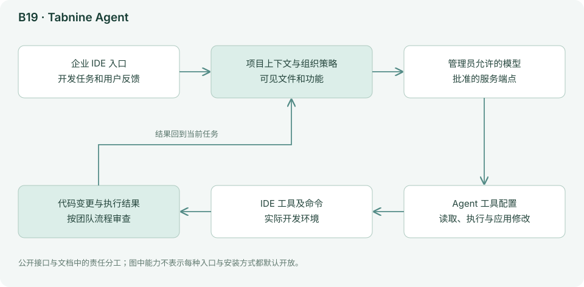

IDE 中的工具设置分别控制读取、命令和应用代码等能力；管理员可以决定组织可用的模型。完整商业核心未公开，因此本报告按公开配置描述其责任分工，不声称验证其内部调度算法。[工具设置](https://docs.tabnine.com/main/getting-started/tabnine-agent/agent-settings)

管理员选择可用模型，用户再在允许范围内发起任务；IDE 工具设置决定能读文件、运行命令或应用修改。它把模型治理与执行控制分开，但两者都需要验证。例如模型端点在内网，并不能说明某个工具不会访问外部网站；禁止执行命令，也不等于可以随意读取全部项目资料。完整商业核心未公开，内部调度不宜臆测。

#### 深入一层：企业配置、任务自治与开发者反馈

Tabnine Agent 的公开说明强调面向目标的自主工作，同时保留与开发者紧密的反馈循环。它与补全、即时问答的区别在于会主动推进多步任务；与无人值守的批处理相比，又会在需要时请求输入或继续执行。企业可选模型和部署条件应结合组织实际配置理解，图不推断私有实现。

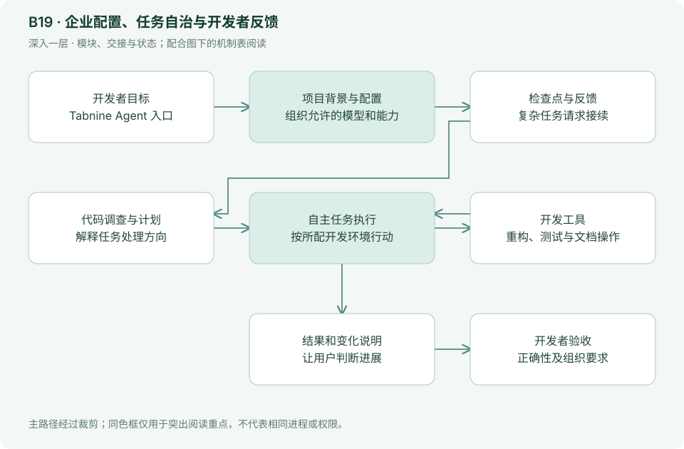

| 模块／交接点 | 怎样工作 | 状态与边界 |
|---|---|---|
| 组织配置 | 模型、服务和功能受组织条件影响 | 公开型号列表不能代表每个账户可用。 |
| 任务检查点 | 复杂工作可要求用户提供反馈或接续 | 等待确认不是模型没有能力继续。 |
| 项目交付 | 结果包含修改、测试或文档 | 合规与代码正确性需要分别验收。 |

**沿着一次任务看数据怎样走。** 例如按公司约定补全测试：先给出测试框架和禁止改动范围，代理调查并实施，开发者在检查点确认方向，最后查看测试行为和代码差异。不能仅因为工具属于企业产品就跳过项目验证。

**与相近工具的实质差别。** 与独立个人 CLI 相比，组织配置和开发者反馈是重要维度；与云端分支任务相比，实际执行位置仍需按部署和入口核对。

本节细图与机制依据：[tabnine-agent](https://docs.tabnine.com/main/getting-started/tabnine-agent)、[tabnine-settings](https://docs.tabnine.com/main/getting-started/tabnine-agent/agent-settings)、[tabnine-models](https://docs.tabnine.com/main/welcome/readme/ai-models)。箭头表示主要信息或控制交接，不表示所有分支必然并行；省略的模块不能视为不存在。

### 能力、状态与边界

| 观察项 | 实际机制／公开能力 | 对使用者意味着什么 |
|---|---|---|
| 组织模型策略 | 管理员控制可用模型 | 实际可选目录以组织和入口为准 |
| 工具设置 | 读取、命令与代码应用分别控制 | 使用前核对有效授权而非仅看默认值 |
| 开发上下文 | IDE 项目与用户反馈 | 先选代表性仓库，确认项目理解有效 |
| 部署路线 | 企业与私有端点等方案 | 数据、日志和工具出口需按部署核对 |
| 模型范围 | 官方目录列多个模型家族 | 目录存在不代表每个入口均可使用 |
| 源码边界 | 商业完整运行时未公开 | 以公开能力及组织试点结果评价 |

**把机制放进实际工作。**

组织治理不是在模型列表里选一个私有端点就结束。还要确认哪些文件进入上下文、工具以谁的身份运行、日志保存在哪里以及用户能否改变设置。模型推理和工具执行可能经过不同数据路径，应按实际部署分别核对。

试点项目应覆盖组织真正困难的情形：大仓库、严格权限、内部依赖和既有检查流程。只在公开小仓库成功，无法代表内部项目同样可用。工具被拒绝时要看说明是否清楚，模型不可选时要看是否透明提示，避免静默行为让团队误判结果。

管理员更改模型或策略后，实际任务表现也可能变化。保留几项代表性基线，重点检查受到改变的读取、执行和代码应用路径。企业选型的价值不只在平均生成质量，还在行为是否可解释、可管理，以及日常支持团队能否定位问题。

### 从安装到完成第一个任务

1. 由组织确定允许的部署、模型与数据策略，再在批准的 IDE 中启用 Agent；个人用户也应检查自己实际能选的模型。

2. 核对文件读取、命令执行和代码应用设置，选一个不依赖复杂外部环境的代表性项目。

3. 给出测试补齐或小重构任务，让代理先说明影响范围；检查它使用的上下文与团队规范是否一致。

4. 在组织允许的模型之间对照，记录完成、人工干预与费用；不要绕过策略只为追逐某个型号。

5. 试点通过后再扩大仓库和用户范围，安排配置更新、模型变更和权限调整的回归任务。

下面是启动命令或操作路线；路径、认证与功能入口请按自己的版本调整。

```text
企业试点记录：
部署与模型端点、组织允许的型号
可读范围、可执行工具、代码应用方式
代表性任务、验证结果、人工修正
模型或策略变更后重新检查同一任务。
```

### 典型任务与验收方法

下面是一份**可直接改写使用的试用任务**，属于本报告设计的验收示例，并非已完成的运行测试。

> 为现有服务补齐参数校验测试，并修复发现的一处遗漏。遵循项目规范，限制在指定模块中，交付测试证据与修改说明。

除了代码质量，还要确认任务全过程遵循实际组织策略。工具被拒绝时是否给出清楚说明，模型不可用时是否透明切换，均影响团队能否可靠采用。

### 模型搭配、适用方向与取舍

在组织批准的 IDE 与部署中启用 Agent，先确认读取和执行权限，再尝试一个范围明确的重构或测试任务。官方模型页列出 GPT、Claude、Gemini、Devstral 等选项，且并非所有型号都适用于所有入口；不能假定目录永远同步最新发布。适合企业代码助手、私有端点和统一模型策略。难度：个人低中；组织部署高。[模型目录](https://docs.tabnine.com/main/welcome/readme/ai-models)

| 选择路线 | 候选组合 | 怎样决定 |
|---|---|---|
| 组织起点 | 管理员批准的当前模型 | 部署与数据策略优先于个人型号偏好。 |
| 困难任务 | 批准目录内较强档位 | 用代表性项目比较，记录人工干预和真实调用。 |
| 私有端点 | 组织支持并验收的模型服务 | 另检查工具和日志出口，不能只看推理端点地址。 |

适合重视统一模型策略与开发环境治理的企业。选择成本主要在部署与管理，个人小项目未必需要这些能力。与其他企业 IDE 产品比较时，应使用真实组织要求和试点任务，不把宣传中的隐私词汇当作已验证事实。

### 资料依据与继续阅读

[Agent 说明](https://docs.tabnine.com/main/getting-started/tabnine-agent)、[工具设置](https://docs.tabnine.com/main/getting-started/tabnine-agent/agent-settings)、[模型目录](https://docs.tabnine.com/main/welcome/readme/ai-models)。

完整商业运行时未公开，结构判断以官方可见行为和接口为限。上面的流程建议与取舍是依据这些材料给出的选型判断；具体型号、权限和菜单以实际安装与账户为准。

<a id="b20"></a>

## B20 Google Jules：把仓库任务交给独立云端工作机

### 定位与设计理念

Jules 是异步编码代理：连接 GitHub，选择仓库和分支，在云端虚拟机中克隆代码、安装依赖、修改并验证。它与 Gemini CLI 的主要差别是环境和任务生命周期由服务管理。当前入门文档仍标记实验性质，应保留成熟度判断。[入门](https://jules.google/docs)

Jules 把代码任务放到独立云端工作机上，让用户先交代需求，再回来查看计划与产物。与本机即时交互相比，它更依赖完整任务说明和可重复环境；优势是用户不必一直占用自己的终端。实验性质也意味着使用者应保留对功能变化、可用性和结果质量的观察。

### 工作原理与架构图

下图依据官方公开接口整理，表示责任分工，不代表已审计闭源内部实现。

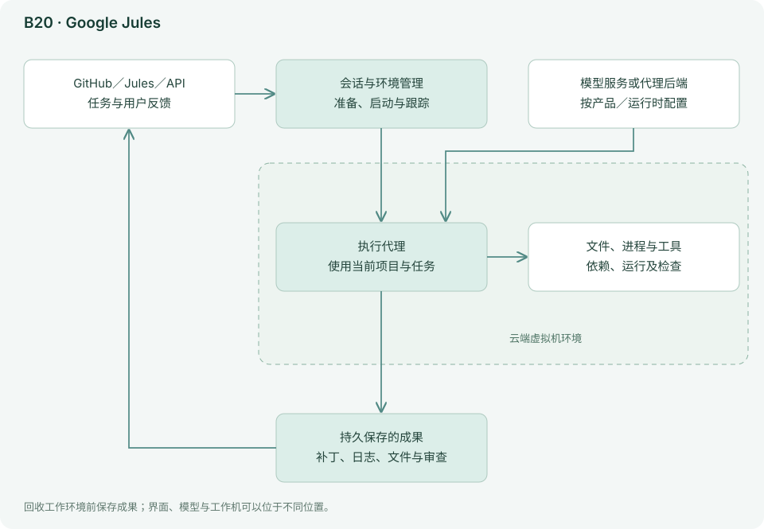


API 将源码来源、会话与活动分为不同对象，便于调用方跟踪某个任务，而不是只等待一段聊天输出。云端环境要从仓库重新建立工作条件，本机正在运行的服务、未提交文件和个人环境变量不会自动出现。CLI 是服务入口，并不意味着同样的执行引擎被搬回本机。

#### 深入一层：计划审批、云端工作区与异步交付

Jules 的公开流程把任务提交、计划审查和代码执行分开。它读取仓库中的项目指令以改善计划，然后在云端环境中完成工作。异步的价值是不用一直占着本地会话，但前提是任务能被完整描述，环境能独立复现，结果也能通过明确条件验收。

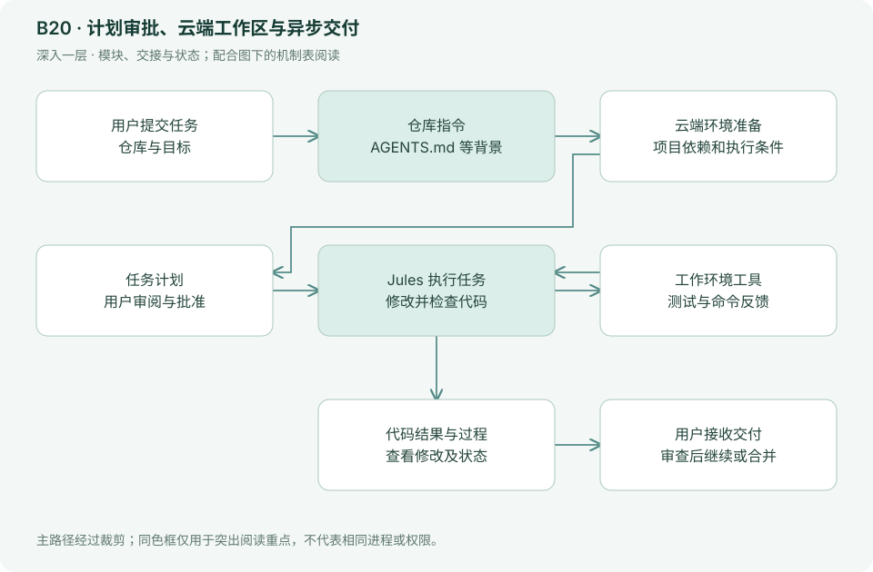

| 模块／交接点 | 怎样工作 | 状态与边界 |
|---|---|---|
| 计划阶段 | 代码变化前可审阅并批准计划 | 计划描述遗漏限制时，应在实施前补充。 |
| 仓库背景 | AGENTS.md 等材料进入理解过程 | 仓库指令不能替代真实依赖与运行配置。 |
| 异步结果 | 执行完成后接收代码及过程信息 | 等待完成与代码已合并是两回事。 |

**沿着一次任务看数据怎样走。** 例如委派补一组单元测试：任务中说明目标模块、框架和覆盖要求，审阅计划后让云端执行。拿到结果后检查是否真正触发目标行为；只增加几个始终通过的断言不算完成需求。

**与相近工具的实质差别。** 与当前编辑器内的即时协作相比，Jules 更依赖清楚的交接和可复现环境；与 Copilot 云端任务相比，应比较计划、集成和交付契约，而不只比较最终生成多少文件。

本节细图与机制依据：[jules-docs](https://jules.google/docs)、[jules-api](https://jules.google/docs/api/reference/)。箭头表示主要信息或控制交接，不表示所有分支必然并行；省略的模块不能视为不存在。

### 能力、状态与边界

| 观察项 | 实际机制／公开能力 | 对使用者意味着什么 |
|---|---|---|
| 任务方式 | 异步云端编码 | 适合独立 issue 与批量维护 |
| 环境 | 独立虚拟机准备仓库与依赖 | 提供可重复安装和测试步骤 |
| API 对象 | Source、Session、Activity | 跟踪状态与产物，不能只看完成通知 |
| 项目规则 | 仓库说明及 AGENTS.md 等材料 | 未记录背景要补入任务或仓库 |
| 模型 | 原生模型路由 | 公开材料不支持任意 BYOK 的普遍承诺 |
| 成熟度 | 官方入门仍有实验性质说明 | 保持小范围试点与正常人工审查 |

**把机制放进实际工作。**

独立云环境有助于减少本机隐含状态，也会暴露准备不足。测试所需数据、系统依赖或内部网络如果没有说明，任务可能在修改前就失败。将环境启动作为单独验收，才能公平评价代理实现代码的能力。

Source、Session 与 Activity 分别表达任务材料、一次运行和运行中的事件。调用方应跟踪状态与产物，不把收到某条消息等同于全部完成。通过 CLI 管理任务，也仍是与服务交互，不能因此期待本机工具、未提交文件和环境变量自动参与执行。

异步任务适合边界清楚的维护，但需求经常变化时交接成本会增加。先处理一个独立 issue，检查分支、diff、测试和已知限制；任务通知只是提醒检查成果。若计划扩大到批量维护，还应统计审查工作量，因为大量可运行却需要重写的补丁不会真正节省团队时间。

### 从安装到完成第一个任务

1. 连接需要处理的 GitHub 仓库，确认分支与访问范围；先选择一个环境简单、可独立验收的问题。

2. 准备依赖安装、测试方法和项目指令，确认云端不需要本机未提交资料；给出具体复现与期望结果。

3. 检查计划是否覆盖任务边界，再让它运行；出现环境问题时补齐说明，避免把环境失败当成模型不会做。

4. 查看活动记录和产物，核对修改与实际测试；有遗漏时提供具体反馈，而不是只要求再次完成。

5. 结果回到正常代码审查流程后再决定合并。相同维护任务反复稳定，才考虑 API 或批量任务自动化。

下面是启动命令或操作路线；路径、认证与功能入口请按自己的版本调整。

```text
适合 Jules 的任务说明：
仓库与分支、问题复现、期望行为、安装和测试步骤
需要保留的兼容行为、交付形式与验收条件
不依赖“我本机刚才打开的文件”或未提交改动。
```

### 典型任务与验收方法

下面是一份**可直接改写使用的试用任务**，属于本报告设计的验收示例，并非已完成的运行测试。

> 为命令行工具补充帮助文档并修正一个参数边界问题。云端安装依赖后运行测试，交付代码与文档的对应修改。

检查云端是否处理了正确分支，帮助文档是否与实际参数一致，测试是否真实覆盖边界。只有成功启动任务或收到通知，不能证明修改已经可合并。

### 模型搭配、适用方向与取舍

优先使用 Jules 原生模型路由；公开材料没有证明任意 BYOK 都受到同等支持，因此不指定一个可随意更换的后端。适合独立 issue、测试补齐、文档更新与批量维护。验收仍需看变更和实际测试，云端任务完成通知不等于应直接合并。难度：初次低中；环境配置中。

| 选择路线 | 候选组合 | 怎样决定 |
|---|---|---|
| 默认路线 | Jules 原生路由 | 模型与云端环境共同组成产品，先验证独立 issue。 |
| 任务升级 | 改善任务与环境准备 | 没有任意模型选择证据时，不以虚构 BYOK 作为建议。 |
| 成本控制 | 标准化小任务与批量前抽样 | 减少依赖失败和需求返工，再考虑扩大任务数量。 |

适合可独立交付的小 issue、测试补齐和文档维护。对强依赖本机环境或需要密集实时讨论的工作，启动与交接成本可能更高。与 Gemini CLI 比较运行位置，与 Devin 比较任务与环境管理，模型选择则遵循各自产品开放程度。

### 资料依据与继续阅读

[入门](https://jules.google/docs)、[API](https://jules.google/docs/api/reference/)。

完整商业运行时未公开，结构判断以官方可见行为和接口为限。上面的流程建议与取舍是依据这些材料给出的选型判断；具体型号、权限和菜单以实际安装与账户为准。

