# 03C｜个人助理与知识工作台：围绕长期信息和日常工作组织代理

这类工具的起点通常不是一个 Git 仓库，而是人、资料、对话和外部应用。它们越来越多地加入代码执行、子代理、浏览器和定时任务，因此不能沿用“都是聊天皮肤”的旧判断。

这里更需要问三个问题：**长期记忆存在哪里？谁能触发任务？代理操作的是哪个人的账户和工作空间？** 同样一次工具调用，放在一个临时编程会话中，与放在持续在线的聊天机器人里，管理难度很不一样。


**档案读法：** 每个工具均按七个相同维度展开。架构图用于理解责任分工；上手步骤与任务卡用于实际试用。代码块是命令或操作示例，不表示本报告已经运行全部工具。

<a id="c01"></a>

## C01 Hermes Agent：把一次任务的经验变成下一次可用的材料

### 定位与设计理念

Hermes 将长期使用放在中心：会话可以检索，经验可以写成记忆和 Skills，任务可以从 CLI、消息渠道或自动化入口到来。“会越用越懂你”在工程上主要意味着保存并重新使用材料，不是每聊一次就训练模型权重。[README](https://github.com/NousResearch/hermes-agent/blob/42c1a93417fa588e735736a0740787ce37381ffd/README.md)

Hermes 更关注长期使用而非单次回答。一次任务留下的经验、偏好与方法，可以在下一次被重新读取。其价值取决于保存的信息是否正确、是否能找回来以及是否及时修订。它适合有连续项目与重复工作的人；偶尔聊天的人未必需要承担多渠道和持续服务的配置成本。

### 工作原理与架构图

下图结合所引源码与文档，画出本工具的主要责任分工；为便于理解，省略次要模块与错误分支。

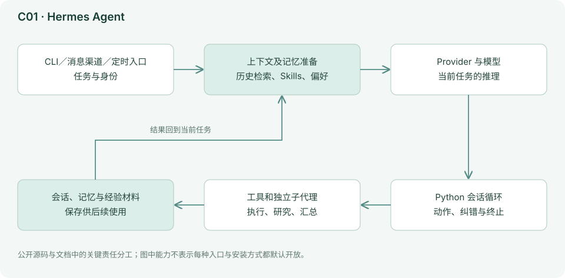

Python 会话循环把模型请求、上下文准备、工具分派和结果处理拆成多个部分；模型协议经适配后进入统一执行逻辑。记忆管理又通过独立 Provider 接口工作。在压缩前保存必要信息，是避免长任务丢失关键进展的一条路径。[循环](https://github.com/NousResearch/hermes-agent/blob/42c1a93417fa588e735736a0740787ce37381ffd/agent/conversation_loop.py)、[记忆管理](https://github.com/NousResearch/hermes-agent/blob/42c1a93417fa588e735736a0740787ce37381ffd/agent/memory_manager.py)

委派工具为子任务建立独立代理，主代理通常只看见任务与摘要，而不是所有中间步骤。源码还为子任务处理模型覆盖、工作树、取消和预算。特别要注意，子代理可以有自己的运行预算，父任务上限不能直接当作整棵任务树的总成本上限。[委派工具](https://github.com/NousResearch/hermes-agent/blob/42c1a93417fa588e735736a0740787ce37381ffd/tools/delegate_tool.py)

长期信息不应都塞进同一段提示。偏好描述你一般怎样工作，项目事实描述某个项目目前是什么样，Skill 描述一套可复用的方法，当前进度则记录这一项任务做到了哪里。Hermes 的记忆 Provider 和会话循环为这些材料提供保存与使用路径，但内容治理仍然重要。子代理拥有自己的上下文与预算，主任务得到汇总，因此要明确哪些结论值得长期保存，不能把未经核对的探索猜测直接变成记忆。

#### 深入一层：当前对话、持久记忆与委派的三种状态

Hermes 将单轮对话的请求、工具调度、重试与压缩放在 conversation loop 中，持久记忆则由专门模块管理。二者最容易被混淆：对话中出现过一件事，不代表它已经成为长期可用的记忆；记忆中保存了一个结论，也不代表它对今天的任务仍然正确。委派又是第三种状态，应带着明确输入返回结果。

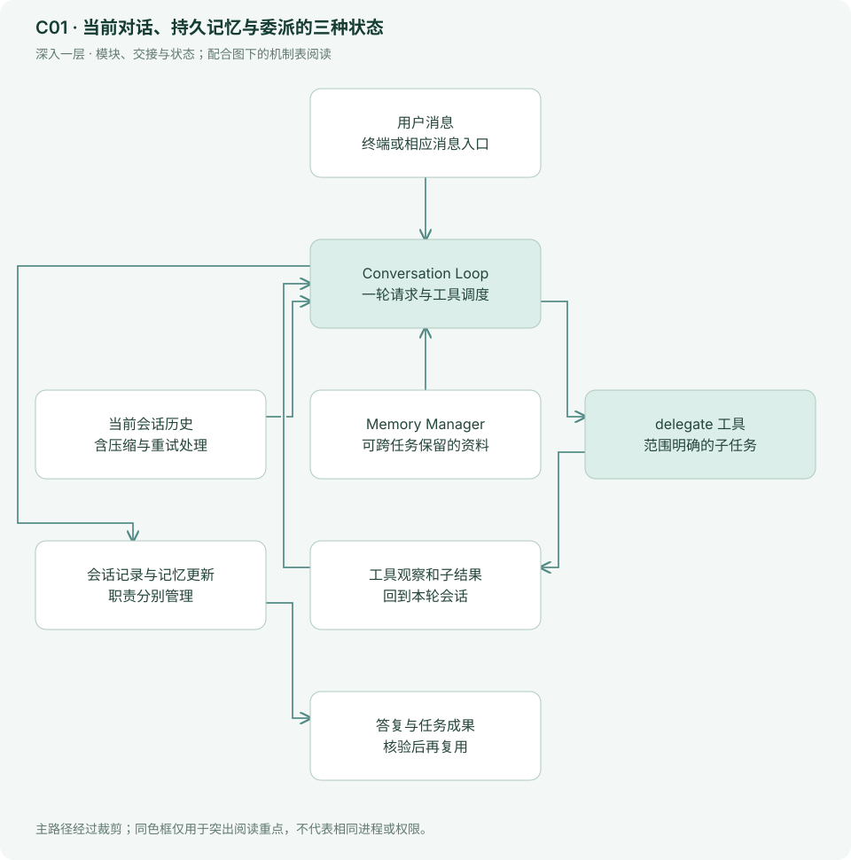

| 模块／交接点 | 怎样工作 | 状态与边界 |
|---|---|---|
| 当前会话 | 保持正在进行的任务与观察 | 压缩改变输入组织，不能代替重要成果归档。 |
| 持久记忆 | 为后续任务保留可复用背景 | 需要核对适用范围、来源和过期信息。 |
| 委派 | 把一部分工作交给子任务 | 子结果应经过主任务核验再进入长期资料。 |

**沿着一次任务看数据怎样走。** 例如持续整理个人知识库：当前会话处理这批材料，委派只调查指定主题，最终确认的偏好或事实才作为长期背景。若把一次猜测长期记住，后续任务会反复沿用错误，因此验收应包含“写入了什么记忆”。

**与相近工具的实质差别。** 与以仓库为中心的 CLI 相比，Hermes 更突出跨任务持续性；与 OpenClaw 相比，长期记忆与常驻消息网关仍是不同架构维度。

本节细图与机制依据：[conversation_loop.py](https://github.com/NousResearch/hermes-agent/blob/42c1a93417fa588e735736a0740787ce37381ffd/agent/conversation_loop.py)、[memory_manager.py](https://github.com/NousResearch/hermes-agent/blob/42c1a93417fa588e735736a0740787ce37381ffd/agent/memory_manager.py)、[delegate_tool.py](https://github.com/NousResearch/hermes-agent/blob/42c1a93417fa588e735736a0740787ce37381ffd/tools/delegate_tool.py)。箭头表示主要信息或控制交接，不表示所有分支必然并行；省略的模块不能视为不存在。

### 能力、状态与边界

| 观察项 | 实际机制／公开能力 | 对使用者意味着什么 |
|---|---|---|
| 长期材料 | 记忆、历史检索与 Skills | 经验复用依赖正确保存和命中，不是训练权重 |
| 压缩 | 上下文处理与压缩前的信息保存 | 关键事实应有可读出处，便于恢复核对 |
| 委派 | 独立代理、可选模型及工作树 | 任务描述需包含交付格式和证据要求 |
| 预算 | 子任务可以拥有自己的上限 | 父任务预算不自动等于整棵任务树总额 |
| 入口 | CLI、消息和自动化等路线 | 长期在线增加身份、服务与凭据管理 |
| 记忆治理 | 材料可积累，也需要修正 | 明确哪些是偏好、事实、临时判断与过期信息 |

**把机制放进实际工作。**

记忆至少有准确性、相关性和时效三个问题。保存的内容可能原本就错，也可能正确但与当前任务无关，还可能已经过期。长期使用应定期抽查重要事实与偏好，保留来源和修订方式。一次成功找回旧对话，只验证了检索的一部分。

Skill 应保存稳定的方法，例如核对报告数字的步骤；项目进度则记录特定任务现在做到哪里。把临时失败、未经确认的偏好或推测都写入长期方法，会让错误在以后反复出现。更合理的做法是完成任务并核对后，再提炼可复用经验。

子代理提供独立上下文，减少主任务被探索过程挤满，但也需要完整交接。研究者应返回来源、冲突和不确定项，而不只交一个结论。预算应合计主任务、所有委派、记忆处理与失败重试。消息渠道和定时任务启用后，还要检查身份、服务在线和重复动作，这些属于持续助理的完整成本。

### 从安装到完成第一个任务

1. 先按官方指南只配置本地 CLI 与一个模型，用一份资料整理任务验证工具、输出和保存位置。

2. 给代理明确项目材料与引用要求，让它生成报告；检查事实后再决定哪些经验适合写入长期记忆或 Skill。

3. 开启新会话询问上次任务，检查它是否能找到正确资料并保留来源；故意更新一项事实，验证旧信息怎样被修正。

4. 独立研究较多时再委派子任务，规定输入、输出和预算，汇总时检查证据冲突及总成本。

5. 最后才接消息渠道和定时工作。验证触发者身份、任务运行环境与结果投递，并安排对记忆和失败任务的定期检查。

下面是启动命令或操作路线；路径、认证与功能入口请按自己的版本调整。

```text
建议分开保存四种材料：
长期偏好：我的报告习惯与表达要求
项目事实：术语、状态、来源及更新时间
方法：可复用的资料核对步骤
当前进度：已完成、失败原因、下一步
```

### 典型任务与验收方法

下面是一份**可直接改写使用的试用任务**，属于本报告设计的验收示例，并非已完成的运行测试。

> 每次根据新访谈补充同一份研究档案，保留来源和冲突观点。记住报告格式偏好，但不要把未证实的市场判断写成永久事实。

做两次相隔的任务，才能观察长期价值。检查第二次是否准确找回既有材料，是否知道哪些事实已改变，以及能否解释来源。记得很多却无法纠错，比少记一些且依据清楚更难维护。

### 模型搭配、适用方向与取舍

建议用可靠的 GPT／Claude 工具模型建立基线；中文任务与成本敏感场景比较当前适配的 Kimi、Qwen、DeepSeek。接本地模型时应检查真实上下文和工具调用能力，不能只看模型参数。适合持续研究助理、个人工作自动化、跨会话项目管理、从重复工作积累 Skills。难度：CLI 中；长期在线与多渠道运维高。

| 选择路线 | 候选组合 | 怎样决定 |
|---|---|---|
| 执行基线 | 已适配的可靠 GPT／Claude 工具模型 | 先完成文件、检索、计算和错误恢复，建立可信基线。 |
| 中文与成本 | 当前支持的 Kimi／Qwen／DeepSeek／Step | 使用真实任务比较；记忆和工具能力来自运行时，不来自模型名字。 |
| 本地试验 | 正确服务的开放模型 | 先测短任务和多轮调用，复杂长任务另行验收。 |

适合持续研究、个人自动化和从重复工作积累方法。代价主要在记忆质量、多入口身份与长期运行。与编码 CLI 比较时看跨会话收益；与 OpenClaw 比较时，一个更突出经验与方法复用，另一个更突出渠道、设备与持续连接。

### 资料依据与继续阅读

[README](https://github.com/NousResearch/hermes-agent/blob/42c1a93417fa588e735736a0740787ce37381ffd/README.md)、[循环](https://github.com/NousResearch/hermes-agent/blob/42c1a93417fa588e735736a0740787ce37381ffd/agent/conversation_loop.py)、[记忆管理](https://github.com/NousResearch/hermes-agent/blob/42c1a93417fa588e735736a0740787ce37381ffd/agent/memory_manager.py)、[委派工具](https://github.com/NousResearch/hermes-agent/blob/42c1a93417fa588e735736a0740787ce37381ffd/tools/delegate_tool.py)。

源码链接指向固定提交；关键实现分析不等于对整个项目和依赖逐行审计。上面的流程建议与取舍是依据这些材料给出的选型判断；具体型号、权限和菜单以实际安装与账户为准。

<a id="c02"></a>

## C02 OpenClaw：让个人代理持续在线，连接不同渠道与设备

### 定位与设计理念

OpenClaw 更像个人代理的接线与运行中心。Gateway 维持长连接、渠道、会话和设备关系；手机、桌面、消息平台可以成为交互入口。它不只是把同一聊天框复制到几个应用。[架构文档](https://github.com/openclaw/openclaw/blob/b419a4add99ff917504ed26168babdbde6ac7ab6/docs/concepts/architecture.md)

OpenClaw 把个人代理做成持续在线的连接中心。来自手机、桌面与消息渠道的任务需要进入正确会话，再交给运行时执行。它解决的是“无论从哪里发起，怎样找到自己的工作状态”，而不是单纯多开几个聊天界面。持续连接带来便利，也要求清楚识别用户、设备和触发权限。

### 工作原理与架构图

下图结合所引源码与文档，画出本工具的主要责任分工；为便于理解，省略次要模块与错误分支。

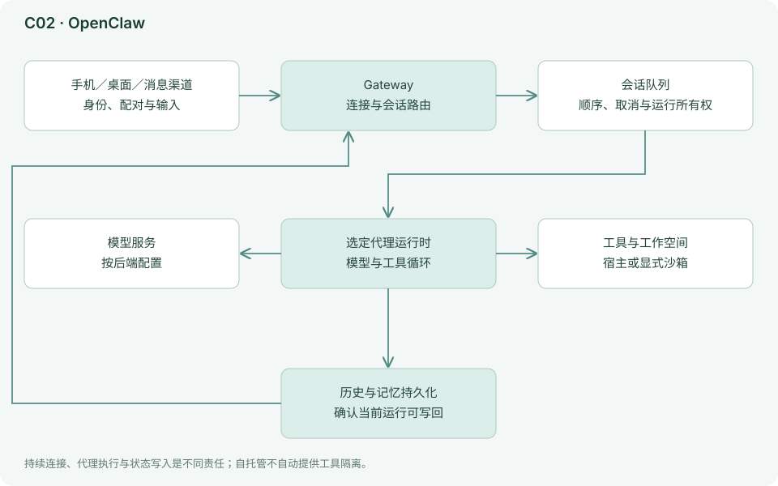

Gateway 管理连接与任务进入方式，具体代理运行时负责模型和工具循环。当前文档已经涉及不同运行时路径，因此不宜永久把它概括成某一版本 Pi 的简单包装。每个会话的任务通常串行化，持久化写入还需要确认当前运行是否仍拥有写入资格，防止被替代的旧任务把过时状态写回去。[代理循环](https://github.com/openclaw/openclaw/blob/b419a4add99ff917504ed26168babdbde6ac7ab6/docs/concepts/agent-loop.md)

工作空间中的记忆材料、会话摘要、检索和后台整理共同服务持续使用。这里有一个实际取舍：记忆越多，维护和纠错越重要。能记住一句话不代表知道它何时过期，用户需要能够查看、修正和删除。[记忆设计](https://github.com/openclaw/openclaw/blob/b419a4add99ff917504ed26168babdbde6ac7ab6/docs/concepts/memory.md)

Gateway 类似接线台，负责把输入放进正确会话；代理运行时才决定下一步动作。同一会话通常需要串行处理，避免两次任务同时修改同一份状态。旧任务被替换后，持久化写入还要确认它是否仍有资格写回，否则可能覆盖新任务的正确结果。记忆文件、检索和整理提供长期连续性，但过时信息仍需要用户纠正。

#### 深入一层：常驻网关、控制客户端与设备节点

OpenClaw 的中心是常驻 Gateway，而不是某一个聊天页面。消息渠道、控制客户端和设备节点都是连接方，但职责不同：客户端管理与查看，节点声明设备能力，代理循环负责具体推理与工具往返。官方说明要求同一宿主的消息连接由网关统一拥有，避免多个进程争抢同一个渠道会话。

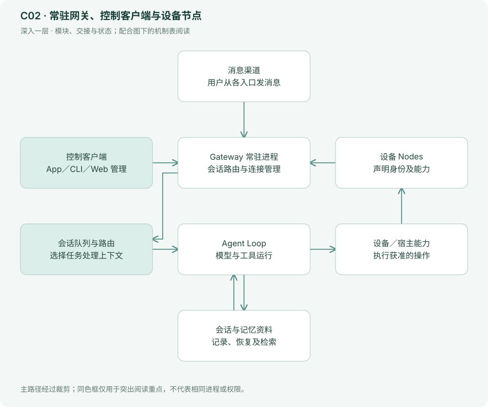

| 模块／交接点 | 怎样工作 | 状态与边界 |
|---|---|---|
| 控制平面 | 客户端通过 WebSocket 与 Gateway 通信 | 关闭一个客户端不等于网关和代理已停止。 |
| 设备节点 | 以 node 角色连接并声明能力 | 能连上设备不代表任何任务都可无条件使用全部能力。 |
| 会话与记忆 | 路由、排队、转录和持久材料各有职责 | 多个消息入口需要避免同时写坏同一任务状态。 |

**沿着一次任务看数据怎样走。** 例如从手机发来任务，网关识别渠道和会话，安排代理运行；需要设备能力时通过对应节点执行，结果再回到原消息入口。排错应先定位连接、路由、代理还是设备执行出了问题，而非一概重启模型。

**与相近工具的实质差别。** 与 Hermes 的持续个人助理目标有交集，但网关所有权、连接与设备能力是 OpenClaw 特别值得理解的一层；它也不等同于给 CLI 加一个定时器。

本节细图与机制依据：[architecture.md](https://github.com/openclaw/openclaw/blob/b419a4add99ff917504ed26168babdbde6ac7ab6/docs/concepts/architecture.md)、[agent-loop.md](https://github.com/openclaw/openclaw/blob/b419a4add99ff917504ed26168babdbde6ac7ab6/docs/concepts/agent-loop.md)、[memory.md](https://github.com/openclaw/openclaw/blob/b419a4add99ff917504ed26168babdbde6ac7ab6/docs/concepts/memory.md)。箭头表示主要信息或控制交接，不表示所有分支必然并行；省略的模块不能视为不存在。

#### 局部放大：从一条渠道消息到一次有归属的运行

入口统一之后仍要解决归属：这条消息属于哪个会话、由谁推进、结果发回哪里。会话队列帮助同一任务按秩序运行；设备节点连接说明能力在哪里，并不直接决定消息属于哪个任务。若多个入口同时更新一个目标，首先应检查路由与排队，再检查代理逻辑。这里只展示正常消息路径，渠道配对、断线重连及各类授权细节仍以相应文档为准。

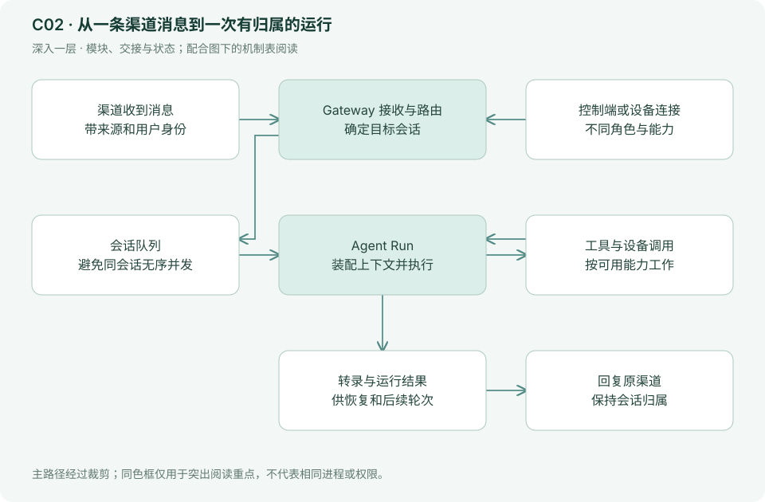

本图依据同节列出的固定源码与官方文档，表示所选子系统的主要路径。

### 能力、状态与边界

| 观察项 | 实际机制／公开能力 | 对使用者意味着什么 |
|---|---|---|
| 连接中心 | Gateway 管渠道、设备与会话 | 先验证谁能发指令，再开放更多入口 |
| 执行后端 | 多种运行时路径 | 后端决定模型、工具及部分权限行为 |
| 并发状态 | 会话串行与写入资格控制 | 避免旧任务覆盖新状态，关注取消后的行为 |
| 记忆 | 工作空间材料、摘要、检索与整理 | 要能查看、更正和删除，而非只积累 |
| 工具环境 | 宿主执行与显式沙箱分开 | 自托管不等于工具天然隔离 |
| 持续运行 | 多渠道和自动化依赖服务在线 | 备份、升级、失败恢复也是使用成本 |

**把机制放进实际工作。**

多个渠道进入同一个个人代理，会同时提出身份与顺序问题。必须知道输入来自谁、应该进入哪个会话、能调用哪些工具；同一任务的补充要求也应与原任务正确关联。配对成功只是连接起点，后续权限与结果归属仍需验证。

串行化可以减少同一会话的争写，但跨会话、后台任务和外部系统还可能共享资源。旧任务被取消后是否仍有资格保存状态，关系到新结果会不会被覆盖。试用时故意修改目标或取消任务，检查实际文件和记忆，比只测试一问一答更能说明可靠性。

长期服务需要备份和恢复，而记忆内容也要能修订。把服务搬到另一台机器，除了聊天记录，还可能涉及工作空间、凭据、设备连接和工具环境。迁移时逐项验证；即使选用相同模型，运行位置和状态缺失也会使行为不同。

### 从安装到完成第一个任务

1. 准备一个可维护的运行环境，按官方指南部署 Gateway；先只配一个设备或渠道，完成身份与连接检查。

2. 选择代理后端和模型，确认工作空间、工具范围与执行环境。先做只读资料任务，核对结果回到正确会话。

3. 连续发送两条有顺序的任务，观察队列、取消与状态保存；不要假定多个渠道意味着任务可以随意并发修改同一文件。

4. 配置长期记忆后测试事实更新与删除，保留重要项目材料的备份；确认新会话使用的是最新信息。

5. 再增加渠道或定时触发，逐项检查触发者、凭据、运行位置和失败恢复。服务升级后重复基本配对与工具测试。

下面是启动命令或操作路线；路径、认证与功能入口请按自己的版本调整。

```text
持续服务检查顺序：
用户与设备身份 → 会话路由 → 执行后端 → 工具环境
→ 状态写入与恢复 → 消息返回 → 定时触发
每新增一个入口，都重查身份与结果归属。
```

### 典型任务与验收方法

下面是一份**可直接改写使用的试用任务**，属于本报告设计的验收示例，并非已完成的运行测试。

> 从消息渠道提交一份资料摘要任务，随后补充修订要求；代理应在同一项目中更新报告，并把新版本返回原会话，保留资料来源。

观察后发的修订是否被正确纳入、旧任务是否覆盖新文件，以及结果是否发到正确对象。单次聊天成功无法验证持续服务；中断恢复和跨渠道状态才是这条路线的重要试用点。

### 模型搭配、适用方向与取舍

依据实际运行时选模型；原生多 Provider 路线可比较强工具模型，若接 Codex 等运行时则遵循其原生模型配置。适合跨设备个人助理、消息入口统一、长期自动化。单纯偶尔问答或修一个 bug，部署整个持续服务可能没有必要。难度：高，主要高在服务、账户与权限管理。

| 选择路线 | 候选组合 | 怎样决定 |
|---|---|---|
| 内置多 Provider | 当前运行时适配的强工具模型 | 先验证身份、会话和工具，再比较型号。 |
| 外部运行时 | 相应代理的原生模型路线 | 选择 Codex 等后端时，遵循其自身模型及认证。 |
| 长期成本 | 稳定任务使用已验收的经济档 | 持续服务须统计定时任务、失败和子任务总消费。 |

适合愿意维护个人服务、需要跨设备和消息入口的人。代价是部署、身份、权限与状态管理。若只是本地写报告，Chatbox／Cherry 更轻；若重点在可重复业务流程，n8n 的显式流程可能更容易观察和管理。

### 资料依据与继续阅读

[架构文档](https://github.com/openclaw/openclaw/blob/b419a4add99ff917504ed26168babdbde6ac7ab6/docs/concepts/architecture.md)、[代理循环](https://github.com/openclaw/openclaw/blob/b419a4add99ff917504ed26168babdbde6ac7ab6/docs/concepts/agent-loop.md)、[记忆设计](https://github.com/openclaw/openclaw/blob/b419a4add99ff917504ed26168babdbde6ac7ab6/docs/concepts/memory.md)。

源码链接指向固定提交；关键实现分析不等于对整个项目和依赖逐行审计。上面的流程建议与取舍是依据这些材料给出的选型判断；具体型号、权限和菜单以实际安装与账户为准。

<a id="c03"></a>

## C03 Agent Zero：给代理一套可以动手操作的工作环境

### 定位与设计理念

Agent Zero 偏向通用任务代理：让模型在可操作的计算环境中使用工具、编写程序、处理资料和分派任务。提示、工具、扩展和工作空间可以被用户修改，因此它兼具产品与实验平台的性质。[README](https://github.com/agent0ai/agent-zero/blob/b1cbd1f960a1a5c4482b324dcff4742aa67b7a51/README.md)

Agent Zero 把模型放进能实际操作的计算环境，使它可以写程序处理资料、调用工具并分派工作。它更像通用技术助理实验台：适应任务的方式很多，用户也能修改提示和工具。自由度越高，越需要清楚提供资料范围、输出要求与可操作环境，否则模型容易花很多时间探索而没有形成可用结果。

### 工作原理与架构图

下图结合所引源码与文档，画出本工具的主要责任分工；为便于理解，省略次要模块与错误分支。

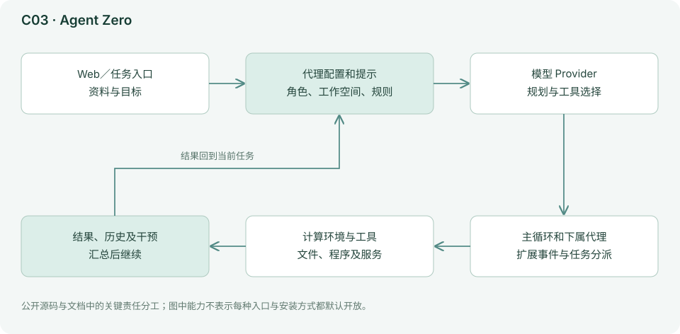

`agent.py` 的循环反复准备提示、调用模型、处理工具，并在多个节点触发扩展与用户干预。子代理通过上下级关系和独立配置组织，具体任务可以交给不同职责的下属。这套设计容易扩展，但扩展一多，排查行为变化也更费力。[主循环](https://github.com/agent0ai/agent-zero/blob/b1cbd1f960a1a5c4482b324dcff4742aa67b7a51/agent.py)、[下属代理](https://github.com/agent0ai/agent-zero/blob/b1cbd1f960a1a5c4482b324dcff4742aa67b7a51/tools/call_subordinate.py)

主循环在准备提示、调用模型、处理工具等位置允许扩展介入，适合试验不同工作方法。下属代理拥有自己的配置与任务，主代理负责交接和汇总。容器给任务提供相对独立的环境，但挂载目录和外部凭据仍决定它能影响什么。最实用的验证是检查最终文件与计算过程，而非仅听代理说它调用了很多工具。

#### 深入一层：AgentContext、上下级代理与执行环境

Agent Zero 中，AgentContext 管理任务级状态，Agent 则有自己的推理和对话过程；call_subordinate 建立上下级工作关系。层级分工能把复杂目标拆小，但不能把每个子代理都看成天然独立的机器。实际文件、工具环境和资源的共享范围，仍要按部署及调用方式判断。

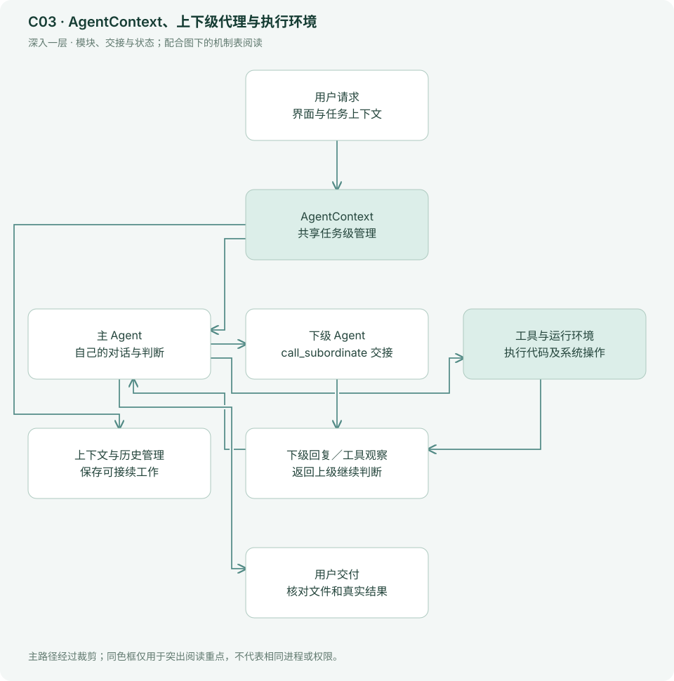

| 模块／交接点 | 怎样工作 | 状态与边界 |
|---|---|---|
| Context 与 Agent | 任务级管理和单个代理职责分开 | 重置或移除上下文的影响可能超出一条消息。 |
| 上下级交接 | 上级给任务，下级返回可用结论 | 任务范围不清会增加重复调查和无效层级。 |
| 系统工具 | 代理通过环境完成实际动作 | 有代码执行能力就需要关注环境，而不是只看聊天权限。 |

**沿着一次任务看数据怎样走。** 例如汇总多个目录的数据：主代理确定格式与验收，下级分别调查数据结构，再回传结论；主代理执行合并并检查输出。若下级也改同一份产物，应先分配写入责任，否则层级结构并不会防止冲突。

**与相近工具的实质差别。** 与固定角色团队相比，递归式上下级结构更灵活，也更需要控制任务深度、预算和状态共享；与 mini-SWE-agent 相比，任务管理层明显更厚。

本节细图与机制依据：[agent.py](https://github.com/agent0ai/agent-zero/blob/b1cbd1f960a1a5c4482b324dcff4742aa67b7a51/agent.py)、[call_subordinate.py](https://github.com/agent0ai/agent-zero/blob/b1cbd1f960a1a5c4482b324dcff4742aa67b7a51/tools/call_subordinate.py)、[README.md](https://github.com/agent0ai/agent-zero/blob/b1cbd1f960a1a5c4482b324dcff4742aa67b7a51/README.md)。箭头表示主要信息或控制交接，不表示所有分支必然并行；省略的模块不能视为不存在。

### 能力、状态与边界

| 观察项 | 实际机制／公开能力 | 对使用者意味着什么 |
|---|---|---|
| 通用执行 | 文件、程序、资料与工具操作 | 输出应是可检查产物，而非操作数量 |
| 可修改性 | 提示、工具和扩展可调整 | 逐项改动，保留最小稳定配置 |
| 子代理 | 上下级关系与独立配置 | 需要明确任务输入、证据和汇总责任 |
| 执行环境 | 容器或文档支持的环境 | 挂载与凭据仍可让任务访问宿主和外部服务 |
| 用户干预 | 循环中的反馈与扩展节点 | 纠正后确认旧计划和新要求已对齐 |
| 模型要求 | 多轮工具、纠错和代码执行 | 小模型是否稳定要通过任务验证 |

**把机制放进实际工作。**

通用计算环境可以通过临时脚本处理复杂资料，这是它与纯聊天的重要差别。脚本产生数字时，应保留输入、筛选条件、计算方法和失败文件清单；模型最后的解释需要依据这些结果。能运行程序带来可验证性，也要求用户真正利用这些证据。

扩展在多个循环节点介入，会让定制更灵活，也增加行为来源。某次修改提示或工具后质量下降，应从最小配置重现，逐项恢复；同时更换模型和多个扩展，会使原因难以判断。子代理继承哪些背景、使用哪份配置，也应写进记录。

容器隔开部分运行环境，实际影响范围仍取决于挂载与授权。把全部个人目录和广泛业务凭据放进去，会改变原本期待的边界。先给任务专用输入与输出目录，完成后检查产物，再逐步增加能力，更容易理解每项工具到底贡献了什么。

### 从安装到完成第一个任务

1. 按官方方式准备运行环境，核对挂载目录与模型配置；使用测试材料，先验证文件输入和结果保存。

2. 给出一项有明确输出的资料任务，例如整理一批文档并生成索引，说明来源、格式和不能推测的事实。

3. 检查代理生成的程序与中间结果。统计任务至少用已知样本复算，确认工具执行不是只做形式上的处理。

4. 需要分工时按材料或职责拆成独立子任务，要求保留证据位置；主任务负责去重、冲突处理和最终结论。

5. 基础流程稳定后再改提示和扩展，并记录差异。无人值守使用前另测中断、失败和重复执行，确保文件与状态可恢复。

下面是启动命令或操作路线；路径、认证与功能入口请按自己的版本调整。

```text
资料任务输入建议：
输入目录只放本次材料；输出另存独立目录。
要求保留：处理清单、未读成功文件、计算方法、来源索引。
子代理按独立材料分工，最后由主任务统一去重与核对。
```

### 典型任务与验收方法

下面是一份**可直接改写使用的试用任务**，属于本报告设计的验收示例，并非已完成的运行测试。

> 整理三十份项目会议纪要，按主题生成索引和决策清单。区分已确定、待讨论与互相冲突的内容，保留每条结论的原文位置。

抽查不同文件与时间段，确认没有把讨论中的建议当作决定。检查程序处理失败的文件是否被悄悄遗漏，以及汇总是否合并了同名但不同项目的事项。

### 模型搭配、适用方向与取舍

优先能稳定处理工具、多轮纠错和代码执行的模型，如当前适配的 Claude／GPT；成本方案再比较开放模型。复杂编排对小模型的稳定性要求高，不宜只按每百万 Token 单价选择。适合技术用户的资料处理、自动化、通用代理实验。难度：中高；无人值守部署高。

| 选择路线 | 候选组合 | 怎样决定 |
|---|---|---|
| 执行基线 | 已适配的可靠 GPT／Claude 工具模型 | 先完成文件、检索、计算和错误恢复，建立可信基线。 |
| 中文与成本 | 兼容服务中的 Qwen／DeepSeek 等候选 | 先核对接入文档并测试工具往返；通用接口兼容不等于完整模型适配。 |
| 本地试验 | 正确服务的开放模型 | 先测短任务和多轮调用，复杂长任务另行验收。 |

适合技术用户处理复杂资料和试验通用代理。丰富的可修改性带来更高排错成本，容器管理也需要基本工程能力。普通写作可以用更轻客户端；明确固定流程可用 Dify；复杂临时任务才更能体现这一类环境的价值。

### 资料依据与继续阅读

[README](https://github.com/agent0ai/agent-zero/blob/b1cbd1f960a1a5c4482b324dcff4742aa67b7a51/README.md)、[主循环](https://github.com/agent0ai/agent-zero/blob/b1cbd1f960a1a5c4482b324dcff4742aa67b7a51/agent.py)、[下属代理](https://github.com/agent0ai/agent-zero/blob/b1cbd1f960a1a5c4482b324dcff4742aa67b7a51/tools/call_subordinate.py)。

源码链接指向固定提交；关键实现分析不等于对整个项目和依赖逐行审计。上面的流程建议与取舍是依据这些材料给出的选型判断；具体型号、权限和菜单以实际安装与账户为准。

<a id="c04"></a>

## C04 Chatbox AI：低门槛客户端正在长出真正的工作模式

### 定位与设计理念

Chatbox 的经典价值是多模型聊天、文件与对话管理，但当前公开技术文档已经描述 Agent／Work 模式、工具、Skills 和记忆。因此它不应再被一概排除在 Harness 讨论之外。商业发行版与社区源码也有差别，功能判断必须标注版本。[项目说明](https://github.com/chatboxai/chatbox/blob/0cf406cbd93197a89487c740cb101bef36641d35/README.md)、[功能页](https://chatboxai.app/en)

Chatbox 从熟悉的多模型聊天入口出发，逐渐加入真正会操作工作目录的模式。对于报告、翻译和资料讨论，用户可以先不理解复杂代理配置就开始；需要生成文件或执行任务时，再进入 Work／Agent 路线。把两种模式区分清楚，能避免用普通聊天的预期理解具有实际操作能力的工作会话。

### 工作原理与架构图

下图结合所引源码与文档，画出本工具的主要责任分工；为便于理解，省略次要模块与错误分支。

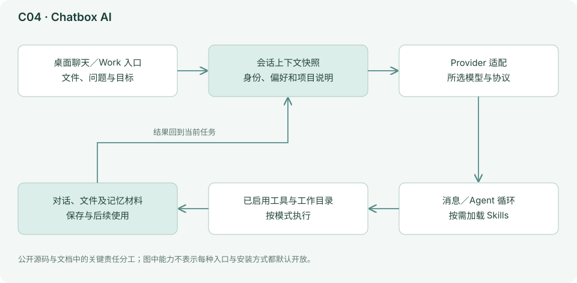

当前 Agent 模式将身份、Soul、个人偏好、工作目录说明与工具信息组装成提示；会话首次启动时保存一份上下文快照。稳定前缀有助于缓存和一致性，但代价是中途修改某些规则，不一定立刻影响这段既有会话，需要新会话或相应重捕获条件。[提示与记忆设计](https://github.com/chatboxai/chatbox/blob/0cf406cbd93197a89487c740cb101bef36641d35/docs/technical/agent-soul-memories.md)

Skills 则可以按需加载，避免把所有工作手册每次全塞进去。Provider 层区分模型配置和实际协议适配；“某服务兼容 OpenAI”并不意味着所有参数与推理行为一致。[Skills](https://github.com/chatboxai/chatbox/blob/0cf406cbd93197a89487c740cb101bef36641d35/docs/technical/agent-skills.md)、[Provider 设计](https://github.com/chatboxai/chatbox/blob/0cf406cbd93197a89487c740cb101bef36641d35/docs/technical/ai-providers.md)

稳定的上下文前缀有利于缓存和行为一致，代价是某些全局修改不会自动刷新旧会话。比如你修改报告语气偏好，既有任务仍可能沿用启动时的快照；应检查生效条件，而不是不断强调同一句要求。Skills 按需加载帮助减少提示长度，但文件中的一次性事实应留在项目材料，不能全部塞进长期人格。

#### 深入一层：Provider、技能和个人资料怎样进入桌面会话

Chatbox 的技术资料将模型 Provider、Agent Skills 与 Soul／Memories 分开说明。Provider 解决“请求发给谁”，技能提供“怎样做这类任务”，个人资料与记忆提供“跨会话要知道什么”。把这些都塞进一个系统提示虽然表面相似，却失去了按需加载和独立维护的边界。

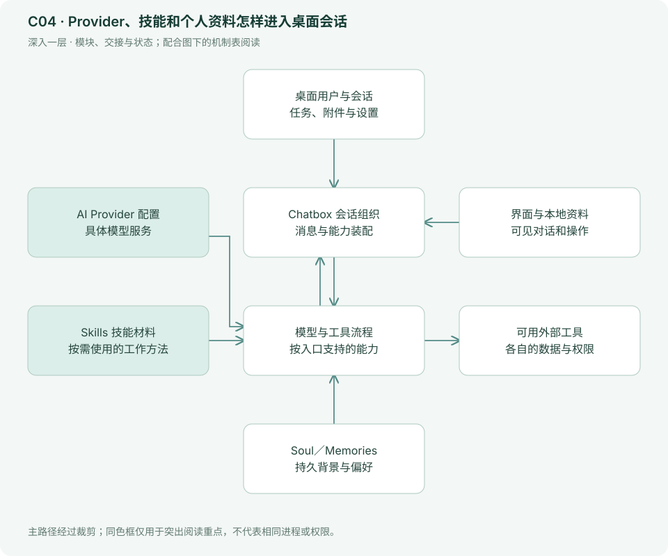

| 模块／交接点 | 怎样工作 | 状态与边界 |
|---|---|---|
| Provider | 统一不同模型渠道的接入 | 模型回复正常不等于所有工具调用能力都适配。 |
| Skills | 可复用工作方法参与当前任务 | 技能是说明材料，不自动带来新的执行权限。 |
| Soul／Memories | 保留个人背景与持续性资料 | 需要避免把临时假设固化为长期事实。 |

**沿着一次任务看数据怎样走。** 例如写月度工作报告：会话接收本月材料，技能提供报告方法，个人资料约束语气与岗位背景，模型通过所配 Provider 生成。验收时分别检查数据来源、方法是否适用以及旧偏好是否仍有效。

**与相近工具的实质差别。** 与纯粹多模型聊天器相比，技能和记忆增加了代理持续性；与面向代码执行的 CLI 相比，桌面交互和资料管理仍是主要入口。

本节细图与机制依据：[ai-providers.md](https://github.com/chatboxai/chatbox/blob/0cf406cbd93197a89487c740cb101bef36641d35/docs/technical/ai-providers.md)、[agent-skills.md](https://github.com/chatboxai/chatbox/blob/0cf406cbd93197a89487c740cb101bef36641d35/docs/technical/agent-skills.md)、[agent-soul-memories.md](https://github.com/chatboxai/chatbox/blob/0cf406cbd93197a89487c740cb101bef36641d35/docs/technical/agent-soul-memories.md)。箭头表示主要信息或控制交接，不表示所有分支必然并行；省略的模块不能视为不存在。

### 能力、状态与边界

| 观察项 | 实际机制／公开能力 | 对使用者意味着什么 |
|---|---|---|
| 入口难度 | Chat 与 Work／Agent 路线 | 先按任务选择是否需要实际工具执行 |
| 多模型 | Provider 与协议适配分层 | 兼容接口仍需核对参数及工具能力 |
| 上下文 | 首轮保存一定的上下文快照 | 改变规则后检查当前会话是否刷新 |
| 工作方法 | Skills 按需加载 | 常用写法与一次性事实分开管理 |
| 发行边界 | 社区源码与商业版本有差别 | 功能判断应记录实际版本 |
| 成果管理 | 对话、文件和目录任务 | 打开最终文件检查结构，而不只看聊天预览 |

**把机制放进实际工作。**

聊天、文件讨论和工作模式的验收不同。聊天主要看内容，资料任务要看引用是否支持结论，Work 还要看文件是否正确保存、工具有没有完成操作。选择最轻而足够的模式，可以减少普通写作被复杂执行流程打断。

上下文快照使会话拥有较稳定的起点。修改全局偏好后旧任务仍沿用原语气，可能是快照生效范围问题；重新确认当前上下文比不断追加同一句要求更直接。项目事实也不应全放进人格，因为其他项目未必适用，而且事实可能过期。

多模型比较时，将事实准确与文风偏好分开。先用原文核对遗漏、数字和否定，再评价自然程度；两个模型都说了同一件事，也不能替代来源。需要长期写小说时，人物与事件应落在可编辑文件中；需要工作报告时，保留材料和口径比持续增长的聊天历史更好查阅。

### 从安装到完成第一个任务

1. 安装适合平台的发行版，在 Chat 中配置一个模型，先验证普通对话、文件输入和历史保存；确认版本所含能力。

2. 用一份短材料试写报告，明确读者、语气、篇幅和引用要求，检查内容是否遵循原文。

3. 把反复使用的风格偏好保存到可查看的规则中；改动后用新会话或文档规定的方法确认生效。

4. 确需读写本地文件或执行步骤时才使用 Work，选择专门工作目录，先做小范围资料整理。

5. 最终打开导出的文件检查标题、表格和引用，保存事实来源；再把稳定的方法提炼为 Skill，而不是把整段历史当作长期记忆。

下面是启动命令或操作路线；路径、认证与功能入口请按自己的版本调整。

```text
报告提示示例：
读者是非技术同事；先解释结论，再说明依据。
只使用附件中的事实，缺信息时明确标注。
输出摘要、正文和来源；长期写作偏好与项目事实分开保存。
```

### 典型任务与验收方法

下面是一份**可直接改写使用的试用任务**，属于本报告设计的验收示例，并非已完成的运行测试。

> 根据三份周会记录写一份管理层周报，突出进展、风险和需要决定的事项。不得把计划写成已完成，保留可追溯的来源。

核对时态、责任人和完成状态，尤其检查模型是否为了行文顺畅补造信息。切换模型时用同一材料比较结构和事实忠实度；启用 Work 后再增加文件保存和格式验证。

### 模型搭配、适用方向与取舍

日常写作可比较当前接入的 Claude、GPT、Kimi／Qwen；工作模式更应优先可靠工具调用。适合一般用户、报告润色、翻译、资料讨论和轻量本地任务。复杂团队开发或持续在线服务不是其最自然的起点。难度：聊天低；Agent 中。

| 选择路线 | 候选组合 | 怎样决定 |
|---|---|---|
| 日常文字 | 已接入 Claude／GPT／Kimi／Qwen | 同材料比较事实忠实、语气和编辑负担。 |
| Work 任务 | 工具调用稳定的已支持型号 | 写文件与执行能力单独验收，聊天好不代表工具好。 |
| 轻量或本地 | 经济文本模型／兼容本地服务 | 短摘要先试；需要图像时确认实际输入链路。 |

适合低门槛多模型写作、翻译和轻量目录任务。大量并行工程、持续在线或多人服务不是最自然的起点。与 Cherry 比较工作台和后端需求，与 AnythingLLM 比较是否需要长期资料库，选择自己实际要用的最小复杂度。

### 资料依据与继续阅读

[项目说明](https://github.com/chatboxai/chatbox/blob/0cf406cbd93197a89487c740cb101bef36641d35/README.md)、[功能页](https://chatboxai.app/en)、[提示与记忆设计](https://github.com/chatboxai/chatbox/blob/0cf406cbd93197a89487c740cb101bef36641d35/docs/technical/agent-soul-memories.md)、[Provider 设计](https://github.com/chatboxai/chatbox/blob/0cf406cbd93197a89487c740cb101bef36641d35/docs/technical/ai-providers.md)。

源码链接指向固定提交；关键实现分析不等于对整个项目和依赖逐行审计。上面的流程建议与取舍是依据这些材料给出的选型判断；具体型号、权限和菜单以实际安装与账户为准。

<a id="c05"></a>

## C05 Cherry Studio：多模型桌面工作台，也可以成为其他代理的宿主

### 定位与设计理念

Cherry 面向同时使用多个模型、资料和助手的人。当前架构已经从普通多模型对话扩展到独立 Agent Session 运行时，因此“多个模型各答一遍”和“多个代理分工执行”需要分别讨论。[README](https://github.com/CherryHQ/cherry-studio/blob/633729727543cfe7ccab776cc08e3a24fa7a925d/README.md)

Cherry Studio 希望把多模型、多资料与不同工作角色集中在一个桌面入口。用户可以比较回答，也可以选择实际执行任务的代理后端。二者不能混同：让三个模型各写一篇文章只是多份答案，真正分工还需要共同目标、状态交接与结果整合。统一工作台的便利主要在组织和切换，而不意味着底层能力完全一致。

### 工作原理与架构图

下图结合所引源码与文档，画出本工具的主要责任分工；为便于理解，省略次要模块与错误分支。

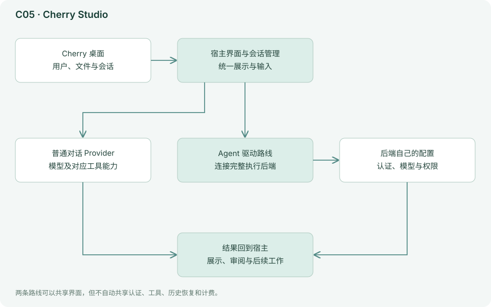

Electron 界面通过进程间通信交给主进程的 AI 服务；主进程负责流、持久化与不同消费者。Agent Session 又区分宿主服务与具体驱动：宿主管会话、排队、恢复标记和界面生命周期，驱动对接 Claude Code、Pi、DSH 等不同执行后端。这是“统一工作台＋不同引擎”的明确例子。[核心架构](https://github.com/CherryHQ/cherry-studio/blob/633729727543cfe7ccab776cc08e3a24fa7a925d/docs/references/ai/core-architecture.md)、[Agent Session](https://github.com/CherryHQ/cherry-studio/blob/633729727543cfe7ccab776cc08e3a24fa7a925d/docs/references/ai/agent-session-runtime.md)

这也带来边界：统一界面不意味着各后端的工具、审批和恢复语义完全一致。切换后端时，应确认原来的任务状态与权限怎样处理，而不只是看聊天记录还在不在。

界面通过进程间通信请求主进程服务，主进程管理输出与持久状态。Agent Session 的宿主负责排队、生命周期和恢复标记，具体驱动负责连接执行后端。这就像同一工作台可以接不同发动机：工作台能统一显示进度，却不能凭空让所有发动机获得相同工具和恢复语义。切换后端时，除模型外还要核对认证、目录和权限。

#### 深入一层：稳定会话宿主与可替换运行时驱动

Cherry Studio 的 AgentSessionRuntimeService 管 UI 轮次、队列、持久化和恢复令牌；Driver 管具体代理如何运行。Claude Code、Pi 与 DSH 的传输、工具、审批和恢复格式被藏在各自驱动后面。统一提示材料由宿主组织，再映射到各运行时，因此一致的个人背景不意味着底层机制完全相同。

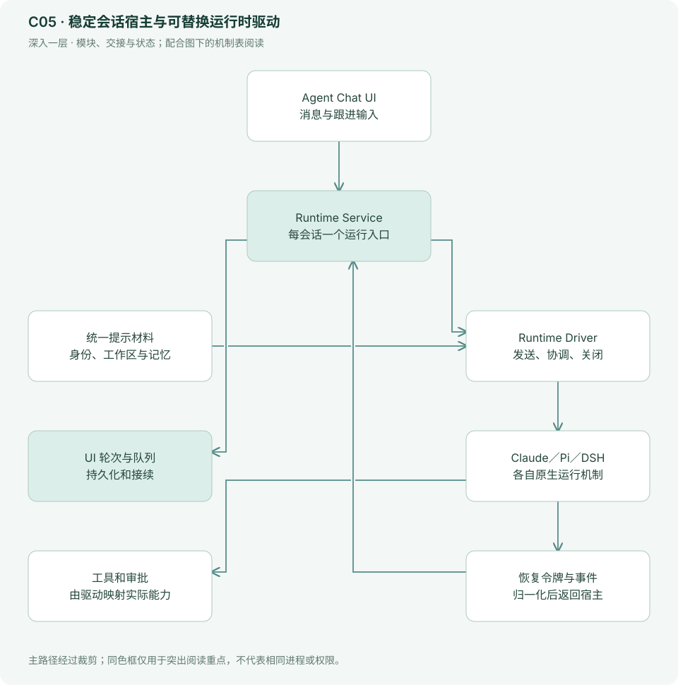

| 模块／交接点 | 怎样工作 | 状态与边界 |
|---|---|---|
| 宿主所有权 | 会话入口、UI 队列与恢复信息由 Runtime Service 管理 | 界面刷新不应被理解成重新创建底层任务。 |
| 驱动所有权 | send、reconcile、close 等接口映射原生运行时 | 同一个按钮背后可能是长进程、流或 SDK 调用。 |
| 统一政策材料 | 身份、工作区、记忆和语言等由共同入口生成 | 原生工具与具体审批仍取决于 Driver。 |

**沿着一次任务看数据怎样走。** 例如从 Pi 驱动切到 DSH：用户希望保留同样的角色与工作区约束，但恢复令牌、工具表和运行事件不能简单照搬。验收应分别检查宿主资料是否一致、驱动是否能正常继续以及权限请求是否正确呈现。

**与相近工具的实质差别。** 与普通 Provider 切换相比，这里替换的是代理运行时；与 Zed 的外部代理宿主类似，但 Cherry 还拥有更明确的统一个人资料与桌面会话层。

本节细图与机制依据：[agent-session-runtime.md](https://github.com/CherryHQ/cherry-studio/blob/633729727543cfe7ccab776cc08e3a24fa7a925d/docs/references/ai/agent-session-runtime.md)、[core-architecture.md](https://github.com/CherryHQ/cherry-studio/blob/633729727543cfe7ccab776cc08e3a24fa7a925d/docs/references/ai/core-architecture.md)。箭头表示主要信息或控制交接，不表示所有分支必然并行；省略的模块不能视为不存在。

### 能力、状态与边界

| 观察项 | 实际机制／公开能力 | 对使用者意味着什么 |
|---|---|---|
| 桌面组织 | 模型、助手、资料与任务集中管理 | 方便整理，但要明确资料属于哪项任务 |
| 普通对话 | 可比较多个模型的回答 | 多个答案不自动构成协作或相互验证 |
| Agent 宿主 | 排队、持久化与会话生命周期 | 界面有历史不代表执行后端已恢复全部状态 |
| 代理驱动 | 连接 Claude、Pi、DSH 等后端 | 模型、工具和权限依驱动分别核对 |
| 数据路径 | 桌面、模型服务及工具后端 | 本地界面不能证明全部资料留在本机 |
| 迁移 | 资料、会话与代理配置分层 | 迁出前检查文件与历史是否真正可复用 |

**把机制放进实际工作。**

桌面宿主管理会话生命周期，驱动管理具体执行，这有助于统一入口，却也形成两层状态。界面保留了任务记录，后端可能已经退出或改变配置；恢复时要确认驱动、模型、目录和工具仍然匹配。只看聊天记录还在，不能判断工作现场已完整恢复。

多模型同时回答适合比较观点与文风，但事实判断需要原始证据。若模型读取同一份错误摘要，它们的共识没有独立验证价值。真正的分工应有不同职责与交付件，例如研究给来源表、写作给正文、最后核对两者，而不是多开几个相似助手。

后端切换时也应分别处理权限与费用。Claude、Pi、DSH 的工具、认证和恢复行为并非由桌面壳统一消除。对普通用户，先稳定一条常用路线更省事；只有明确需要另一种执行方式时再增加驱动，避免把管理所有后端变成新的日常工作。

### 从安装到完成第一个任务

1. 安装桌面端，先配置一个模型与一个资料主题，验证对话、引用和导出；不必一次导入所有个人文件。

2. 为常见工作建立职责明确的助手，说明输出要求；用同一材料比较模型时，保持提示和验收一致。

3. 需要执行任务时创建明确工作空间，选择 Agent 驱动，完成该后端的认证和模型配置。

4. 让它生成一个真实文件，检查工具、权限和保存位置；中断后恢复一次，确认宿主记录与后端状态衔接正确。

5. 再尝试第二个驱动，记录能力差异。把不能自动迁移的规则、历史和授权列出来，避免只凭统一界面判断兼容。

下面是启动命令或操作路线；路径、认证与功能入口请按自己的版本调整。

```text
两种用法分别记录：
多模型比较：同材料、同提示、各自回答，再人工核验。
Agent 任务：选驱动、选工作目录、确认认证与工具，再执行。
记录完整组合：Cherry＋驱动＋模型＋启用工具。
```

### 典型任务与验收方法

下面是一份**可直接改写使用的试用任务**，属于本报告设计的验收示例，并非已完成的运行测试。

> 用给定资料生成一份调研简报，先比较两种模型的提纲，再选择一个 Agent 后端制作最终文件，保留引用和待确认事项。

比较阶段检查观点和依据，不能按文风投票决定事实；执行阶段检查文件、格式和引用是否真正保存。驱动切换后尤其注意工具和权限是否变化。

### 模型搭配、适用方向与取舍

普通对话可自由比较 GPT／Claude／Kimi／Qwen；Agent 驱动则依其后端来选，例如 Claude 驱动优先 Claude、Pi／DSH 按对应适配。适合中文用户、多模型比较、知识整理、希望保留桌面统一入口的人。难度：基础低；多运行时管理中高。

| 选择路线 | 候选组合 | 怎样决定 |
|---|---|---|
| 多模型文字 | GPT／Claude／Kimi／Qwen／Step 等已接入路线 | 同材料对照，关键事实回原文，不按多数票决定。 |
| Agent 驱动 | Claude 驱动用原生模型；Pi／DSH 按适配 | 完整记录驱动和工具，不只记录桌面客户端。 |
| 成本优化 | 摘要轻档、困难工具任务较强档 | 两种模式分开验收，保留真实服务账单。 |

适合中文多模型用户、资料整理和希望统一桌面入口的人。优势是集中管理，代价是后端组合仍需要理解。只需简单写作可以选 Chatbox；需要多人门户可以看 Open WebUI／LibreChat；想直接控制执行循环则更适合原生代理。

### 资料依据与继续阅读

[README](https://github.com/CherryHQ/cherry-studio/blob/633729727543cfe7ccab776cc08e3a24fa7a925d/README.md)、[核心架构](https://github.com/CherryHQ/cherry-studio/blob/633729727543cfe7ccab776cc08e3a24fa7a925d/docs/references/ai/core-architecture.md)、[Agent Session](https://github.com/CherryHQ/cherry-studio/blob/633729727543cfe7ccab776cc08e3a24fa7a925d/docs/references/ai/agent-session-runtime.md)。

源码链接指向固定提交；关键实现分析不等于对整个项目和依赖逐行审计。上面的流程建议与取舍是依据这些材料给出的选型判断；具体型号、权限和菜单以实际安装与账户为准。

<a id="c06"></a>

## C06 Open WebUI：自托管的共享 AI 门户，工具执行能力取决于部署

### 定位与设计理念

Open WebUI 常被用于为本地或远端模型提供统一网页入口。其能力已经延伸到用户权限、知识检索、工具、MCP／OpenAPI 接入以及终端执行相关能力。它既可能是一套聊天门户，也可能被配置成真正的代理工作台。[README](https://github.com/open-webui/open-webui/blob/8bd8b4fac5e059578ac0c74b3c18d11139f88b7d/README.md)

Open WebUI 常作为团队或个人的统一模型入口。它把用户、历史、知识与工具放在同一个网页服务里，可以连接本地模型，也可以连接云端。自托管使界面和部分数据可由自己管理，但完整数据路径还包括生成模型、嵌入、检索、搜索和工具，不能因为入口在内网就认定全链路离线。

### 工作原理与架构图

下图结合所引源码与文档，画出本工具的主要责任分工；为便于理解，省略次要模块与错误分支。

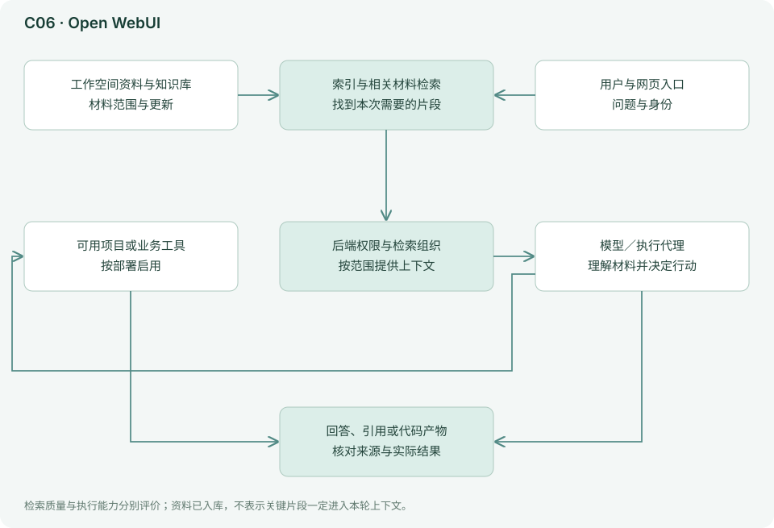

后端中间层组织消息、模型服务、检索与工具结果，工具模块再结合用户权限暴露能力。换句话说，模型本身未必知道你公司的全部数据，是后端决定哪些资料和工具能够进入这轮任务。[中间层](https://github.com/open-webui/open-webui/blob/8bd8b4fac5e059578ac0c74b3c18d11139f88b7d/backend/open_webui/utils/middleware.py)、[工具处理](https://github.com/open-webui/open-webui/blob/8bd8b4fac5e059578ac0c74b3c18d11139f88b7d/backend/open_webui/utils/tools.py)

一旦接上 Open Terminal 等执行能力，就必须检查每个用户的文件、进程和凭据边界。模型服务“只在内网”不能替代用户间隔离。插件或自定义代码也可能访问服务进程本身能够访问的资源。

用户提问时，后端决定哪些资料片段与工具可以进入当前上下文，再把它们交给模型。嵌入模型把资料转成便于检索的表示，生成模型负责根据找回的内容回答，两者可以在不同地方运行。增加终端执行后又多了一层进程与文件边界；如果所有用户共用同一个高权限环境，仅有网页登录并不能实现工具隔离。

#### 深入一层：文档导入与回答生成的两条流水线

Open WebUI 的知识问答要拆成导入链和回答链。导入时解析文档、切分并建立检索表示；回答时按问题找相关片段，经消息处理中间层进入模型请求。工具还可能在生成过程中补充信息。资料存在于知识库，并不意味着每段内容都已进入本次上下文。

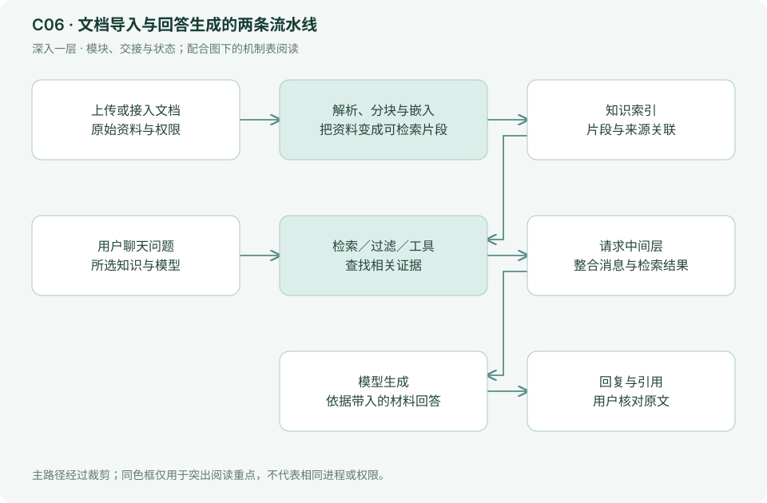

| 模块／交接点 | 怎样工作 | 状态与边界 |
|---|---|---|
| 导入质量 | 解析和分块决定可检索的基本单位 | 表格、扫描件或标题结构丢失，会影响后续回答。 |
| 请求中间层 | 合并消息、资料及工具相关处理 | 同一模型因送入证据不同，可能得到完全不同结果。 |
| 引用检查 | 来源关联让人回到原文 | 有引用不代表结论与引用内容一致。 |

**沿着一次任务看数据怎样走。** 例如问一份政策手册里的例外条件：先确认例外条款被正确解析，再检查检索是否找到它，最后检查模型是否忠实解释。回答错时按这三层排查，比直接换最大模型更有效。

**与相近工具的实质差别。** 与编码代理相比，主要难点是证据管线；与 AnythingLLM 相比，两者都有知识问答，但具体工具循环、工作区组织和流程能力要分别评估。

本节细图与机制依据：[middleware.py](https://github.com/open-webui/open-webui/blob/8bd8b4fac5e059578ac0c74b3c18d11139f88b7d/backend/open_webui/utils/middleware.py)、[tools.py](https://github.com/open-webui/open-webui/blob/8bd8b4fac5e059578ac0c74b3c18d11139f88b7d/backend/open_webui/utils/tools.py)、[README.md](https://github.com/open-webui/open-webui/blob/8bd8b4fac5e059578ac0c74b3c18d11139f88b7d/README.md)。箭头表示主要信息或控制交接，不表示所有分支必然并行；省略的模块不能视为不存在。

### 能力、状态与边界

| 观察项 | 实际机制／公开能力 | 对使用者意味着什么 |
|---|---|---|
| 统一入口 | 用户、模型、历史和知识管理 | 多人使用需明确角色与资料可见范围 |
| 知识检索 | 后端组织相关材料 | 用已知答案测试引用，不只看文风 |
| 模型部署 | 本地或兼容云服务 | 生成与嵌入端点分别核对 |
| 外部工具 | MCP／OpenAPI 等接入路线 | 工具授权需匹配调用用户 |
| 执行扩展 | 可接终端等能力 | 检查用户间文件、进程和凭据隔离 |
| 服务维护 | 自托管入口与持久数据 | 备份、升级、配额和监控属于日常成本 |

**把机制放进实际工作。**

知识问答失败要分层检查：原文有没有正确解析，关键片段是否检索到，后端是否允许该用户读取，模型有没有忠实理解。每层都可能造成相似的错误答案。用带标准来源的问题逐项核对，能防止盲目提高生成模型成本。

多人门户增加了共享与隔离的要求。共享模型端点不代表共享知识权限，共享工具也不代表应共用创建者凭据。接终端后还要考虑文件、进程和资源是否按用户分开；单纯网页登录只解决身份的一部分。

离线部署应检查全部依赖路径。生成模型在内网，但嵌入、搜索或语音走云端，仍会形成不同的数据出口。备份也不应只保存网页配置，还需覆盖历史、资料和必要的服务状态。自托管提供控制机会，实际控制程度由部署与管理决定。

### 从安装到完成第一个任务

1. 按官方部署指南启动单人实例，先只连接一个模型，验证对话和历史；关闭本次用不到的执行扩展。

2. 导入一组主题清楚的资料，配置嵌入和检索，用五到十个有标准答案的问题检查引用与遗漏。

3. 准备多人使用时再配置账户、角色和知识权限，用不同用户测试能否看到不属于自己的资料。

4. 每增加一个工具检查授权身份、数据出口和返回内容；加入终端前单独设计文件与进程隔离。

5. 安排备份与升级验证。要求离线时逐项检查模型、嵌入、搜索、语音、遥测和工具，而不仅是网页地址。

下面是启动命令或操作路线；路径、认证与功能入口请按自己的版本调整。

```text
数据路径清单：
网页服务在哪里？历史存在哪里？
生成模型和嵌入模型在哪里？
搜索、语音、工具及终端会访问哪里？
用不同用户测试：资料是否隔离、工具以谁的身份运行。
```

### 典型任务与验收方法

下面是一份**可直接改写使用的试用任务**，属于本报告设计的验收示例，并非已完成的运行测试。

> 为团队建立内部操作手册问答入口。回答必须引用当前手册；资料不足时说明缺口，不得猜测权限、流程和负责人。

用旧版与新版流程、相似产品名和越权资料提问，检查引用是否准确且符合账户范围。模型更强不一定能补救检索错误；多人产品还必须检查资料隔离与工具身份。

### 模型搭配、适用方向与取舍

与 Ollama／兼容服务的本地模型组合适合内网问答；较难知识任务可接强云端模型，但数据会按配置流向相应服务。适合团队共享入口、内网知识库、本地模型试用。难度：单人中；多人服务高。

| 选择路线 | 候选组合 | 怎样决定 |
|---|---|---|
| 内网问答 | 本地 Qwen 等已验证模型服务 | 生成、嵌入、检索与工具链分别确认位置。 |
| 复杂资料 | 可接入的 GPT／Claude／Kimi 等云模型 | 数据路径允许时再用，先确保检索命中。 |
| 优先排错 | 检查解析、切片、嵌入与引用 | 模型升级不能替代找回正确资料；更换嵌入需核对索引。 |

适合内网知识入口、共享模型服务和本地模型试用。优势是部署控制，代价是服务与权限治理。个人偶尔问答可以用桌面客户端；复杂软件开发应比较专门编码代理；固定业务自动化则更适合显式流程平台。

### 资料依据与继续阅读

[README](https://github.com/open-webui/open-webui/blob/8bd8b4fac5e059578ac0c74b3c18d11139f88b7d/README.md)、[中间层](https://github.com/open-webui/open-webui/blob/8bd8b4fac5e059578ac0c74b3c18d11139f88b7d/backend/open_webui/utils/middleware.py)、[工具处理](https://github.com/open-webui/open-webui/blob/8bd8b4fac5e059578ac0c74b3c18d11139f88b7d/backend/open_webui/utils/tools.py)。

源码链接指向固定提交；关键实现分析不等于对整个项目和依赖逐行审计。上面的流程建议与取舍是依据这些材料给出的选型判断；具体型号、权限和菜单以实际安装与账户为准。

<a id="c07"></a>

## C07 LibreChat：以对话产品为入口，扩展到可配置的 Agent 运行

### 定位与设计理念

LibreChat 将多 Provider、用户系统、历史和工具放在熟悉的聊天界面中，同时提供 Agent Builder、子代理／多代理和代码执行等能力。它适合希望自行托管一个统一 AI 工作入口的团队。[README](https://github.com/danny-avila/LibreChat/blob/ef89fbd5b3840ef9b628ab0763a862623cdce18b/README.md)

LibreChat 将熟悉的对话产品与可配置 Agent 结合，适合团队自建统一入口。用户系统、历史、模型、工具和 Agent Builder 在同一服务中组织，但共享一个 Agent 不等于共享所有人的权限。设计团队助理时，最重要的问题是资料从哪里来、工具以谁的身份执行、谁可以修改职责与配置。

### 工作原理与架构图

下图结合所引源码与文档，画出本工具的主要责任分工；为便于理解，省略次要模块与错误分支。

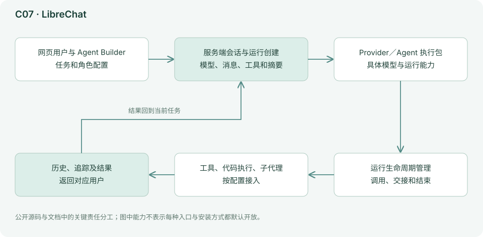

服务端创建运行时，将模型、消息、工具、摘要、子代理配置和追踪信息交给 Agent 执行包。它并非只转发一个 HTTP 请求；会话、工具发现和长期运行需要由服务端管理。但底层依赖的完整实现还在其他包里，本报告不把单个仓库的导入语句当作已经审计整个依赖树。[运行创建](https://github.com/danny-avila/LibreChat/blob/ef89fbd5b3840ef9b628ab0763a862623cdce18b/packages/api/src/agents/run.ts)、[客户端衔接](https://github.com/danny-avila/LibreChat/blob/ef89fbd5b3840ef9b628ab0763a862623cdce18b/packages/api/src/agents/client.ts)

服务端把模型、消息、工具与子代理配置交给执行包，再衔接会话与追踪。它不只是 HTTP 转发，但单个仓库中的封装也不等于底层依赖全被审计。共享 Agent 的配置与调用凭据尤其需要分开：某人能调用“销售助理”，不能据此推定他可以使用创建者的全部业务账户。用只读 Agent 起步，有助于先把知识与身份关系理顺。

#### 深入一层：聊天 API、Agent 图与工具审批的连接

LibreChat 的 Agent 运行路径在服务端组织图配置、工具与事件流。界面中的一条对话可能触发多轮模型和工具交互，不能只看成一次聊天 HTTP 请求。审批、后台任务与子代理相关能力也需要在运行配置中落实，不能因为界面可以选择 Agent 就认定所有工具已开放。

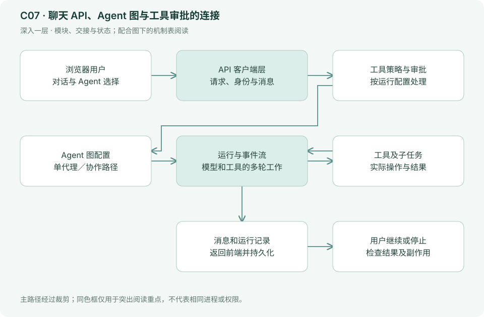

| 模块／交接点 | 怎样工作 | 状态与边界 |
|---|---|---|
| 客户端层 | 把用户请求和消息送入运行流程 | 用户身份与会话上下文需要正确关联。 |
| 图与工具 | 运行图组织代理行为及工具调用 | 图中的角色与实际工具范围共同决定能力。 |
| 事件与中止 | 前端消费流，服务端承担实际执行 | 停止显示与取消已经发出的操作不能混同。 |

**沿着一次任务看数据怎样走。** 例如让 Agent 查资料后生成文件：先确认知识和工具可用，再观察资料调用、文件生成与结果返回。若浏览器断开，应该根据服务端记录判断任务状态，不能仅凭页面空白就重复提交有副作用的请求。

**与相近工具的实质差别。** 与本地桌面会话工具相比，LibreChat 增加了服务端用户、运行与持久化边界；与 Dify 相比，其入口更偏对话，而非首先要求用户画出完整业务流程。

本节细图与机制依据：[run.ts](https://github.com/danny-avila/LibreChat/blob/ef89fbd5b3840ef9b628ab0763a862623cdce18b/packages/api/src/agents/run.ts)、[client.ts](https://github.com/danny-avila/LibreChat/blob/ef89fbd5b3840ef9b628ab0763a862623cdce18b/packages/api/src/agents/client.ts)、[README.md](https://github.com/danny-avila/LibreChat/blob/ef89fbd5b3840ef9b628ab0763a862623cdce18b/README.md)。箭头表示主要信息或控制交接，不表示所有分支必然并行；省略的模块不能视为不存在。

### 能力、状态与边界

| 观察项 | 实际机制／公开能力 | 对使用者意味着什么 |
|---|---|---|
| 对话产品 | 多用户、历史与多个 Provider | 历史和资料需要按用户及共享规则管理 |
| Agent Builder | 配置职责、模型和工具 | 职责应包含来源和完成条件，不只是人格描述 |
| 运行层 | 服务端衔接独立执行包 | 审计边界要包含所依赖模块，不能只看导入语句 |
| 分工 | 可配置子代理／多代理等能力 | 明确输入、交接和最终核验责任 |
| 凭据 | 用户凭据与共享 Agent 配置有不同范围 | 逐项验证工具实际使用哪个账户 |
| 运维 | 服务、数据库和历史保存 | 部署之外还需备份、升级及失败诊断 |

**把机制放进实际工作。**

Agent 配置本身是一种共享资产，既包含职责，也可能关联强工具。谁能修改它、谁能使用它、工具以谁的身份调用，应分别明确。团队试点可以用两个权限不同的用户验证同一任务，观察资料和工具范围是否按预期变化。

服务端运行跨越模型请求、工具执行和持久化。模型已经返回结果而数据库保存失败，与模型本身失败不同；工具执行成功但客户端断连，也不应直接触发重复操作。排错应查看实际运行与外部状态，再决定继续或重试。

子代理和代码执行可以提高任务能力，同时增加追踪与资源需求。研究 Agent 的结论应带来源，计算 Agent 的输出应带方法与输入，最终负责人再核对。大量角色若没有清楚交接，只会把一份错误分散到更多对话中。自托管团队应先稳定少数高频职责，再逐步扩展。

### 从安装到完成第一个任务

1. 按官方部署文档准备服务、数据库与模型入口，先建立单用户可用基线并验证历史保存。

2. 创建一个只读研究 Agent，限定资料来源和输出格式；先不接会写入外部系统的工具。

3. 用两个用户测试共享和私有资料，以及 Agent 配置的查看、修改与调用权限；核对实际工具身份。

4. 确需复杂任务再加入代码执行或子代理，要求保存可复查证据并控制资源；同一输入重跑时观察结果和副作用。

5. 团队推广前安排备份、模型变更与权限回归。服务失败时从模型请求、工具执行和持久化三层分别定位。

下面是启动命令或操作路线；路径、认证与功能入口请按自己的版本调整。

```text
共享 Agent 配置检查：
职责与来源 → 可调用模型 → 可用工具
谁可使用／谁可修改 → 工具使用谁的凭据
历史与产物归谁 → 错误如何追踪和恢复
```

### 典型任务与验收方法

下面是一份**可直接改写使用的试用任务**，属于本报告设计的验收示例，并非已完成的运行测试。

> 建立一个团队研究助理，只根据指定资料回答产品问题；遇到证据冲突列出来源，需要计算时保存计算方法，不直接改写业务系统。

除了回答质量，用不同用户核对可见范围与凭据。检查 Agent 是否为没有答案的问题编造结论，子代理的引用能否回到原文，以及服务中断后历史和结果是否一致。

### 模型搭配、适用方向与取舍

选型建议是针对每个 Agent 的职责固定模型：资料摘要可用经济档，代码执行与复杂工具链用更稳的档位。可选家族以当前适配目录为准。适合共享助理、团队研究、统一模型管理和自定义业务 Agent。难度：中高，尤其需要维护服务与数据库。

| 选择路线 | 候选组合 | 怎样决定 |
|---|---|---|
| 单 Agent 基线 | 当前 Provider 支持的强工具模型 | 用受限职责建立可检查结果，再扩展角色。 |
| 分工方案 | 研究／执行用强档，摘要用经济档 | 交接必须保留来源和约束；角色多不等于更准确。 |
| 组织方案 | 批准的云端或私有端点 | 同时验证账户、资料与工具身份，模型不能补齐治理。 |

适合有部署能力、想统一多个模型和业务 Agent 的团队。代价是数据库、权限与扩展维护。与 Open WebUI 比较具体 Agent 配置与知识流程；与 LobeHub 比较协作组织与使用习惯，不必仅按模型数量判断。

### 资料依据与继续阅读

[README](https://github.com/danny-avila/LibreChat/blob/ef89fbd5b3840ef9b628ab0763a862623cdce18b/README.md)、[运行创建](https://github.com/danny-avila/LibreChat/blob/ef89fbd5b3840ef9b628ab0763a862623cdce18b/packages/api/src/agents/run.ts)、[客户端衔接](https://github.com/danny-avila/LibreChat/blob/ef89fbd5b3840ef9b628ab0763a862623cdce18b/packages/api/src/agents/client.ts)。

源码链接指向固定提交；关键实现分析不等于对整个项目和依赖逐行审计。上面的流程建议与取舍是依据这些材料给出的选型判断；具体型号、权限和菜单以实际安装与账户为准。

<a id="c08"></a>

## C08 LobeHub：从“助手集合”走向有状态的协作工作台

### 定位与设计理念

LobeHub 已不能只按早期 LobeChat 的界面理解。当前方向包括 Agent、工具与协作，其价值是让不同职责的助手与任务状态在同一工作台中组织起来。[README](https://github.com/lobehub/lobehub/blob/035f1e7476eb8a3c66befb76f16ae25673d31e4a/README.md)

LobeHub 将助手、资料与有状态任务放在协作工作台中。一个角色可以负责研究，另一个负责写作，但真正的协作需要共享目标、可查证据和明确交接；不同名字与头像并不会自动形成分工。它适合希望把多种工作职责集中管理的人，同时要求用户避免过度创建角色造成信息分散。

### 工作原理与架构图

下图结合所引源码与文档，画出本工具的主要责任分工；为便于理解，省略次要模块与错误分支。

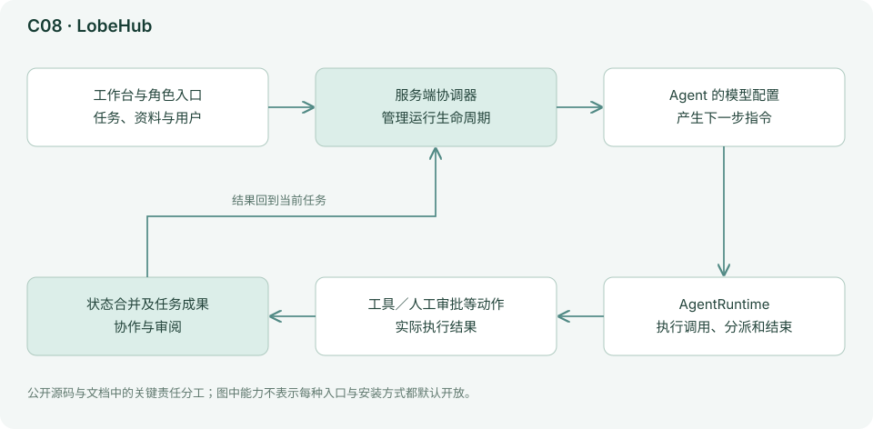

AgentRuntime 接收代理产生的指令，再执行调用模型、调用工具、请求人工审批或结束等动作。批量工具可从同一基础状态并行执行，再合并结果；服务端协调器负责更完整的运行生命周期。这样将“决定下一步”和“实际执行下一步”分开，便于扩展，但并行结果是否相互冲突仍需要上层语义处理。[运行时](https://github.com/lobehub/lobehub/blob/035f1e7476eb8a3c66befb76f16ae25673d31e4a/packages/agent-runtime/src/core/runtime.ts)、[协调器](https://github.com/lobehub/lobehub/blob/035f1e7476eb8a3c66befb76f16ae25673d31e4a/apps/server/src/modules/AgentRuntime/AgentRuntimeCoordinator.ts)

运行时把代理产生的指令转成具体动作，例如调用模型、使用工具、请求人工审批或结束。批量工具可以从同一份基础上下文出发再合并结果，这提高独立查询的效率；如果两项动作都要修改同一业务对象，仅有并发机制无法保证语义一致。角色设计应从任务边界出发：是否真的需要不同状态、工具和权限，还是只需换一个提示模板。

#### 深入一层：代理运行核心与服务端状态协调

LobeHub 把运行核心与服务端协调器分开：Runtime 推进代理步骤，Coordinator 保存状态并发布流事件。源码中特别区分可见输出结束与权威的运行结束事件，这说明“文字停止增长”不等于整个代理任务已经终结。前端需要依赖完整生命周期来清理队列和对齐最终状态。

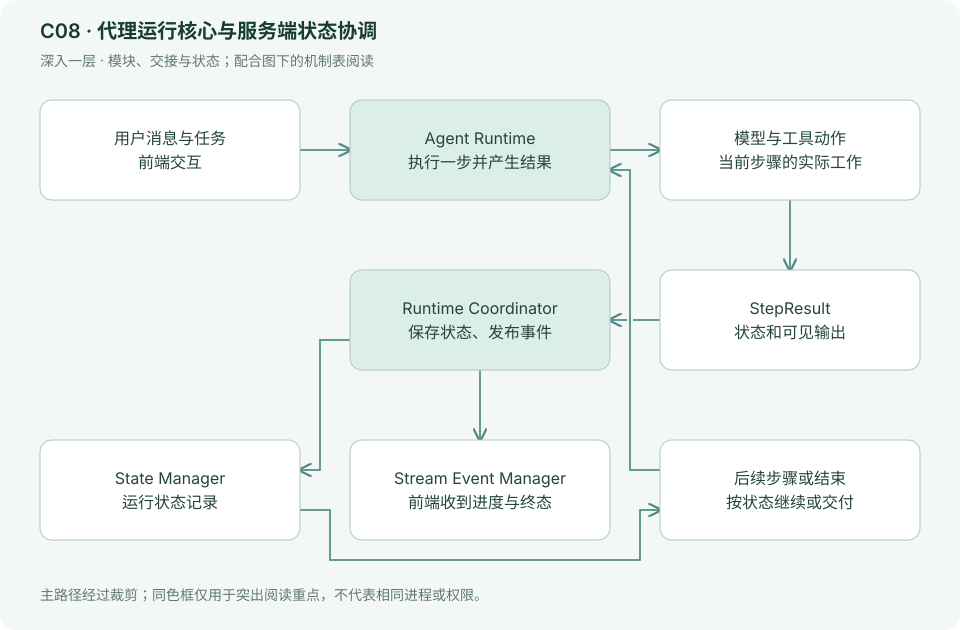

| 模块／交接点 | 怎样工作 | 状态与边界 |
|---|---|---|
| 运行步骤 | 模型和工具动作产生 StepResult | 单步完成后仍可能有后续工作。 |
| 状态保存 | Coordinator 与 State Manager 协调运行事实 | 存储暂时失败与模型失败属于不同故障层。 |
| 流事件 | 进度与终态通知供界面更新 | 不能以早期 UI 提示代替最终运行状态。 |

**沿着一次任务看数据怎样走。** 例如一次多工具调查：每步返回结果并更新运行状态，界面收到阶段进度，最终再收到结束事件。若输出已经停止而任务仍显示运行，应沿状态保存与事件发布链检查，而不是立即认定模型卡住。

**与相近工具的实质差别。** 与仅在单机内维护循环的工具相比，服务端状态和 UI 流的一致性是额外难点；与其他多用户工作台比较，也应关注断线后的接续与状态对齐。

本节细图与机制依据：[runtime.ts](https://github.com/lobehub/lobehub/blob/035f1e7476eb8a3c66befb76f16ae25673d31e4a/packages/agent-runtime/src/core/runtime.ts)、[AgentRuntimeCoordinator.ts](https://github.com/lobehub/lobehub/blob/035f1e7476eb8a3c66befb76f16ae25673d31e4a/apps/server/src/modules/AgentRuntime/AgentRuntimeCoordinator.ts)。箭头表示主要信息或控制交接，不表示所有分支必然并行；省略的模块不能视为不存在。

### 能力、状态与边界

| 观察项 | 实际机制／公开能力 | 对使用者意味着什么 |
|---|---|---|
| 角色组织 | Agent 与协作工作台 | 角色要有职责和交付件，不只换人设 |
| 有状态运行 | 指令与实际执行分开 | 完成状态要能对应真实产物 |
| 批量工具 | 从基础状态执行并汇总结果 | 独立查询可并行，冲突写入需额外设计 |
| 人工参与 | 运行时支持审批动作 | 明确何时需要人的判断及判断材料 |
| 模型 | 按 Provider 与角色配置 | 多模型结论一致也可能源自同一错误材料 |
| 部署 | 托管与自托管路线 | 多人权限和数据保存按实际部署核对 |

**把机制放进实际工作。**

运行时将“决定动作”与“执行动作”分开，便于增加工具、审批和结束处理。用户看到任务完成时，仍应能找到对应文件或结果；状态标签不能脱离真实产物。这种有状态设计的收益，主要在任务可追踪和可接续。

从同一基础状态并行执行工具，适合多个独立查询；如果两项动作都要更新同一对象，结果合并需要业务规则。例如两个角色同时修订同一段报告，应先确定归属或交由统一编辑者整合。底层可以收齐结果，不代表语义冲突自动解决。

角色设计可以从最小职责开始：研究负责事实，写作负责表达，核验负责回原文。若只是改变语气，一份提示模板可能已经足够。只有需要不同状态、工具或权限时才增加独立 Agent，这样既减少调用成本，也让读者知道每项结论由谁依据什么产生。

### 从安装到完成第一个任务

1. 先用一个职责明确的 Agent，例如仅基于团队资料回答问题，配置模型、知识来源和必要工具。

2. 用已知答案检查材料引用和结果；记录任务状态与输出在哪里保存，确认以后能够追溯。

3. 任务确实有不同职责时再增加角色，给出输入、输出和交接规则。例如研究交回证据表，写作根据证据表成文。

4. 并行工具只用于真正独立的动作；涉及写入同一对象时安排顺序或统一负责人，避免冲突后靠语言总结掩盖。

5. 多人使用时检查角色配置修改权、资料范围及产物归属；模型或服务升级后重做一条完整工作流。

下面是启动命令或操作路线；路径、认证与功能入口请按自己的版本调整。

```text
两角色协作示例：
研究角色：输出事实、来源、冲突与不确定项
写作角色：依据证据表生成正文，不添加未证实事实
最终核验：逐项检查正文结论是否有来源支撑
角色增加必须对应真实工作边界。
```

### 典型任务与验收方法

下面是一份**可直接改写使用的试用任务**，属于本报告设计的验收示例，并非已完成的运行测试。

> 把一组市场材料整理成产品简报。先由研究职责形成证据表，再按该表写正文；最后检查观点、数据和来源是否一一对应。

检查两个角色是否真的交接证据，而不是各写一遍近似答案。不同模型若用了同一份错误摘要，不能算独立复核；应回到原材料抽查关键数据和冲突观点。

### 模型搭配、适用方向与取舍

根据当前 Provider 支持选择 GPT、Claude 或中文模型；多角色可以各用不同档位，但应防止风格统一掩盖证据矛盾。适合希望把聊天、资料与多个工作角色集中管理的个人和团队。难度：托管使用低中；自托管与协作治理中高。

| 选择路线 | 候选组合 | 怎样决定 |
|---|---|---|
| 单 Agent 基线 | 当前 Provider 支持的强工具模型 | 用受限职责建立可检查结果，再扩展角色。 |
| 分工方案 | 研究／执行用强档，摘要用经济档 | 交接必须保留来源和约束；角色多不等于更准确。 |
| 组织方案 | 批准的云端或私有端点 | 同时验证账户、资料与工具身份，模型不能补齐治理。 |

适合希望集中管理资料、角色与协作任务的个人和团队。代价是角色、共享状态和权限设计。简单任务保留一个 Agent 往往更清楚；固定业务流程可以比较 Dify，需要随时从消息渠道工作则可比较 OpenClaw。

### 资料依据与继续阅读

[README](https://github.com/lobehub/lobehub/blob/035f1e7476eb8a3c66befb76f16ae25673d31e4a/README.md)、[运行时](https://github.com/lobehub/lobehub/blob/035f1e7476eb8a3c66befb76f16ae25673d31e4a/packages/agent-runtime/src/core/runtime.ts)、[协调器](https://github.com/lobehub/lobehub/blob/035f1e7476eb8a3c66befb76f16ae25673d31e4a/apps/server/src/modules/AgentRuntime/AgentRuntimeCoordinator.ts)。

源码链接指向固定提交；关键实现分析不等于对整个项目和依赖逐行审计。上面的流程建议与取舍是依据这些材料给出的选型判断；具体型号、权限和菜单以实际安装与账户为准。

<a id="c09"></a>

## C09 AnythingLLM：围绕工作空间里的资料组织问答和流程

### 定位与设计理念

AnythingLLM 的自然起点是一个资料工作空间：导入文档、处理与建立索引、按问题检索，再由模型回答。Agent 与 Flow 在此基础上连接外部动作。因此它对“围绕一批固定资料反复工作”的任务很合适。[README](https://github.com/Mintplex-Labs/anything-llm/blob/d401491d67ee88c40d04ab67d71b7360ca6627b4/README.md)

AnythingLLM 围绕一批固定资料持续工作。用户先建立工作空间，把文档处理和检索准备好，再反复提问或运行资料流程。这特别适合手册、政策、项目档案和长期研究材料。它的效果不仅由回答模型决定，文档是否正确提取、切片和检索，常常更早决定答案是否可靠。

### 工作原理与架构图

下图结合所引源码与文档，画出本工具的主要责任分工；为便于理解，省略次要模块与错误分支。

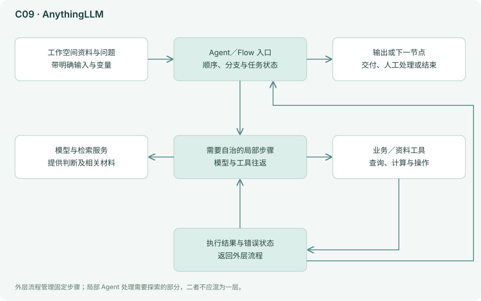

文档处理、嵌入、向量检索、生成模型是不同部件，可以分开选择。执行层还有 Agent 对话管理与 Flow 执行器。当前所检查的 Flow 实现按步骤运行、传递变量，遇到错误或直接输出条件结束；这与让模型自由决定所有下一步的循环不同。[Agent 管理](https://github.com/Mintplex-Labs/anything-llm/blob/d401491d67ee88c40d04ab67d71b7360ca6627b4/server/utils/agents/aibitat/index.js)、[Flow](https://github.com/Mintplex-Labs/anything-llm/blob/d401491d67ee88c40d04ab67d71b7360ca6627b4/server/utils/agentFlows/executor.js)

导入文档后先提取内容，再形成适合检索的表示；提问时只找回相关片段交给生成模型。因此，“资料已经上传”不表示回答时真的看到了关键段落。Agent 可以根据任务选择动作，Flow 则按预先设置的步骤传递变量和处理结束条件。前者更灵活，后者更容易重复，应该按任务是否固定来选择。

#### 深入一层：知识问答、代理工具与 Agent Flow 的交汇

AnythingLLM 同时涉及知识工作区、代理循环和 Agent Flow。Aibitat 组织代理交互，FlowExecutor 按步骤执行流程并维护变量。动态代理决定下一步调用什么，显式流程则预先规定一部分顺序；二者都能用模型，但不属于同一种控制方式。

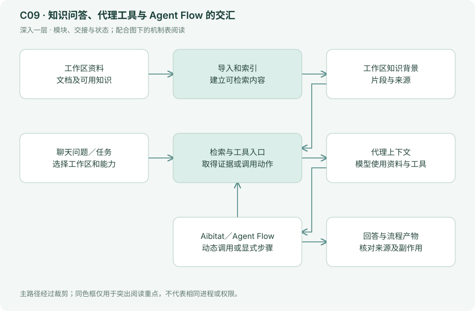

| 模块／交接点 | 怎样工作 | 状态与边界 |
|---|---|---|
| 知识工作区 | 组织资料与任务可见范围 | 文档是否进入本轮请求仍取决于检索和配置。 |
| 代理循环 | 模型按工具契约选择行动 | 工具错误应作为观察处理，不能伪装成成功。 |
| FlowExecutor | 替换变量、执行步骤并保存输出字段 | 字段丢失或格式不符会传递到下一步。 |

**沿着一次任务看数据怎样走。** 例如把资料摘要写入业务系统：先检索证据，再用流程校验字段、生成摘要和调用接口。若接口已写入而后续步骤失败，重跑前应确认重复写入风险；模型记得“不要重复”不能替代业务唯一标识。

**与相近工具的实质差别。** 与纯文档聊天相比，流程带来外部副作用；与 n8n 相比，AnythingLLM 更围绕知识工作区组织体验，连接器与运行管理应另行比较。

本节细图与机制依据：[index.js](https://github.com/Mintplex-Labs/anything-llm/blob/d401491d67ee88c40d04ab67d71b7360ca6627b4/server/utils/agents/aibitat/index.js)、[executor.js](https://github.com/Mintplex-Labs/anything-llm/blob/d401491d67ee88c40d04ab67d71b7360ca6627b4/server/utils/agentFlows/executor.js)、[README.md](https://github.com/Mintplex-Labs/anything-llm/blob/d401491d67ee88c40d04ab67d71b7360ca6627b4/README.md)。箭头表示主要信息或控制交接，不表示所有分支必然并行；省略的模块不能视为不存在。

#### 局部放大：Agent Flow：变量如何穿过显式步骤

这条路径与“让模型随时决定下一步”不同：流程步骤先写好配置，执行器把变量占位替换成当前值，再按步骤类型调用实际操作。上游结果要以正确字段进入变量，后续步骤才能使用。若 API 调用已经产生外部写入，而结果保存或下一步失败，重跑不一定安全；应按业务唯一标识判断是否已处理。图中的错误处理是需要设计和验收的边界，不宣称框架能自动撤销全部副作用。

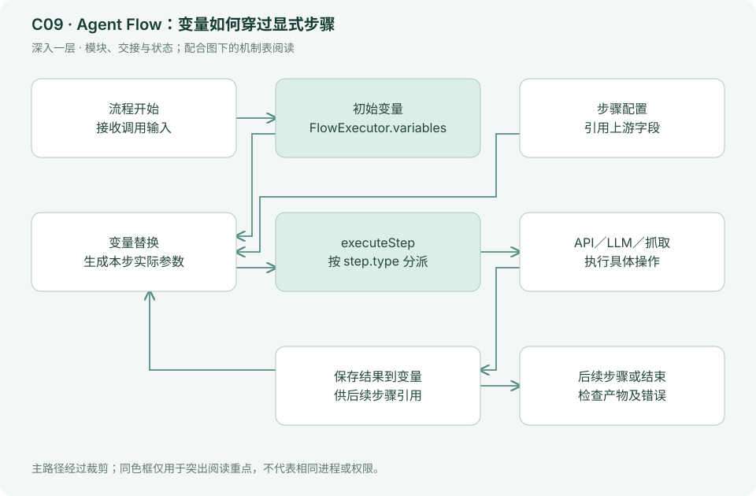

本图依据同节列出的固定源码与官方文档，表示所选子系统的主要路径。

### 能力、状态与边界

| 观察项 | 实际机制／公开能力 | 对使用者意味着什么 |
|---|---|---|
| 资料工作空间 | 围绕主题组织文档 | 主题与权限边界清楚，检索更容易验收 |
| 检索链 | 解析、嵌入、向量检索和生成分层 | 先查资料是否正确提取，再考虑换生成模型 |
| 引用 | 回答应能回到原始片段 | 引用存在不等于足以支持整句结论 |
| Agent | 工具与任务循环 | 适合步骤不完全确定的资料任务 |
| Flow | 步骤、变量与错误／输出条件 | 适合重复提取与固定处理流程 |
| 部署 | 桌面与多人服务能力不同 | 共享、权限和备份按实际版本设计 |

**把机制放进实际工作。**

资料上传只是第一步。扫描文件可能提取失败，表格可能失去列关系，同一内容的多个旧版本也可能同时进入索引。模型检索到片段后仍可能缺少上下文。抽查导入内容与引用位置，往往比反复调整生成提示更能解决问题。

嵌入服务与生成模型承担不同职责。更换嵌入方案后，应核对现有索引是否仍适用；更换生成模型，则主要影响理解、表达和工具行为。两项一起改变会让对照失去解释性，最好先稳定检索，再比较答案质量。

Agent 与 Flow 的差别在于下一步由谁决定。步骤固定的提取和归档，显式 Flow 更容易检查变量和失败位置；需要临时调查的问题可交给 Agent。无论哪条路线，都应保留输入、输出与来源。多人使用还要将工作空间当作权限与资料边界来设计，而不仅是方便分类的文件夹。

### 从安装到完成第一个任务

1. 选择桌面或服务部署，创建单一主题工作空间，先导入少量整理好的材料，确认文本提取完整。

2. 配置生成与嵌入服务，记录各自位置；用五到十个有标准答案的问题测试检索、引用和资料缺失时的表现。

3. 遇到答错先检查原文是否读入、检索是否命中，再检查模型理解。不要首先靠升级大模型掩盖材料问题。

4. 需要重复操作时设计小 Flow，明确输入变量、输出格式和失败分支；不确定步骤较多时再试 Agent 工具。

5. 长期使用建立资料更新和去旧流程。多人服务额外测试工作空间权限、数据备份与新旧版本冲突。

下面是启动命令或操作路线；路径、认证与功能入口请按自己的版本调整。

```text
知识库排错顺序：
原文正确吗 → 文本提取完整吗 → 关键片段检索到了吗
→ 模型是否忠实理解 → 引用是否支持结论
换嵌入服务时，还要核对已有索引是否需要重建。
```

### 典型任务与验收方法

下面是一份**可直接改写使用的试用任务**，属于本报告设计的验收示例，并非已完成的运行测试。

> 根据内部手册回答报销流程问题，明确不同费用类型与例外条件。手册没有说明的内容标为待确认，不以常识代替组织规定。

用跨章节、旧版与新版、存在例外和根本没答案的问题测试。看它能否指出资料缺口并给出准确出处，而不是把相似段落拼成听起来合理的新规则。

### 模型搭配、适用方向与取舍

回答模型可以是云端 GPT／Claude／Kimi，也可以是本地模型；嵌入与检索设置同样影响结果。如果资料根本没检索到，升级生成模型通常只能得到更流畅的错误答案。适合个人文档库、内部手册问答、固定材料上的工作报告和可重复资料流程。难度：桌面低中；多人部署中高。

| 选择路线 | 候选组合 | 怎样决定 |
|---|---|---|
| 内网问答 | 本地 Qwen 等已验证模型服务 | 生成、嵌入、检索与工具链分别确认位置。 |
| 复杂资料 | 可接入的 GPT／Claude／Kimi 等云模型 | 数据路径允许时再用，先确保检索命中。 |
| 优先排错 | 检查解析、切片、嵌入与引用 | 模型升级不能替代找回正确资料；更换嵌入需核对索引。 |

适合固定材料问答、项目文档库和可重复资料处理。临时写作可能用普通客户端更省事，复杂多系统业务可以用 n8n／Dify。模型选型之前先验收检索，否则更强模型通常只会把错误表达得更流畅。

### 资料依据与继续阅读

[README](https://github.com/Mintplex-Labs/anything-llm/blob/d401491d67ee88c40d04ab67d71b7360ca6627b4/README.md)、[Agent 管理](https://github.com/Mintplex-Labs/anything-llm/blob/d401491d67ee88c40d04ab67d71b7360ca6627b4/server/utils/agents/aibitat/index.js)、[Flow](https://github.com/Mintplex-Labs/anything-llm/blob/d401491d67ee88c40d04ab67d71b7360ca6627b4/server/utils/agentFlows/executor.js)。

源码链接指向固定提交；关键实现分析不等于对整个项目和依赖逐行审计。上面的流程建议与取舍是依据这些材料给出的选型判断；具体型号、权限和菜单以实际安装与账户为准。

## 普通知识工作者还应认识的相邻产品

完全不想管理 Provider、运行环境和工具的人，也应比较原生托管工作产品，例如 **ChatGPT Work、Claude Cowork**。它们把模型、连接器和工作空间作为一套产品提供；与自由换模型的 Harness 相比，更接近整套办公服务。Claude Cowork 的官方说明强调围绕文件与应用执行工作；ChatGPT 的能力和模型则按具体产品与账户开放。[Cowork](https://claude.com/product/cowork)、[OpenAI 官方产品文档](https://learn.chatgpt.com/docs/llms.txt)

Manus 的官方资料还描述了持续运行的云端计算环境，属于值得关注的相邻路线。[Cloud Computer](https://help.manus.im/en/articles/15392111-what-is-the-cloud-computer) Genspark、Perplexity Computer、Kimi 的办公产品，以及各类 AI 应用生成器，也处于相邻市场。但本次没有对它们全部建立同等级源码／架构证据，因此不把它们混进“已深读的开放 Harness”数量。对于只想完成一份报告的用户，选择托管产品往往值得考虑；对于要研究和替换代理内部结构的人，开放 Harness 更合适。

同样，LM Studio、Ollama 主要帮助运行和服务模型；SillyTavern 等更偏创作／角色对话；LangGraph、AutoGen、CrewAI 等偏开发框架。它们可能进入一套完整方案，但不应与开箱即用的代理产品在同一张总分表里硬排高低。
