# 03D｜相邻路线与维护观察：结合当前维护状态理解项目

有些工具很重要，却不适合直接与一个桌面编码代理比较；另一些曾经流行，现在的维护状态需要重新判断。本章保留它们的研究价值，同时说明为什么不把它们全部作为新用户的默认推荐。


**档案读法：** 每个工具均按七个相同维度展开。架构图用于理解责任分工；上手步骤与任务卡用于实际试用。代码块是命令或操作示例，不表示本报告已经运行全部工具。

<a id="d01"></a>

## D01 Dify：把模型能力做成可复用的业务应用

### 定位与设计理念

Dify 更接近 AI 应用与流程平台。用户组织输入、知识检索、模型、工具、分支和输出，再将流程交给其他人使用。代码中，Workflow Entry 负责图运行状态、节点与事件，Agent Runner 则在需要自治的步骤中循环调用模型和工具。确定流程与代理循环可以同时存在。[README](https://github.com/langgenius/dify/blob/a068c47ea993ccc0f943131c274b7830b16de9f4/README.md)、[工作流入口](https://github.com/langgenius/dify/blob/a068c47ea993ccc0f943131c274b7830b16de9f4/api/core/workflow/workflow_entry.py)、[工具调用代理](https://github.com/langgenius/dify/blob/a068c47ea993ccc0f943131c274b7830b16de9f4/api/core/agent/fc_agent_runner.py)

Dify 的目标是把 AI 能力做成别人也能反复使用的应用。用户先设计输入、知识、模型、工具与分支，再让使用者提交数据。它不要求每次都让模型从头决定所有步骤，因此适合业务规则较稳定的任务。代理节点保留局部灵活性，外层流程则明确顺序与交接。

### 工作原理与架构图

下图结合所引源码与文档，画出本工具的主要责任分工；为便于理解，省略次要模块与错误分支。

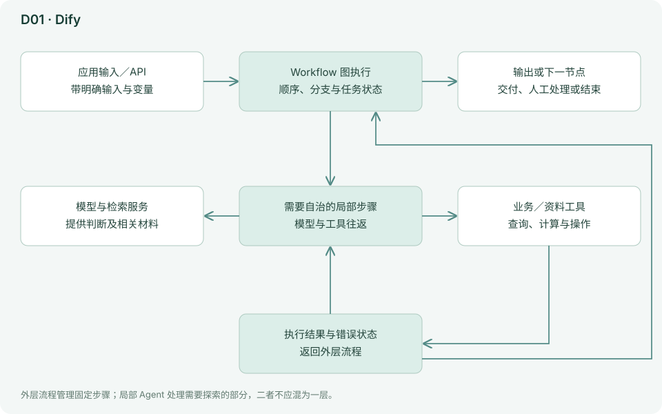

它的好处是：业务逻辑不必每次依靠模型重新猜。例如客户问题先分类，再检索对应知识库，证据不足转人工。代价是需要设计和维护流程、变量、权限与失败分支。

假设客服问题先分类，再检索对应资料，最后生成回答：这三个步骤可以写进流程，不必每轮重新猜。某个节点需要灵活调查时，再使用 Agent Runner 循环调用工具。变量是步骤之间的交接单，字段写错会让下游拿不到输入；失败分支决定资料不足或工具报错时如何退出。图画得通并不代表业务规则已经正确，仍需代表性输入测试。

#### 深入一层：外层工作流图与内层 Agent 循环

Dify 的外层工作流决定节点顺序与分支，Agent 节点内部再根据模型响应灵活调用工具。Workflow Entry 准备图、变量池和运行状态，并把引擎事件变为应用可消费的输出。因此要区分“整个流程下一步去哪里”和“某个 Agent 节点下一次用什么工具”，两个决定由不同层承担。

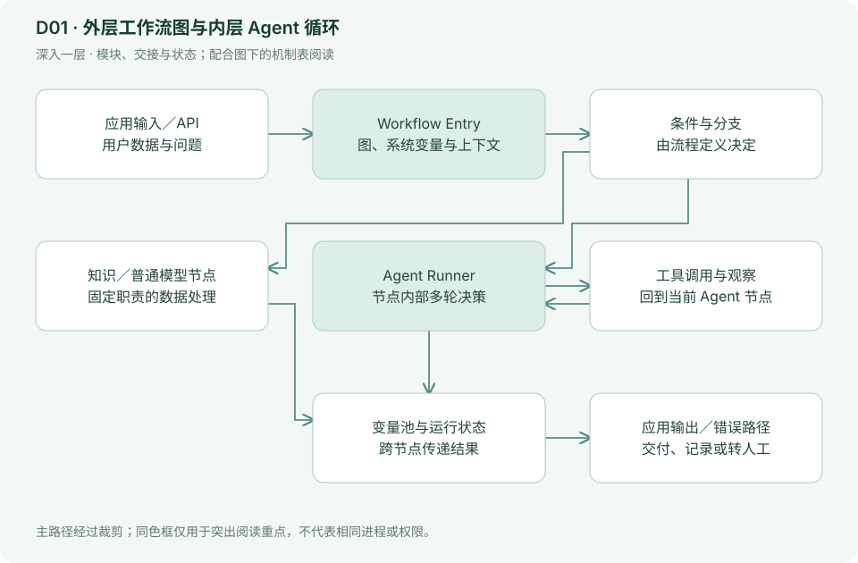

| 模块／交接点 | 怎样工作 | 状态与边界 |
|---|---|---|
| 外层图 | 显式节点和连线组织业务顺序 | 连错分支时，换强模型不能修复流程。 |
| 变量池 | 保存系统和节点产生的数据 | 字段名称、类型与空值决定交接是否正确。 |
| 内层 Agent | 在节点范围内反复请求模型和工具 | 应配置预算、工具范围与可观察的退出条件。 |

**沿着一次任务看数据怎样走。** 例如政策问答先分类，再检索，再判断证据是否充分。只有需要开放式调查的那一步用 Agent；最终回答节点读取确定的证据字段。排查错误时先看分类和变量，再看检索，最后看生成，避免把所有问题归给模型。

**与相近工具的实质差别。** 与自主编码代理相比，Dify 把可预设部分交给图；与 n8n 相比，AI 应用、知识和节点内部模型运行更居于中心。

本节细图与机制依据：[workflow_entry.py](https://github.com/langgenius/dify/blob/a068c47ea993ccc0f943131c274b7830b16de9f4/api/core/workflow/workflow_entry.py)、[fc_agent_runner.py](https://github.com/langgenius/dify/blob/a068c47ea993ccc0f943131c274b7830b16de9f4/api/core/agent/fc_agent_runner.py)。图中选取主要模块与交接路径，完整结构及并行条件请结合所引材料阅读。

#### 局部放大：放大一个 Agent 节点：循环与流程的出口

外层工作流进入 Agent 节点后，不一定马上得到一个结果：Runner 可能多次请求模型和工具。只有节点形成输出或结束状态，外层流程才能按自己的规则继续。Agent 内部思路再灵活，也必须遵守节点输入输出契约。比如调查节点最终必须返回 evidence 字段，后续回答节点才知道哪些是已取得的证据；仅输出一段“我查好了”的说明可能无法完成结构化交接。

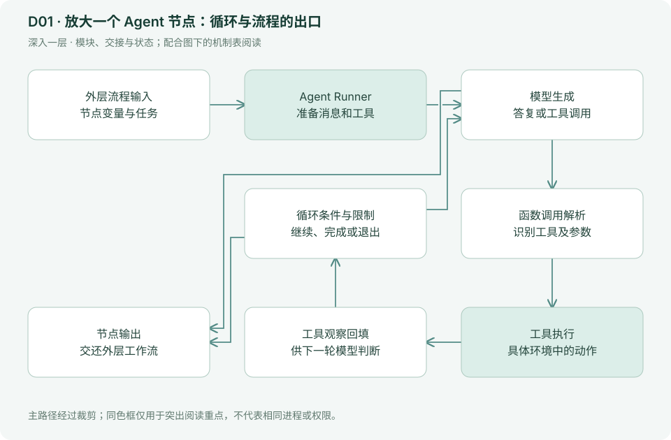

本图依据同节列出的固定源码与官方文档，表示所选子系统的主要路径。

### 能力、状态与边界

| 观察项 | 实际机制／公开能力 | 对使用者意味着什么 |
|---|---|---|
| 流程 | 显式节点、分支与变量 | 适合重复任务，变更时需维护流程 |
| Agent 节点 | 局部多轮模型与工具循环 | 自治范围应限制在确有不确定性的环节 |
| 知识 | 检索材料参与应用回答 | 引用和缺失资料需要单独验收 |
| 模型 | 可按节点选择支持的 Provider | 不同节点的错误会累积到最终结果 |
| 发布 | 应用供其他用户或系统调用 | 测试版本与对外使用版本需区分 |
| 部署与许可 | 云服务、自托管与企业能力 | 按实际许可证和服务条款确认范围 |

**把机制放进实际工作。**

流程图适合表达可确定的业务顺序，但模型仍会引入不确定输出。每个节点应有明确输入与输出约定，必要时增加结构检查；上游字段缺失时，下游不能默默以常识补齐。调试从节点数据开始，通常比直接修改整条提示更有效。

Agent 节点应放在真正需要探索的环节。若只是固定分类或提取，让模型自由调用许多工具可能增加成本与失败路径；若资料明显不足，流程应返回缺口，或转交人工补充材料。外层流程和局部自治各用在适合的位置，才能发挥组合价值。

应用发布后，模型、知识源和提示的变化都可能改变结果。保留代表性样本与可工作的流程版本，变更后重点回归受到影响的分支。多人业务应用还要区分终端使用者与流程管理者的权限，不能因为作者能访问某项资料，就把它暴露给所有应用用户。

### 从安装到完成第一个任务

1. 选择云服务或按官方文档自托管，先配置一个模型与测试资料；明确最终应用面对谁、接收什么输入。

2. 建立最小流程，只保留输入、必要检索、生成与输出。固定输出字段，便于检查与后续系统使用。

3. 加入分类和分支时，为每类准备正常、边界与无法判断的样本；证据不足时，明确返回缺口与可继续处理的条件。

4. 只有某一步不能预先固定时再用 Agent 节点，为其指定工具、预算和退出条件。工具报错要回到可观察的失败分支。

5. 用代表性样本验收整条流程，再发布给实际用户；修改模型、提示或知识源后重新验证，并保存可工作的流程版本。

下面是启动命令或操作路线；路径、认证与功能入口请按自己的版本调整。

```text
示例流程（概念配置，非可导入文件）：
问题 → 分类 → 对应知识检索 → 证据是否足够？
足够：生成带来源的回答
不足：列出缺失信息并转人工
工具错误：记录失败，返回明确状态
```

### 典型任务与验收方法

下面是一份**可直接改写使用的试用任务**，属于本报告设计的验收示例，并非已完成的运行测试。

> 建立内部政策问答应用，按问题类型检索不同手册；答案要引用来源，无法确认时返回待人工处理的原因和需要补充的资料。

逐节点检查输入输出，再检查最终用户结果。分类错会检索错库，字段丢失会让后续模型凭空猜；强模型只能改善部分判断，无法修复错误的流程连线或权限设计。

### 模型搭配、适用方向与取舍

从一个简单问答或资料提取流程开始，固定输入和输出格式；模型使用平台当前支持的 GPT、Claude、Qwen、DeepSeek 等。简单分类与复杂判断可以分配不同档位，但必须对整个流程验收。适合客服知识、文档处理、企业内部 AI 应用；临时修一个代码 bug 通常不是最简路径。难度：基础中；生产化高。许可证、企业能力和云服务与自托管差异应单独核对。

| 选择路线 | 候选组合 | 怎样决定 |
|---|---|---|
| 简单节点 | 支持接口的经济模型 | 分类和固定提取先用样本验收，并设计无法判断分支。 |
| 复杂判断 | 支持的较强 GPT／Claude／中文模型 | 按节点升级，避免整条流程无差别使用最高档。 |
| 本地或组织 | 对应插件／节点支持的内部服务 | 检查结构化输出、工具参数、失败重试与总成本。 |

适合可重复资料处理、客服与内部 AI 应用。它把临时任务变成需要维护的流程产品，因此改一个本地 bug 通常不值得先建应用。与 n8n 比较时看 AI 应用与业务连接器的重心；与自主代理比较时看可预设流程有多少。

### 资料依据与继续阅读

[README](https://github.com/langgenius/dify/blob/a068c47ea993ccc0f943131c274b7830b16de9f4/README.md)、[工作流入口](https://github.com/langgenius/dify/blob/a068c47ea993ccc0f943131c274b7830b16de9f4/api/core/workflow/workflow_entry.py)、[工具调用代理](https://github.com/langgenius/dify/blob/a068c47ea993ccc0f943131c274b7830b16de9f4/api/core/agent/fc_agent_runner.py)。

源码链接指向固定提交；关键实现分析不等于对整个项目和依赖逐行审计。上面的流程建议与取舍是依据这些材料给出的选型判断；具体型号、权限和菜单以实际安装与账户为准。

<a id="d02"></a>

## D02 n8n：让代理进入已有的业务自动化

### 定位与设计理念

n8n 的起点是连接应用与触发流程，AI Agent 是其中可配置的节点。当前 Tools Agent 执行器建立模型、记忆、批处理等上下文，再将工具执行交还工作流引擎并接续结果，同时记录执行次数、失败类型和记忆读写等追踪信息。[README](https://github.com/n8n-io/n8n/blob/8012f017bc80a35cef0c3012033e9089c9db8e03/README.md)、[Tools Agent V3](https://github.com/n8n-io/n8n/blob/8012f017bc80a35cef0c3012033e9089c9db8e03/packages/@n8n/nodes-langchain/nodes/agents/Agent/agents/ToolsAgent/V3/execute.ts)

n8n 从业务自动化出发，AI Agent 是流程中的一类节点。表单、计划或应用事件先触发任务，流程把数据交给模型判断，再连接其他系统。这适合重复发生、输入输出位置明确的工作。模型处理语义不确定性，流程负责固定顺序；把二者分开，可以减少让模型自行决定全部业务动作的负担。

### 工作原理与架构图

下图结合所引源码与文档，画出本工具的主要责任分工；为便于理解，省略次要模块与错误分支。

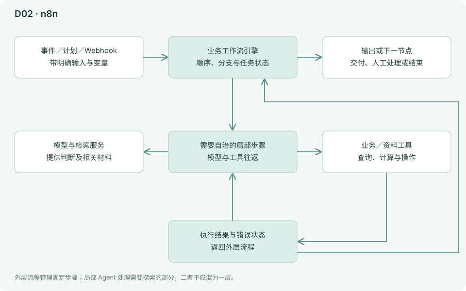

这与终端代理最明显的差别在于“什么时候开始做事”：可以由表单、计划、Webhook 或应用事件触发；输入输出已经是业务数据。模型负责有不确定性的环节，外层流程负责顺序与交接。

模型可以决定调用哪个已暴露工具，而实际工具执行仍与工作流引擎衔接。引擎继续传递结果并保存运行状态，使排错能够定位到具体节点。自动重试需要格外考虑重复副作用：一次创建工单已成功、回执却丢失时，直接重跑可能创建两份。可以用业务唯一标识检查是否已经处理过，为重试提供可核查的依据。

#### 深入一层：工作流引擎如何接管 Agent 的工具执行

n8n 的 Tools Agent V3 将代理决策与工具执行分开衔接。代码会组织批次和模型／记忆输入，把工具请求交给引擎执行，再消费返回的 actionResponses；同时记录迭代、调用和记忆读写等信息。这样 Agent 的自主判断仍嵌在可观察的工作流执行体系中。

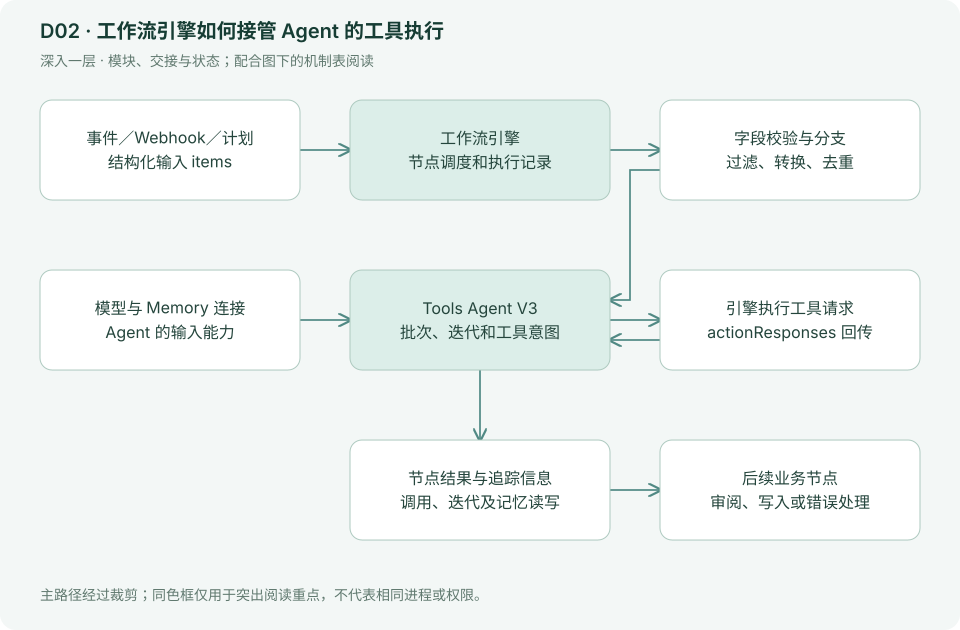

| 模块／交接点 | 怎样工作 | 状态与边界 |
|---|---|---|
| 数据批次 | 输入以 items 进入，按批次处理 | 一个输入与多个输入的字段处理可能不同。 |
| 工具交接 | Agent 提出请求，引擎执行后回传结果 | 超时和重试要考虑已经发生的业务动作。 |
| 执行记录 | 节点结果与追踪信息帮助定位失败 | 模型 Token 少不代表整个流程运行成本低。 |

**沿着一次任务看数据怎样走。** 例如每周工单汇总：校验节点确定时间范围，Agent 整理语义，后续节点存储审阅后的报告。若重复触发，先按周期标识查已处理记录；否则流程重试可能重复创建报告，即便生成内容完全正确。

**与相近工具的实质差别。** 与 Dify 相比，两者都有外层流程与内层 Agent，n8n 更突出事件、业务数据和应用连接；与纯代理循环相比，它要求提前设计字段与失败路径。

本节细图与机制依据：[execute.ts](https://github.com/n8n-io/n8n/blob/8012f017bc80a35cef0c3012033e9089c9db8e03/packages/@n8n/nodes-langchain/nodes/agents/Agent/agents/ToolsAgent/V3/execute.ts)、[README.md](https://github.com/n8n-io/n8n/blob/8012f017bc80a35cef0c3012033e9089c9db8e03/README.md)。图中选取主要模块与交接路径，完整结构及并行条件请结合所引材料阅读。

### 能力、状态与边界

| 观察项 | 实际机制／公开能力 | 对使用者意味着什么 |
|---|---|---|
| 启动方式 | 计划、表单、Webhook 与应用事件 | 触发频率和输入质量影响整个系统 |
| 固定流程 | 节点、变量与状态记录 | 关键业务顺序应由流程明确表达 |
| 代理节点 | 模型、记忆、工具及批处理 | 限制为该任务需要的工具 |
| 连接器 | 跨应用读取和写入 | 核对账户身份、字段和授权范围 |
| 失败恢复 | 节点执行与错误追踪 | 重试前考虑重复创建、重复发送等副作用 |
| 许可 | 官方 fair-code 路线 | 源码可见不意味着任何商业用途都无条件开放 |

**把机制放进实际工作。**

自动化的核心问题之一是重复。网络超时可能发生在动作已成功之后，因此重试前需要业务标识或状态检查。让模型承诺不重复，无法替代确定的去重逻辑。创建记录、发送消息和更新状态尤其需要清楚的恢复设计。

字段与批量数据也容易出错。上游返回空数组、多个对象或不同日期格式时，下游节点可能收到与预期不同的输入。先检查节点数据和转换，再判断模型是否理解错误；把所有结构问题包装成自然语言交给模型，会降低流程可解释性。

Agent 节点适合处理需要理解的局部工作，固定业务顺序由工作流管理。逐步从手动触发到定时运行，可以把内容质量、流程正确性与长期可靠性分开验收。成本除了模型，还包括连接器配额、运行资源和处理失败的人工时间，长期任务尤其需要这本总账。

### 从安装到完成第一个任务

1. 从手动触发开始，连接一个测试数据源和模型，先跑“读取→生成草稿→人工检查→保存”的最小流程。

2. 明确定义每一步字段，检查数组、空值和日期格式，避免模型把结构错误写成自然语言解释后继续执行。

3. 在 Agent 节点只配置所需工具，先让它只读或生成草稿；外部写入放在能够审阅的后续步骤。

4. 测试模型超时、连接器失败与重复事件，设置业务唯一标识和已处理记录；确认重跑不会重复写入。

5. 最后才添加计划或 Webhook，配置运行记录与失败处理；每次改模型、凭据或节点后复测关键路径。

下面是启动命令或操作路线；路径、认证与功能入口请按自己的版本调整。

```text
周报自动化的概念流程：
手动／定时触发 → 读取本周数据 → 校验字段
→ 模型生成草稿 → 人工审阅 → 保存最终文件
每周使用唯一周期标识，重复触发先检查是否已处理。
```

### 典型任务与验收方法

下面是一份**可直接改写使用的试用任务**，属于本报告设计的验收示例，并非已完成的运行测试。

> 每周汇总项目工单，生成进展与风险草稿，保留工单链接和统计口径。先等待人工确认，再保存到指定位置；同一周重复运行不生成重复记录。

用空数据、重复事件、连接器暂时失败和人工退回四种情况验证。报告写得好只证明其中一个节点工作，整条自动化还要证明输入准确、写入可控和失败可追踪。

### 模型搭配、适用方向与取舍

先做“读取数据→生成草稿→人工确认→保存”四步，再加自动触发。简单步骤试经济模型，复杂判断试更强模型；只有确认所用节点支持相应接口后才接入。适合每周报告、线索整理、工单分类、跨应用资料处理。难度：中；可靠生产流程高。官方称其为 fair-code，不应把可见源码直接解释成无条件的宽松开源许可。

| 选择路线 | 候选组合 | 怎样决定 |
|---|---|---|
| 简单节点 | 支持接口的经济模型 | 分类和固定提取先用样本验收，并设计无法判断分支。 |
| 复杂判断 | 支持的较强 GPT／Claude／中文模型 | 按节点升级，避免整条流程无差别使用最高档。 |
| 本地或组织 | 对应插件／节点支持的内部服务 | 检查结构化输出、工具参数、失败重试与总成本。 |

适合跨应用、重复触发和字段明确的业务工作。代价是流程、凭据和失败分支维护。模糊的一次性研究可用通用代理，固定资料应用可用 Dify；先判断任务是否会重复，再决定值得投入多少流程搭建工作。

### 资料依据与继续阅读

[README](https://github.com/n8n-io/n8n/blob/8012f017bc80a35cef0c3012033e9089c9db8e03/README.md)、[Tools Agent V3](https://github.com/n8n-io/n8n/blob/8012f017bc80a35cef0c3012033e9089c9db8e03/packages/@n8n/nodes-langchain/nodes/agents/Agent/agents/ToolsAgent/V3/execute.ts)。

源码链接指向固定提交；关键实现分析不等于对整个项目和依赖逐行审计。上面的流程建议与取舍是依据这些材料给出的选型判断；具体型号、权限和菜单以实际安装与账户为准。

<a id="d03"></a>

## D03 mini-SWE-agent：研究代理时，一个短循环有时比复杂平台更有用

### 定位与设计理念

mini-SWE-agent 强调小而可理解的执行核心，面向软件工程任务与评测。当前 v2 的 Agent 反复执行查询模型、执行动作、加入观察；它也有步数、成本、时间与格式错误终止条件，并保存运行轨迹。[README](https://github.com/SWE-agent/mini-swe-agent/blob/04d809ceab9df28f9adaed044884180159172930/README.md)、[核心实现](https://github.com/SWE-agent/mini-swe-agent/blob/04d809ceab9df28f9adaed044884180159172930/src/minisweagent/agents/default.py)

mini-SWE-agent 把研究所需的关键循环保持得很短：问模型、执行动作、加入观察，再重复。少量核心逻辑让人更容易知道实验改变了什么，也更容易检查轨迹。它不以提供完整个人助理产品为目标；缺少某些界面或长期记忆，可能是研究可解释性与简洁性的取舍。

### 工作原理与架构图

下图结合所引源码与文档，画出本工具的主要责任分工；为便于理解，省略次要模块与错误分支。

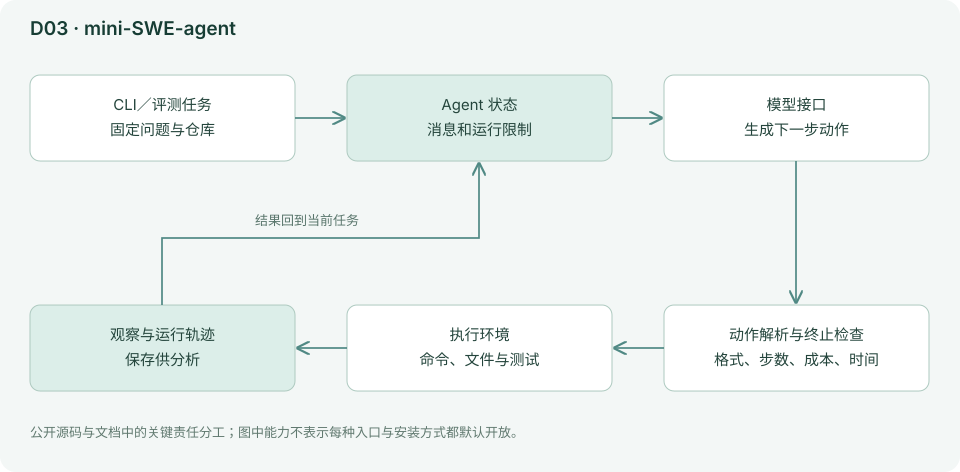

少量代码更容易理解实验中到底改变了什么。代价是完整产品通常还需要的用户管理、丰富 UI、长期个人记忆和业务连接器不属于这个核心目标。

循环中的每次观察都进入后续模型输入，运行限制防止无限持续。轨迹让研究者看到模型什么时候走错、工具返回了什么，以及终止是完成还是预算耗尽。比较模型或工具时固定其他变量，才能解释结果：同一模型、不同提示属于提示实验；同时换模型、环境和预算，则难以说清哪一项带来提升。

#### 深入一层：极简循环中每一步到底保存了什么

mini-SWE-agent 把模型查询、动作执行和观察回填保持在很短的核心路径内，方便研究者定位实验变量。消息历史记录模型看过什么，执行环境决定命令实际上做了什么，终止判断决定为何停止。这三件事一起才构成一条可解释轨迹。

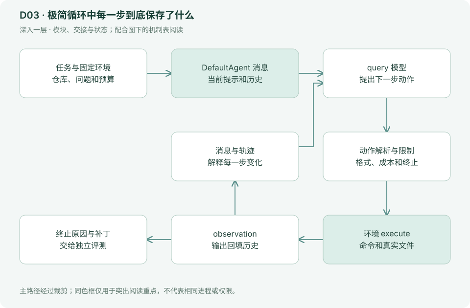

| 模块／交接点 | 怎样工作 | 状态与边界 |
|---|---|---|
| 消息状态 | 问题、动作和观察连续累积 | 核对摘要保留了哪些信息，并保存原始材料供追溯。 |
| 执行环境 | 命令在指定环境运行并返回观察 | 依赖失败应与代码推理失败分别统计。 |
| 终止与评测 | 预算、格式和完成信号影响退出 | 正常退出也不能代替补丁验收。 |

**沿着一次任务看数据怎样走。** 例如比较两种工具提示：固定仓库、模型和预算，只改提示，保存每轮动作与输出，再用同一测试验证补丁。若同时换环境和模型，就无法把结果差异可靠地归给提示设计。

**与相近工具的实质差别。** 与 SWE-agent 较丰富的接口与轨迹处理相比，mini 路线强调少量核心代码；与产品型工具相比，它不会自动提供完整组织治理和个人助理体验。

本节细图与机制依据：[default.py](https://github.com/SWE-agent/mini-swe-agent/blob/04d809ceab9df28f9adaed044884180159172930/src/minisweagent/agents/default.py)、[README.md](https://github.com/SWE-agent/mini-swe-agent/blob/04d809ceab9df28f9adaed044884180159172930/README.md)。图中选取主要模块与交接路径，完整结构及并行条件请结合所引材料阅读。

### 能力、状态与边界

| 观察项 | 实际机制／公开能力 | 对使用者意味着什么 |
|---|---|---|
| 核心 | 查询、动作、观察的短循环 | 适合教学与控制变量实验 |
| 限制 | 步数、成本、时间和格式错误 | 终止原因应与成功率一起报告 |
| 环境 | 软件工程任务的实际执行环境 | 依赖和测试基线必须可重复 |
| 记录 | 保存运行轨迹 | 用于解释失败，不能代替独立验收 |
| 模型 | 依接口选择可稳定调用的型号 | 评测需固定版本与采样条件 |
| 产品边界 | 不以完整多用户工作台为重心 | 个人记忆、权限治理与连接器需另行设计 |

**把机制放进实际工作。**

短循环使实验变量更容易控制，但并不意味着环境可以忽略。相同模型和提示，在不同依赖、工具或测试版本中也可能得到不同结果。保留固定仓库状态与执行环境，是解释成功率的基础。

轨迹分析应找到第一个实质性偏差：没找到关键文件、生成错误动作、误解工具输出，还是在预算结束前没有验证。这样可以将改进落实到文件检索、动作生成、反馈理解或验证等具体环节。最后文本中的自评只是一条消息，独立检查才决定任务是否完成。

对照实验还要防止只挑成功案例。记录全部任务、终止原因、重试和预算；模型输出随机时观察多次结果，工具配置变化则一次只改一项。它适合把代理机制讲清楚，但研究结果推广到日常产品时，仍需考虑界面、权限、历史和人工协作这些额外层次。

### 从安装到完成第一个任务

1. 按官方教程安装并选择受控环境，准备一个已知 issue 和固定仓库提交；记录原有测试结果。

2. 配置模型、提示与预算，先运行单个任务，确认轨迹和产物被保存到可检查位置。

3. 查看失败或完成的真正原因，核对补丁是否解决问题，而不只读取模型最后一条消息。

4. 只改变一个实验变量，再重复相同条件。若模型输出有随机性，用多次任务或重复运行观察波动。

5. 报告成功、失败类型、预算和环境条件，并保存配置；日常开发选型还需加入自己的任务与人工协作条件进行试用。

下面是启动命令或操作路线；路径、认证与功能入口请按自己的版本调整。

```bash
# 按官方教程安装、配置模型及执行环境后
mini
```

### 典型任务与验收方法

下面是一份**可直接改写使用的试用任务**，属于本报告设计的验收示例，并非已完成的运行测试。

> 在固定仓库提交上修复一个可重现问题，限制运行预算并保存完整轨迹。用同一验收检查比较两种提示策略，其他条件保持不变。

检查补丁、测试与终止原因。模型说完成但测试失败应算失败，预算耗尽也不能记作正常完成。记录环境准备失败，避免把所有失败都混成模型能力不足。

### 模型搭配、适用方向与取舍

使用官方教程，在隔离环境中跑一个 issue，固定模型、提示、环境和预算，再改变单一变量。适合模型／Harness 对照实验、课程教学、自动修复研究。模型应选择评测任务能稳定调用的接口；不因为 README 宣称某项基准领先，就推断它适合所有日常交互。难度：研究者中；非开发者高。

| 选择路线 | 候选组合 | 怎样决定 |
|---|---|---|
| 复现实验 | 目标配置的精确模型版本 | 不可用时注明新条件，不冒充原实验复现。 |
| 方法对照 | 固定模型，只改一项 Harness 变量 | 同时固定环境、提示、任务数据和预算。 |
| 模型对照 | 固定 Harness，再更换模型 | 记录重复运行、终止原因与独立验收，不只选成功样例。 |

适合代理课程、自动修复研究和模型／Harness 对照实验。日常用户若需要完整审批、团队协作和长期个人资料管理，通常还要额外搭建。简洁有助于解释结果，不代表它天然在所有任务上更快或更准确。

### 资料依据与继续阅读

[README](https://github.com/SWE-agent/mini-swe-agent/blob/04d809ceab9df28f9adaed044884180159172930/README.md)、[核心实现](https://github.com/SWE-agent/mini-swe-agent/blob/04d809ceab9df28f9adaed044884180159172930/src/minisweagent/agents/default.py)。

源码链接指向固定提交；关键实现分析不等于对整个项目和依赖逐行审计。上面的流程建议与取舍是依据这些材料给出的选型判断；具体型号、权限和菜单以实际安装与账户为准。

<a id="d04"></a>

## D04 SWE-agent：仍值得理解，但官方已把主力转向 mini

### 定位与设计理念

SWE-agent 对代理如何使用软件工程工具、怎样给模型设计可操作接口，有重要历史与研究价值。其执行器围绕模型、环境、工具、格式检查与重试推进任务。[核心实现](https://github.com/SWE-agent/SWE-agent/blob/3ea751c087f32b16e039a2233dd6eefecef325d5/sweagent/agent/agents.py)

SWE-agent 的研究价值在于把软件工程环境与模型可操作接口结合起来。工具怎样呈现文件、错误怎样反馈、动作格式怎样检查，都可能改变完成率。当前维护重点已转向 mini，因此本条主要用于复现实验与理解历史设计；新工作优先评估 mini 等当前路线。

### 工作原理与架构图

下图结合所引源码与文档，画出本工具的主要责任分工；为便于理解，省略次要模块与错误分支。

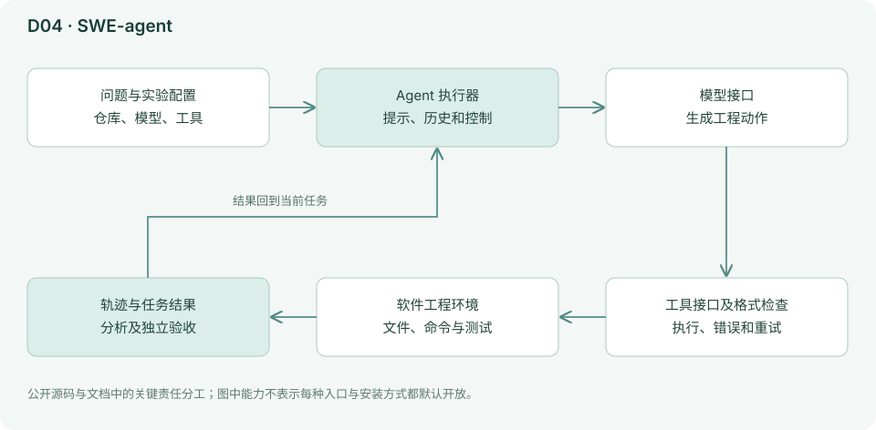

但当前 README 明确表示主要开发精力转向 mini-SWE-agent，并建议新用户优先采用后者。即使仓库近期有推送，也不能把它当成与 mini 同等优先的新路线。适合复现实验、读旧配置或维护已有项目；不列为本报告的新用户首选。[维护说明](https://github.com/SWE-agent/SWE-agent/blob/3ea751c087f32b16e039a2233dd6eefecef325d5/README.md)

工具接口是一种提供给模型的工作方式：怎样看文件、怎样定位内容、怎样修改和验证，都影响模型下一步判断。格式检查与重试帮助处理不合法输出，却不能保证合法动作本身正确。复现实验时必须保留原工具和环境配置；只保留模型名字，通常不足以解释论文或排行榜中的结果。

#### 深入一层：模型行动接口、环境观察与轨迹处理

SWE-agent 将模型和开发环境之间的交互界面作为研究对象：模型能看到哪些操作、输出怎样整理、错误怎样回到下一轮，都会影响问题解决能力。Agent 类组织运行、历史与轨迹，工具及环境则执行实际动作。因此“模型相同”并不足以保证与另一 Harness 的实验条件相同。

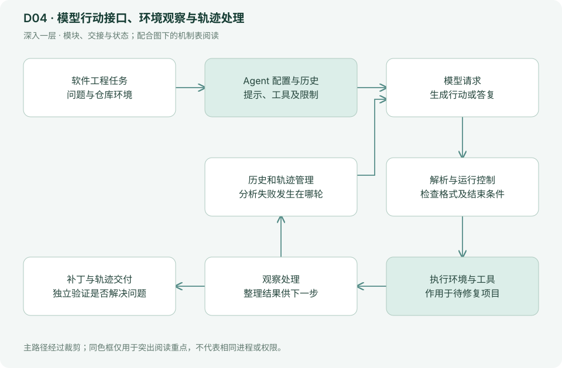

| 模块／交接点 | 怎样工作 | 状态与边界 |
|---|---|---|
| 行动接口 | 提示、动作格式和工具构成模型的操作面板 | 接口难用会增加格式失败与无效步骤。 |
| 观察处理 | 把环境返回内容送回后续决策 | 输出过长或缺失关键信息会改变任务难度。 |
| 轨迹证据 | 保留动作序列及终止原因 | 成功率之外还应报告环境和预算条件。 |

**沿着一次任务看数据怎样走。** 例如修复一个已知 issue：先确认失败测试，代理在环境中逐步调查和编辑；评测端再检查最终补丁。分析失败时，从完整轨迹中定位第一次错误假设及其后续影响。

**与相近工具的实质差别。** 与 mini-SWE-agent 相比，更丰富的接口与处理提供研究控制点，也增加实验配置复杂度；与日常 IDE 产品相比，重点是可分析、可复现的软件工程任务执行。

本节细图与机制依据：[agents.py](https://github.com/SWE-agent/SWE-agent/blob/3ea751c087f32b16e039a2233dd6eefecef325d5/sweagent/agent/agents.py)、[README.md](https://github.com/SWE-agent/SWE-agent/blob/3ea751c087f32b16e039a2233dd6eefecef325d5/README.md)。图中选取主要模块与交接路径，完整结构及并行条件请结合所引材料阅读。

### 能力、状态与边界

| 观察项 | 实际机制／公开能力 | 对使用者意味着什么 |
|---|---|---|
| 研究目的 | 软件工程代理与工具接口设计 | 适合理解模型如何操作环境 |
| 执行 | 模型、工具、格式检查与重试 | 格式合法与任务成功是两个指标 |
| 配置 | 任务、环境与模型共同定义实验 | 固定依赖和提示才能复现 |
| 轨迹 | 保存过程供分析 | 检查真实补丁和测试，不只看最终文本 |
| 维护 | 官方主力转向 mini-SWE-agent | 近期推送不代表同等产品投入 |
| 使用建议 | 既有部署与历史实验仍可研究 | 新项目优先评估 mini 等更活跃路线 |

**把机制放进实际工作。**

工具接口不仅是功能集合，也影响模型怎样思考和行动。文件展示方式、错误提示和编辑格式都会改变后续选择；复现实验若更换这些条件，即使模型相同，也不再是原来的组合。研究旧结果时应把工具配置与提示当作实验的一部分保存。

格式重试能帮助纠正不合法动作，却不能证明合法动作有意义。不断执行同样的错误调查仍可能消耗预算，必须回到轨迹看模型是否利用了反馈。把格式失败、环境失败和推理失败分开，才能判断改进应该落在哪里。

维护转向 mini 后，旧项目仍可用于理解历史方法，但新工作应评估维护责任。迁移时保留任务与验收，逐项替换执行器和工具，便于解释结果变化。无法取得原模型或环境时，应明确称为新的对照研究，保留与历史实验的差异。

### 从安装到完成第一个任务

1. 先明确是复现历史实验还是维护既有部署；新项目优先读官方维护说明，判断是否改用 mini。

2. 复现时固定论文或实验所用提交、配置和任务数据，准备匹配的环境，不直接用最新依赖替换。

3. 选择一个单任务验证工具、模型接口和轨迹保存，确认预算与停止条件符合实验设定。

4. 独立检查补丁与测试，记录格式错误、环境错误和推理错误；按模型判断、工具格式和环境问题分别整理失败原因。

5. 需要迁移时，将任务、验收和环境先带到新执行器，再对照工具接口差异；不假定旧配置可原样加载。

下面是启动命令或操作路线；路径、认证与功能入口请按自己的版本调整。

```text
历史实验复现包：
代码提交、配置文件、模型精确版本
任务数据版本、环境镜像、预算和提示
原始轨迹、补丁、独立验收结果
具体启动命令采用目标提交所附文档。
```

### 典型任务与验收方法

下面是一份**可直接改写使用的试用任务**，属于本报告设计的验收示例，并非已完成的运行测试。

> 复现一项已有软件修复实验，并解释失败发生在哪一步。随后在相同模型和环境下用 mini 路线对照，记录工具接口改变了什么。

重点检查结果能否复现，以及轨迹能否解释成功和失败的原因。模型版本不可用或环境变化时应说明不可比之处；环境已经变化时，将结果标为新的对照实验，并列明与原实验的差异。

### 模型搭配、适用方向与取舍

| 选择路线 | 候选组合 | 怎样决定 |
|---|---|---|
| 复现实验 | 目标配置的精确模型版本 | 不可用时注明新条件，不冒充原实验复现。 |
| 方法对照 | 固定模型，只改一项 Harness 变量 | 同时固定环境、提示、任务数据和预算。 |
| 模型对照 | 固定 Harness，再更换模型 | 记录重复运行、终止原因与独立验收，不只选成功样例。 |

模型选择以目标实验原配置为优先；无法取得原型号时明确标为新的对照实验。已有用户可按稳定性继续维护，新用户更宜从 mini 入手。它仍适合研究工具接口设计，但长期产品化需要额外承担维护责任。

### 资料依据与继续阅读

[核心实现](https://github.com/SWE-agent/SWE-agent/blob/3ea751c087f32b16e039a2233dd6eefecef325d5/sweagent/agent/agents.py)、[维护说明](https://github.com/SWE-agent/SWE-agent/blob/3ea751c087f32b16e039a2233dd6eefecef325d5/README.md)。

源码链接指向固定提交；关键实现分析不等于对整个项目和依赖逐行审计。上面的流程建议与取舍是依据这些材料给出的选型判断；具体型号、权限和菜单以实际安装与账户为准。

<a id="d05"></a>

## D05 Oh My OpenAgent／OmO：叠加在执行核心之上的编排体系

### 定位与设计理念

当前仓库是 `oh-my-openagent`，文档已经覆盖 Pi 相关路线和新的编排配置，不能一直按早期 OpenCode 插件的固定角色表介绍它。[README](https://github.com/code-yeongyu/oh-my-openagent/blob/d862a09a0cce8a77b14168bd68d5a29087b18d79/README.md)

OmO 在已有执行核心之上加入编排经验：什么时候先规划、怎样派任务、如何保留证据和继续工作。它不是一个模型，也不是只能独立运行的底层循环。其收益来自把成熟任务习惯复用起来；同时多加一层依赖，也意味着行为问题可能来自模型、底座、插件或配置中的任何一层。

### 工作原理与架构图

下图结合所引源码与文档，画出本工具的主要责任分工；为便于理解，省略次要模块与错误分支。

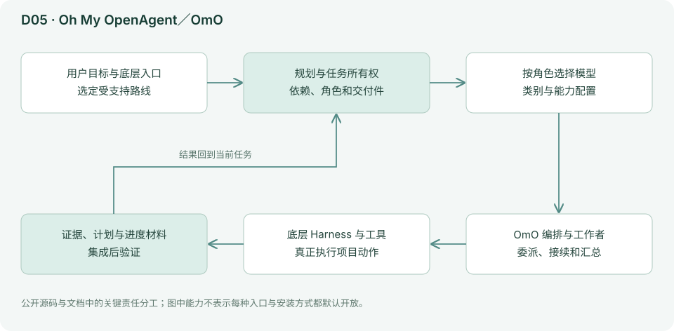

当前编排文档区分规划、执行、依赖图和团队模式。主代理保持任务所有权，通过任务工具委派；工作者可以按类别选择模型，探索与资料代理拥有受限职责。计划文件、进度状态与证据材料服务于继续执行和验证。[编排说明](https://github.com/code-yeongyu/oh-my-openagent/blob/d862a09a0cce8a77b14168bd68d5a29087b18d79/docs/guide/orchestration.md)

这类系统的收益在于把经验性的提示、任务拆分和复查做成可复用流程。代价是增加一层依赖：模型、底层 Harness、插件与配置都可能影响结果。升级任何一层都应做回归任务。

依赖图表达哪项工作必须等另一项完成，主代理保留整体任务责任，工作者按职责交回材料。这能避免所有任务一次性并行导致接口互相猜测。计划和证据文件让恢复有依据，但如果工作者只交一句“已完成”，主任务仍无法可靠判断。当前文档已包含 Pi 路线，旧 OpenCode 插件名称和固定角色表不能代表全部现状。

#### 深入一层：主代理、分类工作者与审查门槛

OmO 的固定快照将主要工作流交给同一主 Agent，通过技能进入规划或执行，而不是必须切换成互不相干的规划者和执行者。task 调用要在 category 与 subagent_type 两种路由中二选一：前者按类别配置工作者，后者调用命名专门代理。只读记忆侧车又是另一条辅助路径，不承担实施任务。

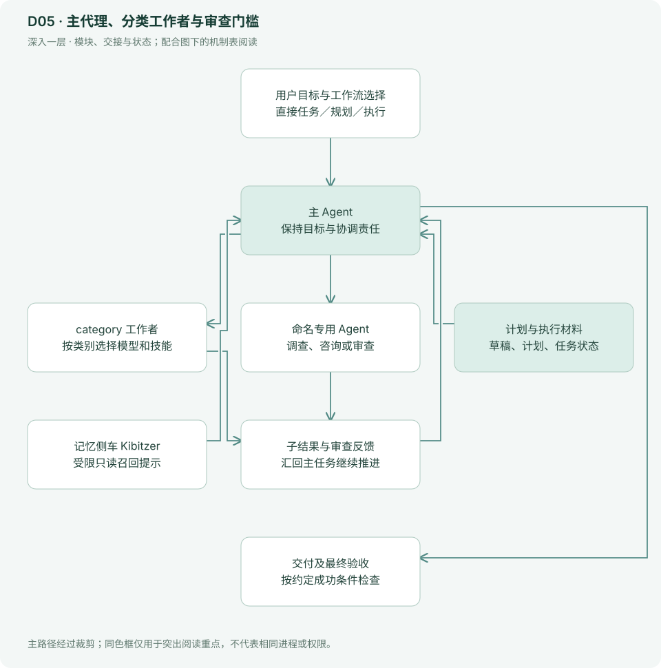

| 模块／交接点 | 怎样工作 | 状态与边界 |
|---|---|---|
| 路由规则 | 类别任务的模型来自类别配置 | 不能把临时 model 参数与类别配置任意混用。 |
| 规划门槛 | 某些咨询和审查角色只在特定规划条件下开放 | 角色存在不代表主代理随时可调用。 |
| 记忆侧车 | 观察有限事件并提供只读召回提示 | 提醒不等于自动写入记忆，也不应唤醒空闲主任务。 |

**沿着一次任务看数据怎样走。** 例如大型重构：先形成可执行计划与验收条件，再按类别委派实现和检查；主代理汇总结果，必要时按审查意见修正。若工作者都完成而集成仍失败，整个目标仍未完成，不能用角色数量代替验收。

**与相近工具的实质差别。** 与一般子代理工具相比，OmO 在路由、规划契约和审查流程上更厚；与 Dify 的节点图相比，许多步骤仍由主代理根据工作流材料动态推进。

本节细图与机制依据：[orchestration.md](https://github.com/code-yeongyu/oh-my-openagent/blob/d862a09a0cce8a77b14168bd68d5a29087b18d79/docs/guide/orchestration.md)、[README.md](https://github.com/code-yeongyu/oh-my-openagent/blob/d862a09a0cce8a77b14168bd68d5a29087b18d79/README.md)。图中选取主要模块与交接路径，完整结构及并行条件请结合所引材料阅读。

### 能力、状态与边界

| 观察项 | 实际机制／公开能力 | 对使用者意味着什么 |
|---|---|---|
| 定位 | 叠加在 Harness 上的编排体系 | 组合应包含底座、插件版本与配置 |
| 规划 | 计划、依赖图与团队模式 | 先确定哪些任务真正独立 |
| 任务所有权 | 主代理统一负责委派与集成 | 有人完成局部不代表整体完成 |
| 工作者 | 按类别选择模型与职责 | 输入、输出和工具要明确 |
| 状态材料 | 计划、进度与证据用于接续 | 保存真实结果，避免空泛汇报 |
| 兼容维护 | 多层组合持续演进 | 升级任意一层都应运行基线任务 |

**把机制放进实际工作。**

编排层能够复用经验，也可能把不适合的流程强加给简单任务。每个新增角色都需要输入、输出、等待和汇总，存在固定成本。只有子任务足够独立且规模适当时，并行收益才可能超过协调开销。

依赖关系应在实施前表达。后端接口还没确定时让前端自主实现，往往产生返工；两个工作者同时修改共享配置，也可能互相覆盖。计划文件不仅列任务，还应记录接口、责任和停止条件，主代理保留集成判断。

多层升级是常见排错难点。底层 Harness 改工具格式，模型服务改行为，插件又改角色默认值，最终结果可能同时变化。一次只更新一层，保留最小任务和不使用编排的基线，能帮助判断是组合问题还是模型问题。可读的证据材料也让退出或迁移更容易。

### 从安装到完成第一个任务

1. 先让当前支持的底层 Harness 独立完成一个任务，确认模型、权限和工具正常；保存版本与配置。

2. 按当前官方路线加入 OmO，核对适用底座，不照搬早期教程中的名称、角色与默认模型表。

3. 选择一个具有独立子任务的需求，明确共享接口、依赖顺序和交付材料，再运行规划与委派。

4. 检查工作者的真实文件与证据，统一处理接口冲突；主任务收集子任务产物后，继续完成最终集成测试。

5. 和不用 OmO 的基线比较总时长、成本与人工干预。只在确实减少返工的任务类别中保留完整编排。

下面是启动命令或操作路线；路径、认证与功能入口请按自己的版本调整。

```text
编排任务示例：
先确定接口 → 并行调查独立模块 → 汇总证据
→ 分配实现 → 集成 → 统一验证
记录底层 Harness、OmO 版本、角色模型和权限配置。
```

### 典型任务与验收方法

下面是一份**可直接改写使用的试用任务**，属于本报告设计的验收示例，并非已完成的运行测试。

> 为现有项目增加导入功能，先确认格式与错误规则，再拆成解析、界面和测试任务。每项交回代码与证据，最后运行完整用户流程。

观察依赖是否真的约束执行，工作者是否反复修改共享文件，以及集成后能否通过统一检查。增加代理数量却增加返工，说明当前任务边界或编排方式不合适。

### 模型搭配、适用方向与取舍

先让底层 Harness 独立工作，再安装当前官方推荐的 OmO 路线；对一个具有独立子任务的项目试用，而不必让每个小改动都走完整编排。模型选择遵循角色配置和当前匹配文档，主代理用更强模型、机械任务用经济型号是一种待验证策略。难度：高。适合有能力维护配置的开发者，不适合作为完全不懂环境管理者的第一套工具。

| 选择路线 | 候选组合 | 怎样决定 |
|---|---|---|
| 主代理 | 底座支持的强规划与工具模型 | 负责接口、集成和困难判断，具体名称以当前配置为准。 |
| 独立工作者 | 按角色验收的经济或专项型号 | 给足输入和停止条件，统计所有分支开销。 |
| 兼容回归 | 固定底座、插件与模型版本 | 每次只更新一层，保留不使用编排的对照任务。 |

适合有能力维护配置、任务又确实可分工的开发者。轻量小修改可直接使用底层工具，省掉规划与交接成本。与 Factory 比较时看整合产品与自组装的取舍；与普通子代理比较时看任务状态和依赖管理是否有实际收益。

### 资料依据与继续阅读

[README](https://github.com/code-yeongyu/oh-my-openagent/blob/d862a09a0cce8a77b14168bd68d5a29087b18d79/README.md)、[编排说明](https://github.com/code-yeongyu/oh-my-openagent/blob/d862a09a0cce8a77b14168bd68d5a29087b18d79/docs/guide/orchestration.md)。

源码链接指向固定提交；关键实现分析不等于对整个项目和依赖逐行审计。上面的流程建议与取舍是依据这些材料给出的选型判断；具体型号、权限和菜单以实际安装与账户为准。

## 四个需要单独标记的旧项目／旧入口

| 项目 | 本次可核验事实 | 应怎样对待 |
|---|---|---|
| Continue | 当前 README 明确写不再积极维护，并发布最终 2.0.0；仓库元数据仍可能出现近期推送 | 保留历史与既有部署参考，新选型不列活跃首选 |
| Roo Code | 仓库已归档，README 说明扩展于 5 月 15 日关闭 | 不使用旧排行榜推荐新用户直接投入；分支或后续产品需重新核验 |
| Aider | 仓库仍未归档，但本次 API 快照最后推送为 2026-05-22 | 标记维护观察，不武断宣称停更或不可用 |
| `bytedance/trae-agent` | 本次仓库快照最后推送为 2026-02-05 | 与商业 TRAE 产品分开，作为研究代码观察项 |

来源：[Continue](https://github.com/continuedev/continue/blob/5522c6f44ca0ac3528b37244818fbfa39b5af470/README.md)、[Roo](https://github.com/RooCodeInc/Roo-Code/blob/b867ec9145750d0ae1ff7f02d35406e9bf2a0b16/README.md)、[Aider 仓库](https://github.com/Aider-AI/aider)、[TRAE Agent 仓库](https://github.com/bytedance/trae-agent)。具体抓取时间、提交和数值见[仓库快照表](../research/repository-snapshot.csv)。


<a id="h01"></a>

## H01 Continue：理解可配置编码助手，也要尊重维护结论

### 定位与设计理念

Continue 曾将 CLI、VS Code 和 JetBrains 入口与开放模型配置结合。所保存 README 明确写不再积极维护，并说明最终 2.0.0 发行。因此本条用于既有部署、历史设计与迁移参考，不把它作为新用户的活跃首选。[README 与最终发行](https://github.com/continuedev/continue/blob/5522c6f44ca0ac3528b37244818fbfa39b5af470/README.md)

它的历史价值在于让用户围绕现有编辑器配置模型与开发辅助能力。工具选择不必和某家模型完全绑定，用户可以把项目背景与自己的模型服务结合。维护状态发生变化后，最有价值的动作通常是盘点已有资产：哪些属于通用项目资料，哪些依赖插件内部机制，再决定继续维护还是迁移。

### 工作原理与架构图

下图依据所引公开文档概括职责，不代表完整源码审计或对现有服务可用性的确认。

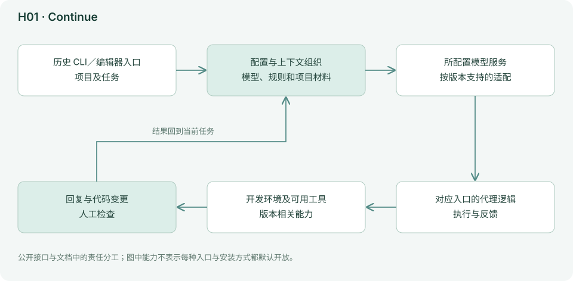


这张图仅归纳公开产品职责，不把某个历史版本的实现套到最终版。模型、界面和项目上下文可以分开管理，但某项特定功能可能依赖入口与版本。迁移最容易出错的是保留了模型名字，却没有迁移工具格式、规则优先级和项目背景。因此，备份时还应保存可独立理解的任务说明、项目资料与验收条件。

#### 深入一层：历史入口、可移植配置与迁移边界

Continue 的历史架构价值在于把模型配置、项目上下文与编辑器入口组合起来。当前条目处于维护观察，因此细图采用迁移边界图，而不把某个旧版内部实现冒充最终发行架构。先拆出通用资料与入口专属机制，才能判断哪些资产能直接带走、哪些必须重建。

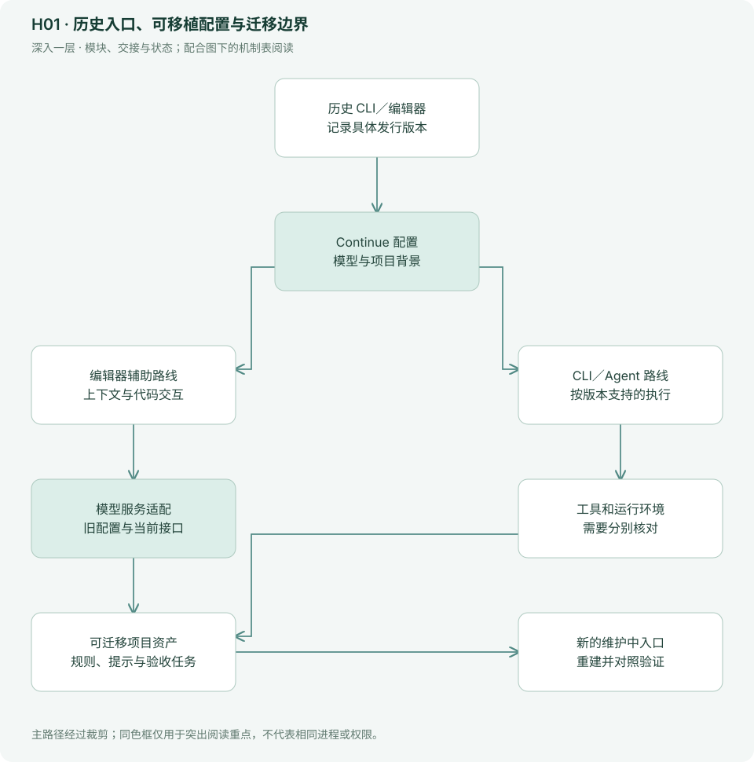

| 模块／交接点 | 怎样工作 | 状态与边界 |
|---|---|---|
| 通用资产 | 规则、提示、代码与验收任务可独立保存 | 优先导出可读材料，避免只保存插件私有状态。 |
| 接口配置 | Provider、模型 ID 和工具格式随版本变化 | 旧配置文件可解析不代表新服务兼容。 |
| 入口专属能力 | 编辑器和 CLI 曾有各自集成职责 | 迁移时用完整任务验证上下文、工具、恢复与交付。 |

**沿着一次任务看数据怎样走。** 例如迁移自动补测试工作流：保留同一仓库和验收，导出规则，重配新入口的模型与工具，再重做任务。若原模型不可用，应明确改变了实验条件，不能把全部差异归给新 Harness。

**与相近工具的实质差别。** 与活跃工具档案不同，这张图服务于既有部署盘点和迁移，不鼓励依据过时教程新建长期依赖。可配置路线的经验仍可用于评估当前产品。

本节细图与机制依据：[README.md](https://github.com/continuedev/continue/blob/5522c6f44ca0ac3528b37244818fbfa39b5af470/README.md)。图中选取主要模块与交接路径，完整结构及并行条件请结合所引材料阅读。

### 能力、状态与边界

| 观察项 | 实际机制／公开能力 | 对使用者意味着什么 |
|---|---|---|
| 入口 | 历史上覆盖 CLI 与多种编辑器 | 先记录当前仍在使用的具体版本 |
| 模型配置 | 可配置模型服务的产品路线 | 旧适配不保证支持之后发布的新型号 |
| 项目资料 | 规则和上下文是重要资产 | 导出可读材料，减少对插件私有状态依赖 |
| 维护状态 | README 明确不再积极维护 | 不能用零星推送替代维护承诺 |
| 既有使用 | 旧部署可能仍能完成任务 | 以实际稳定性及依赖可维护性判断 |
| 迁移 | 选择维护中的替代入口 | 用完整任务验证，不只测试聊天接通 |

### 从安装到完成第一个任务

1. 盘点已有入口、版本、模型和依赖，阅读最终发行与维护说明；这不是鼓励新用户从旧版本开始安装。

2. 导出项目规则、提示、重要会话结论和服务配置，凭据采用独立安全方式保存，不写进公开项目。

3. 选两个真实常用任务，记录现有配置的结果、工具和限制，作为迁移基线。

4. 按需求选择 Cline、OpenCode、CodeCompanion 等当前路线，逐项重建模型、规则与工具。

5. 从相同仓库状态重做任务，核对编辑、测试与恢复；确认迁移后再处理旧配置，保留必要的可读记录。

下面是启动命令或操作路线；路径、认证与功能入口请按自己的版本调整。

```text
迁移清单：入口与版本、Provider、模型 ID
项目规则、常用提示、工具连接、关键会话结论
两项代表性任务及验收结果
新工具中逐项重建，不直接复制未知配置字段。
```

### 典型任务与验收方法

下面是一份**可直接改写使用的试用任务**，属于本报告设计的验收示例，并非已完成的运行测试。

> 把一个现有 Continue 工作流迁移到维护中的候选，保留相同模型和项目任务，验证解释代码、修改文件、运行检查与结果保存。

比较时重点检查原有工作流程能否在新工具中继续完成。对旧模型已不可用或配置无法等价迁移的部分，明确记录差异，不把它们当作新 Harness 单独造成的优劣。

### 模型搭配、适用方向与取舍

| 选择路线 | 候选组合 | 怎样决定 |
|---|---|---|
| 已有部署 | 仍受支持且已验证的旧配置 | 维护状态限制新投入，不把历史推荐当当前最佳。 |
| 迁移对照 | 新工具明确支持的相同模型 | 先迁工作流再升模型，尽量减少比较变量。 |
| 新用户 | 维护活跃产品的原生或正式支持路线 | 不为复刻旧入口而绑定不可用服务。 |

模型优先沿用仍受支持且已验证的既有配置，之后再单独升级。新用户更宜选择维护活跃的入口；已有用户则按迁移成本、服务可用性和维护能力判断。这条历史路线仍说明了模型选择权与编辑器集成可以同时存在。

### 资料依据与继续阅读

[README 与最终发行](https://github.com/continuedev/continue/blob/5522c6f44ca0ac3528b37244818fbfa39b5af470/README.md)。

此处主要依据公开说明与维护声明，未重新安装验证旧版本的全部功能。上面的流程建议与取舍是依据这些材料给出的选型判断；具体型号、权限和菜单以实际安装与账户为准。

<a id="h02"></a>

## H02 Roo Code：保留多模式工作经验，重新选择维护中的执行入口

### 定位与设计理念

Roo 的历史产品重心是编辑器内的多模式代理，README 列出 Code、Architect、Ask、Debug 和自定义模式，以及 MCP 等能力。当前仓库已归档，README 说明扩展关闭。它仍可用于理解旧工作流，但不能据此推荐新用户继续依赖旧服务。[README 与模式说明](https://github.com/RooCodeInc/Roo-Code/blob/b867ec9145750d0ae1ff7f02d35406e9bf2a0b16/README.md)

多模式将工作意图显式区分：规划、提问、调试和实施各有关注点，用户可按任务切换。它能帮助组织工作，但模式名称本身并不构成权限保障，真正的执行边界还取决于配置与工具。项目关闭后，这些方法仍可带到其他工具，旧服务和旧插件则需要单独评估。

### 工作原理与架构图

下图依据所引公开文档概括职责，不代表完整源码审计或对现有服务可用性的确认。

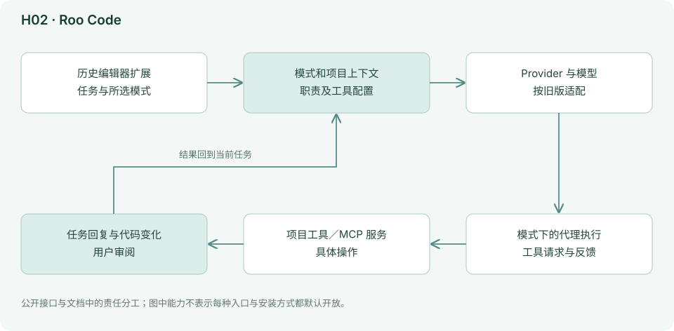


模式可以改变提示与允许使用的能力，让同一个代理先分析再实施；这与启动多个独立工作者并不一样。迁移自定义模式时，把原来的用途落实为新工具的规则、权限和任务说明。某些模式允许命令时，即便名字叫 Architect，也不能默认它没有写入能力。

#### 深入一层：工作模式、工具范围与迁移后的权限重建

Roo 的模式首先是工作职责与配置的组合，不自动代表一个独立进程或一台隔离机器。同一个代理从规划切换到实施，与生成多个并行工作者是不同机制。项目关闭之后，细化这层边界的实际用途，是把旧模式的真实意图迁移到新工具，而非机械复制名称。

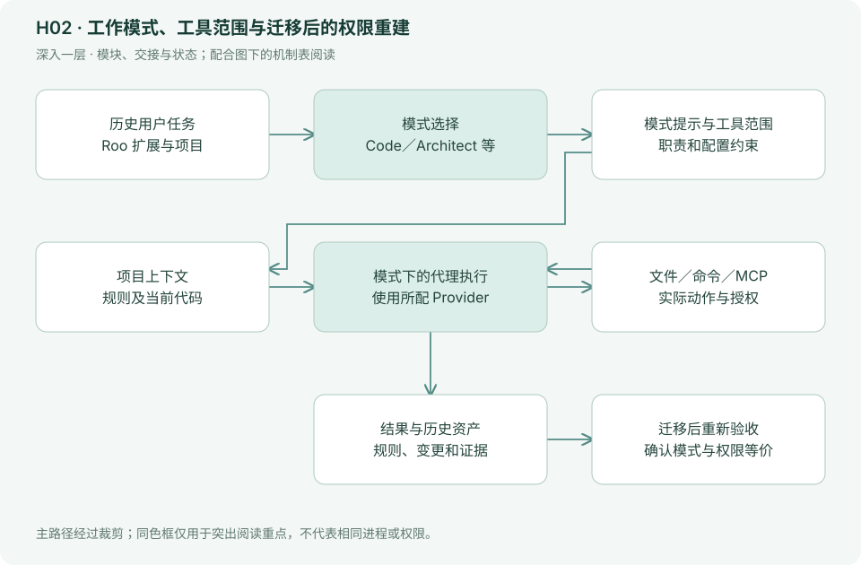

| 模块／交接点 | 怎样工作 | 状态与边界 |
|---|---|---|
| 模式提示 | 改变角色与工作方法 | 叫 Architect 不能证明没有写入能力。 |
| 工具范围 | 配置决定允许哪些具体操作 | 迁移后要重新核对权限，不能沿用旧印象。 |
| 资产导出 | 保存规则和代表性任务 | 旧服务状态与新工具维护状态须分开判断。 |

**沿着一次任务看数据怎样走。** 例如迁移先规划后编码模式：把规划阶段的输入、输出和允许工具写清，再在新工具重建，检查其是否真的限制写入。随后验证实施阶段能否读取计划，并将其用于实际修改。

**与相近工具的实质差别。** 与 Cline 当前子代理／团队能力相比，历史模式切换不是同一层协作机制；共同代码历史也不保证当前权限或可用性相同。

本节细图与机制依据：[README.md](https://github.com/RooCodeInc/Roo-Code/blob/b867ec9145750d0ae1ff7f02d35406e9bf2a0b16/README.md)。图中选取主要模块与交接路径，完整结构及并行条件请结合所引材料阅读。

### 能力、状态与边界

| 观察项 | 实际机制／公开能力 | 对使用者意味着什么 |
|---|---|---|
| 工作方法 | Code、Architect、Ask、Debug 等模式 | 按职责理解，不凭名字推断安全边界 |
| 自定义 | 可建立自己的工作模式 | 迁移时重新表达工具与权限 |
| 扩展 | MCP 等外部能力 | 服务授权与配置需要重新核对 |
| 维护 | 仓库归档且扩展关闭 | 旧排行榜不构成继续投入的依据 |
| 替代 | 可在其他代理中复用方法 | 同源项目也不保证全部行为相同 |
| 历史记录 | 代码与任务经验仍有价值 | 导出关键规则与真实成果，减少私有状态依赖 |

### 从安装到完成第一个任务

1. 确认旧环境是否仍可用，保存必要项目资产；阅读关闭说明，不依据陈旧安装教程启动新的长期依赖。

2. 整理每个自定义模式的真正职责、输入、输出和工具，不只记录角色名称。

3. 选择维护中的候选，如 Cline、Kilo 或其他适合入口，重新设计规则和权限。

4. 迁移 MCP 时重新确认服务、认证和工具范围；用只读任务先验收，再开放写入。

5. 在相同代码任务上比较计划、实施与验证，检查新模式是否保留了原工作方法，并删除已无意义的旧配置。

下面是启动命令或操作路线；路径、认证与功能入口请按自己的版本调整。

```text
旧模式迁移表：
模式名称 → 真正职责 → 输入与交付 → 可用工具
→ 新工具中的实现方式 → 一项验收任务
“规划者”是职责描述，不自动等于只读权限。
```

### 典型任务与验收方法

下面是一份**可直接改写使用的试用任务**，属于本报告设计的验收示例，并非已完成的运行测试。

> 将一个先规划后实施的 Roo 工作流迁移到新工具。保留项目约束和检查步骤，分别验证规划阶段的工具范围与实施后的结果。

查看新工具是否按预期限制动作，以及规划是否真正指导实施。旧模式名相同却权限不同，应视为迁移差异；以当前生效的配置和实际操作结果核对权限。

### 模型搭配、适用方向与取舍

| 选择路线 | 候选组合 | 怎样决定 |
|---|---|---|
| 已有部署 | 仍受支持且已验证的旧配置 | 维护状态限制新投入，不把历史推荐当当前最佳。 |
| 迁移对照 | 新工具明确支持的相同模型 | 先迁工作流再升模型，尽量减少比较变量。 |
| 新用户 | 维护活跃产品的原生或正式支持路线 | 不为复刻旧入口而绑定不可用服务。 |

模型应随新工具当前适配重新选择，不能沿用旧排行榜中的最优组合断言。历史 Roo 适合研究多模式方法，活跃生产使用应比较维护中的产品。迁移的目标是保留有用的工作习惯，并在新工具中找到合适的实现方式。

### 资料依据与继续阅读

[README 与模式说明](https://github.com/RooCodeInc/Roo-Code/blob/b867ec9145750d0ae1ff7f02d35406e9bf2a0b16/README.md)。

此处主要依据公开说明与维护声明，未重新安装验证旧版本的全部功能。上面的流程建议与取舍是依据这些材料给出的选型判断；具体型号、权限和菜单以实际安装与账户为准。

<a id="h03"></a>

## H03 Aider：项目地图、编辑协议与 Git 紧密结合

### 定位与设计理念

Aider 将代码地图、模型适合的编辑格式与 Git 工作流结合。仓库快照未归档，但推送间隔值得继续观察；这不足以断言不可用，也不足以证明当前所有新模型已适配。[仓库](https://github.com/Aider-AI/aider)

Aider 的鲜明路线是把有限上下文用在重要代码结构上，并采用适合模型的编辑协议。它不需要为每项改动建立复杂团队，也能通过明确输入、编辑和 Git 审查完成工作。项目地图帮助模型了解仓库，但它是压缩表示，无法替代必要时阅读实际实现。

### 工作原理与架构图

下图结合所引源码与文档，画出本工具的主要责任分工；为便于理解，省略次要模块与错误分支。

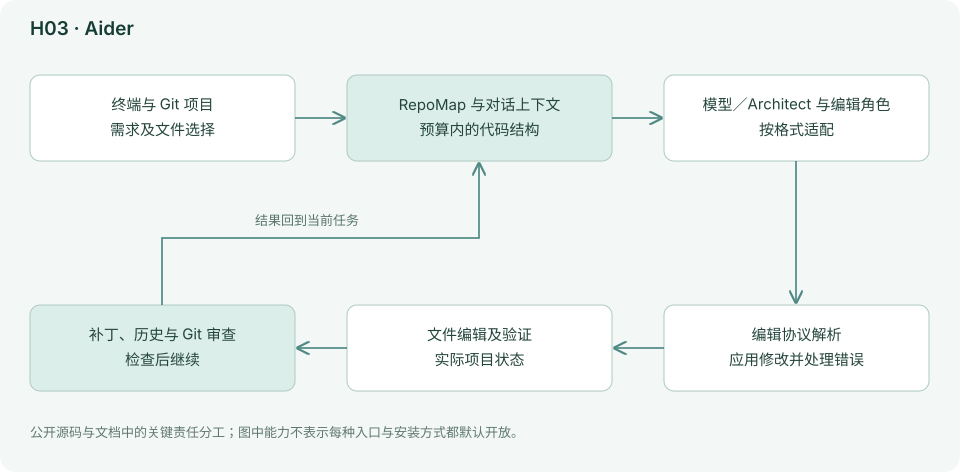

RepoMap 用有限预算表示仓库中的重要结构；编辑核心负责把模型输出变成代码修改。Architect 路线将提出方案与具体编辑分开，说明不依赖复杂团队编排也能形成清楚分工。[项目地图](https://github.com/Aider-AI/aider/blob/5dc9490bb35f9729ef2c95d00a19ccd30c26339c/aider/repomap.py)、[编辑核心](https://github.com/Aider-AI/aider/blob/5dc9490bb35f9729ef2c95d00a19ccd30c26339c/aider/coders/base_coder.py)

项目地图从代码结构中挑选重要信息，帮助模型知道相关文件和符号在哪里；编辑核心再将模型回复解析为实际修改。若模型频繁生成无法应用的编辑，问题可能在协议匹配而非理解能力。Architect 分工则让强模型先描述方案、另一模型具体编辑，节省与否要看交接遗漏和重试成本。

#### 深入一层：RepoMap、编辑协议与 Git 的完整链条

Aider 的 RepoMap 在预算内选取重要的仓库结构，帮助模型定位相关代码。真正编辑还需要实际文件内容与适合模型的编辑协议。Architect 路线可以让一个模型提出方案，另一个负责按协议实施；节省多少要连同交接和补丁失败一起算。

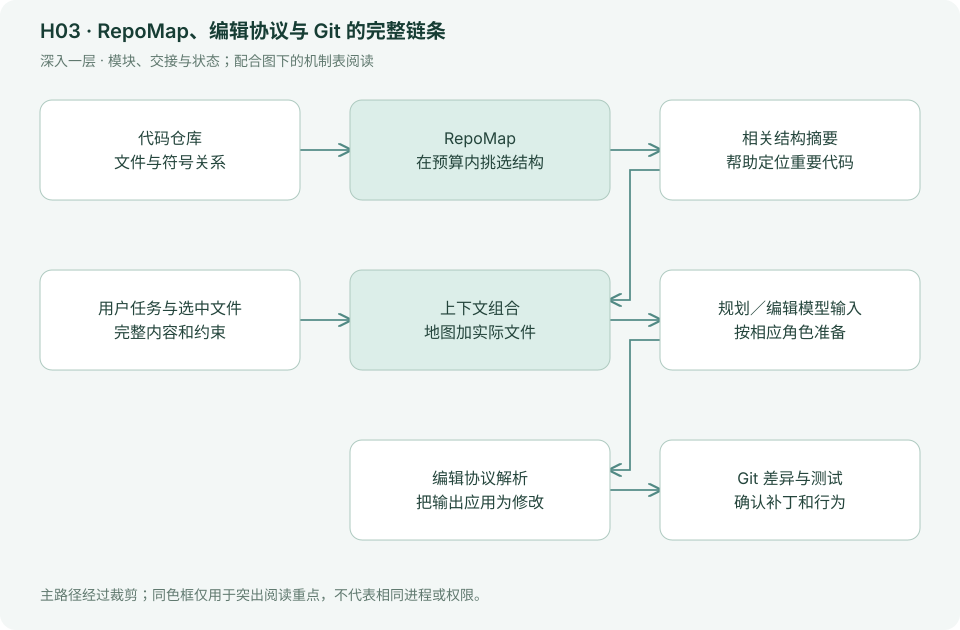

| 模块／交接点 | 怎样工作 | 状态与边界 |
|---|---|---|
| 结构地图 | 提供符号和文件关系线索 | 地图帮助找位置，不替代关键代码阅读。 |
| 编辑协议 | 解析模型返回的修改格式并应用 | 模型理解正确也可能因格式不匹配而编辑失败。 |
| Git 与验证 | 保存和审查实际差异 | 格式应用成功不等于语义正确。 |

**沿着一次任务看数据怎样走。** 例如提取重复校验：地图帮助定位调用方，模型读取相关文件后给出修改，编辑核心尝试应用，最后通过 diff 和测试核查。若补丁应用失败，应先检查格式与目标文件状态，再决定是否需要更强的规划模型。

**与相近工具的实质差别。** 与检索知识库的路线相比，RepoMap 更偏代码结构与预算；与多代理编排相比，Aider 说明上下文选择和编辑契约本身也能构成重要架构差异。

本节细图与机制依据：[repomap.py](https://github.com/Aider-AI/aider/blob/5dc9490bb35f9729ef2c95d00a19ccd30c26339c/aider/repomap.py)、[base_coder.py](https://github.com/Aider-AI/aider/blob/5dc9490bb35f9729ef2c95d00a19ccd30c26339c/aider/coders/base_coder.py)。图中选取主要模块与交接路径，完整结构及并行条件请结合所引材料阅读。

### 能力、状态与边界

| 观察项 | 实际机制／公开能力 | 对使用者意味着什么 |
|---|---|---|
| 上下文 | RepoMap 提供有预算的结构表示 | 地图帮助定位，关键实现仍需读取 |
| 编辑 | 按模型适配修改格式 | 聊天质量好不保证补丁可应用 |
| 职责分工 | Architect 与编辑角色 | 计划必须清楚传给编辑者 |
| Git | 变更与版本工作流紧密结合 | 查看实际 diff，保留原有用户修改 |
| 维护观察 | 快照未归档，但更新间隔值得关注 | 不能直接宣布停更或保证新模型兼容 |
| 试用 | 适合有限范围的代码修改 | 总成本包含格式失败与返工 |

### 从安装到完成第一个任务

1. 先核实当前维护与模型兼容说明，在项目副本或独立分支准备一项小任务，保存原有改动。

2. 选择官方说明支持的模型与编辑格式，明确相关文件，先让它解释影响范围。

3. 完成一项修改并检查 diff；遇到编辑格式失败时核对模型与协议，不只重复同一提示。

4. 再试 Architect 分工，对照同一任务的完成质量、总调用与交接成本。

5. 若迁移到新工具，保留项目资料、测试与版本习惯；不要求新工具必须复刻 RepoMap 才能取得相同结果。

下面是启动命令或操作路线；路径、认证与功能入口请按自己的版本调整。

```text
试用记录：模型＋编辑格式＋提供文件＋RepoMap 设置
结果：补丁是否能应用、行为是否正确、测试是否通过
Architect 路线另记：规划模型、编辑模型、交接与重试成本。
```

### 典型任务与验收方法

下面是一份**可直接改写使用的试用任务**，属于本报告设计的验收示例，并非已完成的运行测试。

> 将一个模块中的重复校验提取成共享函数，保持所有调用方行为。用直接编辑和 Architect 分工各做一次对照，检查补丁和测试。

先看语义是否保留，再看编辑是否顺利。若分工减少规划错误却增加补丁失败，应将规划、补丁应用和返工合并计算，比较整项任务的成本。

### 模型搭配、适用方向与取舍

模型必须适配具体编辑协议；Architect 与编辑角色可采用不同能力。先以当前官方模型说明核对支持，再用相同改动验收。已有用户按实际稳定性决定是否继续，新用户先核实维护与兼容情况。[官方模型说明](https://aider.chat/docs/llms.html)

| 选择路线 | 候选组合 | 怎样决定 |
|---|---|---|
| 直接编辑 | 官方说明支持的模型与编辑格式 | 以补丁能否应用、行为正确与测试通过验收。 |
| Architect | 规划模型＋编辑模型分开 | 统计交接遗漏与编辑重试，不只看规划回答质量。 |
| 维护与迁移 | 核对当前适配后再接新型号 | 旧排行榜和包名不能保证现有服务仍可用。 |

适合喜欢终端与 Git、任务范围较清楚的既有用户。新选型先核对当前维护及模型适配；需要持续个人记忆、浏览器工作台或云端团队时应另选方向。它提醒我们，上下文与编辑协议也能形成重要差异。

### 资料依据与继续阅读

[仓库](https://github.com/Aider-AI/aider)、[项目地图](https://github.com/Aider-AI/aider/blob/5dc9490bb35f9729ef2c95d00a19ccd30c26339c/aider/repomap.py)、[编辑核心](https://github.com/Aider-AI/aider/blob/5dc9490bb35f9729ef2c95d00a19ccd30c26339c/aider/coders/base_coder.py)、[官方模型说明](https://aider.chat/docs/llms.html)。

源码链接指向固定提交；关键实现分析不等于对整个项目和依赖逐行审计。上面的流程建议与取舍是依据这些材料给出的选型判断；具体型号、权限和菜单以实际安装与账户为准。

<a id="h04"></a>

## H04 TRAE Agent 研究仓库：研究可修改循环，与商业 TRAE 分开判断

### 定位与设计理念

`bytedance/trae-agent` 是研究导向的开放代理代码。README 描述多 Provider、文件与 Bash 工具、步骤摘要、轨迹记录及 YAML 配置；其自述仍写积极开发，而仓库快照显示较长推送间隔，两种信息应一起保留。本报告列为维护观察，不替它推断商业 TRAE／SOLO 的能力或活跃度。[README](https://github.com/bytedance/trae-agent/blob/e839e559ac61bdd0e057c375dd1dee391fee797d/README.md)

该研究仓库强调模块化、可修改和轨迹可观察性，适合学习或比较代理方法。模型、工具、步数与记录可通过配置组合，方便研究者改变一项设计后观察结果。商业 TRAE／SOLO 的产品体验、账户和内部模型不能从这里反推，两者即使名称相关，也不是同一个研究对象。

### 工作原理与架构图

下图依据所引公开文档概括职责，不代表完整源码审计或对现有服务可用性的确认。

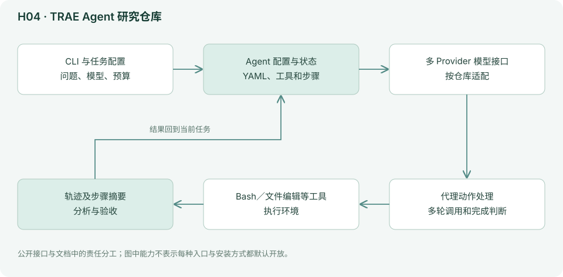


YAML 配置为模型与代理建立对应关系，步数限制约束运行，轨迹记录为失败分析保留过程。简短步骤摘要方便阅读，但不应替代完整工具结果。研究时应先找到造成失败的具体一轮，再判断是输入、模型输出、工具解析还是环境问题；仅比较最终成功文字会丢掉最有用的信息。

#### 深入一层：可配置研究循环与双层过程记录

TRAE Agent 研究仓库把模型 Provider、工具、最大步数与轨迹记录作为可调整的研究条件。Lakeview 提供简短步骤摘要，完整轨迹则保留分析失败所需的细节。摘要是阅读辅助层，不应覆盖原始工具输出，更不能从这套研究实现推断商业 TRAE／SOLO 的内部运行时。

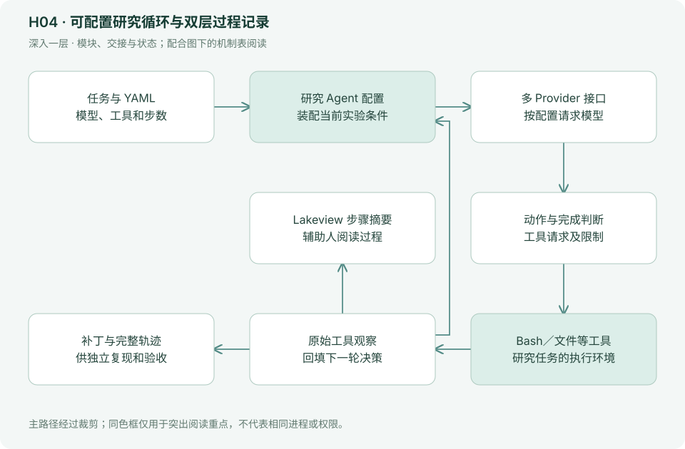

| 模块／交接点 | 怎样工作 | 状态与边界 |
|---|---|---|
| YAML 配置 | 模型定义与 Agent 工具清单分开配置 | 复现时要保存解析后的实际条件，而不只保存模板。 |
| 执行循环 | 多轮模型动作在固定环境中运行 | 改变工具或环境时应作为实验变量记录。 |
| 两层记录 | 步骤摘要易读，完整轨迹可排错 | 排查错误时结合摘要与完整轨迹定位发生轮次。 |

**沿着一次任务看数据怎样走。** 例如比较两种文件编辑工具提示：固定模型和初始仓库，分别保存完整轨迹，再对照编辑失败的位置。若 Lakeview 总结省略了一次工具报错，应回到原始记录，不能据此把失败算成模型没有尝试。

**与相近工具的实质差别。** 与商业 TRAE 的任务工作台相比，这是研究可修改性与轨迹可解释性的路线；与 mini-SWE-agent 相比，可配置工具和额外摘要层带来更多实验维度。

本节细图与机制依据：[README.md](https://github.com/bytedance/trae-agent/blob/e839e559ac61bdd0e057c375dd1dee391fee797d/README.md)。图中选取主要模块与交接路径，完整结构及并行条件请结合所引材料阅读。

### 能力、状态与边界

| 观察项 | 实际机制／公开能力 | 对使用者意味着什么 |
|---|---|---|
| 定位 | 开放研究代码，非商业产品完整运行时 | 不以此证明 TRAE／SOLO 的内部设计 |
| 模型 | README 列出多个 Provider | 旧示例型号需要重新核对可用性 |
| 配置 | YAML、环境变量及步骤预算 | 配置与版本一起保存才可复现 |
| 工具 | 文件编辑、Bash 与其他研究工具 | 按实际执行环境判断权限 |
| 记录 | 轨迹与 Lakeview 等步骤摘要 | 摘要辅助阅读，验收回到原始结果 |
| 维护 | 自述与推送间隔存在需观察之处 | 不将旧 README 的活跃措辞当最新保证 |

### 从安装到完成第一个任务

1. 先确定研究目的并核对仓库现状，固定提交；新用户若只是找日常产品，应另看商业 TRAE 或其他活跃代理。

2. 按目标提交的安装说明准备环境，使用示例配置作为结构参考，但重新核对模型与凭据，不复制旧型号结论。

3. 在隔离的测试项目中运行单个任务，设置步数与预算，确认轨迹和文件产物能保存。

4. 只改变一项工具或提示配置再对照，分析失败轮次与错误类型；模型不同则单列实验。

5. 总结可复用发现并保存环境和原始轨迹。用于产品化时，再用实际场景评估维护、权限、恢复和用户交互。

下面是启动命令或操作路线；路径、认证与功能入口请按自己的版本调整。

```text
研究配置应记录：
仓库提交、模型 Provider 与精确 ID
工具清单、最大步数、提示、环境和任务初始状态
保存完整轨迹与补丁；步骤摘要只用于辅助阅读。
```

### 典型任务与验收方法

下面是一份**可直接改写使用的试用任务**，属于本报告设计的验收示例，并非已完成的运行测试。

> 在一个已知 issue 上比较两种工具提示，模型和环境保持不变，记录每次动作、返回信息及最终补丁，解释失败发生的具体原因。

确认配置真正改变了目标变量，模型输出与工具结果能一一对应。若模型服务已经不支持旧示例，明确这是新实验条件，不能宣称完全复现历史结果。

### 模型搭配、适用方向与取舍

| 选择路线 | 候选组合 | 怎样决定 |
|---|---|---|
| 复现实验 | 目标配置的精确模型版本 | 不可用时注明新条件，不冒充原实验复现。 |
| 方法对照 | 固定模型，只改一项 Harness 变量 | 同时固定环境、提示、任务数据和预算。 |
| 模型对照 | 固定 Harness，再更换模型 | 记录重复运行、终止原因与独立验收，不只选成功样例。 |

模型以目标提交实际支持、当前仍可稳定调用的接口为准。适合研究代理模块和分析轨迹；日常产品选择应单独评估活跃项目。维护状态不足以直接判断算法好坏，却会影响长期部署的成本。

### 资料依据与继续阅读

[README](https://github.com/bytedance/trae-agent/blob/e839e559ac61bdd0e057c375dd1dee391fee797d/README.md)。

此处主要依据公开说明与维护声明，未重新安装验证旧版本的全部功能。上面的流程建议与取舍是依据这些材料给出的选型判断；具体型号、权限和菜单以实际安装与账户为准。

## 另外三种“看似停更，其实是迁移”

- **Pi**：使用当前 `earendil-works/pi`，安装与文档以当前仓库为准。
- **Kimi**：当前 `kimi-code` 与旧 `kimi-cli` 不应按同一套源码架构描述。
- **Copilot Chat**：旧仓库归档后，编辑器侧开发迁入 VS Code；这不等于产品终止。

这也是为什么本报告同时检查仓库元数据、README、当前文档与实际源码入口。单看星数，或者单看最后一次推送时间，都可能得出错误结论。
