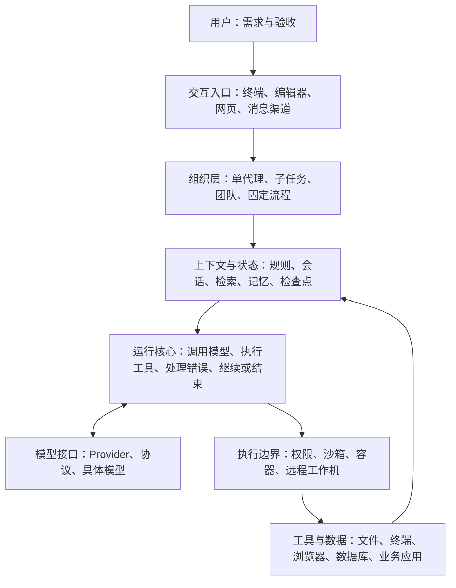
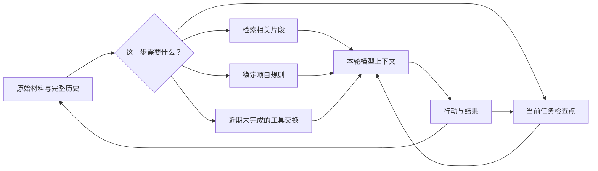
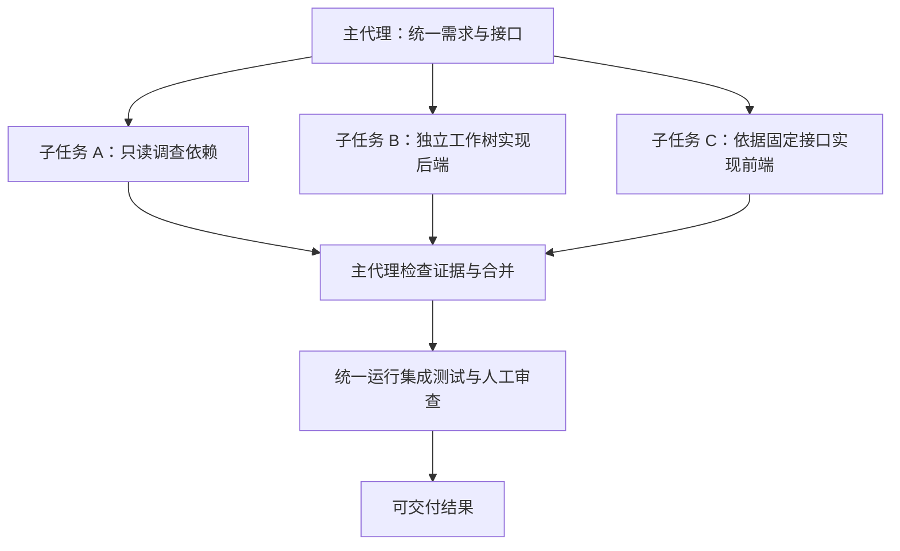
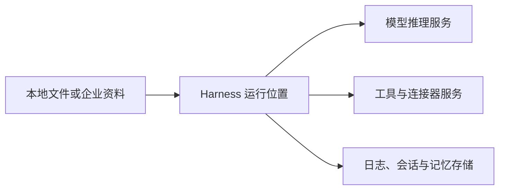

# 04｜架构分类与取舍：真正的区别在于，谁保存状态、谁决定下一步

把这些产品分成“CLI、IDE、网页”很容易，却不足以指导选择。同一套代理可以同时有三种界面；一个网页工作台也可以承载完全不同的代理核心。

更有用的做法，是把每个产品放到几条独立坐标上：模型替换自由度、执行环境、上下文策略、任务组织方式、长期状态，以及治理能力。下面的分类是对第三章证据的分析，产品可以跨类，不是互斥名单。

## 4.1 先按设计重心分成六类

| 设计重心 | 代表 | 主要替你解决什么 | 为此付出的代价 |
|---|---|---|---|
| 模型与代理共同优化 | Claude Code、Codex、Gemini CLI、Kimi Code、Vibe、Grok Build、Step Code | 原生模型、工具格式、提示与错误恢复更容易配套 | 换模型后原本的优势可能减弱；账户与供应商影响较大 |
| 开放执行核心与多模型 | OpenCode、Pi、DSH；Qwen Code、MiMo Code 也跨入此类 | 自选模型、接口和扩展，方便研究和替换 | 配置组合多，兼容性与升级负担落到用户身上 |
| 编辑器与开发流程整合 | Cursor、Copilot、Junie、Kiro、Zed、Qoder、CodeBuddy、Kilo、Cline | 把项目上下文、修改、审阅和运行连接起来 | 某些能力依赖指定编辑器、账户或服务 |
| 任务与远程环境管理 | Devin、Factory、OpenHands、Warp 平台、Replit | 给任务配环境，安排执行，收集产物与验证 | 环境成本、启动时间、凭据、资源清理和锁定效应 |
| 长期个人代理 | Hermes、OpenClaw、Agent Zero | 跨会话记忆、渠道、定时任务、持续工作 | 状态会积累，需要长期维护与权限管理 |
| 知识和多模型工作台 | Chatbox、Cherry、Open WebUI、LibreChat、LobeHub、AnythingLLM | 管理资料、模型、对话、用户和可复用助手 | 检索质量、部署版本和所选执行后端影响很大 |

这张表表达的是倾向，不是功能禁令。例如 Chatbox 可以执行任务，Codex 可以写报告，Hermes 也能写代码。分类的意义是判断“哪类工作是产品组织起来最顺手的”。

## 4.2 一套方案其实有六层，可以只换其中一层

这是阅读用的概念图，不是所有仓库都真的有六个同名模块。

几个组合能帮助理解：

- **Zed＋Codex＋GPT**：编辑器来自 Zed，代理执行和模型配置来自 Codex。
- **Cherry＋Pi＋某个 Provider**：Cherry 管理桌面会话，Pi 处理代理运行，Provider 提供模型。
- **Claude Code＋Augment Context Engine**：保留代理，增加项目检索能力。
- **OpenHands Canvas＋ACP 代理**：保留任务界面，却可以更换执行后端。
- **Warp 中运行 Claude Code**：换了终端体验，并不意味着底层自动使用 Warp 原生代理。

这些都是官方公开支持路线的例子，但安装、认证和具体版本仍要逐一核对。[Zed 外部代理](https://github.com/zed-industries/zed/blob/16c9aa7ea6d897a8044d9501cde1b295256722f2/docs/src/ai/external-agents.md)、[Cherry 运行时](https://github.com/CherryHQ/cherry-studio/blob/633729727543cfe7ccab776cc08e3a24fa7a925d/docs/references/ai/agent-session-runtime.md)、[Augment MCP](https://docs.augmentcode.com/context-services/mcp/overview.md)、[OpenHands](https://github.com/OpenHands/OpenHands/blob/ffdc65e10c3aa68ae1704eedbc6a011c02fcec8c/README.md)、[Warp](https://docs.warp.dev/_llms-txt/agents.txt)

## 4.3 模型中立与原生适配：自由度为什么不是免费的

一个模型要在代理中表现好，需要做到的不只是答对问题。它还需要稳定输出工具参数，理解工具错误，遵守编辑格式，在长历史中继续工作，并知道什么时候需要验证。

| 层次 | “兼容”实际意味着什么 | 还不能证明什么 |
|---|---|---|
| 网络可达 | API 地址、Key、认证有效 | 工具调用是否正确 |
| 请求兼容 | 能按 Chat Completions、Responses 或 Messages 等协议交互 | 所有参数、推理状态、图片和缓存都可用 |
| 工具兼容 | 工具名称、参数与结果能来回传递 | 模型是否会选对工具、处理失败 |
| 代理适配 | 提示、编辑方式、截断、压缩、重试适合该模型 | 在你的项目里是否更可靠 |
| 任务验证 | 在真实任务中满足验收、成本和人工介入要求 | 对所有其他任务也最好 |

原生路线容易把第三、第四层一起调好；开放路线让使用者有机会自行组合。MiMo 的模型特定工具配置、Grok 的多协议后端、Pi 的 Provider 扩展都说明：真正可用的模型中立需要代码和测试，不是一个下拉框。[MiMo 适配](https://github.com/XiaomiMiMo/MiMo-Code/blob/1579e7d9ee5fca87b707c3892dc725316674a9d6/docs/architecture/codex-microkernel-runtime.en.md)、[Grok 配置](https://docs.x.ai/build/settings)、[Pi 扩展](https://github.com/earendil-works/pi/blob/b4588f26af2f74f7b1387b548e04a3c8d81da75b/packages/coding-agent/docs/extensions.md)

对普通使用者，先用原生组合建立成功基线，再试便宜或更开放的替代品，往往比一开始同时修改模型、提示、网关和插件更容易定位问题。对平台开发者，可替换性本身就是重要收益，值得承担更复杂的验证。

## 4.4 上下文管理：把工作记清楚，比把窗口做大更重要

设想请一个助理整理一份报告。桌面可以放下十本书，不代表他知道哪页支持哪个结论。上下文窗口是桌面大小；检索、摘要、状态文件和记忆，才决定桌面上放什么。

| 方法 | 通俗解释 | 优点 | 容易出的问题 |
|---|---|---|---|
| 直接装入近期历史 | 把最近聊天和工具结果带上 | 简单，近期细节完整 | 历史越来越长，重要规则可能被噪声淹没 |
| 工具输出精简 | 大日志写文件，只带相关片段 | 减少重复和无关内容 | 关键错误可能被截掉，需要能回读原文件 |
| 历史压缩 | 把旧过程写成摘要 | 延长任务连续性 | 摘要可能遗漏否定条件、失败尝试和未决问题 |
| 检索 | 需要时查文件或历史 | 大资料库不必全部装入 | 检索不命中，模型就看不到关键材料 |
| 任务检查点 | 明确保存目标、进度、决定、下一步 | 更容易中断后继续 | 检查点过期，可能重复执行旧步骤 |
| 长期记忆 | 保存跨任务有用的偏好和事实 | 降低重复解释 | 错误或临时信息可能长期污染后续工作 |
| 子代理隔离 | 把探索细节放在另一会话 | 主任务保持清晰 | 摘要交接丢细节，父代理可能误信结论 |

源码中的代表性选择各有侧重：Goose 分主动压缩与溢出后的后备策略；Kimi 注意不切断工具交换；MiMo 保存可恢复的任务材料；Hermes 在压缩前处理记忆；DSH 从事件日志推导模型历史。[Goose](https://github.com/aaif-goose/goose/blob/91a5789bce40ee312675e6715c20eb3612d1a03c/documentation/docs/guides/sessions/smart-context-management.md)、[Kimi](https://github.com/MoonshotAI/kimi-code/blob/6451f1e056e90037bbf832f3578955cf8e55db64/packages/agent-core-v2/src/agent/fullCompaction/strategy.ts)、[MiMo](https://github.com/XiaomiMiMo/MiMo-Code/blob/1579e7d9ee5fca87b707c3892dc725316674a9d6/README.md)、[Hermes](https://github.com/NousResearch/hermes-agent/blob/42c1a93417fa588e735736a0740787ce37381ffd/agent/memory_manager.py)、[DSH](https://github.com/deepseek-ai/deepseek-harness/blob/00102833dfaee1da9f48a3a8eae9d34005a75218/docs/architecture.md)

**写长篇小说的例子。** 不能只在一个聊天窗口里连续写二十章。应单独保存人物设定、时间线、地点、已发生事件与伏笔；每章结束更新这些材料，下一章只装载相关部分。全局记忆可以保存作者偏好的文风，却不应混入某一本小说中虚构的人物事实。

**修复杂 bug 的例子。** 检查点最好写出：已重现的现象、已经排除的假设、改动文件、通过和失败的检查、下一步。仅写“正在解决登录问题”，恢复时几乎没有帮助。

## 4.5 三种“记住了”，其实是三回事

**聊天记录**用于查“曾经说过什么”；**任务状态**用于知道“现在进行到哪里”；**长期记忆**用于判断“以后也值得知道什么”。成熟方案往往同时需要三者。

假设代理昨天帮你做预算表：聊天记录包含讨论过程；任务状态写着“还有一列公式未验证”；长期记忆只应留下你长期采用的财年和格式偏好。若把昨天估算的数字直接当作永久记忆，未来报告可能反复引用一个过期值。

稳定提示也有取舍。Chatbox 当前的会话快照能避免每轮变化打乱前缀缓存，但中途改规则未必立即生效。相反，每轮动态重读规则更及时，却可能改变任务的一致性和缓存成本。没有一种策略对所有任务都最好。[Chatbox 快照设计](https://github.com/chatboxai/chatbox/blob/0cf406cbd93197a89487c740cb101bef36641d35/docs/technical/agent-soul-memories.md)

## 4.6 多代理：先判断是否真的能够拆开

| 形式 | 结构 | 适用任务 | 主要成本 |
|---|---|---|---|
| 单代理 | 一份连续上下文做完 | 小修复、线性任务、需要紧密共享背景 | 长任务可能拥挤，但交接最少 |
| 只读研究子代理 | 主代理委派探索，收报告 | 找依赖、查资料、独立审查 | 摘要遗漏、重复研究 |
| 主从实施 | 主代理规划，多工作者实施 | 边界清楚的模块或文件改造 | 合并、接口不一致、验证成本 |
| 团队与共享任务板 | 多代理保存任务与消息 | 跨阶段大任务 | 协调状态、并发冲突、总预算 |
| 固定工作流中的代理节点 | 流程确定，部分步骤由模型决定 | 周报、分类、资料提取、审批流程 | 配置和维护流程，需要显式处理失败 |

当前 Cline 的只读子代理与 CLI Agent Teams 恰好展示了前两种协作差别；Factory 自定义 Droid、Hermes 委派和 DSH 可换后端又提供不同程度的组织能力。它们不是同一个“多代理：是”的复选框。[Cline 团队](https://github.com/cline/cline/blob/078f82b1e2617a6be421e34c08d35af1c3a78d87/docs/cli/agent-teams.mdx)、[Factory](https://docs.factory.ai/harness/subagents.md)、[Hermes](https://github.com/NousResearch/hermes-agent/blob/42c1a93417fa588e735736a0740787ce37381ffd/tools/delegate_tool.py)、[DSH](https://github.com/deepseek-ai/deepseek-harness/blob/00102833dfaee1da9f48a3a8eae9d34005a75218/docs/subsystems/subagent.md)

如果后端接口还没有确定，前端马上并行实现可能反而更慢。若三个代理都改同一配置文件，又没有工作树或责任分区，就很容易互相覆盖。**值得并行的标准是任务相对独立，而不是想让屏幕看起来更忙。**

总耗时也不是简单除以代理数。粗略地说：并行时间由最慢子任务，加上拆分、交接、合并与检查组成。成本则通常把各个代理的模型调用都加起来。多代理更有机会节省等待时间，却未必节省费用。

## 4.7 权限审批、沙箱和回滚，各自解决不同问题

| 机制 | 真正解决的问题 | 不负责解决的问题 |
|---|---|---|
| 提示中要求谨慎 | 影响模型的选择 | 不能强制阻止进程访问文件 |
| 操作审批 | 决定某次或某类动作是否允许 | 用户误点后仍可能造成影响 |
| 工具参数限制 | 限制可调用的目录、接口、命令 | 绕过工具的其他执行通道仍要管 |
| 系统沙箱 | 由操作系统限制文件／网络／进程行为 | 不自动理解业务动作是否正确 |
| 容器／虚拟机 | 分离运行环境与依赖 | 挂载目录、外网和凭据仍可能扩大影响 |
| Git／文件检查点 | 恢复受跟踪的文件状态 | 无法普遍撤销邮件、付款、数据库写入 |
| 审计日志 | 事后知道发生过什么 | 不会自动阻止问题发生 |

Pi 默认没有权限系统，是明确选择；Codex 将权限和执行边界纳入核心；Grok Build 的公开沙箱模块区分进程与子进程网络；OpenClaw 的 Gateway 又需要额外处理远程入口和宿主执行。它们都能完成任务，但默认风险边界并不相同。[Pi](https://github.com/earendil-works/pi/blob/b4588f26af2f74f7b1387b548e04a3c8d81da75b/README.md)、[Codex](https://github.com/openai/codex/blob/8a577399c774d1881ef030971d8f271694f55536/codex-rs/core/src/sandboxing/mod.rs)、[Grok 沙箱](https://github.com/xai-org/grok-build/blob/4247f661689354b831191f11eeeac8424993fe3d/crates/codegen/xai-grok-sandbox/src/lib.rs)、[OpenClaw](https://github.com/openclaw/openclaw/blob/b419a4add99ff917504ed26168babdbde6ac7ab6/docs/concepts/architecture.md)

对一般用户，最实用的做法是让代理在任务目录工作，使用独立分支或副本；对可能影响外部系统的动作，只提供必要账户权限。不是每一步都要弹窗，而是让真正不可轻易撤销的步骤有清楚边界。

## 4.8 自由代理与固定工作流：业务稳定后，未必还需要处处自治

自由代理适合未知问题，例如“查清这个测试为什么偶尔失败”。下一步需要随证据变化，事先很难画出完整流程。

固定工作流适合已知业务，例如“每周读取三张表，计算指标，生成草稿，经过负责人确认后归档”。哪些数据来自哪里、怎样验证、失败后怎么办，最好显式定义。Dify、n8n、AnythingLLM Flow 属于值得比较的相邻路线。

两者可以嵌套：外层用确定流程控制触发、权限、格式和审批，内部某一步让代理自主研究。这通常比让一个通用代理每周重新猜一遍公司流程更容易维护。

## 4.9 本地、云端和自托管：必须拆成三条数据流

“桌面应用”只说明一部分界面或逻辑在电脑上；模型仍可能在云端，联网搜索和嵌入也可能经过第三方。真正的全本地方案，需要检查这几条路径都在哪里。

| 方案 | 收益 | 成本与限制 |
|---|---|---|
| 本地 Harness＋云模型 | 使用自己的文件和工具，模型能力选择多 | 选中的内容仍会发给模型服务 |
| 本地 Harness＋本地模型 | 更强的数据路径控制，可离线 | 硬件、速度、模型能力与服务维护 |
| 托管 Harness＋云环境 | 起步快，远程任务容易持续 | 对平台环境、账户和计费依赖更高 |
| 自托管服务＋云模型 | 可统一用户和流程 | 自托管不意味着推理数据不出网 |
| 自托管服务＋内网模型与工具 | 全链路控制空间较大 | 运维、权限隔离、备份和容量规划最复杂 |

## 4.10 开放源码、开放模型、开放协议，是三种不同的自由

开放源码让你有机会理解和修改 Harness；开放权重让你有机会自己部署模型；MCP／ACP 等协议让部件更容易互接。三者可以独立存在。

同样，“代码看得见”不代表任意商业使用都没有限制；“模型权重能下载”也不代表训练数据、训练过程与全部许可条件都开放。正式部署前应检查具体版本的许可证，而不要把产品统称为“开源”后就停止核对。

## 4.11 不应做一张总分榜，而应找出你的首要瓶颈

| 经常遇到的困难 | 优先改哪一层 | 先比较哪些方向 |
|---|---|---|
| 总找不到正确文件 | 检索、项目说明、索引 | Augment、IDE 上下文、准确文件引用 |
| 模型会解释但改不对 | 工具适配、编辑方式、模型能力 | 原生 Claude Code／Codex 等组合 |
| 长任务跑着跑着忘事 | 检查点、压缩、状态恢复 | MiMo、Hermes、任务型平台及明确进度文件 |
| 改好了但交付很麻烦 | 环境、测试、PR 与产物管理 | Copilot 云端、Devin、OpenHands、Factory |
| 资料库答案不准确 | 导入质量、切分、检索、引用 | AnythingLLM、Open WebUI、LibreChat 的检索配置 |
| 每天重复解释偏好 | 可维护记忆与规则 | Hermes、Chatbox／Cherry 的规则和工作空间 |
| 多人用起来互相干扰 | 账户、权限、环境隔离 | 有组织治理的托管方案或认真配置的自托管服务 |
| 成本高却不见收益 | 任务拆分、重试、缓存、人工介入 | 先测量，不急着换最便宜或最强模型 |

当你知道瓶颈在哪一层，选型会简单很多。接下来按[细分使用场景](05-按场景选择组合.md)寻找两三个候选即可，无需安装完整名单。

## 4.12 Step Code 加入后：同源核心怎样长出不同产品

Step Code 很适合用来理解本章的分类方法：它的核心来自 Pi，产品重心却偏向 Step 模型原生协同，同时向目标托管和产物交付延伸。因而它主要放入第一类，源码可扩展性作为第二条坐标；不能因为采用 Pi 核心，就认定它与 Pi 的默认权限、内置服务和模型选择相同。[来源声明](https://github.com/stepfun-ai/Step-Code/blob/adcf37b0572ff568b3fbff759f52267690c98c32/LICENSE-STATUS.md)、[产品接口](https://github.com/stepfun-ai/Step-Code/blob/adcf37b0572ff568b3fbff759f52267690c98c32/packages/coding-agent/src/stepcode-runtime.ts)

| 比较维度 | Pi | Step Code | OpenCode | 对选择的影响 |
|---|---|---|---|---|
| 产品重心 | 核心保持可理解，把特殊需求交给扩展 | 以 Step 原生模型组织较完整的终端流程 | 开放多 Provider、多入口 | 先确定要定制材料、原生组合，还是统一跨模型工作流 |
| 模型边界 | 通过 Provider 与扩展选模型 | 默认内置 Step；自定义模型另行配置与验证 | 多 Provider 是主要产品路线 | 能读到适配代码与开箱即用的账户入口不同 |
| 权限 | 默认没有内置权限系统 | 有四档审批，当前默认 Bypass；没有默认系统沙箱 | 有自己的权限服务，按配置判断 | 不应把“来源相同”当作默认行为相同 |
| 多代理 | 体验取决于所装扩展 | 产品内子代理与目标控制；高级 workflow 受运行环境约束 | 子会话与任务工具；部分后台能力仍有实验条件 | 比较具体入口、安装包和开关，不能只勾“支持” |
| 交付路径 | 按自己选择的工具组织 | StepPage 把静态目录接到发布服务 | 通过项目工具与扩展组织 | 静态成果的一体化交付，换来对托管服务的依赖 |

Pi 与 OpenCode 的依据见 [A09、A08 档案](03A-终端与开放编程代理.md)；Step 对应[模型目录](https://github.com/stepfun-ai/Step-Code/blob/adcf37b0572ff568b3fbff759f52267690c98c32/packages/providers/src/providers/all.ts)、[权限](https://github.com/stepfun-ai/Step-Code/blob/adcf37b0572ff568b3fbff759f52267690c98c32/packages/coding-agent/src/step/permissions.ts)、[workflow 注册](https://github.com/stepfun-ai/Step-Code/blob/adcf37b0572ff568b3fbff759f52267690c98c32/packages/coding-agent/src/features/workflow/registration-gate.ts)与[静态发布](https://platform.stepfun.ai/docs/en/step-code/reference/steppage.md)。表中的区别是结构分析，尚未用统一任务测出优劣。

**与 Claude Code／Codex 等原生路线相比，Step Code 的吸引力是另一套可检查源码的原生组合。** 它可以复用部分项目规范与插件布局，降低迁移成本；但接口名字相似，生命周期也可能不同。例如 Step 的 goal 由工作代理报告是否完成，本次文档没有独立完成评判器；workflow 的使用约定也不等于强制权限门。选择时需要检查这些细节，而不是仅凭熟悉的命令名称推断行为。[目标生命周期](https://github.com/stepfun-ai/Step-Code/blob/adcf37b0572ff568b3fbff759f52267690c98c32/docs/goal-lifecycle.md)、[编排合同](https://github.com/stepfun-ai/Step-Code/blob/adcf37b0572ff568b3fbff759f52267690c98c32/docs/orchestration-lifecycle.md)

**与 Hermes／OpenClaw 等持续助理相比，Step Code 的长任务更依赖当前本机进程。** 目标、定时记录和聊天历史能够落盘，并不会自行建立全天候远程工作环境。如果电脑经常休眠、任务需要长期按时触发，应把进程托管和异常恢复纳入设计；如果需求只是今天下午连续修完一个模块，这种本机模式反而比较直接。

**与 Replit 等托管应用平台相比，StepPage 主要缩短静态交付的一段流程。** 它很适合把网页原型、可视化报告交给别人查看；涉及服务端鉴权、数据库、定时后端和生产运维时，仍需额外环境。这是交付范围差异，不应由“能一键发布”推导出完整应用托管。[StepPage 范围](https://platform.stepfun.ai/docs/en/step-code/reference/steppage.md)

最后，Step-5 的大窗口和 Step Code 的压缩、子代理机制承担不同责任。大窗口提高一次可接纳的信息量，摘要与分工则控制哪些信息进入当前任务。更大的窗口可以减少部分压缩，也可能增加重复输入开销；更积极的摘要可以降低负担，也可能丢失细节。应比较“同一结果需要多少总调用与人工修正”，而不是只比较窗口或主会话长度。
