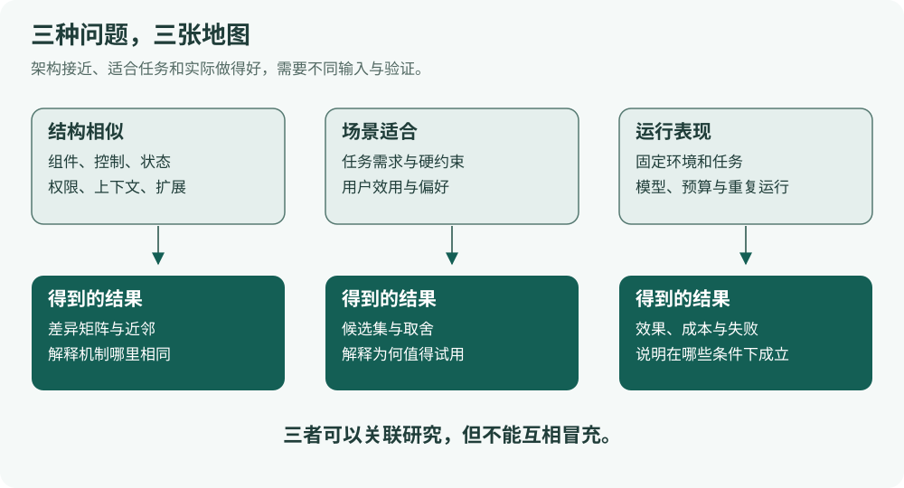
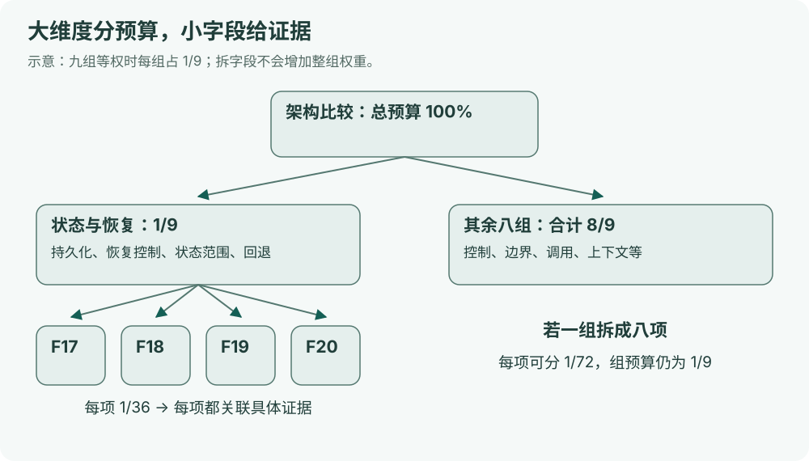
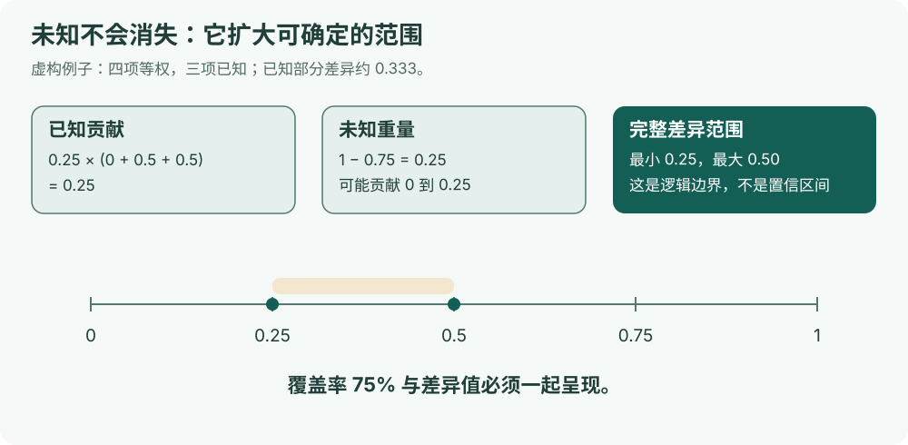
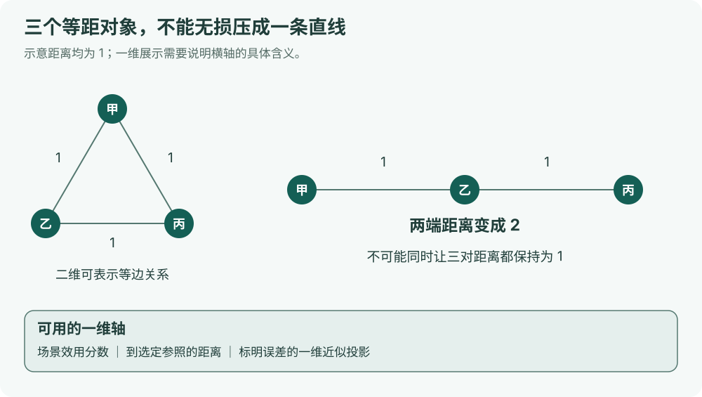
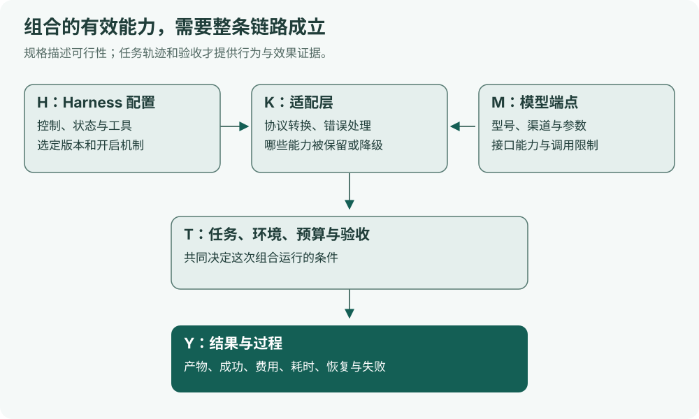
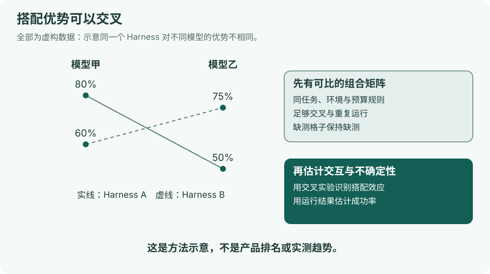

# 把 AI Harness 变成可比较的数据

一份关于架构特征、差异度、场景选型与「Harness × 模型」联合评估的方法研究

**作者：ProgrammerAsahi 项目，AI 辅助研究与编写。资料核验日期：2026 年 9 月 24 日。**

这份报告讨论一个具体问题：能不能把 Claude Code、Codex、Pi、Step Code、Cline、个人助理和工作流工具的架构，变成一组有证据的数据，再计算它们哪里相似、哪里不同？

答案是可以，而且值得做。但我们需要先决定“相似”指什么。两种工具可能内部结构相似，却适合不同任务；也可能结构完全不同，却在某类任务上取得接近的结果。**结构、适用性和表现是三张不同的地图。**把它们混成一张排行榜，会损失这项工作的主要价值。

本报告提出的是研究与实施方案，附有可复算的虚构示例。**本次没有给现有 55 份工具档案全部打分，没有运行这些产品，也没有进行付费模型测试。**图中的甲、乙、丙和 Harness A／B 都是教学用的假想对象，不能映射为任何真实产品。

阅读入口：[工具调研主报告](../../index.html) · [本文 Markdown](report.md) · [来源与采集记录](sources.json) · [复算与维护说明](README.md)

## 0. 先把术语说清楚

不需要记住下表。后文遇到陌生词时，回来查一下即可。

| 术语 | 通俗解释 | 在这里为什么有用 |
|---|---|---|
| Harness | 围绕模型搭建的执行外壳，负责接工具、保存状态、控制流程等 | 本报告主要比较的对象 |
| 架构 | 软件由哪些部分组成，谁控制谁，数据放在哪里 | 比“支持多少功能”更能解释工具差异 |
| 特征／字段 | 对一个方面提出的明确问题，例如“恢复任务需要保存哪些状态” | 每个字段都应有可查的答案 |
| 向量 | 按固定顺序放在一起的一组数据 | 不一定是一串浮点数，也可以先是有类型的记录 |
| 编码规则／码本 | 规定每一项怎么填、怎么判断、有争议时怎么办 | 防止不同人给同一个机制填出不同答案 |
| 名义变量 | 只有类别、没有高低顺序，如单进程或服务分离 | 不应该硬编码成 1、2、3 后相减 |
| 有序变量 | 有明确顺序，但相邻档位未必等距 | 如允许的审批粒度；顺序本身也需要定义 |
| 集合变量 | 可以同时有多个值的一项，如可用触发方式 | 适合表示并存机制 |
| 嵌入／Embedding | 用模型把文字、代码等压成一串数 | 方便找相似材料，但含义通常不如人工字段透明 |
| 距离／差异度 | 越小表示在指定规则下越接近 | 不自动代表实际替换成本或任务优劣 |
| 相似度 | 越大表示越接近 | 必须说明如何由数据算出 |
| 度量 | 满足若干数学条件的距离，尤其是“三角不等式” | 一些聚类和画图方法依赖这些条件 |
| Gower 差异度 | 把不同类型字段分别比较，再加权平均的一类方法 | 适合同时有类别、数值、是非值的架构资料 |
| Jaccard 差异度 | 用两个集合“没有共享的部分”衡量差别 | 适合比较工具能力集合 |
| 权重 | 某个方面在一次比较中分到多少话语权 | 是研究选择，不是天然真理 |
| 效用 | 一项能力对具体用户、具体任务有多大帮助 | 用于选型，不等于结构相似度 |
| 硬约束 | 不满足就不能入选的条件 | 例如必须在断网环境完成任务 |
| 缺失／未知 | 目前没有足够证据判断 | 不能偷偷填成“不支持” |
| 不适用 | 当前对象或条件下，这个问题没有意义 | 没有子代理时，“子代理之间如何通信”可能不适用 |
| 证据覆盖率 | 本次比较实际用到了多少预定权重对应的已知信息 | 与差异度同时显示，防止少量资料造成假相似 |
| 聚类 | 按一定规则把相近对象分组 | 分组是观察角度，不是产品的永久身份 |
| 降维 | 将很多维度压缩到二维或一维，便于画图 | 通常会改变原始距离 |
| MDS | 尽量让图中距离接近输入差异度的画图方法 | 适合展示整体关系，同时需要报告失真 |
| 敏感性分析 | 改动权重、字段或假设，观察结论变不变 | 用来找稳健结论和脆弱结论 |
| Bootstrap／重抽样 | 从已观察到的样本中反复抽样，观察结果波动 | 评估任务得分或排名的不确定性 |
| 消融实验 | 有计划地去掉一个组件，再比较表现 | 帮助判断某个机制实际贡献了什么 |
| 交互效应 | 两个部分搭配后的效果，不能只由各自效果相加解释 | 某模型可能特别适合某种 Harness |
| 全因子设计 | 把所选 Harness、模型等因素的组合都测试一遍 | 便于区分各自作用和搭配作用 |
| 轨迹／Trace | 一次运行中的模型调用、工具操作、错误、恢复等记录 | 解释“为什么失败”，而不只是“失败了” |
| 图／Graph | 用节点表示组件，用边表示控制或数据关系 | 可以比较真正的拓扑结构 |
| Pareto 前沿 | 没有被另一个方案在所有关键方面同时超越的方案集合 | 避免把成本、速度和质量强行压成唯一总分 |

下面这些是方法名称，阅读比较表时按需查阅即可。

| 名称 | 一句话解释 |
|---|---|
| MCDA，多准则决策分析 | 在质量、成本等多个标准之间组织取舍的一组方法 |
| Swing weighting，摆幅赋权 | 比较各指标从明确最差改善到最好，哪一种改善更值得 |
| AHP，层次分析法 | 通过成对比较组织偏好，并检查判断的一致性 |
| BWM，最优最劣法 | 先选最重要和最不重要的准则，再用较少比较推导权重 |
| 熵权 | 给当前数据中区分信息较多的指标分配较大权重；不等于更有用 |
| CRITIC | 同时考虑指标波动和相关关系的一种数据赋权方法 |
| SMAA | 在取值或权重不确定时，研究哪些排名在假定分布下经常出现 |
| TOPSIS | 按接近理想方案、远离不理想方案的程度组织选择 |
| ELECTRE／PROMETHEE | 比较方案能否在多项标准下胜过另一方案的方法家族 |
| PCA／MCA／FAMD | 分别用于连续、类别或混合数据的主要变化方向分析 |
| 独热编码 | 把一个类别字段展开为多个“是否属于该类别”的列 |
| k-means／k-medoids | 前者找数值中心，后者选真实对象作为组代表 |
| k-modes／k-prototypes | 分别面向类别数据、类别加数值数据的聚类路线 |
| DBSCAN／HDBSCAN | 按数据点的疏密寻找群组，可把部分点留作噪声 |
| Ward 连接 | 按合并后组内平方偏差的增加量组织层次聚类，要求适当的欧氏几何 |
| UMAP | 把高维数据画到低维的一种方法，通常更关注局部关系 |
| 图核 | 比较图中结构模式的函数；输出不是天然的百分比 |
| DTW，动态时间规整 | 允许时间轴伸缩后比较序列形状的方法 |
| Wasserstein 距离 | 想象把一个分布搬成另一个分布，计算所需搬运代价 |
| 对数几率／logit | 将概率 p 转换为 log(p/(1−p))，便于构建概率模型 |
| 层级模型 | 在不同任务、模型或工具之间共享部分信息，同时保留各自差异 |
| 低秩／矩阵补全 | 假设组合结果主要由少数隐藏因素决定，再估计未观察的格子 |
| 混杂 | 两个因素一起变化，使我们难以判断是谁产生了影响 |
| 数据泄漏 | 本该留到最终验证的信息提前进入了训练或选择过程 |
| 幂等 | 同一个操作重复执行，不会不断产生额外副作用 |
| 置信区间／功效 | 前者描述特定统计程序的不确定性；后者指实验发现指定效应的能力 |

## 1. 这项研究究竟要回答什么

### 1.1 三个问题，三套输出

设想两个工具都能修复一个 Python 小错误。一个在终端里边读文件边执行命令，另一个由固定工作流依次调用“定位、修改、测试”三个节点。成功率接近，并不意味着它们架构相似。反过来，两个同源分支可能共享很多代码，但权限默认值、上下文处理和模型适配不同，使用感受也会分开。

因此，我们建议建立三套互相关联、但分别命名的数据。

| 想回答的问题 | 主要输入 | 合适的输出 |
|---|---|---|
| 哪些工具的组织方式相似？ | 控制流程、状态、执行边界、扩展接口等 | 架构差异矩阵、相似邻居、结构分类 |
| 我的任务适合用什么？ | 硬约束、用户偏好、实际需求与能力证据 | 候选短名单、取舍解释、待验证条件 |
| 哪个组合实际做得更好？ | 固定任务与预算下的运行结果 | 成功率、耗时、成本、失败类型与不确定性 |

第一套数据是本项目现在最适合开始的部分。第二套可以先做可解释的规则建议。第三套需要另行设计和执行实验，不能从架构表直接推导。



### 1.2 值得做，但不需要追求“唯一正确的向量”

向量化最直接的收益，不是把阅读报告变成算分，而是让结论可以追问：为什么说这两个工具接近？是状态机制相近，还是只有界面相近？换一种任务关注点，结论是否仍成立？

同时，向量是对现实的压缩。它不必解释软件所有细节，也不应该承诺“几十个字段就穷尽了所有差异”。我们需要的是：**对报告关心的问题足够有解释力；对没有覆盖的区别，能够明确指出。**

两个工具得到完全相同的结构记录，也未必是失败。它可能说明它们属于同一种结构路线，而区别主要在实现质量、默认配置、生态或模型。为了让每个品牌都有独特坐标而增加字段，会把分类变成识别产品名。

### 1.3 当前建议，一页读完

1. 以“工具版本＋本地运行配置”为对象，先冻结范围，再采集数据。
2. 从九个架构大维度、36 个候选字段起步。它们是试行码本，不是行业标准。
3. 保留类型和原始值，使用分组加权的 Gower 方法作为基线。
4. 每个距离同时显示证据覆盖率、主要差异贡献及未知信息范围。
5. 架构地图采用等大维度权重；场景选型另设硬约束和用户效用。
6. 先画特征矩阵、两两差异表和差异解释，再做二维地图与聚类。
7. 模型加入时，先建立接口适配记录，再用受控实验研究搭配效果。
8. 先用小样本验证规则，再扩展到全部可纳入本地范围的工具。

这八条是本文的建议，后文会逐条解释它们的依据、替代方案和局限。

## 2. 研究范围与资料是怎样找的

### 2.1 “都按本地模式”需要一个可操作的定义

本报告采用的定义是：**Harness 的主要控制与执行环境由使用者在本机或自行管理的本地环境中启动；模型推理允许通过外部 API 完成。**“Harness 在本地”与“所有数据都不离开本机”是两件事。

纯托管工作台如果没有可核验的本地运行模式，继续保留在主报告中，但暂不纳入这张本地架构距离矩阵。不能为了凑齐 55 个对象，把不存在的本地版本假想出来，也不能将其所有字段填为零。

同一工具拥有 CLI、编辑器插件、常驻服务等模式时，选定一个代表配置。需要比较另一种模式，再新增一条配置记录。安装方式、默认插件、权限模式和是否开启子代理都要留下来。

### 2.2 检索路线与纳入标准

本次进行了定向资料检索，而不是宣称无遗漏的系统综述。检索范围包括官方仓库、作者论文、官方统计软件文档和公开评测协议，主要沿五条线展开。

| 检索路线 | 代表检索词 | 希望解决的问题 |
|---|---|---|
| Harness 架构分类 | agent harness architecture taxonomy、design decisions、codebook | 有没有可以借鉴的字段和编码研究？ |
| Harness 与模型实验 | harness benchmark、scaffold effect、harness LLM interaction | 怎样区分外壳、模型和搭配的影响？ |
| 混合数据比较 | Gower missing values、grouped traits、mixed data clustering | 类别、数值和未知值怎样一起算？ |
| 权重与决策 | swing weighting、SMAA、sensitivity analysis、MCDA | 权重如何解释、如何验证？ |
| 图、轨迹与行为 | graph kernel、trajectory format、task embedding、model routing | 简单字段之外，还能怎样表达结构和行为？ |

纳入一项资料的条件是：与上述问题直接有关，能找到一手说明，并且有可借鉴的方法、数据格式或实现。这里同时收录论文、工具库、规范和资料索引；它们的作用不同，不能一概称为“已经实现我们全部设想的产品”。历史方法库也可以作为研究线索，但不因此推荐直接作为新的生产依赖。

来源清单保存 URL、可获得的完整提交 SHA、采集时间、内容哈希和阅读范围。README 阅读不等于源码审计，论文段落阅读不等于复现实验。个别来源只有搜索索引摘要，正文会明确限制使用范围。

### 2.3 最关键的发现

这次确实找到了与我们目标相近的工作。其中，*Architectural Design Decisions in AI Agent Harnesses* 对 70 个项目进行了架构编码，围绕子代理、上下文、工具、安全隔离和编排整理维度，并给出操作化规则。这比只列产品功能更接近我们想做的事情。不过，它的类别、语料选择和人工判断仍需审视，不能直接把论文中的每条产品判断当成官方事实。它也没有替我们完成面向本项目的、处理缺失证据的通用距离系统。[S01]

AgentArch、Harness-Bench、PawBench 等工作则更接近“结构与运行结果之间如何建立联系”。它们为配置比较、统一环境、任务标签和轨迹分析提供了参考，但各自范围不同，不能将不同评测的分数直接拼表排名。[S03][S04][S05][S49]

## 3. 可以借鉴的项目、研究与规范

本章按用途整理 40 个条目。每项都说明“它做什么、我们借什么、不能据此声称什么”。多个来源支持同一项目时合并介绍，避免把仓库、论文和网页重复算成三个项目。

### 3.1 最接近目标的架构与组合研究

**01｜Architectural Design Decisions in AI Agent Harnesses：从项目材料提取架构类别。**这项研究的重要参考价值是“码本”：把模糊的架构印象变成可以逐项判断的机制。我们可以借鉴其维度提炼与证据记录方式，再用本报告的工具样本检验覆盖。其分类不能直接解释为数值高低，也不宜未经复核就移植具体产品标签；公开资料和非官方材料的证据等级必须分开。[S01]

**02｜Awesome-Agent-Harness：发现资料的地图。**HKUST-KnowComp 的索引收集 Harness 相关论文与项目，适合发现遗漏的研究路线，以及沿引用向前追溯。可借鉴其主题组织方式，把新资料放回既有问题框架。它是资料入口，不是运行评测，也不提供可直接使用的工具距离。[S02]

**03｜Agent Harness 综述：为概念边界提供另一个参照。**所收录预印本围绕 Harness 的组成与演化展开，可与其他分类相互对照。我们能借它检查自己是否漏掉状态、工具或控制层的职责。综述中的概念归纳仍是作者视角；应固定版本，并避免把预印本表述包装成已达成的行业共识。[S51]

**04｜Microsoft Agent Framework 的 Harness 能力矩阵：把能力映射到具体构件。**官方文档列出其 Harness 的组成、默认机制和可选配置，适合借鉴“能力对应哪个实现入口”的表达方式。它是特定生态的构成说明，不是跨产品排行榜，也没有证明这些功能对每一种任务都有相同价值。[S52]

**05｜AgentArch：系统改变架构配置，再观察模型表现。**项目围绕企业工作流比较编排、调用方式、记忆等配置。我们可借鉴它把“架构选择”写成明确实验变量的方法，而不是只比较品牌。局限在于任务、实现和模型范围有限；观察到的偏好不等于模型在全部 Harness 上的永久属性。[S03][S49]

**06｜Harness-Bench：保留不同外壳行为，统一外部评测条件。**该研究采用离线沙箱任务，记录产物、轨迹和验证结果。最值得借鉴的是统一环境与验收，同时保留被测 Harness 本身的流程差异。它研究的是完整配置的结果；若没有进一步消融，不能把成绩差异归因到某一个内部模块。[S04]

**07｜PawBench：按任务特点观察模型与 Harness。**项目汇集任务、标签和多种组合结果，可借鉴其任务切片与适配要求：模型比较时尽量固定 Harness，Harness 比较时尽量固定模型，并保留运行记录。任务来源混合时要检查重复、权重和难度，不能只因为任务数更多就认为覆盖更公平。[S05]

**08｜How good is your harness?：从组合结果拆分不同因素。**作者讨论利用足够交叉的 Harness—模型结果，区分两者的影响。它支持我们关注“组合表是否可识别”，而不仅是收集很多分数。本次仅核验到摘要及搜索索引中的第一页，PDF 直接访问受限；本文不据此复述完整估计细节或产品优劣。[S06]

**09｜The Scaffold Effect in Coding Agents：比较过程与失败模式。**研究在特定终端任务子集上比较多个外壳与模型。可借鉴其对效率、轨迹和失败原因的关注。不同工具的轮数和时间预算并不天然等价，论文自己的限制也提醒我们：小样本、预算差异和宽误差范围下，不应将显眼倍数推广成普遍规律。[S07]

### 3.2 评测与轨迹基础设施

**10｜Harbor／Terminal-Bench：组织任务环境和结果。**Terminal-Bench 提供终端任务评测，Harbor 提供组织环境、代理适配与评估的基础设施。我们可借鉴任务隔离、可重复环境和独立验证器。这里的“评测 Harness”是测量设备，被比较的“Agent Harness”才是研究对象；二者名称相似，职责不同。[S08][S09][S60]

**11｜AgentBoard：除了成功与否，还看走到了哪一步。**项目强调对代理任务进行分析式评估。我们可借鉴阶段进展和细分能力的观察思路，为失败记录保留有用信息。阶段进度只有在任务定义明确、验证规则一致时才可比；步骤多不等于工作多，更不等于效果好。[S10]

**12｜Inspect AI：分开组织任务、求解过程和评分。**它的评估框架适合承载任务集、执行逻辑与评分器。可借鉴可复用评测定义和日志审阅。它不会自动解决任务代表性、评分偏见或产品公平性；这些仍然需要我们设计。[S11]

**13｜HELM：用多维结果替代一张单项榜。**HELM 强调场景与多指标评估。我们可以借鉴“同一组合在不同维度都有记录”的报告方式，保留准确性、效率等彼此独立的结果。它的模型评估体系不能原样当作 Harness 架构码本。[S12][S50]

**14｜BFCL：为工具调用建立更具体的能力参照。**Berkeley Function Calling Leaderboard 聚焦函数与工具调用评测，可为模型适配测试提供问题类型线索。接口参数正确只解决了调用的一部分；长期任务恢复、审批和文件副作用仍需另测。[S13]

**15｜τ²-bench：把交互中的双方和环境都考虑进去。**项目研究包含用户与代理交互的任务，可借鉴状态变化、协作条件和验收方式。对这类任务，固定一个用户模拟器本身也是实验选择，应记录其版本；不能把模拟交互结果直接等同于真实用户满意度。[S14]

**16｜SkillsBench：研究附加技能材料是否改变表现。**它为技能相关任务与验证提供参考。对本项目最有用的是成对比较“同一组合有技能／无技能”，同时固定其他条件。应固定数据集版本和技能内容；不能把技能包效果全部归入 Harness 固有能力。[S15]

**17｜ATIF：让不同工具留下可比较的轨迹。**Harbor 的 Agent Trajectory Interchange Format 为步骤、调用、用量与关联关系提供统一表达。我们可以借它做轨迹中间层，再从中提取行为特征。转换时必须记录源字段及丢失信息；统一格式不会使不同产品的“轮次”自动拥有相同含义。[S17]

**18｜OpenTelemetry GenAI 语义约定：统一可观测事件的名称。**该规范为调用、事件和计量提供共同语言，有利于把模型调用和工具执行串起来。我们可借鉴它的追踪层级与字段约定。规范及仓库会演进，必须固定版本；规范存在不等于所有 Harness 已完整实现。[S16]

### 3.3 混合数据、聚类和概念结构

**19｜R cluster::daisy：Gower 基线的成熟参考实现。**官方文档明确说明混合变量类型、权重与缺失处理。适合用作公式核对和交叉验证的参照。我们的条件字段、固定组预算和覆盖区间仍需额外实现，不能简单调用函数后就宣称所有问题已解决。[S18]

**20｜Python gower：轻量的试算入口。**项目提供 Python 中的 Gower 计算实现，适合快速理解接口和输出。真正采用前，要用人工可复算数据检查缺失值、类别判断、范围归一化和权重行为。README 中的“支持 Gower”不保证恰好符合本项目定义的所有边界。[S54]

**21｜gawdis：关注一组相关字段实际贡献了多少。**它针对混合性状数据，处理字段及字段组贡献不均的问题。这与“一个大维度拆出很多字段就占便宜”的担忧非常接近。可借鉴组预算与贡献诊断；其数据驱动平衡目标不等于用户任务重要性，不能代替场景偏好。[S19]

**22｜kmodes／k-prototypes：为类别和混合数据找代表。**这些方法为纯类别或类别加数值数据提供聚类选择。可借鉴对不同变量类型分别处理的思路。k-prototypes 中数值与类别部分的平衡需要设定，不能直接把一切当作已归一化的 Gower 距离。[S21]

**23｜FactoMineR 的 FAMD：用混合数据寻找主要变化方向。**FAMD 同时处理连续与类别变量，可用于观察字段关系和样本分布。适合辅助发现冗余、解释哪些机制一起变化。它保留的是所采用变换下的变化结构，不保证保留我们的 Gower 差异或任务偏好。[S22]

**24｜Orange：让数据探索过程可见。**它的距离等组件适合通过可视化工作流尝试不同处理。可借鉴“数据—距离—图”的分层交互，帮助不写代码的读者理解计算。默认归一化和缺失处理依然需要检查，图形操作不替代方法说明。[S23]

**25｜Formal Concept Analysis／concepts：用共同属性定义类别。**形式概念分析以“哪些对象共享哪些属性”组织概念关系。它适合解释多重归属，例如工具同时属于“可恢复”和“事件驱动”的集合。二值属性的阈值需要定义；属性多时概念格可能非常复杂，并不一定比距离图易读。[S46]

### 3.4 图、代码与语义表示

**26｜GraKeL：比较组件关系，而不只是字段清单。**图核库能把图的局部结构转换为可比较信号。我们可借它比较带角色标签的节点和连接。前提是节点、边和边界一致；按文件或类名直接建图，会把代码风格误当架构差异。[S24]

**27｜netrd：尝试多种网络距离。**它提供网络比较等方法，可用于探索拓扑差异。值得借鉴的是同一对图可以从不同结构尺度比较。部分方法依赖节点对应关系或网络假设，不能把“所有图都能输入”理解成“所有结果都有架构含义”。[S25]

**28｜NetworkX 图编辑距离：用修改操作解释差异。**可以把结构差异解释为增加、删除、替换节点和边所需的代价。这个解释很直观，但编辑代价本身就是权重，精确求解也可能昂贵。适合小规模、经过归一化的职责图，不适合未经压缩的整个源码依赖网。[S26]

**29｜Sentence Transformers：比较架构描述的语义。**文本嵌入适合找相似段落、候选邻居和待检查的重叠描述。我们可以用它辅助检索和标注。它可能把措辞相近当成机制相近，受到文档长度、营销表达和语言影响，不适合独立支撑架构结论。[S36]

**30｜CodeBERT／GraphCodeBERT：从代码及代码关系提取表示。**项目为代码相关任务提供预训练表示，提醒我们源码不只有关键词。可借鉴局部模块检索和数据流线索。相同代码骨架可能服务于不同产品边界；不同语言也能实现相同机制，所以源码向量不能直接当产品架构向量。[S37]

**31｜Task2Vec：把任务表达成可比较对象。**它为视觉分类任务构造表示，说明“被向量化的不一定只有工具，任务也可以有表示”。可借鉴任务族相似性与迁移选择的研究思路。原方法依赖特定模型和任务设置，不能直接把本文的小说、代码修复、报表任务套进去就得到可靠距离。[S47]

**32｜Model2Vec：名称相近，但不是模型架构分类器。**该项目生成静态文本嵌入，可考虑用于轻量语义检索。它并不是把各个大模型自身编码成架构向量的现成工具。保留这个条目，是为了避免检索时被名称误导。[S48]

### 3.5 权重、稳健性与组合优化

**33｜PyMCDM：比较多种决策与权重方法。**项目及文档可作为熵权、CRITIC 等方法的参考实现。适合在同一数据上检验不同规则为何给出不同结果。程序能算出权重，不意味着这些权重代表使用者的需求。[S27][S53]

**34｜pyDecision：更广的多准则方法集合。**它涵盖 AHP、BWM、TOPSIS、ELECTRE、PROMETHEE 等路线。可用于对照补偿型评分与带否决条件的选择。方法多不是同时全部使用的理由，应先选择符合决策问题的假设。[S28]

**35｜SALib：系统检查输入变化怎样影响输出。**它提供多种敏感性分析方法，适合分析权重与阈值对排名或分组的影响。归一化权重相互依赖，不能不加说明地套用要求独立输入的分析。初期采用透明的情景扰动，通常比复杂指标更容易解释。[S29]

**36｜JSMAA：在偏好不确定时观察可接受的排名。**该历史实现提供 SMAA 方法线索：当权重不能精确确定时，研究方案在假定权重分布下的排名表现。可借鉴“排名稳定区间”而非单点榜单的呈现。这里的比例依赖采样分布，不等于真实用户选择概率；本报告也不将旧实现推荐为默认依赖。[S30]

**37｜RouteLLM：根据任务选择模型。**它把模型路由视为质量与成本之间的选择问题。可借鉴先有可比结果、再学习选择规则的路线。单次请求的路由收益不能直接推广到有长期状态和工具副作用的整段代理任务。[S31]

**38｜RouterBench：用统一结果比较路由策略。**它提供离线研究模型选择的框架与数据思路。我们可以借鉴保存“同一任务由不同模型处理”的结果矩阵，支持反事实比较。若某组合没有运行结果，不能假装知道换过去会成功。[S32]

**39｜DSPy／AFlow：把程序或工作流也作为优化对象。**前者提供针对语言模型程序的优化组件，后者研究工作流搜索。可借鉴将提示、模块和连接方式显式化，再用训练／验证任务选择配置。优化过的任务不能又原封不动当最终测试集；搜索成本也应计入。[S33][S34]

**40｜Agent Lightning：连接实际代理运行与训练。**当前固定版本强调运行采集与训练系统之间的连接。可借鉴保留真实 Harness 行为、统一记录的工程思路。训练会改变模型，因而产生新的比较对象；本项目当前的小规模静态分类没有必要立即引入强化学习训练。[S35]

### 3.6 从这些工作中，我们还缺什么

现有工作已经提供了许多零件：架构码本、评测环境、混合距离、图比较、权重分析和模型路由。此次检索没有核验到一个可以直接导入我们全部档案、自动产出可信架构相似度与场景推荐的完整成品。**这是本次检索的边界，不是断言全网不存在。**

本项目真正需要补上的，是连接这些零件的证据协议：字段怎么定义，哪种配置算一个对象，未知值怎么处理，距离如何解释，以及结论如何随版本更新。

## 4. 先决定“一行数据”代表什么

### 4.1 对象不是产品名，而是可复查的配置

“某工具支持沙箱”并不回答“本次所选模式是否启用沙箱”。同一产品可能通过插件获得检索能力，也可能通过用户脚本接入其他模型。把所有可能能力合成一行，会得到一个现实中从未存在过的超级配置。

建议每行使用以下身份记录，身份字段不参与架构距离。

```yaml
# 数据格式示意，不是任何 Harness 的可执行配置
record_id: example-harness__release-x__local-default
product: 假想工具甲
version_or_commit: 明确版本或完整提交
mode: local
configuration: 默认安装；明确列出启用的扩展与权限
operating_system: 固定操作系统及必要差异
model_policy: 架构层不绑定模型；适配记录另存
schema_version: architecture-0.1
evidence_cutoff: YYYY-MM-DD
```

分别保存三种视图：**本次配置实际启用什么、该版本官方提供什么、经过扩展还能做到什么。**基线比较使用第一种；后两种作为可选配置或解释资料。不要把“有扩展点”自动展开成“已经拥有所有扩展能力”。

### 4.2 每个答案都带一张证据小卡

```yaml
field: F19
status: known                 # known / unknown / not_applicable
value: [conversation, tool_result]
evidence_kind: source_path    # source_path / official_doc / observed_run
source_url: 固定提交下的具体文件链接
locator: 保存与恢复入口、函数或文档小节
configuration_scope: 本次选定配置
review_status: single_review  # 不冒充已完成双人复核
note: 尚无证据说明会保存外部服务状态
```

证据类型不是从低到高的一条简单刻度。代码能证明某条路径存在，却未必证明发行版默认开放；运行成功能证明那个环境的一次结果，却未必说明所有账户可用。发生冲突时，先检查版本与配置，再保留冲突记录，而不是用一个“置信度 0.8”把问题压下去。

### 4.3 不把“架构”变成万能篮子

| 数据层 | 例子 | 默认用途 |
|---|---|---|
| 架构机制 | 循环控制、状态归属、进程边界 | 结构距离 |
| 产品与使用条件 | 安装难度、价格、许可证、平台 | 选型筛选与解释 |
| 模型与接口 | 型号、工具调用协议、适配验证 | 组合可行性 |
| 行为与结果 | 错误恢复次数、成功率、费用 | 运行评估 |
| 证据与版本 | 来源、日期、未知原因 | 审阅与可信边界 |

这不是说价格或易用性不重要，而是它们回答不同问题。把开源许可证和子代理拓扑直接混成一个“架构距离”，很难解释数字到底代表什么。

## 5. 怎样选维度：一份可试行的 36 字段码本

### 5.1 大维度来自职责，小字段来自可核验机制

大维度的划分有研究者判断，但不应仅凭感觉。我们建议沿一次任务的生命周期检查：任务怎样进入，谁决定下一步，模型获得什么材料，工具在哪执行，状态如何保存，多人／多代理怎样协作，任务怎样恢复与结束。

一个“大维度”是一项相对完整的职责；一个“小字段”是这项职责下可独立核验的问题。以下九组、每组四字段，是为了启动试编码而形成的候选方案。四个字段不是永久配额，后续可以增减。**无论拆成几个字段，该组总权重都不因此增加。**



以下类型标记：**类**＝无高低顺序的类别；**集**＝可并存机制集合；**序**＝有明确顺序；**条件**＝仅在前置条件成立时比较。每个集合都有版本化词表，新增值先审阅定义，不能自由填写近义词。

### 5.2 九组候选字段

#### A｜执行控制：谁决定下一步

| 编号 | 问题与类型 | 编码边界／主要证据 |
|---|---|---|
| F01 | 主控制方式是什么？类 | 用户逐步驱动／模型循环／显式工作流／事件调度；混合结构记录主要入口及说明，必要时改为控制图 |
| F02 | 计划怎样约束执行？类 | 无独立计划／仅提示文本／结构化任务表／可执行流程约束；不自动排序为成熟度 |
| F03 | 通过什么结束或暂停？集 | 模型结束信号、验证条件、预算、用户中断；检查实际调度入口 |
| F04 | 失败后由谁怎样处理？集 | 调用重试、模型自修、流程分支、升级人工；区分框架规则与提示建议 |

#### B｜组件与运行边界：各部分住在哪里

| 编号 | 问题与类型 | 编码边界／主要证据 |
|---|---|---|
| F05 | 前端与执行核心怎样连接？类 | 同进程／子进程协议／本地服务 API；只看所选模式 |
| F06 | 文件、命令等工具在哪里执行？集 | 主进程、子进程、独立本地服务、容器；云执行不混入本地基线 |
| F07 | 会话状态的权威副本归谁？类 | 客户端、执行核心、独立状态服务；文件路径属于证据，不作为类别名 |
| F08 | 独立会话怎样隔开？集 | 仅逻辑标识、进程、工作目录、文件系统、容器；与安全强度不直接画等号 |

#### C｜模型接入与调用：怎样与模型对话

| 编号 | 问题与类型 | 编码边界／主要证据 |
|---|---|---|
| F09 | 模型调用抽象放在哪里？类 | 固定厂商 SDK／适配器层／统一协议网关；不按厂商数量评分 |
| F10 | 工具调用如何表达？集 | 原生结构化调用、文本解析、协议转换；记录解析和错误处理路径 |
| F11 | 模型在任务中如何分配？集 | 单一固定、按角色、按请求路由、失败回退；不开启的功能进入能力视图 |
| F12 | 怎样管理调用预算？集 | 输出限制、总 Token、调用次数、时间、金额；区分软提醒与强制截止 |

#### D｜上下文与知识：模型当下看见什么

| 编号 | 问题与类型 | 编码边界／主要证据 |
|---|---|---|
| F13 | 短期上下文怎样组织？类 | 顺序消息／类型化事件重建／显式状态投影；关注构造请求的代码 |
| F14 | 超长内容如何缩减？集 | 截断、摘要、工具结果替换、分段选择；“支持大窗口”不是压缩机制 |
| F15 | 外部材料怎样进入上下文？集 | 用户指定、关键词、语义检索、结构索引；浏览器访问本身不等于知识库 |
| F16 | 跨会话记忆怎样写入与取回？集 | 用户维护文件、自动摘要、结构化记录、检索库；没有则已知空集合 |

#### E｜状态与恢复：中断后还剩什么

| 编号 | 问题与类型 | 编码边界／主要证据 |
|---|---|---|
| F17 | 运行记录以什么形式持久化？集 | 消息、事件日志、状态快照、外部引用；只写日志不等于能恢复 |
| F18 | 怎样恢复控制流程？类 | 不支持／重建对话再运行／检查点继续／显式工作流重放；类别不默认等距 |
| F19 | 恢复会覆盖哪些状态？集 | 对话、任务计划、工具结果、工作区、子代理关联；外部副作用单列说明 |
| F20 | 怎样处理回退与重复执行？集 | 会话分支、工作区快照、补偿操作、幂等标识；Git 存在不等于自动回滚 |

#### F｜权限与执行约束：能做什么，由谁批准

| 编号 | 问题与类型 | 编码边界／主要证据 |
|---|---|---|
| F21 | 允许／拒绝规则怎样表达？集 | 工具类别、命令规则、文件路径、网络目标；记录默认规则 |
| F22 | 审批可以落在哪些层？集 | 整个任务、工具调用、具体操作；审批 UI 与强制执行点分别核查 |
| F23 | 约束由什么机制执行？集 | 应用检查、操作系统隔离、容器策略等；“提示模型不要做”另记，不算隔离 |
| F24 | 审计记录能关联什么？集 | 意图、实际操作、审批、结果、身份；可见日志不必然覆盖所有操作 |

#### G｜多代理协作：任务怎样分给多个执行者

| 编号 | 问题与类型 | 编码边界／主要证据 |
|---|---|---|
| F25 | 是否存在框架管理的多个代理？类 | 无／有；多个模型调用不自动算多代理 |
| F26 | 由谁创建与调度？条件、集 | 用户、主代理、工作流、事件调度；F25＝有才比较机制 |
| F27 | 子代理间如何共享或隔离状态？条件、集 | 独立上下文、消息、共享文件、共享状态；权限是否继承另作说明 |
| F28 | 怎样汇总、等待和取消？条件、集 | 同步返回、异步等待、共享看板、取消传播；不能只根据“并行”宣传判断 |

#### H｜扩展与集成：怎样添加新能力

| 编号 | 问题与类型 | 编码边界／主要证据 |
|---|---|---|
| F29 | 新工具以什么边界加入？集 | 内部代码、插件 API、外部协议服务、用户脚本 |
| F30 | 可复用指导如何装载？集 | 项目规则、技能目录、角色模板、工作流定义；区分内容与可执行代码 |
| F31 | 生命周期允许在哪干预？集 | 输入、模型调用、工具前后、保存、结束；证据指向实际事件钩子 |
| F32 | 核心可以怎样嵌入其他程序？集 | CLI 子进程、库、服务 API、协议客户端；界面自动化不等于正式 API |

#### I｜触发与持续运行：谁让任务开始并继续

| 编号 | 问题与类型 | 编码边界／主要证据 |
|---|---|---|
| F33 | 任务从哪里触发？集 | 用户交互、API、定时、外部事件；自写操作系统脚本不算原生调度 |
| F34 | 生命周期由谁维持？类 | 前台进程、后台守护、本地服务；退出 UI 后是否继续需核查 |
| F35 | 未完成工作如何排队？类 | 无队列、内存队列、持久队列；进程崩溃后语义是关键证据 |
| F36 | 怎样把工作交还给人？集 | 阻塞审批、消息通知、可恢复待办、结构化任务交接 |

### 5.3 为什么没有“智能程度”“安全等级”这样的列

这些词都重要，却过于宽泛。“安全等级高”可能同时指权限提示、隔离、审计、默认规则和漏洞状况。把它写成 1—5 分，很容易让不同标注者各凭印象。

我们先记录能核验的机制。需要回答“是否满足某种安全要求”时，再将这些机制和实际验证映射为具体要求。例如“未经批准不得联网”需要检查执行点与测试结果，不能靠容器字段有一个勾来推断。

### 5.4 如何判断这些字段够不够

用主报告建立一张“解释覆盖表”：每条重要差异，能否落入现有字段？如果不能，是缺字段，还是它本来属于模型、易用性或生态？如果多个字段只能得到同一份证据、永远一起变化，是否重复计算了同一机制？

建议先选择约 8—12 个有代表性的本地配置做试编码，覆盖终端循环、编辑器集成、聊天知识库、常驻助理、显式工作流和框架。这个数量是启动建议，不是统计充分性的保证。优先选择结构差异大、证据可获得的样本，而不是星数最高的一组。

字段保留至少满足四项：定义清楚、证据可查、对某个研究问题有用、不是另一字段的重复说法。罕见但关键的机制不因“多数工具都没有”而删除；当前全相同的字段可以保留为元数据，但不应假装它贡献了当前样本中的区分。

### 5.5 条件字段怎样避免重复处罚

没有多代理的工具，F26—F28 不是三个“不支持”，而是三个条件不成立。比较“无多代理”与“有多代理”时，如果既在 F25 记满差异，又在三个子项重复记满差异，就把同一个区别算了多次。

本报告建议把 G 组作为一个有条件的子树：先比较“有没有”，再在双方都有时比较机制。存在状态不同，使用事先约定的门控差异；双方都没有，该组视为相同；双方都有，进入子字段。门控差异设为多少仍是建模选择，建议在 0.5、0.75、1 等情景下检验，而不是暗中固定后当成事实。

一种可试行规则是：存在状态占组内 1/4，机制占 3/4；双方都有时按这两个部分计算；只有一方有时使用单独公布的门控代价。它属于**基于 Gower 的层级扩展**，不再是直接逐列调用标准函数。初期也可以将 G 组折成一个明确类别，以减少复杂性；代价是失去内部细节。

## 6. 不止一种向量化：各条路线适合做什么

### 6.1 首选是保留类型的结构记录

向量化不必从“把所有东西转为数字”开始。先存 `控制方式=模型循环`、`触发方式={交互,API}`，比存 `控制方式=3` 更安全。计算时再按字段类型选择规则，原始含义不会丢失。

| 路线 | 主要输入 | 擅长回答 | 主要代价 | 本项目建议 |
|---|---|---|---|---|
| 人工结构字段 | 源码与文档证据 | 机制哪里不同 | 标注维护成本 | 第一阶段主干 |
| 独热编码 | 已定义的类别 | 输入通用模型 | 类别拆多后可能隐含增权 | 按原字段归组，不直接裸算欧氏距离 |
| MCA／FAMD | 类别与数值表 | 哪些变化方向最明显 | 变换后的轴不直观 | 辅助发现关系 |
| 文本嵌入 | 同模板架构描述 | 找候选相似材料 | 受写法和篇幅影响 | 辅助检索，不独立定论 |
| 代码嵌入 | 相关模块代码 | 找相近实现 | 语言、依赖、复制代码混杂 | 小范围交叉核验 |
| 结构图表示 | 组件与关系 | 拓扑和控制关系差异 | 建图规则与图匹配成本 | 第二阶段选复杂机制试点 |
| 轨迹表示 | 实际调用与事件 | 行为模式是否接近 | 强依赖模型与任务 | 有实测后再加入 |
| 任务表现向量 | 分任务族的结果 | 组合在哪些任务擅长 | 样本与费用要求高 | 与静态架构分层展示 |
| 多视图组合 | 上述若干层 | 综合寻找线索 | 权重及解释更复杂 | 保留分层结果再考虑汇总 |

FAMD、文本相似、代码表示、图核与轨迹规范分别有可用的一手方法资料，但它们的输出空间不相同，不能因为都叫“向量”就直接相加。[S22][S24][S36][S37][S17]

### 6.2 架构图怎样变成数据

建议把图分为至少三层：**控制图**记录谁调度谁；**数据图**记录上下文、状态和工具结果如何流动；**信任边界图**记录哪些操作穿过进程、权限或文件系统边界。

节点使用职责名称，例如“调度器”“模型适配器”“状态存储”，而不是源码文件名。边标记“调用”“读写”“审批”“事件”。先规定同一职责如何合并、外部模型是否作为节点、重复工作者怎样表达，再比较图。

仅有一个总览箭头图通常不够。两个图都画成“用户→模型→工具→结果”，只能说明它们属于代理系统。真正有区分力的是控制权、状态归属、并发关系和边界。图表示也不是替代文字：遗漏一条恢复路径，算法不会替我们自动发现。

### 6.3 行为向量不能脱离任务分布

可以从轨迹提取工具调用比例、重复调用率、错误后恢复率、压缩次数、子代理使用比例等。但这些是**某组合在某组任务上的行为**，不是 Harness 的不变本质。

比较前应固定任务集合和模型，统一事件定义。调用“搜索”十次究竟是积极检索还是反复失败，要结合结果。也不要把长轨迹简单截成一样长后做欧氏距离；事件顺序、并行和不同粒度都会影响结论。

### 6.4 混合几种表示时，保留分账

可以定义 `D = a×结构差异 + b×图差异 + c×行为差异`，但前提是三项尺度已说明、缺失处理一致、权重目的明确。相同源码又影响结构字段、图和文本表示时，还可能被算三次。

第一版建议并排给出三项，不急着汇总。只有当用户确实需要一个综合排序，并且解释与稳定性检查过关，才公开总分及其组成。

## 7. 距离与相似度：从可解释基线开始

### 7.1 Gower 的基本想法

不同字段先各自变成 0—1 的差异：0 表示该字段相同，1 表示该规则下最大差异。然后按预先分配的权重平均。R 的 `daisy` 文档提供了混合类型、权重和缺失处理的参考；本文在此基础上增加组预算与证据展示。[S18]

设 `w_k` 是字段 k 的权重，`δ_k(i,j)` 是该字段对两个工具的差异，`m_k` 表示两边是否都有可比较证据：

```text
已知部分差异 d(i,j) = Σ[w_k × m_k × δ_k(i,j)] / Σ[w_k × m_k]
```

分母为零时，输出“无法比较”，不是 0，也不是 1。权重应在比较前固定。不能每比较一对工具，就重新选一套最有利的字段。

### 7.2 每一种字段怎样算

| 字段类型 | 建议规则 | 需要说清楚的地方 |
|---|---|---|
| 名义类别 | 相同为 0，不同为 1 | 类别粒度决定区别多大；可另设经审阅的类别代价表 |
| 对称二值 | 相同为 0，不同为 1 | 双方“没有”是否确实有结构意义 |
| 非对称二值／能力集合 | Jaccard：1−交集大小／并集大小 | 共同缺少不计相似；空集对空集规则须预定 |
| 有序档位 | 将明确顺序映射到 0—1，再取绝对差 | 等间距是假设；可用非等距映射并做敏感性检查 |
| 连续数值 | 绝对差／预定有效范围，并按规则截到 0—1 | 范围应固定；不能新加一个极端样本就改变旧结果 |
| 重尾数值 | 先取对数等变换，再归一化 | 适合数量级差异；0 值处理要定义 |
| 条件结构 | 先比较门控条件，再比较有意义的子项 | 属于扩展规则，需要单独验证 |

集合字段若双方都是已知空集合，本文默认差异为 0：这只表示该已知字段相同。对于“稀有能力的共同存在”这一特定检索目的，也可以排除共同空集，但分母和解释必须相应改变。

对于“支持 1 个模型”和“支持 100 个模型”，不建议直接比较数量。兼容深度与厂商列表长度不是一回事。数量既容易过时，又容易制造“越多越好”的错觉。

### 7.3 权重如何落到字段

九个大维度等权时，每组分到 1/9。某组四个字段等权，每个字段得到 1/36。若该组后来拆成八个字段，仍然只分原来的 1/9，而不是翻倍。

在没有条件分支的固定字段表中，可写为 `w_gk = W_g × v_gk`，其中所有组权重之和为 1，每组内部字段权重之和也为 1。

这里有一个容易忽略的选择：缺失字段之后，是只按已知字段重新分配整组预算，还是保留这部分未知重量？**本文选择保留未知重量供覆盖率和上下界计算。**不会因为某组只知道一项，就让它代表该组全部机制。已知差异仍会按实际观察到的总权重归一化，同时公开这次比较涉及了哪些组。

### 7.4 其他距离什么时候更合适

| 方法 | 适合的数据／问题 | 不适合直接拿来做什么 |
|---|---|---|
| Manhattan／L1 | 各数值差异逐项相加，容易解释贡献 | 将无序类别写成数字后计算 |
| Euclidean／L2 | 有意义、尺度一致的连续坐标 | 默认处理混合架构字段和未知值 |
| Hamming | 固定长度类别或二值向量的不同项比例 | 表示类别之间细致的相近程度 |
| Cosine | 文本／代码嵌入的方向接近 | 解释为成功概率；`1−cos` 也不总满足三角不等式 |
| Jaccard | 能力、机制等集合的重叠 | 衡量共同缺少某能力的重要性 |
| Mahalanobis | 考虑连续字段间相关性的距离 | 在样本少、维度多时未经正则化估协方差 |
| Jensen–Shannon | 可比类别上的概率分布，如工具事件占比 | 比较未经归一化的任意数值列；需说明散度或其平方根 |
| Wasserstein／最优传输 | 分布之间的“搬运成本”，如延迟分布 | 没有定义底层事件距离就套用 |
| 编辑距离／DTW | 有顺序的事件序列、时间形状 | 忽略并行关系、把不同粒度事件视为同单位 |
| 图编辑距离／图核 | 组件拓扑或带标签的结构图 | 把图核值直接称作 0—1 相似度而不归一化 |
| 学习到的距离 | 有可靠“相近／不相近”监督样本 | 用几十个自行标注产品无验证地训练万能相似度 |

上述方法的计算定义可以参照 SciPy、POT、tslearn 和 scikit-learn 文档；“有现成函数”不等于已经符合本项目语义。[S38][S57][S58][S59][S55]

### 7.5 相似度怎样从距离得到

当差异度已经严格位于 0—1，可以定义 `s = 1−d`。这只是一个容易阅读的刻度转换。`s=0.8` 表示“按所选规则计算的相似程度为 0.8”，**不是 80% 的功能相同，也不是 80% 的概率可以互相替代。**

对于其他距离，可以用指数衰减等函数，例如 `s=exp(−d/τ)`。参数 τ 决定多远还算接近，必须解释或校准。将任意距离做最小—最大归一化，会让相似度随候选集合变化，适合临时图示时也应注明。

迁移难度还常常是有方向的：从简单配置迁移到复杂平台，和反方向迁移，工作量不同。标准对称距离不适合回答这一问题。应该另建“需要补齐／重写什么”的有向迁移成本，而不是要求架构距离承担所有职责。

## 8. 未知字段：怎样计算，又不制造虚假的确定性

### 8.1 两边都不知道，不代表两边相同

| 状态 | 正确解释 | 比较时的处理 |
|---|---|---|
| 已知存在 | 有适用于本配置的正面证据 | 按实际取值计算 |
| 已知不存在 | 有足够证据证明选定配置不提供该机制 | 作为真实值计算，不是缺失 |
| 未知 | 没找到、材料冲突、闭源不可见或版本不清 | 从已知部分计算中移除，保留未知重量 |
| 不适用 | 前置条件不成立 | 按事先定义的条件规则处理 |
| 未运行验证 | 架构可能已知，但实际行为没有实测 | 不把文档结论升级成行为事实 |

“两边都是未知”没有贡献共同证据；“两边都已知没有多代理”则是一个真实的共同点。二者必须在数据中用不同状态表达。

### 8.2 一个距离至少配三个信息

建议向读者显示：**已知部分差异、加权证据覆盖率、完整差异的可能范围**。还可以显示九组覆盖条，告诉读者到底缺在什么地方。

在比较范围固定、总权重为 1、每个字段差异均在 0—1 的前提下，设已知部分覆盖了 c 的权重，已知差异是 d，则：

```text
完整差异的最小可能值 = c × d
完整差异的最大可能值 = c × d + (1 − c)
```

推理很简单：已知部分的贡献已经确定；未知部分最乐观全相同，最悲观全不同。这个区间是**逻辑上下界**，不是 95% 置信区间，也不表示区间内各数同样可能。若字段间存在约束，上下界还可能进一步收窄。

条件不适用的字段不能直接塞进 `1−c`。先在所有候选中定义一致的适用规则或门控子树，再对其中真正未知的部分计算范围。只要条件语义不清，就暂不汇总总距离。

### 8.3 手算一个完整例子

为了看清计算，暂时只用四个等权字段。下表不是对任何实际工具的评估。

| 字段，各占 25% | 假想工具甲 | 假想工具乙 | 字段差异 |
|---|---|---|---|
| 主控制方式 | 模型循环 | 模型循环 | 0 |
| 上下文机制集合 | 摘要、文件选择 | 摘要 | Jaccard＝1−1/2＝0.5 |
| 恢复档位，示例定义 0—2 | 2 | 1 | 绝对差／2＝0.5 |
| 任务触发方式 | 手动 | 未知 | 暂不计算 |

三个已知字段贡献为 `0.25×0 + 0.25×0.5 + 0.25×0.5 = 0.25`。已知覆盖率为 0.75，所以已知部分差异是 `0.25/0.75 ≈ 0.333`。

例中的恢复档位人为定义为：0＝不恢复，1＝恢复对话，2＝恢复对话及指定任务状态，并暂按等距计算。它只用于演示有序变量；真实工具的多种恢复机制不一定具有这种线性顺序，不能直接用它替换 F18 的类别记录。

完整差异范围为 `[0.25, 0.50]`。若转换为相似度，已知部分为约 0.667，完整相似度范围为 `[0.50, 0.75]`。不能只挑 0.667 写成一个醒目的“相似 67%”。



仓库中的 `calculate_examples.py` 和测试文件复算上述结果。它们是方法演示，不是完整的 36 字段评分引擎。

### 8.4 一个隐藏问题：两两删除缺失值会破坏几何关系

考虑三个对象，所有字段均为二值，问号代表未知：

```text
甲 = (0, 0, ?)
乙 = (0, ?, 0)
丙 = (?, 1, 0)
```

甲与乙只能比较第一列，差异为 0；乙与丙只能比较第三列，差异也为 0；甲与丙只能比较第二列，差异为 1。于是出现 `d(甲,丙) > d(甲,乙)+d(乙,丙)`。

这并非算术错误，而是三次比较使用了不同证据。它说明这种成对缺失处理得到的数值，不保证是严格的度量。**不能因为名称叫“距离”，就假定能无损放进欧氏空间，或适用所有聚类算法。**

### 8.5 什么时候补值，什么时候保持未知

| 方法 | 优点 | 风险／适用边界 |
|---|---|---|
| 保持缺失＋覆盖率 | 最透明，适合证据研究 | 低覆盖对象难以稳定定位 |
| 固定公共字段子集 | 对所有对象用同一把尺 | 可能丢掉关键差异，完整案例选择也可能有偏 |
| 按规则给候选取值范围 | 利用已知约束 | 需要明确规则，不是按品牌猜答案 |
| 多重插补 | 在假设模型下研究缺失对结果的影响 | 少量、异质、非随机缺失的软件资料很难满足假设 |
| 文本模型预测字段 | 加速提出待核验候选 | 只能形成待审记录，不能伪装成观测事实 |

闭源产品缺少内部证据，通常不是随机缺失。仅按“相似产品一般如此”补值，会把我们的先入分类重新写回数据，得到貌似自洽的循环论证。

第一版建议不给未知值作单点填补。设置“可用于主地图的覆盖要求”时，要同时规定总覆盖和关键组覆盖，并把阈值作为可调整的质量规则。不存在公认的 70% 或 80% 通行线；初期可以比较多组阈值下的结果，而不能把建议阈值写成统计定律。

### 8.6 下一个字段该先查什么

优先查“会改变结论”的未知：权重大、存在明确争议、可能改变近邻或跨过硬约束门槛的字段。可以先计算某个未知取不同值时推荐是否改变，再按预计核验成本安排阅读。

这相当于把研究预算花在信息价值更高的位置。一个漂亮的全表完成率，不一定比把关键比较的证据补齐更有用。

## 9. 权重不是一道数学题，而是一份可检查的选择

### 9.1 至少区分三种“权重”

**表示权重**决定架构地图关注哪些职责；**偏好权重**表示用户愿意为哪种任务改善付出代价；**证据状态**告诉我们一个答案有多少支持。前两种可以是数值，第三种不应随便乘进距离，把资料少的产品变得“更像所有人”。

架构探索使用大维度等权，是一种容易解释的中立起点，但不是没有主观选择。维度怎样划分、本身已经影响结果。应公布其他合理划分下的稳定性，而不是把等权称为“完全客观”。

### 9.2 不同权重方法的适用范围

| 方法 | 实际回答的问题 | 优势 | 主要限制 |
|---|---|---|---|
| 大维度等权 | 各职责先有同样预算会怎样？ | 易审计、易复算 | 仍依赖维度划分 |
| 专家直接分配 | 专家希望关注什么？ | 快速 | 容易把抽象重要性与具体改进混淆 |
| Swing weighting | 从明确最差到最好，哪种改善更有价值？ | 权重有具体语义 | 要先定义范围和效用 |
| AHP 两两判断 | 某准则相对另一个有多重要？ | 有结构化判断与一致性检查 | 比较次数多；一致不代表正确 |
| BWM | 相对最好与最差准则如何取舍？ | 减少比较负担 | 仍需偏好判断及模型假设 |
| 熵权 | 哪些字段在当前样本里更有变化？ | 可自动计算 | 变化大不等于任务重要；受样本组成影响 |
| CRITIC | 哪些字段变化大且与其他字段不重复？ | 考虑部分相关关系 | 相关性和尺度选择不等于用户价值 |
| gawdis 式贡献平衡 | 哪些字段实际主导了总体差异？ | 能诊断名义等权下的失衡 | 目标是表示平衡，不是任务收益 |
| 从选择／结果学习 | 哪些特征能预测已有偏好或效果？ | 有数据时可校准 | 标签偏见、混杂、过拟合与外推风险 |
| 权重区间／SMAA | 偏好尚未确定，哪些选择仍稳健？ | 不强迫用户假装精确 | 输出依赖所设权重范围和分布 |

方法与实现可参见官方 MCDA 指南、PyMCDM、pyDecision、gawdis 和 JSMAA。它们解决不同问题，不能用“算法算出的”替代价值判断。[S41][S53][S28][S19][S30]

### 9.3 推荐的场景权重流程

以“维护一个已有测试的中型仓库，修复跨文件错误”为例，先写清任务和验收：复现问题、修改范围合理、测试通过、能审阅差异、失败后可回退。

**第一步，列硬约束。**例如必须使用企业允许的模型渠道，不能把代码发送到未经批准的服务。违反硬约束的组合进入“不可选／待核验”，不能用高质量得分抵消。

**第二步，定义具体效用。**“审阅性”不能只是一句形容词，可以分成：只给最终文本、能查看改动、能关联操作与测试、支持明确审批与恢复。哪些档位更有用，以及有用多少，需要用户场景决定；这些不自动构成通用高低榜。

**第三步，比较改进幅度。**在设定的候选范围内，是把不可审阅变成可审阅更重要，还是把平均等待从 20 分钟降到 5 分钟更重要？这种“从哪里改善到哪里”的比较，才让权重有含义。[S41]

**第四步，分配预算并回看实例。**让用户比较几组具体取舍，检查权重是否真的复现其选择。若用户一遇到某种条件就拒绝，不要用极大权重勉强模拟，应该提升为硬约束。

**第五步，给权重留范围。**用户不确定时可以回答“质量大约比速度重要一到两倍”，无需精确填 0.37。展示这一区间内的稳定候选，比伪精确的总排名更诚实。

下面是一份**虚构的赋权练习**。它说明怎么计算，不提供本项目的默认推荐权重。

| 已规定的改善 | 用户给出的相对价值 | 归一化权重 |
|---|---:|---:|
| 任务验收成功率从 50% 改善到 90% | 100 | 50% |
| 从无法关联改动与操作，改善到可审阅且可回退 | 60 | 30% |
| 同类任务等待从 20 分钟缩短到 5 分钟 | 40 | 20% |

总点数为 200，分别除以 200 即得到权重。若研究范围改为成功率从 85% 到 90%，原来的 100 点不能直接沿用，因为“改善的幅度”已经变了。还要检查指标是否重复：可回退带来的成功收益如果已全部计入成功率，第二项应仅表达用户另外重视的可控性，避免收益算两遍。

### 9.4 场景不同，应改变哪些东西

| 细分场景 | 先检查的约束 | 更值得比较的效用 | 合适的验收 |
|---|---|---|---|
| 在陌生仓库修小错误 | 模型渠道、工作区权限 | 定位、改动审阅、测试反馈、启动负担 | 最小复现与回归测试 |
| 新建跨模块应用框架 | 依赖与部署边界 | 计划维护、跨文件一致性、长任务恢复 | 可运行的里程碑与接口契约 |
| 批量依赖升级 | 变更范围、审批、可回退 | 批处理、隔离、失败汇总、恢复 | 各项目独立验证与差异清单 |
| 长篇小说续写 | 私有素材处理、上下文来源 | 设定记忆、可控修改、版本分支 | 人物与时间线一致，风格人工评阅 |
| 带来源的工作报告 | 来源可追踪、保密规则 | 检索、引用关联、表格和文件产物 | 引用逐项可核验，结论与数据一致 |
| 多来源资料综述 | 检索范围、授权资料访问 | 去重、证据管理、冲突记录、长文结构 | 可追溯引用与反例检查 |
| 每晚整理本地资料 | 常驻权限、无人值守边界 | 触发、队列、幂等、失败通知 | 重跑不重复破坏，失败可恢复 |
| 企业内网知识问答 | 数据不外发、账户权限 | 检索权限继承、引用、更新与审计 | 受限资料不越权，回答有来源 |

场景变化不只是调滑块。有时要换效用函数、硬约束或任务集。比如小说质量不能用代码测试通过率替代，批处理可靠性也不能由一次成功的小修复推断。

### 9.5 总分何时可以相加，何时不该相加

加权效用可写成 `U_s(x)=Σ w_sk×u_sk(x)`，但它默认某方面的不足可以被另一个方面补偿，并且所用偏好大致可分离。若“没有权限审计就完全不能用”，它不是一个适合低权重平均掉的缺点。

还有条件互补：记忆再好，如果恢复机制不能取回它，长任务收益可能有限。对于这种组合条件，可以用明确规则、交互项或分层效用，而不是不断加新列。

TOPSIS 的“接近理想点”、ELECTRE／PROMETHEE 的超越关系、Pareto 筛选各有用途。第一版推荐**硬约束＋少量可解释效用＋Pareto 候选集**。只有偏好已经足够明确，才附一个可展开的加权排序。[S28]

### 9.6 怎样检查权重是否脆弱

至少做四类扰动：组权重变化、删除一组、合并相关字段、改变有争议的编码与未知候选值。观察前几名候选、最近邻和主要分类是否稳定。

可以给出“在这组明确采样规则下，某工具有多少比例进入前三”的结果。但这叫**规则情景下的排名稳定性**，不是“有多大概率最适合你”。权重总和为 1，输入彼此依赖；如使用 Sobol 等方法，要先说明参数化方式及解释范围。SALib 可帮助实现分析，不能替我们消除这些假设。[S29]

重复字段也不只靠相关系数发现。两个机制在当前 10 个样本中总是共现，未来可能分开；反之，同一机制换成两种语言描述，数值相关未必显眼。应结合职责、证据与数据一起判断。

## 10. 从距离到分类：不要先决定应该有几类

### 10.1 第一个结果应当是一张解释表

对每个工具先列三个邻居，并展开距离贡献：哪个维度相近、哪个维度不同、哪些资料不足。这比先画一张分成五团的彩色图更容易发现码本错误。

如果最近邻关系只由“同一界面”“同一厂商”驱动，而恢复、权限、上下文等重要机制被淹没，应该回去检查字段与权重。若结构相近但用法不同，也可能正是有价值的发现，不必强行修成现有分类。

### 10.2 可考虑的聚类路线

| 路线 | 好理解的解释 | 使用条件与限制 |
|---|---|---|
| 层次聚类，平均连接 | 逐步合并平均差异较小的组 | 可用差异矩阵，但缺失掩码不同会影响结果；树形并不证明真实家族树 |
| 层次聚类，完全连接 | 控制组内最远成员 | 组更紧，可能对离群点敏感 |
| k-medoids／PAM | 每组挑一个真实工具当代表 | 易解释，需选择组数并检查稳定性 |
| k-modes／k-prototypes | 用类别或混合数据直接聚类 | 距离定义与字段类型必须匹配 |
| DBSCAN／HDBSCAN 类路线 | 按局部密度找组，也允许噪声 | 小样本、高维或覆盖不均时密度难解释 |
| 形式概念分析 | 按共享属性形成可重叠概念 | 无需唯一归类，但概念数可能爆炸 |
| 人工标签＋数据审查 | 保留易读类别，寻找例外 | 要公开人为命名与算法发现之间的区别 |

聚类算法对输入几何和连接规则有不同要求。尤其不要对任意 Gower 矩阵直接使用要求欧氏方差解释的 Ward 方法，也不要把类别编号直接投入 k-means。相关限制与算法定义可参见 scikit-learn 文档。[S20]

### 10.3 分类怎样验证

不要只看一项轮廓系数。它衡量在选定差异规则下组是否紧密，不能证明“安全”“任务适合”或“真实架构类别”。字段选择已经决定了地图，算法只是沿着这张地图划线。

建议同时检查：组内是否能用机制描述，边界对象为什么在这里，删去一个大维度后是否崩解，换权重后成员如何移动，低覆盖样本是否左右结果。最终报告可以保留稳定的大组，并允许部分工具以“跨组／证据不足”呈现。

### 10.4 同源关系与架构相似分开

Git 分叉关系是历史事实，架构距离是当前配置的比较结果。两者值得并排看：同源分支可能因默认模型、状态或权限逐渐分化；独立实现也可能收敛到类似结构。

因此，Pi 与 Step Code 这类同源核心和产品包装的比较，适合用“来源关系＋结构字段变化”解释，不需要新建某厂商专属的分类原则。本报告不在没有新一轮版本核验的情况下替它们填入数值。

## 11. 可视化怎样既直观，又不误导

### 11.1 一条轴线不能保留任意两两距离

假设甲、乙、丙之间的距离都为 1。它们可以是等边三角形的三个顶点，却无法同时放在一条直线上，使每两点距离仍为 1。中间点与两端各距 1，两端就必然相距 2。

因此，“把所有 Logo 放在一条轴上，任何两点间距就是原始差异度”通常做不到。Logo 只能作为点的标识，不能改变这一几何限制。



不过，原先的构想可以保留为三种准确的版本。

| 图的名称 | 横轴真正表示什么 | 读者可以比较什么 |
|---|---|---|
| 场景适合度轴 | 某场景的效用分数／区间 | 哪些候选更符合已声明的偏好 |
| 以某工具为参照的差异轴 | 每个工具到参照工具的差异 | 谁更接近这个参照；其余工具之间不能直接读距离 |
| 一维 MDS 投影 | 尽量压缩原始差异的一维坐标 | 一个近似排序；必须提示压缩失真 |

轴上 Logo 如果太密，可在纵向错开或使用标签连线；纵向位置没有数值含义时明确说明。不能为了美观横向移动 Logo，却继续宣称间距精确。

### 11.2 推荐的八种视图

**一，字段矩阵。**每行一个配置、每列一个机制，已知值、未知、不适用使用不同标记。它是最重要的可审阅底图，点击一个格子能看到证据。

**二，两两差异热图。**每个格子写距离，另加覆盖提示；未知不涂成“很相似”的浅色。切换权重后显示方法版本，便于比较。

**三，两工具差异条形图。**把总差异按九个维度分解，显示哪些组贡献最多。贡献以固定总预算计，不要把缺失后的局部归一化混成全局贡献。

**四，二维 MDS 地图。**尝试保留差异关系；显示拟合失真、随机初始化规则、关键点距离误差。图的旋转与镜像一般没有语义，不能把横轴自然解释为“更智能”。[S39]

**五，近邻网络。**只有差异与覆盖同时满足规则才连边，适合发现桥接工具。阈值改变可能显著改变网络，应允许查看被隐藏边的原因。

**六，场景候选轴。**显示效用及不确定范围，硬约束不满足的对象单独列出。颜色表示状态，不能只凭颜色传达信息。

**七，稳健性图。**展示权重扰动后排名范围、邻居保持率或成员变化。窄区间的第二名可能比极不稳定的第一名更有参考价值。

**八，Harness × 模型热图与 Pareto 散点图。**前者观察搭配差异，后者同时显示成功、耗时和成本；未测试的格子保持空白，不插值成漂亮的完整榜单。

### 11.3 UMAP、雷达图与聚类树的使用边界

UMAP 适合探索局部邻域，但图上大片空白和相距很远的两团，不应自动解读为可靠的全局距离。官方文档也讨论了将嵌入用于聚类时的注意事项。应在原始特征或明确差异矩阵上验证结论，而不是只对二维坐标继续聚类。[S40]

雷达图适合少量对象的概览，不适合 55 个工具一起叠加。轴顺序、面积和尺度都会影响感受；不同类型机制也未必有“越外越好”的方向。需要精确比较时，用对齐的条形图更直接。

聚类树显示的是特定算法的合并过程。树的枝长、颜色与切分阈值都要解释，不将其当作产品演化树。

### 11.4 对本网站的具体交互建议

后续可以增加一个统一的“比较实验室”入口：先选择“结构比较／场景选择／运行结果”，再选择工具与版本。默认显示两工具对照和证据，不先用复杂图表轰炸读者。

高级设置里再放权重、缺失阈值、距离方法和投影选择。每次结果都可导出包含配置、字段版本、权重和来源的记录。深浅模式、键盘可用、图形文本替代和离线运行应沿用主报告约束。

本次提供的是方法图和复算材料，没有把尚未标注的真实工具装进交互排行榜。

## 12. 把模型加入：怎样表示一个完整组合

### 12.1 为什么不能只把两个向量接起来

最简单的做法是把 Harness 的 36 项数据和模型的若干项数据拼在一起。这能形成一张组合身份证，却不能自动预测组合质量。

模型可能支持原生工具调用，但适配层只传普通文字；Harness 可能实现多模态输入，但所选渠道没有开放该能力；模型可能拥有很长窗口，实际流程却在更短处压缩。**有效能力取决于整条路径，而不是两张宣传参数表的并集。**

AgentArch 等配置研究和 Harness—模型统计研究，都支持把搭配作为研究对象；它们并没有提供适用于全部产品、全部任务的固定组合公式。[S49][S06]



### 12.2 先建五张相连的表

| 表 | 存什么 | 不应混进去什么 |
|---|---|---|
| H：Harness 配置 | 架构字段、版本、开启功能 | 未验证的任务成功率 |
| M：模型端点 | 精确型号、渠道、参数、能力声明与验证 | 把厂商名当能力分数 |
| K：适配关系 | 哪些协议与能力经过这条接口实际保留 | “HTTP 请求成功，所以全部兼容” |
| T：任务与环境 | 任务族、实例、权限、数据、预算、验收 | 模型见过答案的训练材料 |
| Y：运行结果 | 成功、产物、轨迹、费用、耗时与失败 | 从架构猜出来的“预测实测” |

一条联合记录使用 `(H版本, M端点版本, K适配配置, T任务版本, 运行设置)` 作为可复查身份。之后才决定为哪种问题构造向量。

### 12.3 模型本身提取什么特征

| 特征层 | 候选字段 | 应如何使用 |
|---|---|---|
| 接口能力 | 消息角色、结构化调用、并行调用、结构化输出、流式语义 | 适配预检；按端点与渠道核验 |
| 输入与输出边界 | 模态、上下文限制、输出限制、请求限制 | 硬约束或范围条件；广告上限不等于可用质量 |
| 任务行为 | 代码修改、长文一致性、证据引用、工具参数、错误恢复 | 固定任务切片上的经验向量 |
| 资源表现 | 延迟分布、吞吐、输入输出及缓存计费 | 在固定渠道、日期和条件下比较 |
| 可控性 | 采样参数、推理预算、系统指令遵守、格式稳定 | 前两项是设置；后两项需验证 |
| 部署条件 | 本地权重、硬件、量化配置、许可证、数据路径 | 部署筛选，不能直接解释为质量 |

参数量、厂商、模型家族、开源或闭源可以是元数据，但通常不该进入“任务能力相似度”的主距离。两个规模不同的模型可能拥有相似任务表现，同一家族的不同版本也可能行为差异很大。

闭源模型缺少内部架构数据时，不需要强行猜层数。对日常选型，接口与行为表示通常比内部神经网络结构更有用。开源模型的量化精度、推理引擎和硬件变化，则可能构成新的运行配置。

### 12.4 有效能力用“链路检查”，不靠简单取交集

在最粗略的描述里，可以说有效能力要同时通过 Harness、模型和适配层。但真实情况还涉及版本、权限、参数和上下文，所以建议按能力建立状态机：

```text
未核验 → 文档声明兼容 → 最小请求验证 → 多步流程验证 → 目标任务验证
                    ↘ 不兼容／部分降级／环境受限
```

这些状态不是单一高低分。例如“文档兼容但未测试”与“测试因限流失败”是不同原因，不能都编码为 0.5。

建议预检下列链路：带工具定义的请求、一次真实工具返回后的续接、多个工具调用标识、取消／中断、流式片段合并、长上下文后的压缩与恢复、多模态内容、子代理模型选择、错误重试与预算截止。每一项都应记录预期行为和实际日志。它们是后续测试清单，本次未执行。

### 12.5 三种不同的联合向量

**方案一：组合规格向量。**表达 `[H架构, M接口与部署, K适配状态]`，适合回答“哪些组合结构接近、哪些可以试”。它不包含成功率，不把未知适配状态当兼容。

**方案二：行为向量。**表达组合在固定任务族中的工具使用、恢复、上下文消耗、人工介入等分布。适合回答“它们做事的方式是否接近”。需要对任务分布进行标准化，或按任务族分别计算。

**方案三：效果向量。**表达组合在多个任务族的成功率、耗时、费用与质量结果。适合回答“在这些任务上是否可替代”。即使两个组合效果接近，也不能推断结构相似或未知任务上的泛化表现相同。

初期建议把三种向量并排呈现。若需要混合距离，可写：

```text
D组合 = a × D结构 + b × D接口 + c × D行为
```

但 a、b、c 必须对应明确用途。预测任务表现时，不能把同一测试任务的成功率先放入输入向量，再拿它预测自己的结果；这叫数据泄漏，得到的准确性没有实际意义。

### 12.6 搭配效果为何会“交叉”

以下数字完全虚构，只演示一种可能关系，不是任何产品实测：

| 同一任务分布下的示例成功率 | 模型甲 | 模型乙 |
|---|---|---|
| Harness A | 80% | 50% |
| Harness B | 60% | 75% |

用模型甲时，A 比 B 高 20 个百分点；用模型乙时，A 比 B 低 25 个百分点。两次比较相差 45 个百分点。在这个概率尺度上的例子中，Harness 的优势依赖模型，不能只用一项“Harness 加分”解释。



在真实数据里，还必须考虑任务难度、重复运行和抽样误差。交互也依赖使用的统计尺度：概率尺度上的差值不等于对数几率尺度上的系数，不能把二者混用。

### 12.7 一份可研究的统计模型

对于每次运行是否成功，可以考虑下列层级模型。这是本报告提出的分析框架，不是已经拟合出的结果：

```text
成功概率的 logit
  = 基础项
  + Harness 项
  + 模型项
  + Harness × 模型交互项
  + 任务难度项
  + 预算／环境等预先规定的协变量
```

`logit` 是把 0—1 的概率转换到整条数轴，便于组合解释因素。层级模型让样本少的组合不过分依赖一次幸运结果，但它仍有分布和先验假设。Stan 的文档提供层级逻辑回归等建模基础；这里提出的具体设计还需要根据实际数据检验。[S56]

只有总榜分数、没有逐任务结果时，能做的归因更有限。某 Harness 只搭一个模型，另一个 Harness 只搭另一个模型，差异无法清楚归到哪一方。组合图至少要有足够连接，模型项与 Harness 项才有机会分开；要研究交互，还需要足够的交叉组合、重复与任务覆盖。**“图连通”只是部分必要结构条件，不保证交互可估或因果结论成立。**

如果来自公开排行榜，各组合可能使用不同预算、提示和版本，且提交者倾向公布有利配置。统计调整不能自动修复所有选择偏差。更稳妥的是先组织小规模受控比较，再把公共结果当外部参照。

### 12.8 多模型、多代理系统怎样表示

一个系统可能用模型甲规划、模型乙写代码、模型丙检查结果。不能把三个模型向量取平均，再宣称得到了系统向量。角色、调用比例、信息传递和决策权才是关键。

建议保存角色图：节点为执行角色及其模型配置，边为任务和状态流。另存运行时每个角色的调用量和成本。静态角色分配和动态实际用量是两层数据；平均用量还可能随任务变化。

路由器也是系统的一部分。RouteLLM 与 RouterBench 可为选择策略提供参考，但在长期代理任务中，途中换模型可能改变记忆解释、工具习惯和恢复行为，需要独立验证。[S31][S32]

### 12.9 是否能先预测没测过的组合

可以研究，但不要把预测写成事实。简单基线可从模型与 Harness 主效应开始，再研究交互、低秩矩阵补全或基于特征的模型；每增加一种复杂度，都要证明它在留出数据上有帮助。

评估至少区分：已见过双方但未见过搭配、从未见过的 Harness、从未见过的模型、从未见过的任务族。随机拆散同一工具不同配置，可能让测试过于容易。

低秩假设并不保证成立，缺失组合也往往不是随机的：某模型不支持所需接口，或某渠道太贵才没有测试。结构性不兼容应先排除，不能通过矩阵补全预测成“高分潜力股”。

## 13. 如果以后做实测，怎样设计才有解释力

### 13.1 先定义要测的效果

这里存在两种同样合理、但不能混称公平的实验。

| 实验视角 | 固定什么 | 保留什么 | 能回答什么 |
|---|---|---|---|
| 受控机制比较 | 工具集、模型、任务、预算等 | 有意改变的机制 | 在这些约束下，该机制带来什么影响？ |
| 现实产品配置比较 | 任务、环境底线、预算上限、验收 | 各工具原生提示、流程及默认能力 | 用户按这种配置使用，整体结果怎样？ |

统一到同一个最小执行循环，可能抹掉 Harness 的优势；完全保留默认配置，又难以归因。建议都明确标注，不把其中一种结果包装为另一种。

### 13.2 一个可负担的试点

可先选 3 个结构不同且适配证据充足的 Harness，搭配 2 个模型，在 4 个任务族中各准备 5 个独立实例，每个组合重复 3 次。总计 `3×2×4×5×3 = 360` 次运行。

这是预算估算示例，不是本次已执行的计划，也不是统计功效充分的保证。若单次成本未知，应先做小规模成本测量，再决定规模。不要为了达到漂亮的样本数而牺牲任务代表性。

全因子设计能明确列出组合，NIST 的实验设计资料可作为基础。若预算不够，可以分阶段或用部分组合设计，但要预先写清哪些效应会互相混淆。[S43]

### 13.3 任务集怎样划分

| 任务族 | 应包含的差异 | 不宜只看什么 |
|---|---|---|
| 代码修复 | 仓库大小、跨文件依赖、错误可复现性、测试充分性 | 最后是否写出一段看似正确的代码 |
| 工程搭建与迁移 | 新项目、旧系统、依赖变更、接口契约 | 文件数或生成行数 |
| 文献与工作报告 | 来源冲突、表格资料、引用密度、隐私约束 | 文风流畅度 |
| 长篇创作 | 长程设定、角色一致、指定修订、风格约束 | 单段漂亮程度 |
| 资料与文件工作流 | 重复运行、批处理、失败恢复、产物校验 | 一次流程的演示成功 |
| 持续助理 | 触发可靠性、状态跨时段保持、权限与交接 | 在线时长或消息数 |

本地模式下仍可研究很多任务，但 live SaaS 操作、长时间真实用户反馈等可能超出试点范围。超出范围的能力保持未评估，不能用离线任务分数替它背书。

### 13.4 必须固定或记录的变量

记录精确模型端点与版本、渠道、推理与采样设置、Harness 提交、适配器、提示和技能内容哈希、工具版本、数据与环境、权限、缓存策略、重试规则、预算和终止原因。

“相同轮数”不一定公平：一个产品一轮可以并行调用多个工具，另一个可能一轮只做一件事。“相同 Token”也不一定代表相同费用或时间。建议选定主预算轴，再同时报告时间、调用量、Token 和实际费用，展示预算—结果曲线。

API 型号别名可能更新；无法固定后端快照时，至少记录请求返回的版本信息与时间窗口，并把该限制写入结果。

### 13.5 怎样验收与统计

代码和文件任务优先用确定性验证器：测试、格式校验、文件差异、数据库状态等。文本任务使用明确评分标准，必要时多人盲评。使用模型评分器时，记录型号、提示与校准，检查偏好和一致性；不能把同一被测模型的自评当作独立结论。

重复运行可以估计随机性，但同一任务上的三次结果不是三个独立任务。比较成功率时，优先按任务配对，并按任务单元重抽样；不要把所有重复运行当独立样本，给出过窄区间。

区分任务失败、超预算、基础设施故障、接口不兼容和人为中断。预先写明重试和排除规则，保留分母。只保留成功轨迹，会把最重要的失败信息抹掉。

大量比较还会出现偶然显著差异。应预先确定主要问题与指标，报告效应大小和不确定性，必要时控制多重比较；不追着最显眼的一格写结论。

### 13.6 成本指标也会误导

“成功任务平均成本”有两种常见口径：只平均成功运行的花费，或把失败消耗也算入总支出再除以成功数。后者更接近实际获得成功产物的总体支出，但成功数为零时不可计算。两者都不能隐去失败率。

还应区分模型账单、工具费用、基础设施、人工审阅和等待时间。缓存折扣、免费额度和订阅分摊会改变数字；保留原始用量与价格快照，避免只存一个最终货币数。

推荐同时展示：成功率、总预算消耗、完成时间分布、人工介入量、失败类型，以及质量—成本 Pareto 前沿。不同用户可以自行取舍，无需强推万能第一名。

### 13.7 结构为什么有用：用消融研究连接两张地图

若发现有持久状态的配置表现更好，不能马上说“持久状态提高了成功率”。这些配置可能恰好搭配更强模型、更多预算或更简单任务。

可以在同一工具中关闭一个机制，固定其余条件做消融；也可以在多个实现中比较相同机制变化。前者有更清楚的局部归因，后者有助于检查是否只对一个实现成立。仍然需要记录关闭后是否改变了其他流程。

结构距离的用途是提出可解释假设、组织样本和寻找反例。它帮助我们设计实验，而不是替代实验。

## 14. 让量化长期可信：标注、验证与版本治理

### 14.1 两个人填出不同答案，先修定义

建议试点采用独立标注后再讨论。先记录分歧，判断来自字段含义、证据遗漏、版本差异还是复杂架构无法被单一类别表达，然后修订码本。

可以按字段报告一致率，以及适用于相应尺度的一致性指标。Krippendorff α 有相应实现可参考，但小样本、类别极不平衡或几乎全为未知时，一个系数不能概括标注质量。不要为了提高一致率而删除所有难以判断但关键的字段。[S45]

大模型可以协助提出证据位置、生成待审候选值和发现冲突。应保存模型与提示版本，人工复核关键字段。两个使用相似提示的模型给出同样答案，不等于两份独立证据。

### 14.2 验证应分五层

| 层次 | 要问的问题 | 推荐检查 |
|---|---|---|
| 内容有效性 | 字段是否覆盖我们真正关心的区别？ | 与主报告逐条建立解释覆盖表 |
| 编码可靠性 | 不同人能否依据相同证据填出一致答案？ | 独立标注、分歧记录、码本修订 |
| 数学正确性 | 距离、权重和缺失规则是否按定义实现？ | 人工例子、边界测试、参考实现对照 |
| 结论稳健性 | 改合理假设后，近邻与分类是否仍成立？ | 权重、阈值、字段与未知情景扰动 |
| 外部有效性 | 结构结论是否有助于解释任务和迁移？ | 留出工具、任务实验、具体迁移案例 |

数据表能算出结果，只通过了中间很小的一步。反过来，暂时不能预测成功率，也不证明架构描述无价值；需要对照它最初要回答的问题。

### 14.3 版本更新不能偷偷改坐标

分别给码本、数据、权重方案、计算方法和图形布局设置版本。新增字段时，旧距离是否重算、连续字段范围是否改变、旧图是否仍可复现，都要有明确规则。

发布记录至少包含输入哈希、方法版本、权重、筛选范围、随机种子和生成器版本。来源失效时，保留固定 SHA 与已记录哈希；第三方全文缓存继续遵守仓库忽略规则，不因可复现而擅自再分发不合许可的原文。

新工具加入后，如果采用固定尺度和固定权重，旧对象间距离原则上不应无故变化；如果使用样本相关归一化、熵权或嵌入重训练，就应解释为什么旧坐标跟着变了。

### 14.4 数据使用的现实边界

公开产品差异表可以由社区纠错，但应要求具体版本与证据。对厂商提出的更正，同样按证据规则处理。没有公开内部机制的产品，不应被武断标成“较差”，但也不能因为知名度高就默认完善。

运行轨迹可能包含代码、密钥、路径、用户文本和工具返回内容。若以后公开数据集，应先设计最小化记录、脱敏和授权策略。结构摘要可以公开，不代表原始轨迹适合原样发布。

## 15. 本项目怎样分阶段落地

### 15.1 第一阶段：先做可信的数据底座

本次交付的是方法报告、候选码本、来源记录、原创图和合成例子。下一步实施时，建议先建立以下文件关系，而不是直接给 55 个工具批量生成分数。

```text
quantification/
  schema/          字段定义、词表、条件分支与版本
  profiles/        每个本地配置的已核验值
  evidence/        来源定位与标注记录，不含第三方全文
  scenarios/       硬约束、效用、权重区间
  methods/         距离与缺失规则
  runs/            如获授权实测，再保存脱敏结果及轨迹索引
  outputs/         距离、覆盖、贡献、稳健性与可视化数据
```

上面是未来组织建议，不是当前仓库已经存在的数据集。当前报告与复算材料位于 `studies/harness-quantification/`。

第一轮先人工试编码少量代表配置，检查定义、重复和证据缺口，再决定 36 字段的哪些部分保留。形成两个最有用的页面：证据矩阵，以及可展开的两工具差异解释。

### 15.2 第二阶段：扩展工具覆盖与场景视图

逐步扩展到主报告中有明确本地配置的对象。每次新增都运行校验并保留未知，不能以完成率为理由推测闭源机制。

先发布大维度等权的结构比较，再加入少数细分场景。每个场景要有任务说明、硬约束、效用档位与权重来源。用户可以调整偏好，但默认值不应披上“科学最佳”的外衣。

二维地图、近邻网络和聚类放在证据足够之后。不能为了图形完整，将低覆盖对象悄悄补值并融入同一簇。

### 15.3 第三阶段：验证组合与行为

从少量 Harness—模型组合的适配预检开始，再决定是否开展受控任务实验。优先回答具体问题，例如“模型调用协议的降级是否增加失败”“摘要策略对长任务恢复是否有影响”，而不是一开始就建立覆盖全市场的总榜。

有足够数据之后，才研究模型路由、结构与表现关联、未知组合预测。优化与训练使用独立数据，最终测试集保持隔离。

### 15.4 哪些情况应该暂停扩张、先修方法

如果标注者长期无法理解字段、近邻主要由缺失模式决定、权重稍变排名就翻转、聚类无法用机制描述、模型适配状态反复混淆，就先修码本或缩小结论范围。

成功的第一版不一定有很多图。更好的验收标准是：读者能从一条比较结论走回字段、证据、计算规则，并知道它在哪些条件下会改变。

## 16. 仍然开放的问题与本报告的边界

九个维度是否足够，需要通过真实试编码验证。本文提供了覆盖检查流程，没有声称已经完成全部档案的覆盖审计。条件机制的门控代价、字段间依赖和不同子系统的拓扑表达，也都需要在样本上比较替代方案。

本次资料以公开一手来源为主，包含论文、预印本、官方文档、仓库说明和方法规范。没有逐行审计所有列出的项目，没有复现论文实验，也没有把作者自报结果转为自己的实测结论。历史库作为方法线索列出，不构成当前维护状态或生产可用性推荐。

公开论文的任务集、版本和预算并不统一，因此本文主要借鉴方法与限制，不拼接跨榜单成绩。搜索索引可访问而全文不可访问的资料已单独标明；只下载未阅读的材料不用于支撑正文结论。

本文最重要的可检验主张是：**结构化证据可以让架构比较更透明；模型搭配与任务优劣则需要额外的数据和实验。**下一步应首先验证这套码本是否能稳定、清楚地解释一组真实工具，再决定扩大规模。

## 17. 参考资料与继续阅读

正文中的 S 编号均可点击至一手来源。以下索引列出用途与阅读范围，机器可读版本还包含采集记录、固定提交和可获得的内容哈希。网页与仓库可能继续更新，应优先使用所列固定版本。

<!-- REFERENCES:GENERATED -->

本正文引用 58 项来源记录；同一项目的论文、仓库和规范可能分别登记，不能把来源数当成独立项目数。完整采集表另含仅供发现与继续阅读的记录。

- **S01** — [Architectural Design Decisions in AI Agent Harnesses](https://arxiv.org/html/2604.18071v1)。阅读范围：摘要、五类设计维度、方法限制及附录码本；未独立重标全部项目。

- **S02** — [Awesome-Agent-Harness / HKUST-KnowComp](https://github.com/HKUST-KnowComp/Awesome-Agent-Harness/blob/ef4ae73eba63d997cb388b70167a9ec1f4c55223/README.md)。阅读范围：固定提交 README 的主题分类与项目入口；未逐一核验目录全部链接。 固定提交：`ef4ae73eba63d997cb388b70167a9ec1f4c55223`。

- **S03** — [AgentArch](https://github.com/ServiceNow/AgentArch/blob/dfdd9cd69642f74d7f2c72738c96faff7b70e59f/README.md)。阅读范围：固定提交 README 的配置维度、任务与实验组织；未运行实验。 固定提交：`dfdd9cd69642f74d7f2c72738c96faff7b70e59f`。

- **S04** — [Harness-Bench](https://arxiv.org/html/2605.27922v1)。阅读范围：方法、任务与轨迹设计、评估协议和局限；未复现实验。

- **S05** — [PawBench](https://github.com/agentscope-ai/PawBench/blob/0f794a8bb6c27aa9ee4091b2691fa30e4ed9cc8f/README.md)。阅读范围：固定提交 README 的任务标签、组合比较及适配要求；未复现实验。 固定提交：`0f794a8bb6c27aa9ee4091b2691fa30e4ed9cc8f`。

- **S06** — [How good is your harness? Statistical evaluation of coding harnesses](https://openreview.net/pdf/99eabc2ce65fd2871a253a0a57954c934ea9e6b0.pdf)。阅读范围：搜索引擎索引的摘要与第 1 页：模型／Harness 效应分离；PDF 直接访问失败，未阅读全文。

- **S07** — [The Scaffold Effect in Coding Agents](https://arxiv.org/html/2607.22585v1)。阅读范围：实验设置、预算说明、过程分析与局限；不把作者结果作为本项目实测。

- **S08** — [Harbor](https://github.com/harbor-framework/harbor/blob/cdb76bae6dc88d5bca1c8f0754bbba300d6574b4/README.md)。阅读范围：固定提交 README 的评测环境与代理适配说明。 固定提交：`cdb76bae6dc88d5bca1c8f0754bbba300d6574b4`。

- **S09** — [Terminal-Bench](https://arxiv.org/html/2601.11868v1)。阅读范围：摘要、任务环境与验证设计相关段落；未执行基准。

- **S10** — [AgentBoard](https://github.com/hkust-nlp/AgentBoard/blob/bb7255e2daf1989069a186dad9e53f70680961db/README.md)。阅读范围：固定提交 README 的进度与细分指标说明。 固定提交：`bb7255e2daf1989069a186dad9e53f70680961db`。

- **S11** — [Inspect AI](https://inspect.aisi.org.uk/)。阅读范围：官方入口中的任务、求解器、评分器和日志组织说明；未通读所有链接文档。

- **S12** — [HELM](https://crfm.stanford.edu/helm/latest/)。阅读范围：官方评测入口与维度说明；不引用动态排名。

- **S13** — [Berkeley Function Calling Leaderboard](https://gorilla.cs.berkeley.edu/leaderboard.html)。阅读范围：官方工具调用评测入口和分类说明；不引用动态排名。

- **S14** — [tau2-bench](https://github.com/sierra-research/tau2-bench/blob/b7ea9074c1cba482b30687fecdb5c8425fd6f619/README.md)。阅读范围：固定提交 README 的任务、交互环境与版本说明。 固定提交：`b7ea9074c1cba482b30687fecdb5c8425fd6f619`。

- **S15** — [SkillsBench](https://github.com/benchflow-ai/skillsbench/blob/9a1f4dd5f7659f75707435da3ce854b6e48321d1/README.md)。阅读范围：固定提交 README 的技能评估、任务注册与验收说明。 固定提交：`9a1f4dd5f7659f75707435da3ce854b6e48321d1`。

- **S16** — [OpenTelemetry GenAI agent spans](https://github.com/open-telemetry/semantic-conventions-genai/blob/8ffdf568e1b4391a99adb081db16e8102e36918e/docs/gen-ai/gen-ai-agent-spans.md)。阅读范围：固定提交规范中的代理、工作流与工具追踪类别；规范处于演进中。 固定提交：`8ffdf568e1b4391a99adb081db16e8102e36918e`。

- **S17** — [Harbor ATIF](https://github.com/harbor-framework/harbor/blob/cdb76bae6dc88d5bca1c8f0754bbba300d6574b4/rfcs/0001-trajectory-format.md)。阅读范围：ATIF RFC 的设计目标、Schema、层级轨迹与计量字段。 固定提交：`cdb76bae6dc88d5bca1c8f0754bbba300d6574b4`。

- **S18** — [R cluster daisy / Gower](https://www.stat.math.ethz.ch/R-manual/R-devel/library/cluster/html/daisy.html)。阅读范围：daisy 文档中的混合变量、Gower、权重与缺失处理。

- **S19** — [gawdis](https://stat.ethz.ch/CRAN/web/packages/gawdis/vignettes/gawdis.html)。阅读范围：gawdis 教程中的字段组、实际贡献与权重平衡。

- **S20** — [scikit-learn clustering](https://scikit-learn.org/stable/modules/clustering.html)。阅读范围：聚类方法比较及距离／连接规则限制相关小节。

- **S21** — [kmodes / k-prototypes](https://github.com/nicodv/kmodes/blob/61265b159e8a33af779fba005912a5185fd82078/README.rst)。阅读范围：固定提交 README 的 k-modes 与 k-prototypes 说明。 固定提交：`61265b159e8a33af779fba005912a5185fd82078`。

- **S22** — [FactoMineR](https://search.r-project.org/CRAN/refmans/FactoMineR/html/FAMD.html)。阅读范围：FAMD 函数说明；原先下载的完整 PDF 手册未通读。

- **S23** — [Orange Distances](https://orangedatamining.com/widget-catalog/unsupervised/distances/)。阅读范围：Distances 组件的输入、输出和设置说明。

- **S24** — [GraKeL](https://github.com/ysig/GraKeL/blob/726a9ba16aa450c59164b2a214dccd0eaef93663/README.md)。阅读范围：固定提交 README 的图核种类与接口概览。 固定提交：`726a9ba16aa450c59164b2a214dccd0eaef93663`。

- **S25** — [netrd](https://github.com/netsiphd/netrd/blob/c1c85aa1517de49d335fb3c0e62cc0edbc5c161b/README.md)。阅读范围：固定提交 README 的网络距离与适用对象概览。 固定提交：`c1c85aa1517de49d335fb3c0e62cc0edbc5c161b`。

- **S26** — [NetworkX graph_edit_distance](https://networkx.org/documentation/stable/reference/algorithms/generated/networkx.algorithms.similarity.graph_edit_distance.html)。阅读范围：graph_edit_distance 的参数、编辑代价与计算说明。

- **S27** — [PyMCDM](https://github.com/kotbaton/pymcdm/blob/346a44f5afdac249c534912cc8d483e82586c52d/README.md)。阅读范围：固定提交 README 的多准则决策模块与方法入口。 固定提交：`346a44f5afdac249c534912cc8d483e82586c52d`。

- **S28** — [pyDecision](https://github.com/Valdecy/pyDecision/blob/0849b78875d51d329ad4fa4471cb45d1ce065a30/README.md)。阅读范围：固定提交 README 的方法分类与列表；未运行各算法。 固定提交：`0849b78875d51d329ad4fa4471cb45d1ce065a30`。

- **S29** — [SALib](https://github.com/SALib/SALib/blob/c8b2be52a136d861caf4b1e53a4dae2e036ee390/README.rst)。阅读范围：固定提交 README 的敏感性分析方法与使用结构。 固定提交：`c8b2be52a136d861caf4b1e53a4dae2e036ee390`。

- **S30** — [JSMAA](https://github.com/tommite/jsmaa/blob/d00ae1412d45c1804a4edf254f10f6e2532389fa/README.txt)。阅读范围：固定提交 README.txt 的 SMAA 类型与历史版本说明；未验证当前运行环境。 固定提交：`d00ae1412d45c1804a4edf254f10f6e2532389fa`。

- **S31** — [RouteLLM](https://github.com/lm-sys/RouteLLM/blob/0b64fdafe049e596a3f5657c219329f24af24198/README.md)。阅读范围：固定提交 README 的强弱模型路由、阈值与使用范围。 固定提交：`0b64fdafe049e596a3f5657c219329f24af24198`。

- **S32** — [RouterBench](https://github.com/withmartian/routerbench/blob/cc67d1008bd8f3cf1e8040cc3ba4034d31b93c0c/README.md)。阅读范围：固定提交 README 的离线结果、路由比较与成本质量分析。 固定提交：`cc67d1008bd8f3cf1e8040cc3ba4034d31b93c0c`。

- **S33** — [DSPy](https://dspy.ai/learn/optimization/optimizers/)。阅读范围：官方优化器文档中的目标、训练示例与优化范围。

- **S34** — [AFlow](https://arxiv.org/html/2410.10762v1)。阅读范围：摘要及工作流搜索的方法概述；未复现搜索实验。

- **S35** — [Agent Lightning](https://github.com/microsoft/agent-lightning/blob/ff9457587fb6ec900e16e93be9ad2d77409afa08/README.md)。阅读范围：固定提交 README 的当前训练、网关与 rollout 架构；未运行系统。 固定提交：`ff9457587fb6ec900e16e93be9ad2d77409afa08`。

- **S36** — [Sentence Transformers similarity](https://sbert.net/docs/sentence_transformer/usage/semantic_textual_similarity.html)。阅读范围：语义文本相似度文档中的编码与相似度计算。

- **S37** — [CodeBERT / GraphCodeBERT](https://github.com/microsoft/CodeBERT/blob/c0de43d3aaf38e89290f1efb771f8de845e7a489/README.md)。阅读范围：固定提交 README 的 CodeBERT 与 GraphCodeBERT 定位。 固定提交：`c0de43d3aaf38e89290f1efb771f8de845e7a489`。

- **S38** — [SciPy distance functions](https://docs.scipy.org/doc/scipy/reference/spatial.distance.html)。阅读范围：距离函数分类及相关函数定义；未逐项测试全部实现。

- **S39** — [MDS](https://scikit-learn.org/stable/modules/manifold.html#multidimensional-scaling)。阅读范围：MDS 与降维说明相关小节。

- **S40** — [UMAP clustering caveats](https://umap-learn.readthedocs.io/en/latest/clustering.html)。阅读范围：UMAP 用于聚类的官方说明及解释限制。

- **S41** — [MCDA swing weighting](https://analysisfunction.civilservice.gov.uk/policy-store/an-introductory-guide-to-mcda/)。阅读范围：准则、范围、价值判断与 swing weighting 相关段落。

- **S43** — [NIST factorial designs](https://www.itl.nist.gov/div898/handbook/pri/section3/pri333.htm)。阅读范围：全因子设计的定义与组合数量说明。

- **S45** — [Krippendorff alpha](https://github.com/grrrr/krippendorff-alpha/blob/ff2d04da35b76b12c5916383e62d71a94e8fd444/README.md)。阅读范围：固定提交 README 的一致性指标实现说明；非软件架构标注验证研究。 固定提交：`ff2d04da35b76b12c5916383e62d71a94e8fd444`。

- **S46** — [Formal concept analysis / concepts](https://github.com/xflr6/concepts/blob/87d44f3708c4c81ef56b4c9c190fedb1593ed7aa/README.rst)。阅读范围：固定提交 README 的形式概念分析定位与例子。 固定提交：`87d44f3708c4c81ef56b4c9c190fedb1593ed7aa`。

- **S47** — [Task2Vec](https://arxiv.org/abs/1902.03545)。阅读范围：作者论文摘要：视觉分类任务的表示与迁移选择；未阅读全文。

- **S48** — [Model2Vec](https://github.com/MinishLab/model2vec/blob/4dea3af7c4a0afa5506d304c91414f54a9559091/README.md)。阅读范围：固定提交 README 的静态文本嵌入定位；不是模型架构向量化。 固定提交：`4dea3af7c4a0afa5506d304c91414f54a9559091`。

- **S49** — [AgentArch paper](https://arxiv.org/html/2509.10769v2)。阅读范围：架构配置、任务设计、结果讨论与局限相关段落；未复现。

- **S50** — [HELM paper](https://arxiv.org/abs/2211.09110)。阅读范围：论文摘要中的多维评估目标；未阅读全文。

- **S51** — [Agent Harness survey](https://www.preprints.org/manuscript/202604.0428/v2)。阅读范围：预印本页面摘要、组织框架与范围说明；非全面文献复核。

- **S52** — [Agent Harness capability matrix](https://learn.microsoft.com/en-us/agent-framework/agents/harness)。阅读范围：官方文档中的构成、能力矩阵、默认与可选配置。

- **S53** — [PyMCDM weights](https://pymcdm.readthedocs.io/en/master/modules/objective_weights.html)。阅读范围：官方文档中的熵权、CRITIC 等客观赋权入口与定义。

- **S54** — [gower Python implementation](https://github.com/wwwjk366/gower/blob/d92f2145e65efe305143e9e30cc69b722d1c52e3/README.md)。阅读范围：固定提交 README 的 Gower 接口与例子；未审计其缺失值实现。 固定提交：`d92f2145e65efe305143e9e30cc69b722d1c52e3`。

- **S55** — [Scikit-learn metric learning NCA](https://scikit-learn.org/stable/modules/neighbors.html#neighborhood-components-analysis)。阅读范围：Neighborhood Components Analysis 的监督距离学习说明。

- **S56** — [Stan hierarchical logistic regression](https://mc-stan.org/docs/stan-users-guide/regression.html)。阅读范围：回归文档中的逻辑回归与层级模型说明；本文联合模型为作者方案。

- **S57** — [scipy Jensen-Shannon](https://docs.scipy.org/doc/scipy/reference/generated/scipy.spatial.distance.jensenshannon.html)。阅读范围：Jensen–Shannon 距离函数定义，区分散度及平方根。

- **S58** — [POT optimal transport](https://pythonot.github.io/)。阅读范围：官方项目入口的最优传输定位与实现范围。

- **S59** — [tslearn DTW](https://tslearn.readthedocs.io/en/stable/user_guide/dtw.html)。阅读范围：DTW 用户指南的序列、对齐和定义说明。

- **S60** — [Harbor adapters and Harbor-Index](https://arxiv.org/abs/2609.04298)。阅读范围：论文摘要中的评测适配与基础设施定位；未阅读全文。

综合指标研究还可从 [OECD 方法手册的官方出版页](https://www.oecd.org/en/publications/handbook-on-constructing-composite-indicators-methodology-and-user-guide_9789264043466-en.html) 继续查找。该条仅核验出版元数据；来源表中的 R proxy 手册仅下载留作线索，未用于本文论证。

[S01]: https://arxiv.org/html/2604.18071v1
[S02]: https://github.com/HKUST-KnowComp/Awesome-Agent-Harness/blob/ef4ae73eba63d997cb388b70167a9ec1f4c55223/README.md
[S03]: https://github.com/ServiceNow/AgentArch/blob/dfdd9cd69642f74d7f2c72738c96faff7b70e59f/README.md
[S04]: https://arxiv.org/html/2605.27922v1
[S05]: https://github.com/agentscope-ai/PawBench/blob/0f794a8bb6c27aa9ee4091b2691fa30e4ed9cc8f/README.md
[S06]: https://openreview.net/pdf/99eabc2ce65fd2871a253a0a57954c934ea9e6b0.pdf
[S07]: https://arxiv.org/html/2607.22585v1
[S08]: https://github.com/harbor-framework/harbor/blob/cdb76bae6dc88d5bca1c8f0754bbba300d6574b4/README.md
[S09]: https://arxiv.org/html/2601.11868v1
[S10]: https://github.com/hkust-nlp/AgentBoard/blob/bb7255e2daf1989069a186dad9e53f70680961db/README.md
[S11]: https://inspect.aisi.org.uk/
[S12]: https://crfm.stanford.edu/helm/latest/
[S13]: https://gorilla.cs.berkeley.edu/leaderboard.html
[S14]: https://github.com/sierra-research/tau2-bench/blob/b7ea9074c1cba482b30687fecdb5c8425fd6f619/README.md
[S15]: https://github.com/benchflow-ai/skillsbench/blob/9a1f4dd5f7659f75707435da3ce854b6e48321d1/README.md
[S16]: https://github.com/open-telemetry/semantic-conventions-genai/blob/8ffdf568e1b4391a99adb081db16e8102e36918e/docs/gen-ai/gen-ai-agent-spans.md
[S17]: https://github.com/harbor-framework/harbor/blob/cdb76bae6dc88d5bca1c8f0754bbba300d6574b4/rfcs/0001-trajectory-format.md
[S18]: https://www.stat.math.ethz.ch/R-manual/R-devel/library/cluster/html/daisy.html
[S19]: https://stat.ethz.ch/CRAN/web/packages/gawdis/vignettes/gawdis.html
[S20]: https://scikit-learn.org/stable/modules/clustering.html
[S21]: https://github.com/nicodv/kmodes/blob/61265b159e8a33af779fba005912a5185fd82078/README.rst
[S22]: https://search.r-project.org/CRAN/refmans/FactoMineR/html/FAMD.html
[S23]: https://orangedatamining.com/widget-catalog/unsupervised/distances/
[S24]: https://github.com/ysig/GraKeL/blob/726a9ba16aa450c59164b2a214dccd0eaef93663/README.md
[S25]: https://github.com/netsiphd/netrd/blob/c1c85aa1517de49d335fb3c0e62cc0edbc5c161b/README.md
[S26]: https://networkx.org/documentation/stable/reference/algorithms/generated/networkx.algorithms.similarity.graph_edit_distance.html
[S27]: https://github.com/kotbaton/pymcdm/blob/346a44f5afdac249c534912cc8d483e82586c52d/README.md
[S28]: https://github.com/Valdecy/pyDecision/blob/0849b78875d51d329ad4fa4471cb45d1ce065a30/README.md
[S29]: https://github.com/SALib/SALib/blob/c8b2be52a136d861caf4b1e53a4dae2e036ee390/README.rst
[S30]: https://github.com/tommite/jsmaa/blob/d00ae1412d45c1804a4edf254f10f6e2532389fa/README.txt
[S31]: https://github.com/lm-sys/RouteLLM/blob/0b64fdafe049e596a3f5657c219329f24af24198/README.md
[S32]: https://github.com/withmartian/routerbench/blob/cc67d1008bd8f3cf1e8040cc3ba4034d31b93c0c/README.md
[S33]: https://dspy.ai/learn/optimization/optimizers/
[S34]: https://arxiv.org/html/2410.10762v1
[S35]: https://github.com/microsoft/agent-lightning/blob/ff9457587fb6ec900e16e93be9ad2d77409afa08/README.md
[S36]: https://sbert.net/docs/sentence_transformer/usage/semantic_textual_similarity.html
[S37]: https://github.com/microsoft/CodeBERT/blob/c0de43d3aaf38e89290f1efb771f8de845e7a489/README.md
[S38]: https://docs.scipy.org/doc/scipy/reference/spatial.distance.html
[S39]: https://scikit-learn.org/stable/modules/manifold.html#multidimensional-scaling
[S40]: https://umap-learn.readthedocs.io/en/latest/clustering.html
[S41]: https://analysisfunction.civilservice.gov.uk/policy-store/an-introductory-guide-to-mcda/
[S43]: https://www.itl.nist.gov/div898/handbook/pri/section3/pri333.htm
[S45]: https://github.com/grrrr/krippendorff-alpha/blob/ff2d04da35b76b12c5916383e62d71a94e8fd444/README.md
[S46]: https://github.com/xflr6/concepts/blob/87d44f3708c4c81ef56b4c9c190fedb1593ed7aa/README.rst
[S47]: https://arxiv.org/abs/1902.03545
[S48]: https://github.com/MinishLab/model2vec/blob/4dea3af7c4a0afa5506d304c91414f54a9559091/README.md
[S49]: https://arxiv.org/html/2509.10769v2
[S50]: https://arxiv.org/abs/2211.09110
[S51]: https://www.preprints.org/manuscript/202604.0428/v2
[S52]: https://learn.microsoft.com/en-us/agent-framework/agents/harness
[S53]: https://pymcdm.readthedocs.io/en/master/modules/objective_weights.html
[S54]: https://github.com/wwwjk366/gower/blob/d92f2145e65efe305143e9e30cc69b722d1c52e3/README.md
[S55]: https://scikit-learn.org/stable/modules/neighbors.html#neighborhood-components-analysis
[S56]: https://mc-stan.org/docs/stan-users-guide/regression.html
[S57]: https://docs.scipy.org/doc/scipy/reference/generated/scipy.spatial.distance.jensenshannon.html
[S58]: https://pythonot.github.io/
[S59]: https://tslearn.readthedocs.io/en/stable/user_guide/dtw.html
[S60]: https://arxiv.org/abs/2609.04298
